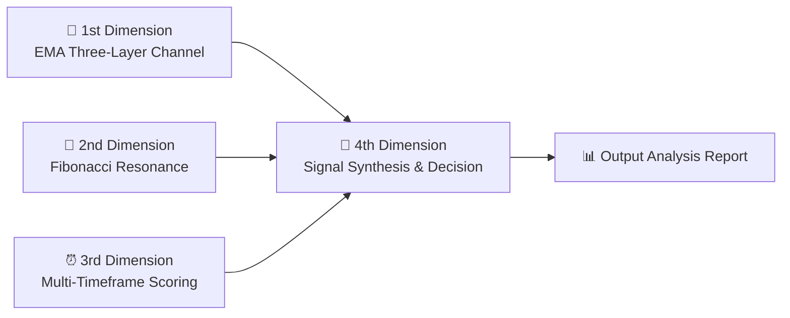

# 🎰 Multi-Dimensional Trading Resonance System

**Multi-Dimensional Trading Resonance System**

> A prompt-based trading analysis skill built on EMA multi-layer channels + Fibonacci retracements + multi-timeframe resonance scoring, supporting both Chinese A-share and cryptocurrency markets.
---

## 📖 Introduction

This project is a **pure Markdown-implemented AI Skill** (prompt-based) with zero code dependencies. It provides traders with a structured technical analysis methodology—the **Multi-Dimensional Trading Resonance System**—enabling professional-level technical analysis for stocks and cryptocurrencies.

### Core Features

- 🧠 **Prompt-based** — Pure Markdown implementation, no dependencies, driven by natural language
- 📊 **Four-Dimensional Analysis** — EMA channels × Fibonacci × Multi-timeframe resonance × Signal synthesis
- 🎯 **Quantified Scoring** — 0-100 comprehensive scoring system to eliminate subjective judgment
- 🏪 **Triple Market** — A-shares (T+1), DSE Bangladesh (T+2, Sun-Thu), Cryptocurrency (24/7)
- 📋 **Structured Output** — Generates standardized reports with specific price levels and trading recommendations

---

## 🗂️ Project Structure

```
t-trading/
├── README.md                           ← Project documentation (this file)
├── SKILL.md                            ← Skill entry & registration (activation rules / workflow / parameter reference)
└── vegas-tunnel-resonance-skill.md     ← Core implementation (complete four-dimensional analysis rules)
```

| File | Purpose | Summary |
|------|---------|---------|
| `SKILL.md` | **Entry & Index** | Metadata, activation conditions (keywords + intent triggers), role definition, Mermaid workflow diagram, parameter quick-reference, usage examples |
| `vegas-tunnel-resonance-skill.md` | **Core Rules Engine** | Complete four-dimensional analysis rules, scoring details, calculation methods, trading signal templates, position management matrix, analysis report templates, **DSE Bangladesh rules** |

---

## 🚀 Usage

### Prerequisites

- An AI assistant environment that supports loading Markdown Skills
- Load `SKILL.md` and `vegas-tunnel-resonance-skill.md` into the AI's context
- **Market data source**: Either (a) provide OHLC data yourself, or (b) ensure the AI has access to market data APIs

### Data Requirements

**This skill produces concrete price-level recommendations and requires verified market data.** Before requesting analysis:

- **Have OHLC data ready** (Open, High, Low, Close, Volume for 5min/15min/1H/4H/Daily timeframes)
- **Identify recent swing points** (Swing High and Swing Low prices with dates)
- **Ensure data freshness** (within 1-2 hours for intraday analysis, within 1 day for swing analysis)

See the "Data Source & Input Requirements" section in `vegas-tunnel-resonance-skill.md` for detailed data format.

### Natural Language Triggers

After loading the Skill and preparing data, use natural language to trigger analysis. Supported usage patterns:

| You Can Ask | AI Will Execute |
|------------|-----------------|
| "Analyze if **600519** is suitable for T-trading" | A-share T-trading mode → Complete four-dimensional analysis report |
| "What's the current position for **BTC**, can I day trade?" | Crypto day trading mode → Complete four-dimensional analysis report |
| "Where is the support level for **ETH**?" | Focus on Fibonacci + EMA resonance support levels |
| "How do you view the Vegas Tunnel?" | Explain the system → Ask for the asset → Execute analysis |
| "Is **BYD** a good entry now?" | Complete four-dimensional analysis → Score + direction conclusion |
| "Show me the moving averages for **CATL**" | Recognize as EMA channel analysis → Activate this Skill |

### Trigger Keywords

The following keywords will automatically activate this Skill:

> `T-trading` · `day trading` · `buy low sell high` · `short-term trading` · `Vegas Tunnel` · `EMA analysis` · `EMA channel` · `Fibonacci` · `support level` · `resistance level` · `golden ratio`

---

## 🏗️ System Architecture

This system consists of four analysis dimensions that progressively build toward trading signals:



### 1st Dimension: EMA Three-Layer Channel System

| Channel Layer | Fast Line | Slow Line | Purpose |
|--------------|-----------|-----------|---------|
| 🔵 Inner (Short-term Tunnel) | EMA12 | EMA13 | Core reference for day trading |
| 🟡 Middle (Vegas Tunnel) | EMA144 | EMA169 | Medium-term trend direction |
| 🔴 Outer (Long-term Tunnel) | EMA576 | EMA676 | Bull-bear boundary / strategic direction |

> **Parameter Origin**: 12 and 13 are adjacent Fibonacci numbers; 144 = 12², 169 = 13²; 576 = 144×4, 676 = 169×4

### 2nd Dimension: Fibonacci Retracements & Extensions

Calculate five key retracement levels (0.236 / 0.382 / 0.500 / 0.618 / 0.786) between defined swing highs and lows, and identify **resonance points** with EMA channels:

| Resonance Level | Condition | Points |
|----------------|-----------|--------|
| 🥇 Golden Resonance | Fib 0.618 aligns with EMA144/169 | +20 points |
| 🥈 Silver Resonance | Fib 0.382/0.500 aligns with any EMA | +15 points |
| 🥉 Bronze Resonance | Fib 0.236/0.786 aligns with any EMA | +10 points |

### 3rd Dimension: Multi-Timeframe Resonance Scoring

Score independently across 5 timeframes (5min / 15min / 1H / 4H / Daily), weighted by market and trading type:

| Market × Mode | 5min | 15min | 1H | 4H | Daily |
|--------------|------|-------|----|----|-------|
| A-share T-trading | 30% | 25% | 20% | 15% | 10% |
| A-share swing | 10% | 15% | 25% | 25% | 25% |
| **DSE Bangladesh Intraday** | 30% | 30% | 25% | 10% | 5% |
| **DSE Bangladesh Swing** | 5% | 10% | 20% | 30% | 35% |
| Crypto day trading | 30% | 25% | 25% | 15% | 5% |
| Crypto swing | 5% | 10% | 20% | 30% | 35% |

### 4th Dimension: Signal Synthesis & Trading Decision

Synthesize scores from the first three dimensions to output:

- ✅ **Direction Determination** (Long / Short / Wait)
- 📍 **Entry / Stop-loss / Take-profit levels**
- 📊 **Position sizing recommendation** (based on score and resonance level)
- ⚠️ **Risk warnings**

## 📊 Scoring Summary

| Score | Signal | Action |
|-------|--------|--------|
| 80-100 | ⭐⭐⭐⭐⭐ Very Strong | High-confidence entry, standard/heavy position |
| 60-79 | ⭐⭐⭐⭐ Strong | Standard position, follow rules |
| 40-59 | ⭐⭐⭐ Medium | Light position testing only |
| 20-39 | ⭐⭐ Weak | Watch and wait |
| 0-19 | ⭐ Invalid | Do not trade |
| <0 | ⚠️ Reverse | Consider opposite direction |

---

## 🏪 Market Adaptation

| Market | Hours | Settlement | Notes |
|--------|-------|------------|-------|
| **A-shares** | 09:30-15:00 (break) | T+1 | ±10% limits |
| **DSE Bangladesh** | 10:00-14:30 (continuous) | T+2 | Sun-Thu trading |
| **Crypto** | 24/7 | Instant | High volatility |

---

## 📄 Output Example

Each analysis generates a structured report in a standard template containing:

```
┌─────────────────────────────────────┐
│  📌 Asset Information               │
│  📊 1st Dimension: EMA Channel Status│
│  📐 2nd Dimension: Fibonacci Analysis│
│  ⏰ 3rd Dimension: Multi-Timeframe Resonance Scoring │
│  🎯 4th Dimension: Trading Decision   │
│     ├── Entry / Stop-loss / Take-profit levels │
│     ├── Position recommendation       │
│     └── Trading plan & risk warnings  │
│  ⚠️ Disclaimer                      │
└─────────────────────────────────────┘
```

For detailed report template definitions, see the "Analysis Output Template" section in [vegas-tunnel-resonance-skill.md](./vegas-tunnel-resonance-skill.md).

---

## ⚠️ Disclaimer

> **All analysis provided by this project is for technical reference only and does not constitute investment advice.**
>
> - All technical indicators have lag and failure probabilities
> - Always follow stop-loss discipline, keep single-trade risk within 2% of total capital
> - A-shares are subject to T+1 restrictions, T-trading must be based on existing positions
> - Cryptocurrency markets are highly volatile, exercise extreme caution with leveraged trading
> - **Market risk exists, invest with caution**

### 🚨 Critical: Data Source & Hallucination Risk

> **This skill produces concrete price-level recommendations (entry, stop-loss, take-profit).** Without verified market data, these recommendations are hallucinated and have zero predictive value.
>
> **Before trusting any analysis:**
> - ✅ Verify the AI has declared a data source (user-provided OHLC, API name, etc.)
> - ✅ Confirm data freshness (within 1-2 hours for intraday, within 1 day for swing)
> - ❌ **Reject any price levels without a cited data source**
> - ❌ **Do not trade on recommendations that cannot be traced to verified market data**

---

## 📜 Version History

| Version | Date | Changes |
|---------|------|---------|
| 1.0.0 | 2026-03-14 | Initial release, complete four-dimensional analysis system |

---

*Built with ❤️ for traders — Prompt-based, Zero Dependencies, Pure Markdown*
