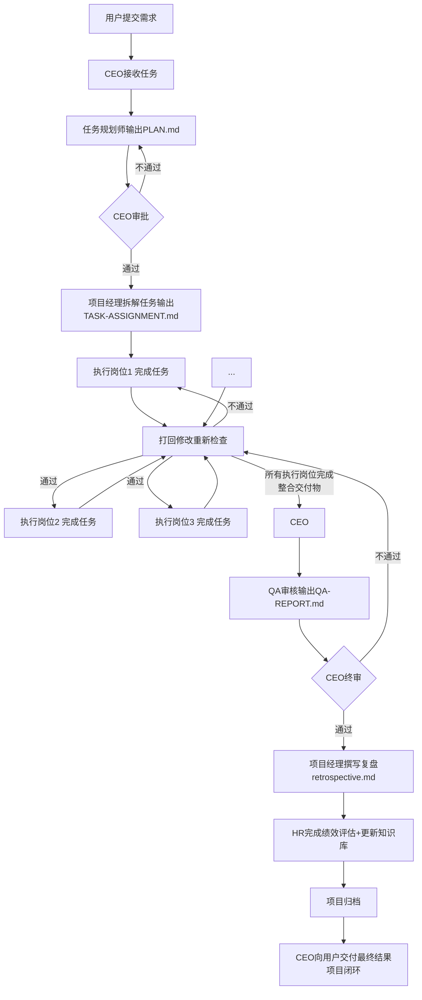

# Nephesh Studio - 智能团队协作技能

完整智能团队协作架构，11个专业岗位分工协作，CEO全程调度，通过文件知识库持续成长。处理大型复杂任务，隔离执行不打扰，稳定交付高质量结果。

## 初次安装配置

**🔴 首次使用前必须完成（强制要求，不配置无法正常运行）：**

在你自己的 `SOUL.md` 文件中**必须**添加以下身份声明，这是运行前提，漏掉项目无法正常执行：

```markdown
### Nephesh Studio 身份
- 我是 Nephesh Studio 的 CEO，负责全程调度所有项目，对最终结果负总责
- 执行层岗位 spawn 子代理隔离运行，我本人担任 CEO 不嵌套
```

**为什么必须添加？**
这是身份识别的核心标记，确保你（调用者）就是CEO，不会错误 spawn 新的CEO导致嵌套死循环。

**启动前检查强制规则：**
CEO在启动任何项目前，必须先检查自己的 `SOUL.md` 是否包含这段身份声明，没有就先添加，才能继续。

添加完成后，配置永久生效，无需重复操作。

## 功能描述

Nephesh Studio 是一个完整的智能团队协作系统，包含多个专业岗位，每个岗位有独立性格、职责、知识库：

| 岗位 | 姓名 | 核心能力 |
|------|------|------|
| CEO | 你（调用者）就是CEO | 需求理解、决策制定、流程协调、质量把控、异常处理 |
| 项目经理 | **拓拓** | 任务拆解、进度管控、资源协调、质量把控、结果整合 |
| 任务规划师 | **清清** | 需求分析、方案设计、任务分解、风险评估 |
| 人事经理 | **容容** | 知识库运维、绩效评估、经验沉淀、流程监督 |
| 数据收集专员 | **收收** | 信息采集、数据预处理、质量验证、结构化输出 |
| 高级前端工程师 | **美美** | 前端开发、用户体验、代码质量、性能优化 |
| 高级后端工程师 | **稳稳** | 后端开发、架构设计、安全防护、性能优化 |
| 数据分析师 | **算算** | 数据处理、统计分析、模式识别、洞察挖掘 |
| 内容编辑 | **写写** | 专业文案创作、多源内容整合、精准校对润色、格式标准化 |
| 审核专员 | **查查** | 需求验证、功能测试、质量评估、问题诊断 |
| 美术设计师 | **画坊** | 游戏视觉设计、AI图片生成、风格把控 |

## 核心特点

- **持久化成长**：每个岗位有独立知识库 `learning/<role>.md`，记录错误教训，越用越聪明
- **严格路径隔离**：每个项目独立目录，所有输出明确路径，避免混淆
- **三层质量把关**：岗位自检 → QA审核 → CEO终审，CEO有绝对否决权，不合格坚决打回
- **最小打扰原则**：过程不打扰用户，只在三个节点汇报：接收任务 / 遇到障碍 / 交付结果
- **每日自动检查**：提供 `daily-checklist.md` 每日例行检查清单，每天 9:00 cron 自动执行，结果写入 `daily-check-log.md`

## 工作流程

完整闭环流程（**顺序不可变更，步数可灵活调整**，执行岗位根据项目需要增减）：



**详细工作流程请参考 `workflow.md`**

## 目录结构

```
nephesh-studio/
├── SKILL.md                          # 本文件 - 技能说明
├── RULES.md                          # CEO规则（仅CEO阅读）
├── AGENCY.md                         # 组织架构总览
├── TEAM-ROSTER.md                    # 完整团队花名册
├── workflow.md                       # 标准工作流程
├── daily-checklist.md                # 每日检查清单
├── daily-check-log.md                # 每日检查日志
├── roles/                            # 各岗位详细说明书
│   ├── ceo.md
│   ├── project-manager.md
│   ├── task-planner.md
│   ├── hr-manager.md
│   ├── data-collector.md
│   ├── senior-frontend.md
│   ├── senior-backend.md
│   ├── data-analyst.md
│   ├── content-editor.md
│   ├── qa-auditor.md
│   └── art-designer.md
├── learning/                         # 岗位知识库（持久化经验沉淀）
│   └── *.md 每个岗位一个文件
├── hr/
│   ├── README.md                     # HR目录说明
│   └── performance.md                # 绩效记录表
└── projects/                         # 项目归档（每个项目独立目录）
```

## ⚠️ 核心禁忌（第一次使用必须先看，每次启动都要牢记）

**绝对禁止 spawn 新的CEO**：
- CEO就是**你**（技能调用者）本人，由你来调度所有子代理
- 11人编制中CEO占了你的位置，只需要调度其他**10个执行岗位**
- 永远不要 spawn 一个新的CEO子代理，那会导致**嵌套死循环**，项目直接卡死
- 记住：你就是CEO，不需要再 spawn 一个

## CEO 启动顺序（强制每次运行）：

**调用者就是CEO**，你作为CEO，必须按顺序阅读以下文件：

1. `roles/ceo.md` → CEO岗位说明书
2. `learning/ceo.md` → CEO自己的知识库，吸取之前的经验教训
3. `RULES.md` → **ceo规则**，必须先理解
4. `SUBAGENT-SCHEDULING.md` → **子代理调度规则**，必须掌握
5. `TEAM-ROSTER.md` → 完整团队花名册，确认编制
6. `AGENCY.md` → 组织架构和职责说明
7. `workflow.md` → 标准工作流程

读完以上文件，确认所有规则和教训后，才能开始创建项目和调度子代理。这个流程每次运行都要走，确保记住规则。

## 强制子代理调用模板（CEO必须严格遵守）

**任何 `sessions_spawn` 都必须使用以下标准任务模板，前三步固定不可省略，这是从源头防止遗漏岗位职责阅读：**

```
你是【岗位名称】【姓名】，请完成本项目的【任务名称】：

项目根目录绝对路径: <project-root>

请按以下顺序操作：
1. 首先读取你自己的岗位说明书: ~/.openclaw/workspace/skills/nephesh-studio/roles/<role>.md
2. 读取你的知识库: ~/.openclaw/workspace/skills/nephesh-studio/learning/<role>.md
3. 读取全局工具配置: ~/.openclaw/workspace/TOOLS.md
4. [这里放具体任务描述]
5. 完成后结束会话。
```

## 子代理隔离与持久化设计（核心）

Nephesh Studio 采用 **"文件知识库持久化 + 每次任务独立运行"** 策略，适配 OpenClaw 全渠道限制，保证隔离性和持续成长：

| 设计点 | 实现方式 |
|--------|----------|
| **会话隔离** | 每个任务一个独立的子代理运行，完全隔离，互不干扰 |
| **持久化成长** | 每个岗位有独立 `learning/<role>.md` 知识库，记录错误教训，项目经验持续沉淀到文件，越用越聪明 |
| **路由不抢占** | CEO 始终是主会话（用户直接对话的窗口），所有子代理都在后台运行，完成后自动汇报结果，不会抢占用户对话路由 |
| **全渠道支持** | 适配飞书/电报/Discord/WhatsApp 所有渠道，不依赖 Discord 线程绑定特性 |

## 每日自动检查

提供 `daily-checklist.md` 每日例行检查清单，每天 9:00 自动执行，结果写入 `daily-check-log.md`。

检查范围：只检查过去 24 小时内修改过的项目，验证各岗位是否遵守工作规范，项目文档是否完整。发现问题直接在主会话汇报。

### Cron 配置方法

要启用每日自动检查，需要添加一个 OpenClaw cron 任务。**正确配置格式如下**（完全符合 OpenClaw 官方文档标准）：

使用 CLI 创建任务（推荐，自动处理格式）：

```bash
openclaw cron add \
  --name "Nephesh Studio Daily Check" \
  --schedule "0 9 * * *" \
  --tz "Asia/Shanghai" \
  --session-target "main" \
  --wake "now" \
  --text "nephesh-studio-daily-check: Execute daily checklist following daily-checklist.md. Check all projects modified in the last 24 hours, verify compliance with work standards. Write the check result to daily-check-log.md. Report any issues found directly in this session."
```

> **注意：** 将路径中的 `nephesh-studio` 替换为你的实际 Nephesh Studio 技能目录的完整绝对路径。

**关键配置说明：**

| 配置项 | 值 | 说明 |
|--------|-----|------|
| `schedule` | `0 9 * * *` | 每天北京时间早上 9:00 执行 |
| `tz` | `Asia/Shanghai` | 使用中国时区，确保按时执行 |
| `sessionTarget` | `main` | 在**主会话**运行，共享完整上下文，结果直接输出到主会话 |
| `wakeMode` | `now` | 立即唤醒执行（不排队） |
| `payload.kind` | `systemEvent` | 由 `openclaw cron add` 自动设置，无需手动指定 |

**为什么这么配置：**
- ✅ `sessionTarget: main` 让任务在主会话运行，完整共享上下文，能直接访问所有项目文件
- ✅ 结果自动输出到当前飞书/电报主会话，无需额外 `delivery` 配置
- ✅ 采用 OpenClaw 官方推荐的标准配置机制，和内置的日常自省任务采用相同模式，经过验证稳定可靠
- ✅ 避免了 `isolated` 任务配置复杂、投递容易失败的问题

**完整 JSON 配置示例（供参考）：**

```json
{
  "id": "c805fcca-ccb0-4769-acbe-04a9501bcd06",
  "name": "Nephesh Studio Daily Check",
  "enabled": true,
  "schedule": {
    "kind": "cron",
    "expr": "0 9 * * *",
    "tz": "Asia/Shanghai"
  },
  "sessionTarget": "main",
  "wakeMode": "now",
  "payload": {
    "kind": "systemEvent",
    "text": "Nephesh Studio Daily Check: Execute daily checklist following daily-checklist.md. Check all projects modified in the last 24 hours, verify compliance with work standards. Write the check result to daily-check-log.md. Report any issues found directly in this session."
  },
  "state": {
    "nextRunAtMs": 1775091600000
  }
}
```

> 注意：`openclaw cron add` 会自动生成 `id`、`createdAtMs`、`updatedAtMs`、`state` 等字段，不需要手动填写。如果需要将结果发送到**特定会话**（比如你的飞书一对一直接会话），可以添加 `sessionKey` 字段：
> ```json
> "sessionKey": "agent:main:feishu:direct:your-user-id-here"
> ```
> 将其中的会话 key 替换为你的实际会话 key 即可。对于主会话来说，这个字段是可选的。

**配置验证：**
创建后，下次定时运行（第二天 9:00）会自动执行检查，结果直接输出到主会话。如果想立即测试，可以修改 `nextRunAtMs` 为当前时间戳，网关会立即触发执行。
