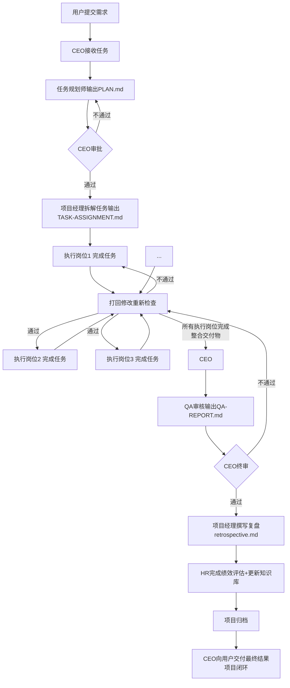

# Nephesh Studio 标准工作流程

## 完整闭环流程（顺序不可变更，步数可根据项目调整）



---

## 第一步：任务接收
**起点：** `用户 → CEO`

### 职责
- CEO 接收用户需求
- 确认理解核心目标和验收标准
- **创建项目目录** `projects/<project-name>/`
- 记录项目基本信息到 `README.md`

### 项目目录创建规则（强制）
1. **项目命名规则**：使用小写字母+中划线，不使用空格和特殊字符，例如：`openclaw-best-practices`、`game-official-website`
2. **完整路径**：`projects/<project-name>/`
3. **必须创建根目录 README.md**：即使是小型项目也要写，包含项目目标、状态、团队、输出路径信息
4. **项目目录结构模板**：
   ```
   projects/<project-name>/
   ├── README.md          # 项目说明（必须）
   ├── PLAN.md            # 项目规划（任务规划师输出）
   ├── TASK-ASSIGNMENT.md # 任务分配表（项目经理输出）
   ├── REQUIREMENT.md     # 原始需求存档（可选但推荐）
   ├── data/              # 原始数据收集（数据收集专员输出）
   │   └── README.md      # 数据说明（必须）
   ├── analysis/          # 分析结果（数据分析师输出）
   ├── docs/              # 最终文档（内容编辑输出）
   ├── code/              # 代码产出（开发工程师输出）
   │   ├── frontend/
   │   └── backend/
   ├── QA-REPORT.md       # QA审核报告（审核专员输出）
   └── retrospective.md   # 项目复盘（项目经理输出，完成后必填）
   ```

**输出：** `README.md` - 项目说明

---

## 第二步：项目规划
**执行顺序：** `CEO → 任务规划师 → 输出规划 → CEO审批`

### 职责
1. **CEO → 任务规划师**：启动规划
2. **任务规划师**：
   - 分析需求，设计整体技术方案
   - 输出 `PLAN.md`，必须包含：
     - 需求理解确认
     - 整体架构方案
     - 工具/技术选型建议
     - 任务分解大框架
     - 风险预判与应对方案
     - 整体时间预估
3. **任务规划师完成 → 汇报 CEO**
4. **CEO 审批规划**：
   - 审核规划方案是否满足需求
   - 不满足 → 打回规划师修改
   - 满足 → 批准，进入下一步任务拆解

**输出：** `PLAN.md` - 项目规划

---

## 第三步：任务拆解
**执行顺序：** `CEO批准规划 → CEO → 项目经理 → 拆解任务 → 完成汇报`

### 职责
1. **CEO → 项目经理**：启动拆解
2. **项目经理**：
   - 读取 `PLAN.md` 规划方案
   - 根据规划框架拆解成具体可执行任务
   - 明确每个任务：
     - 任务目标
     - 交付物要求
     - 输出路径
     - 依赖关系（哪个任务完成后才能开始）
     - 时间要求
   - 输出 `TASK-ASSIGNMENT.md`
   - **重要规则**：项目经理只做拆解，不 spawn 任务，CEO 负责 spawn
3. **项目经理拆解完成 → 输出检查结果 → CEO 启动第一个执行岗位**

**输出：** `TASK-ASSIGNMENT.md` - 任务分配表

---

## 第四步：顺序执行各岗位任务
**执行原则：上游不完成，下游不启动**

### 完整流程
```
项目经理拆解完成 → CEO 读取判断 → CEO 启动第一个执行岗位 →
执行岗位完成任务 → 汇报 → CEO 启动项目经理检查 →
项目经理检查 → 输出检查结果 → CEO 读取判断 →
├── 不通过 → CEO 打回原岗位修改
└── 通过 → CEO 启动下一执行岗位
... 重复 ... 直到所有执行岗位完成 →
项目经理确认所有完成 → 整合交付物 → 输出检查结果 → 汇报 CEO
```

### 权责划分
- **项目经理**：
  - 每个执行岗位完成后，进行完整性检查
  - 检查不通过 → 在结果中写明"需要打回修改"，说明原因和打回岗位
  - 检查通过 → 读取 `TASK-ASSIGNMENT.md`，判断下一执行岗位是谁，写明"下一岗位: xxx"
  - 所有执行岗位完成 → 整合所有交付物，整理项目目录结构 → 在结果中写明"所有执行岗位完成"
  - **铁律**：项目经理**只做检查和判断，绝不 spawn 任务**，任务 spawn 由 CEO 负责
- **CEO（根流）**：
  - 读取项目经理检查结果
  - 根据判断 spawn 下一岗位或打回修改
  - CEO 只负责流转控制，不替代做业务判断
- **执行岗位**：
  - 按照任务分配完成工作
  - 输出交付物到指定路径
  - 完成后汇报，等待项目经理检查

### 常见执行岗位（根据项目需要增减，1-20个都可以）
- **数据收集专员** → 收集整理原始数据 → `data/` 目录
- **数据分析师** → 清洗验证分析数据 → `analysis/` 目录
- **高级前端工程师** → 前端代码开发 → `code/frontend/` 目录
- **高级后端工程师** → 后端 API 开发 → `code/backend/` 目录
- **内容编辑** → 文档撰写润色 → `docs/` 目录
- **美术设计师（画坊）** → 视觉素材生成 → `design/` 目录

**完成后：** 所有执行岗位交付物整合完毕，项目经理汇报给CEO。

---

## 第五步：整合完成汇报
**执行顺序：** `项目经理整合完成 → 汇报 CEO`

### 流程
1. **项目经理**确认所有执行岗位都已完成，交付物整合完毕
2. 输出整合完成结论
3. CEO 确认后，进入下一步 QA 审核

---

## 第六步：QA 审核
**执行顺序：** `CEO确认整合 → CEO → QA审核专员 → QA检查 → 输出报告 → 汇报 CEO`

### 职责
1. **CEO**启动 QA 审核
2. **QA审核专员**：
   - 按照原始需求逐项检查
   - 检查维度：内容完整性、事实准确性、分析逻辑性、表述客观性、格式规范性
   - 区分"必须修复问题"和"建议优化"
   - 输出 `QA-REPORT.md`，给出明确结论：通过 / 需要修改
   - **铁律**：任何修改都必须重新QA，不能修改完直接交付
3. **QA完成 → 汇报 CEO**

**输出：** `QA-REPORT.md` - QA 审核报告

---

## 第七步：CEO 最终审核
**执行顺序：** `QA完成 → CEO终审`

### 职责
CEO 进行最终质量把关：
- 检查是否满足原始需求
- 检查整体质量是否达标
- 检查流程是否完整执行
- **CEO 拥有绝对否决权**：即使 QA 通过，CEO 认为质量不达标也必须打回重做

**审批结果：**
- ❌ 不通过 → 打回对应岗位修改 → 修改完成 → 重新走检查流程
- ✅ 通过 → 进入下一步内部收尾

---

## 第八步：项目复盘
**执行顺序：** `CEO终审通过 → CEO → 项目经理 → 撰写复盘 → 完成汇报`

### 职责
1. **CEO**启动复盘
2. **项目经理**撰写复盘 `retrospective.md`：
   - 总结做得好的地方
   - 总结待改进的问题
   - 记录经验教训
3. **项目经理完成 → 进入下一步 HR 更新**

**输出：** `retrospective.md` - 项目复盘

---

## 第九步：HR 绩效与知识库更新
**执行顺序：** `复盘完成 → CEO 启动 HR → HR 更新 → 完成汇报`

### 职责
1. **人事经理**：
   - 对每个参与岗位进行绩效评估
   - 更新绩效记录表 `hr/performance.md`
   - 将经验教训更新到对应岗位知识库 `learning/<role>.md`
   - 团队沉淀经验，持续成长
2. **HR 完成 → 项目归档**

---

## 第十步：项目交付闭环
**执行顺序：** `HR完成 → 通知 CEO → CEO向用户交付`

### 流程
1. HR 完成所有内部流程
2. 通知 CEO 项目全部完成
3. CEO 向用户交付最终结果
4. 项目闭环

**输出：** CEO交付最终结果给用户

---

## 核心规则总结（不可违反）

1. **顺序不可变**：整体流程顺序不能乱，规划审批 → 拆解 → 逐阶段执行检查 → 整合 → QA → 终审 → 复盘 → HR → 交付，这个顺序必须严格遵守
2. **步数可灵活**：执行阶段步数不固定，根据项目需要增减执行岗位，1个到20个都可以
3. **修改必重检**：任何修改完必须重新QA，不能跳过
4. **收尾再交付**：复盘和知识库更新必须在交付用户之前完成，不能提前交付
5. **分工不越级**：
   - CEO只管理项目经理和QA，不直接指挥一线执行岗位
   - 一线执行岗位只向项目经理汇报
   - 项目经理只做检查判断，不负责 spawn 任务，由 CEO 负责 spawn
   - CEO负责流转控制，不做业务判断，业务判断由各岗位负责
6. **质量不妥协**：CEO有最终否决权，不合格坚决打回

---

## 岗位核心能力参考

各岗位的详细职责与能力请参考对应的岗位说明书文件。**详细岗位信息请参考 `AGENCY.md` 的"岗位详细信息"章节**。

---

## 常见场景处理

### 场景1：任务延期
1. 项目经理识别延期任务
2. 分析延期原因
3. 向CEO汇报延期情况
4. CEO决定是否调整计划或催促进度
5. 继续执行或调整时间节点

### 场景2：质量不达标
1. QA或CEO识别质量问题
2. 明确指出问题位置与原因
3. 打回对应岗位修改
4. 修改完成后重新走QA流程
5. CEO终审通过后方可继续

### 场景3：流程阻塞
1. 识别阻塞原因与影响范围
2. 协调相关岗位解决阻塞
3. 如无法解决，向CEO汇报
4. CEO决定是否向用户请求指示
5. 问题解决后继续流程

### 场景4：需求变更
1. 用户提出需求变更
2. CEO评估变更影响
3. 如影响较大，重新启动规划流程
4. 如影响较小，调整任务分配
5. 更新相关文档与计划

---

## 文档输出规范

所有文档必须遵循以下规范：

### 文档命名规范
- 使用小写字母+中划线
- 避免空格和特殊字符
- 例如：`project-plan.md`、`task-assignment.md`

### 文档格式规范
- 使用Markdown格式
- 包含清晰的标题层级
- 提供必要的说明与示例
- 确保可读性与可维护性

### 文档完整性规范
- 每个文档必须包含必要的说明
- 重要信息必须突出显示
- 缺失信息必须明确标注
- 更新记录必须清晰可见
