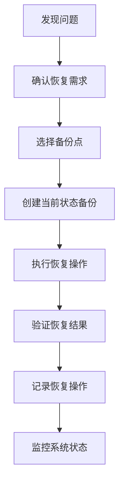

# Recovery Guide

## When to Restore

### 常见恢复场景
1. **配置错误**：修改配置后系统无法正常工作
2. **意外删除**：重要文件被意外删除或损坏
3. **升级问题**：OpenClaw升级后出现兼容性问题
4. **安全事件**：怀疑系统被未授权修改
5. **测试回滚**：测试新功能后需要回滚到稳定状态

### 恢复前检查
1. **确认问题**：明确需要恢复的具体问题
2. **选择备份点**：选择最合适的备份时间点
3. **评估影响**：评估恢复操作的影响范围
4. **制定计划**：制定详细的恢复计划

## Recovery Process

### 标准恢复流程


### 详细步骤

#### 步骤1：确认恢复需求
1. **问题诊断**：明确什么出了问题
2. **影响评估**：问题影响的范围和严重程度
3. **恢复目标**：期望恢复到什么状态

#### 步骤2：选择备份点
1. **查看可用备份**：
   ```bash
   ls -la ~/.openclaw/backups/daily/
   ls -la ~/.openclaw/backups/critical/
   ```

2. **检查备份内容**：
   ```bash
   # 查看备份目录内容
   ls -la ~/.openclaw/backups/daily/20260308_113037/
   
   # 查看备份日志
   tail -20 ~/.openclaw/workspace/memory/backup-log.md
   ```

3. **选择标准**：
   - 问题发生前的最新备份
   - 已知稳定的备份点
   - 包含所需文件的备份

#### 步骤3：创建当前状态备份
**重要**：恢复前必须创建当前状态备份
```bash
./backup-before-change.sh "pre-restore-$(date +%Y%m%d_%H%M%S)"
```

#### 步骤4：执行恢复操作
```bash
# 完整恢复（使用独立恢复脚本）
bash ~/.openclaw/workspace/skills/backup-manager/restore.sh ~/.openclaw/backups/critical/BACKUP_FILE.tar.gz

# 选择性恢复（手动）
cp ~/.openclaw/backups/critical/BACKUP_FILE/openclaw.json ~/.openclaw/openclaw.json
cp ~/.openclaw/backups/critical/BACKUP_FILE/workspace/MEMORY.md ~/.openclaw/workspace/MEMORY.md
```

#### 步骤5：验证恢复结果
1. **文件检查**：
   ```bash
   # 检查恢复的文件
   ls -la ~/.openclaw/openclaw.json
   
   # 验证文件内容
   head -10 ~/.openclaw/openclaw.json
   ```

2. **功能测试**：
   ```bash
   # 测试OpenClaw状态
   openclaw gateway status
   
   # 测试模型配置
   openclaw models status
   ```

3. **系统测试**：
   - 启动OpenClaw网关
   - 测试代理功能
   - 验证配置生效

#### 步骤6：记录恢复操作
确保恢复操作被完整记录在备份日志中。

## Recovery Scenarios

### 场景1：OpenClaw配置错误
**症状**：OpenClaw无法启动，配置错误
**恢复方案**：
```bash
# 1. 停止OpenClaw
openclaw gateway stop

# 2. 恢复配置文件（使用独立恢复脚本）
bash ~/.openclaw/workspace/skills/backup-manager/restore.sh ~/.openclaw/backups/critical/最新备份

# 3. 重启OpenClaw
openclaw gateway restart
```

### 场景2：模型配置错误
**症状**：模型无法使用，API错误
**恢复方案**：
```bash
# 仅恢复模型配置
cp ~/.openclaw/backups/daily/最新备份/models.json ~/.openclaw/agents/main/agent/models.json

# 重启网关
openclaw gateway restart
```

### 场景3：工作空间文件损坏
**症状**：MEMORY.md或其他重要文件损坏
**恢复方案**：
```bash
# 选择性恢复工作空间文件
cp ~/.openclaw/backups/daily/最新备份/MEMORY.md ~/.openclaw/workspace/MEMORY.md
cp ~/.openclaw/backups/daily/最新备份/USER.md ~/.openclaw/workspace/USER.md
# ... 其他需要恢复的文件
```

### 场景4：完整系统恢复
**症状**：系统完全无法工作
**恢复方案**：
```bash
# 完整恢复（使用独立恢复脚本）
bash ~/.openclaw/workspace/skills/backup-manager/restore.sh ~/.openclaw/backups/critical/最近的关键备份

# 重启所有服务
openclaw gateway restart
```

## Post-Recovery Actions

### 立即操作
1. **验证功能**：确保所有核心功能正常
2. **检查日志**：查看恢复后的系统日志
3. **用户通知**：如果影响用户，及时通知

### 短期操作（24小时内）
1. **监控系统**：密切监控系统稳定性
2. **问题分析**：分析导致需要恢复的根本原因
3. **预防措施**：制定防止问题再次发生的措施

### 长期操作
1. **备份策略优化**：根据恢复经验优化备份策略
2. **恢复流程改进**：改进恢复流程和文档
3. **培训与演练**：定期进行恢复演练

## Troubleshooting

### 常见问题

#### 问题1：备份文件损坏
**症状**：恢复时文件读取错误
**解决方案**：
1. 尝试其他备份点
2. 检查备份文件完整性
3. 如果所有备份都损坏，考虑从源码重建

#### 问题2：恢复后配置不生效
**症状**：恢复文件后配置未生效
**解决方案**：
1. 重启OpenClaw网关
2. 检查配置文件权限
3. 验证配置文件格式

#### 问题3：恢复导致新问题
**症状**：恢复后出现新问题
**解决方案**：
1. 回滚到恢复前的状态（使用恢复前创建的备份）
2. 分析问题原因
3. 选择性恢复，而不是完整恢复

#### 问题4：备份点选择困难
**症状**：不确定选择哪个备份点
**解决方案**：
1. 查看备份日志，了解每个备份点的上下文
2. 选择问题发生前的最新备份
3. 如果不确定，从最旧的可用备份开始测试

## Best Practices

### 恢复最佳实践
1. **测试恢复流程**：定期测试恢复流程，确保可行
2. **文档完整性**：保持恢复文档的完整和最新
3. **团队培训**：确保团队成员了解恢复流程
4. **自动化验证**：自动化恢复后的验证步骤

### 预防性措施
1. **定期备份**：确保备份的规律性和完整性
2. **备份验证**：定期验证备份的可用性
3. **变更管理**：重大变更前创建备份
4. **监控告警**：监控系统健康状态，及时发现问题

## Emergency Contacts

### 🚨 紧急恢复（OpenClaw无法启动时）
**重要**：使用独立恢复脚本，不需要OpenClaw运行

```bash
# 查看紧急恢复指南
cat ~/OPENCLAW_EMERGENCY_RECOVERY.md

# 查看备份目录详细指南
cat ~/.openclaw/backups/README.md

# 使用独立恢复脚本
bash ~/.openclaw/workspace/skills/backup-manager/restore.sh ~/.openclaw/backups/critical/YOUR_BACKUP.tar.gz
```

### 内部资源
1. **紧急恢复指南**：`~/OPENCLAW_EMERGENCY_RECOVERY.md`
2. **备份目录指南**：`~/.openclaw/backups/README.md`
3. **独立恢复脚本**：`~/.openclaw/workspace/skills/backup-manager/restore.sh`
4. **备份日志**：`~/openclaw/workspace/memory/backup-log.md`
5. **系统日志**：`/tmp/openclaw/openclaw-*.log`

### 外部资源
1. **OpenClaw文档**：https://docs.openclaw.ai
2. **社区支持**：https://discord.com/invite/clawd
3. **GitHub Issues**：https://github.com/openclaw/openclaw/issues

---

**记住**：恢复是最后的手段。优先考虑预防和早期发现问题。
**重要**：恢复脚本可以独立运行，不依赖OpenClaw。即使OpenClaw完全挂了，也可以恢复！
