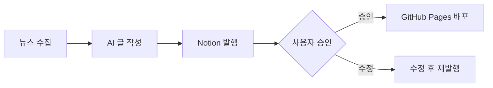

# Auto Sec Blogger 📝

> AI 기반 보안 블로그 자동화 시스템

[](https://www.gnu.org/licenses/agpl-3.0)
[](https://www.python.org/downloads/)
[](https://bigmodel.cn)

## ✨ 주요 기능

- **다중 뉴스 소스**: Google News, arXiv, Hacker News 자동 수집
- **AI 글 작성**: GLM-4.7 기반 한국어 블로그 포스트 자동 생성
- **Human-in-the-Loop**: Notion에서 승인 후 발행
- **다중 플랫폼**: Notion 발행 → GitHub Pages 자동 배포
- **주제 분석**: 트렌드 기반 주제 선정

## 🚀 설치

```bash
git clone https://github.com/rebugui/auto-sec-blogger.git
cd auto-sec-blogger
pip install -r requirements.txt
```

## ⚙️ 환경 설정

```bash
# .env 파일 생성
cat > .env << 'ENVEOF'
GLM_API_KEY=your-glm-api-key
NOTION_API_KEY=your-notion-api-key
NOTION_DATABASE_ID=your-database-id
GITHUB_TOKEN=your-github-token
ENVEOF
```

### API 키 발급처
- **GLM API**: https://bigmodel.cn
- **Notion Integration**: https://www.notion.so/my-integrations
- **GitHub Token**: https://github.com/settings/tokens

## 📖 사용법

### 전체 파이프라인 실행

```bash
# 뉴스 수집 → 글 작성 → Notion 발행
python3 scripts/run_pipeline.py
```

### 개별 단계 실행

```bash
# 1단계: 뉴스 수집
python3 scripts/collector.py

# 2단계: 글 작성
python3 scripts/writer.py --topic "보안 뉴스"

# 3단계: Notion 발행
python3 scripts/notion_publisher.py

# 4단계: GitHub Pages 배포 (승인 후)
python3 scripts/publish_github.py
```

### Human-in-the-Loop 워크플로우



## 📊 파이프라인 구조

```
scripts/
├── run_pipeline.py          # 전체 파이프라인 실행
├── collector.py             # 뉴스 수집
├── topic_analyzer.py        # 주제 분석
├── writer.py                # AI 글 작성
├── notion_publisher.py      # Notion 발행
└── publish_github.py        # GitHub Pages 배포
```

## 🎨 글 작성 예시

### 입력 (뉴스 URL)
```
https://google_news.com/article/cve-2024-1234
```

### 출력 (블로그 포스트)
```markdown
# CVE-2024-1234: 신규 취약점 발견

## 개요
2024년 3월 9일, 새로운 보안 취약점이 발견되었습니다...

## 영향 범위
- 영향 받는 버전: ...
- CVSS 점수: ...

## 대응 방안
1. 최신 버전으로 업데이트
2. ...

## 참고 자료
- 원문: [링크]
```

## 🔄 자동화 설정

### Cron (일일 발행)

```bash
# 매일 오전 10시
0 10 * * * cd ~/.openclaw/workspace/skills/auto-sec-blogger && python3 scripts/run_pipeline.py >> logs/cron.log 2>&1
```

### GitHub Actions (자동 배포)

```yaml
# .github/workflows/deploy.yml
name: Deploy Blog
on:
  repository_dispatch:
    types: [blog-approved]
jobs:
  deploy:
    runs-on: ubuntu-latest
    steps:
      - uses: actions/checkout@v3
      - name: Deploy to GitHub Pages
        run: ./scripts/deploy.sh
```

## 📈 통계

```bash
# 발행 통계 확인
python3 -c "from scripts.utils import get_stats; print(get_stats())"
```

## 🤝 기여하기

1. Fork this repository
2. Create your feature branch
3. Commit your changes
4. Push to the branch
5. Open a Pull Request

## 📝 라이선스

[GNU Affero General Public License v3.0](LICENSE)

---

Made with 🦞 by [rebugui](https://github.com/rebugui)
