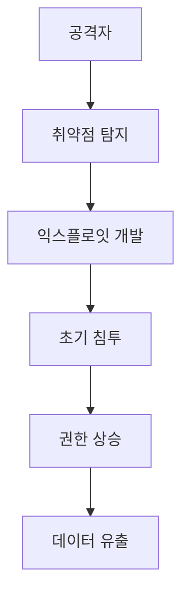

# Intelligence Agent Architecture

## 시스템 개요

Intelligence Agent는 4단계 파이프라인으로 구성된 자동화 시스템입니다.

```
┌─────────────────────────────────────────────────────────────┐
│                    Intelligence Pipeline                      │
├─────────────────────────────────────────────────────────────┤
│                                                              │
│  1️⃣ Collector          2️⃣ Selector          3️⃣ Writer     │
│  ┌──────────────┐     ┌──────────────┐     ┌──────────────┐│
│  │Google News   │────▶│ GLM-4.7      │────▶│ GLM-4.7      ││
│  │arXiv         │     │ 품질 평가    │     │ 글 작성      ││
│  │HackerNews    │     │ 점수 매기기  │     │ Mermaid      ││
│  └──────────────┘     └──────────────┘     └──────────────┘│
│         │                    │                    │         │
│         ▼                    ▼                    ▼         │
│    100+ 기사            5개 선별            5개 글          │
│                                                              │
│  4️⃣ Notion Publisher          5️⃣ Git Publisher             │
│  ┌──────────────┐            ┌──────────────┐               │
│  │ Draft 저장   │───────────▶│ Git Push     │               │
│  │ 상태 관리    │  승인 후   │ GitHub Pages │               │
│  │ Human Loop   │            │ 배포         │               │
│  └──────────────┘            └──────────────┘               │
│                                                              │
└─────────────────────────────────────────────────────────────┘
```

## 컴포넌트 상세

### 1. Collector (뉴스 수집기)

**목적**: 다양한 소스에서 최신 보안 뉴스 수집

**소스**:
- **Google News**: RSS 피드 기반 키워드 검색
- **arXiv**: cs.CR (Cryptography and Security) 카테고리
- **HackerNews**: 트렌딩 기술 뉴스

**구현**:
```python
class NewsCollector:
    def fetch_google_news(self, query="security vulnerability"):
        # RSS 피드 파싱
        # 중복 URL 제거
        # 메타데이터 추출 (제목, 날짜, URL, 요약)

    def fetch_arxiv(self, category="cs.CR"):
        # arXiv API 호출
        # 최신 논문 메타데이터 추출

    def fetch_hackernews(self):
        # HackerNews API 호출
        # 인기 기사 추출
```

**출력**: `Article` 객체 리스트
```python
{
    'title': '새로운 제로데이 취약점 발견',
    'url': 'https://...',
    'source': 'Google News',
    'date': '2025-03-09',
    'summary': '요약 내용...',
    'content': '본문...'
}
```

### 2. Selector (AI 기사 선별)

**목적**: 수집된 기사 중 고품질 기사 선별

**평가 기준** (GLM-4.7):
- **관련성** (1-10): 보안 분야 관련성
- **시의성** (1-10): 최신 이슈 여부
- **영향도** (1-10): 실무 영향도
- **흥미도** (1-10): 독자 흥미 유발

**구현**:
```python
class ArticleSelector:
    async def evaluate_article(self, article):
        # GLM-4.7으로 기사 평가
        prompt = f"""
        다음 기사를 평가하세요:
        제목: {article['title']}
        요약: {article['summary']}

        평가 기준:
        - 관련성 (1-10)
        - 시의성 (1-10)
        - 영향도 (1-10)
        - 흥미도 (1-10)
        """

        response = await self.llm_client.generate(prompt)
        return parse_score(response)

    async def evaluate_and_select(self, articles, max_articles=5):
        # 병렬 평가
        tasks = [self.evaluate_article(a) for a in articles]
        results = await asyncio.gather(*tasks)

        # 점수 합산 및 정렬
        scored = sorted(results, key=lambda x: x['total_score'], reverse=True)

        # 상위 N개 반환
        return scored[:max_articles]
```

**출력**: 상위 5개 기사

### 3. Writer (블로그 글 작성)

**목적**: GLM-4.7으로 전문적인 블로그 글 작성

**구조**:
1. **제목** (헤드라인)
2. **요약** (3줄 요약)
3. **본문** (상세 분석)
4. **Mermaid 다이어그램** (시각화)
5. **결론** (시사점)
6. **태그** (키워드)

**구현**:
```python
class BlogWriter:
    async def generate_article(self, article):
        # 1. 기본 정보
        title = self._generate_title(article)
        summary = await self._generate_summary(article)

        # 2. 상세 분석
        analysis = await self._generate_analysis(article)

        # 3. Mermaid 다이어그램
        diagram = await self._generate_mermaid(article)

        # 4. 결론
        conclusion = await self._generate_conclusion(article)

        # 5. 태그
        tags = await self._extract_tags(article)

        return BlogPost(
            title=title,
            summary=summary,
            content=analysis,
            diagram=diagram,
            conclusion=conclusion,
            tags=tags
        )
```

**Mermaid 다이어그램 예시**:


### 4. Notion Publisher (Notion 발행)

**목적**: 생성된 글을 Notion에 Draft 상태로 저장

**상태 관리**:
```
Draft → Review → Approved → Published
```

**구현**:
```python
class NotionPublisher:
    def create_article(self, blog_post):
        # Notion API 호출
        response = requests.post(
            f"https://api.notion.com/v1/pages",
            headers={
                "Authorization": f"Bearer {NOTION_API_KEY}",
                "Notion-Version": "2022-06-28"
            },
            json={
                "parent": {"database_id": DATABASE_ID},
                "properties": {
                    "제목": {"title": [{"text": {"content": blog_post.title}}]},
                    "상태": {"select": {"name": "Draft"}},
                    "날짜": {"date": {"start": datetime.now().isoformat()}},
                    "태그": {"multi_select": [{"name": tag} for tag in blog_post.tags]}
                }
            }
        )

        return response.json()
```

**Human-in-the-Loop**:
1. Notion에서 Draft 상태 글 확인
2. 내용 검토 및 수정
3. 상태를 "Approved"로 변경
4. Git Publisher가 Approved 글만 발행

### 5. Git Publisher (Git 발행)

**목적**: Approved 글을 GitHub Pages에 발행

**프로세스**:
1. 로컬 블로그 저장소 클론
2. 마크다운 파일 생성 (`_posts/YYYY-MM-DD-title.md`)
3. Jekyll Front Matter 추가
4. Git commit & push
5. GitHub Actions 트리거
6. Jekyll 빌드 & 배포

**구현**:
```python
class GitPublisherService:
    def publish(self, blog_posts):
        # 1. 로컬 저장소 확인
        if not os.path.exists(BLOG_LOCAL_PATH):
            self._clone_repo()

        # 2. 마크다운 파일 생성
        for post in blog_posts:
            if post.status == "Approved":
                self._create_markdown_file(post)

        # 3. Git 작업
        self._git_commit()
        self._git_push()

        # 4. GitHub Actions 트리거
        print("✅ GitHub Actions가 자동으로 실행됩니다")

    def _create_markdown_file(self, post):
        # Jekyll Front Matter
        front_matter = f"""---
layout: post
title: "{post.title}"
date: {post.date}
categories: security
tags: {post.tags}
---
"""

        # 파일 저장
        filename = f"{post.date.strftime('%Y-%m-%d')}-{self._slugify(post.title)}.md"
        filepath = os.path.join(BLOG_LOCAL_PATH, "_posts", filename)

        with open(filepath, 'w', encoding='utf-8') as f:
            f.write(front_matter + post.content)
```

## 데이터 흐름

```
1. 수집 (100+ 기사)
   ↓
2. 평가 & 선별 (5개)
   ↓
3. 글 작성 (5개)
   ↓
4. Notion 저장 (5개 Draft)
   ↓
5. 사용자 승인 (2개 Approved)
   ↓
6. Git 발행 (2개)
   ↓
7. GitHub Pages 배포 (2개)
```

## 비동기 처리

**병렬 실행**:
```python
# 기사 평가 병렬화
tasks = [selector.evaluate_article(a) for a in articles]
results = await asyncio.gather(*tasks)

# 글 작성 병렬화
tasks = [writer.generate_article(a) for a in selected]
posts = await asyncio.gather(*tasks)
```

**장점**:
- 5개 기사 평가: 10초 → 2초 (5x 빠름)
- 5개 글 작성: 50초 → 10초 (5x 빠름)

## 에러 처리

**재시도 로직**:
```python
@retry(
    stop=stop_after_attempt(3),
    wait=wait_exponential(multiplier=1, min=4, max=10)
)
async def call_glm_api(prompt):
    response = await client.generate(prompt)
    return response
```

**Rate Limit 처리**:
```python
try:
    response = await call_glm_api(prompt)
except RateLimitError:
    await asyncio.sleep(60)
    response = await call_glm_api(prompt)
```

## 모니터링

**로그 구조**:
```python
logger.info(f"[1/4] Collecting news from {len(sources)} sources...")
logger.info(f"[2/4] AI evaluating {len(articles)} articles...")
logger.info(f"[3/4] Writing {len(selected)} blog posts...")
logger.info(f"[4/4] Publishing {len(posts)} to Notion...")
logger.info(f"✅ Pipeline completed: {success_count}/{total_count}")
```

**메트릭**:
- 수집된 기사 수
- 선별된 기사 수
- 작성된 글 수
- 발행된 글 수
- 소요 시간

## 보안

**API 키 관리**:
- 환경 변수로 관리
- `.env` 파일은 `.gitignore`에 추가
- 절대 코드에 하드코딩하지 않음

**Git Token 권한**:
- `repo` 스코프만 허용
- 정기적으로 토큰 갱신
- 최소 권한 원칙 준수
