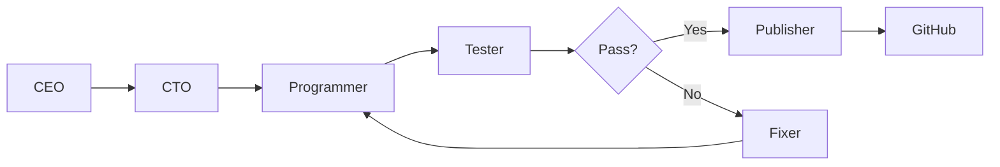

# Dev Factory 🏭

> 자동 소프트웨어 개발 에이전트 (ChatDev 2.0 + GLM-5 기반)

[](https://www.gnu.org/licenses/agpl-3.0)
[](https://www.python.org/downloads/)
[](https://github.com/OpenBMB/ChatDev)

## ✨ 주요 기능

- **주제 자동 발견**: GitHub Trending, CVE DB, 보안 뉴스에서 개발 주제 발굴
- **7-Agent 협업**: CEO, CTO, Programmer, Tester 등 7개 에이전트 협업
- **자동 테스트**: 생성된 코드 자동 테스트 실행
- **자동 수정**: 오류 발생 시 자동 수정 (최대 3회)
- **GitHub 발행**: 완성된 프로젝트 GitHub에 자동 푸시

## 🚀 설치

```bash
git clone https://github.com/rebugui/dev-factory.git
cd dev-factory
pip install -r requirements.txt
```

## ⚙️ 환경 설정

```bash
# .env 파일 생성
cat > .env << 'ENVEOF'
GLM_API_KEY=your-glm-api-key
GITHUB_TOKEN=your-github-token
NOTION_API_KEY=your-notion-api-key      # 선택
NOTION_DATABASE_ID=your-database-id     # 선택
ENVEOF
```

### API 키 발급처
- **GLM API**: https://bigmodel.cn
- **GitHub Token**: https://github.com/settings/tokens (repo 권한)
- **Notion Integration**: https://www.notion.so/my-integrations (선택)

## 📖 사용법

### 자동 개발 시작

```bash
# 주제 자동 발견 → 개발 → 테스트 → 발행
python3 run_build.py

# 특정 주제로 개발
python3 run_build.py --topic "취약점 스캐너"

# CVE 기반 개발
python3 run_build.py --cve CVE-2024-1234
```

### 개별 단계 실행

```bash
# 1단계: 주제 발견
python3 builder/discovery/github_trending.py

# 2단계: ChatDev 실행
python3 builder/pipeline.py --project "security-scanner"

# 3단계: 테스트
python3 builder/testing/runner.py

# 4단계: GitHub 발행
python3 builder/integration/github_publisher.py
```

## 🏗️ 아키텍처

### 7-Agent 시스템



### 에이전트 역할

| 에이전트 | 역할 |
|---------|------|
| **CEO** | 프로젝트 기획 및 요구사항 정의 |
| **CTO** | 기술 스택 선정 및 아키텍처 설계 |
| **Programmer** | 코드 작성 |
| **Tester** | 테스트 코드 작성 및 실행 |
| **Reviewer** | 코드 리뷰 |
| **Fixer** | 오류 수정 |
| **Publisher** | GitHub 발행 |

### Discovery Sources

```python
DISCOVERY_SOURCES = {
    'github_trending': GitHubTrendingCrawler(),
    'cve_database': CVEDatabaseCrawler(),
    'security_news': SecurityNewsCrawler(),
}
```

## 📊 파이프라인 예시

### 입력: "취약점 스캐너"

```
[CEO] 요구사항 정의
  ↓
[CTO] Python + requests + beautifulsoup4 선택
  ↓
[Programmer] 코드 작성 (5 files)
  ↓
[Tester] 단위 테스트 실행 (10 tests)
  ↓
[Reviewer] 코드 품질 검토
  ↓
[Publisher] GitHub 저장소 생성 및 푸시
  ↓
✅ 완료: https://github.com/rebugui/vuln-scanner
```

## 🔧 설정

### config.yaml

```yaml
chatdev:
  model: "glm-5"
  max_retries: 3
  timeout: 300

discovery:
  github_trending: true
  cve_database: true
  security_news: true
  
testing:
  enabled: true
  coverage_threshold: 70

publishing:
  github: true
  notion: false  # 선택
```

## 📈 통계

```bash
# 개발 통계 확인
python3 -c "from builder.orchestrator import get_stats; print(get_stats())"
```

출력 예시:
```
Total Projects: 42
Success Rate: 85%
Average Build Time: 12m 34s
Languages: Python (35), JavaScript (5), Go (2)
```

## 🚨 자동 수정 워크플로우

```python
# Self-Correction Engine
for attempt in range(max_retries=3):
    code = programmer.write(requirements)
    test_results = tester.run(code)
    
    if test_results.passed:
        break
    else:
        errors = analyzer.extract_errors(test_results)
        fixer.fix(errors)
```

## 🤝 기여하기

1. Fork this repository
2. Create your feature branch (`git checkout -b feature/amazing-feature`)
3. Commit your changes (`git commit -m 'Add amazing feature'`)
4. Push to the branch (`git push origin feature/amazing-feature`)
5. Open a Pull Request

## 📝 라이선스

[GNU Affero General Public License v3.0](LICENSE)

## 🙏 크레딧

- **ChatDev 2.0** - Auto development framework
- **GLM-5** - LLM provider
- **OpenClaw** - AI agent platform

---

Made with 🦞 by [rebugui](https://github.com/rebugui)
