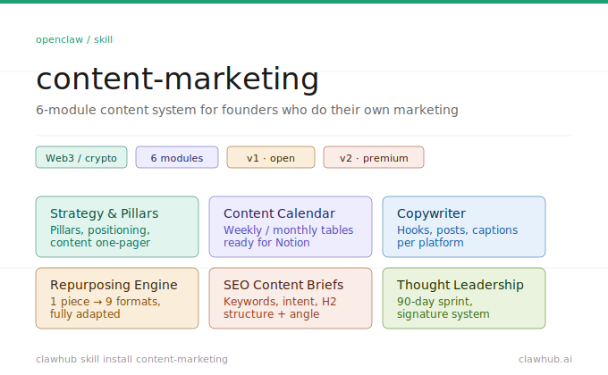

# content-marketing-skill



> Content marketing skill for OpenClaw — strategy, calendars, copywriting, repurposing, SEO briefs & thought leadership. Built for founders who do their own marketing. Web3/crypto niche included.

---

## Install

```bash
clawhub skill install content-marketing
```

Or paste the repo URL directly into your OpenClaw chat and the agent will install it automatically.

---

## What it does

6 modules, all in one skill:

| Module | What it solves |
|---|---|
| **Strategy & Pillars** | Define your content pillars and positioning from scratch |
| **Content Calendar** | Generate weekly/monthly calendars ready for Notion or Airtable |
| **Copywriter** | Write platform-specific posts with 3 hook variants and 2 versions |
| **Repurposing Engine** | Turn 1 piece of content into 9 different formats |
| **SEO Content Briefs** | Full briefs with keyword intent, structure, and differentiation angle |
| **Thought Leadership** | 90-day roadmap to become a recognized voice in your industry |

---

## Web3 / Crypto niche

Includes a dedicated niche module for crypto and Web3 founders — platform playbooks for Twitter/X and Farcaster, tone calibration by audience (OG holders, mainstream, TradFi, LATAM), and real examples from the space.

Activates automatically when you mention crypto, Web3, DeFi, NFTs, or blockchain.

---

## File structure

```
content-marketing-skill/
├── SKILL.md                        ← Main skill (6 modules)
└── references/
    ├── platform-playbooks.md       ← LinkedIn, X, TikTok, newsletter, Instagram rules
    └── web3-niche.md               ← Crypto/Web3 niche module
```

---

## Built with

- [OpenClaw](https://openclaw.ai)
- [ClawHub](https://clawhub.ai)
