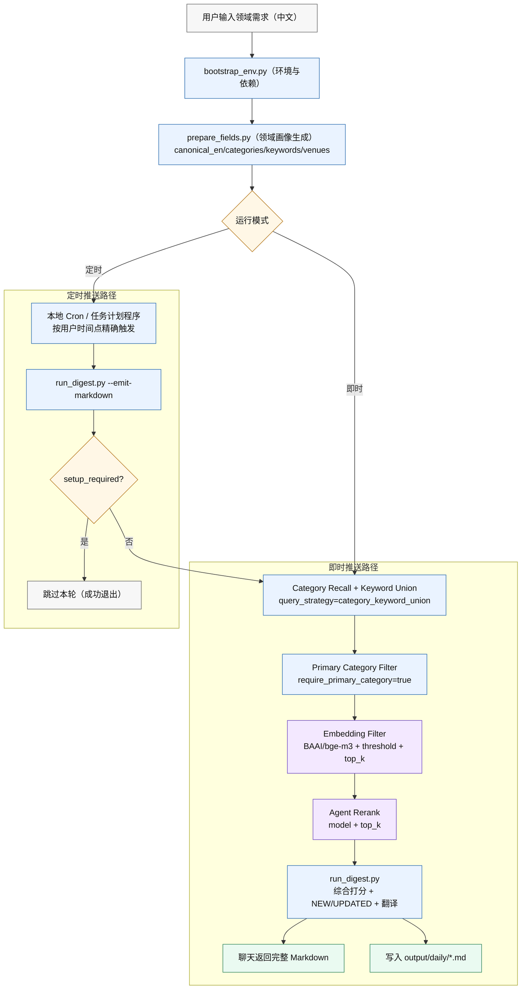

# agent-daily-paper

`agent-daily-paper` 用于按研究领域聚合 arXiv 最新论文，并支持定时推送与即时推送两种运行模式。

## 给 Agent 的一句话安装指令

可以直接对 Agent 说：

`帮我安装 https://github.com/Ricardo-Ping/agent-daily-paper.git 这个 skill，然后安装 arxiv-digest-lab 虚拟环境，并进行初始化设置。`

核心能力：
- 多领域订阅与每领域独立数量上限（5-20）
- 本地 `arXiv taxonomy` 知识库（`data/arxiv_taxonomy.json`），用于领域分类校验与补全
- 输出英文标题、中文标题、英文摘要、中文摘要、arXiv 链接
- 默认启用 `PDF 全文解读`（每篇输出单段中文论文解读，默认不少于 500 字）
- 论文解读写作风格由 `SKILL.md` 约束（读者视角、评审式总结、避免关键词机械拼接）
- 日报头部输出领域画像：英文领域名、关键词、相关会议/期刊
- `NEW/UPDATED` 标记与 Markdown 归档
- 定时推送（默认使用本地 cron / 任务计划程序；GitHub Actions 仅可选）
- 即时推送（命令行触发，不依赖 Actions）

## 运行流程图（Academic Style）



## 首次配置

默认 `config/subscriptions.json` 为“未初始化锁定态”（`setup_required=true`），不会直接推送。
必须先收集用户配置并写入真实订阅，再运行。

订阅配置至少包含：
- `field_settings[].name`
- `field_settings[].limit`（5-20）
- `push_time`（HH:MM，本地时间）
- `timezone`（例如 `Asia/Shanghai`）

## 时间语义

- `push_time` 始终按 `timezone` 对应的本地时间解释，不按 UTC 解释。
- 例如：`push_time=12:00` 且 `timezone=Asia/Shanghai`，表示上海时间中午 `12:00`。
- GitHub Actions 的 `cron` 本身使用 UTC，但本项目工作流只是“轮询是否到点”；真正是否执行，由 `run_digest.py` 按订阅里的本地 `timezone + push_time` 判断。
- 如果某个 agent 把你说的“12 点”直接当成 UTC 去创建外部自动任务，那是调度层做错了，不是本项目的 `push_time` 语义。

## 环境准备（Conda）

推荐安装 skill 后先执行一键初始化（自动建环境、装依赖、装 Argos 模型、初始化配置）：

```bash
python scripts/bootstrap_env.py --run-doctor
```

等价手动步骤：

```bash
conda create -n arxiv-digest-lab python=3.10 -y
conda activate arxiv-digest-lab
pip install argostranslate pypdf sentence-transformers
python scripts/install_argos_model.py --from-code zh --to-code en
python scripts/install_argos_model.py --from-code en --to-code zh
python scripts/install_embedding_model.py --model BAAI/bge-m3
python scripts/install_embedding_model.py --kind reranker --model BAAI/bge-reranker-v2-m3
python scripts/sync_arxiv_taxonomy.py --output data/arxiv_taxonomy.json
```

翻译提供方：
- `TRANSLATE_PROVIDER=argos`（离线，默认）
- `TRANSLATE_PROVIDER=openai`（需 `OPENAI_API_KEY` + `OPENAI_TRANSLATE_MODEL`）
- `TRANSLATE_PROVIDER=auto`
- `TRANSLATE_PROVIDER=none`

## 健康检查（推荐先跑）

```bash
python scripts/doctor.py
```

检查项：
- `config/subscriptions.json` 与 `data/state.json` 是否存在且可解析
- 订阅配置字段完整性（`push_time`、`timezone`、`field_settings`、`limit`）
- `config/agent_field_profiles.json` 格式
- Argos 依赖与语言包状态
- arXiv 网络连通性
- GitHub Actions 工作流关键步骤

## 即时推送（不依赖 GitHub Actions）

### 一键执行

```bash
python scripts/instant_digest.py --fields "数据库优化器,推荐系统" --limit 20 --time-window-hours 72
```

默认读取 `config/agent_field_profiles.json` 作为 Agent 字段画像输入（首次安装后应完成该文件配置）。
默认输出“完整 Markdown 正文到聊天（与 `output/daily/*.md` 文件内容一致）”，并同时落盘到 `output/daily/*.md`。
默认使用忽略历史模式，避免首次配置被旧状态误拦截；如需按历史去重可加 `--respect-history`。
中文领域会先翻译为英文 `canonical_en`，再执行分类与 arXiv 检索（arXiv 不支持中文检索）；若输入本身已是英文，则直接使用，不做翻译。

### 分步执行

```bash
python scripts/prepare_fields.py --fields "数据库优化器" --limit 20 --output config/subscriptions.instant.json
python scripts/run_digest.py --config config/subscriptions.instant.json --emit-markdown
```

## Agent 字段画像输入（默认启用）

`prepare_fields.py` 默认使用 `config/agent_field_profiles.json`，建议作为标准配置文件长期维护。  
如果该文件为空或未命中字段，不会中断；会自动走“seed+taxonomy+heuristic”生成临时字段画像并写入 `subscriptions*.json` 的 `field_profiles`。

```json
{
  "数据库优化器": {
    "canonical_en": "database query optimizer",
    "categories": ["cs.DB"],
    "keywords": ["database", "query optimizer", "execution plan", "cost model", "cardinality estimation"],
    "title_keywords": ["optimizer", "query", "cost model"],
    "venues": ["SIGMOD", "VLDB", "ICDE", "PODS"]
  }
}
```

运行命令（默认路径）：

```bash
python scripts/prepare_fields.py --fields "数据库优化器" --profiles-json config/agent_field_profiles.json --output config/subscriptions.instant.json
python scripts/run_digest.py --config config/subscriptions.instant.json --emit-markdown
```

`prepare_fields.py` 在每个领域上会额外保存 Top-K 种子语料（默认 K=20）：
- 文档：`output/seed_corpus/docs/<canonical_en>.md`（标题、作者、摘要、链接）
- 向量：`output/seed_corpus/embeddings/<canonical_en>.json`（`title+abstract` 的 embedding）
- 默认启用“领域指纹缓存”：当领域画像未变化时，后续运行直接复用本地 seed 语料与向量，不再重新抓取 Top-K。
- 如需强制重抓（例如想刷新种子语料），可加：`--seed-force-refresh`

## arXiv Taxonomy 本地知识库（默认接入）

- 同步脚本：`python scripts/sync_arxiv_taxonomy.py --output data/arxiv_taxonomy.json`
- `prepare_fields.py` 默认读取 `data/arxiv_taxonomy.json`（可用 `--taxonomy-json` 覆盖）
- 作用：
  - 校验 Agent 给出的分类 code（非法 code 会被过滤）
  - 在未提供分类时，基于 taxonomy 做候选分类补全
  - 保证最终 `subscriptions.json` 使用 arXiv 合法分类

首次可通过模板初始化：

```bash
cp config/agent_field_profiles.example.json config/agent_field_profiles.json
```

```powershell
Copy-Item config/agent_field_profiles.example.json config/agent_field_profiles.json
```

## 相关性漏斗（推荐）

推荐启用四层过滤：
1. `query_strategy=category_keyword_union`（主分类 + 英文关键词并集召回）
2. `require_primary_category=true`（仅保留主分类命中）
3. `embedding_filter`（本地向量相似度过滤）
4. `agent_rerank`（本地语义重排，默认 `BAAI/bge-reranker-v2-m3`）
5. 订阅级去重（仅使用 `sent_versions_by_sub`）
6. `category_expand_mode`（`off/conservative/balanced/broad`）

`subscriptions.json` 示例：

```json
{
  "query_strategy": "category_keyword_union",
  "require_primary_category": true,
  "category_expand_mode": "balanced",
  "embedding_filter": {
    "enabled": true,
    "model": "BAAI/bge-m3",
    "threshold": 0.58,
    "top_k": 120
  },
  "agent_rerank": {
    "enabled": true,
    "model": "BAAI/bge-reranker-v2-m3",
    "top_k": 40
  },
  "insight_mode": "pdf",
  "insight_lang": "zh",
  "insight_min_chars": 300,
  "insight_embed_model": "BAAI/bge-m3",
  "insight_paragraph_min_chars": 500,
  "insight_pdf_max_pages": 20,
  "insight_pdf_timeout_sec": 35
  }
}
```

如果你希望“完全由 Agent 确认分类，不允许脚本猜分类”，可用：

```bash
python scripts/instant_digest.py --fields "推荐系统" --agent-categories-only --category-expand-mode off
```

分类字段说明：
- `primary_categories`：实际检索与主分类过滤使用的分类集合（核心）
- `categories`：扩展后的参考分类信息（用于画像展示与候选补充，不直接替代主分类约束）

去重状态说明：
- 已逐步弃用全局 `sent_ids/sent_versions`。
- 当前仅使用 `data/state.json -> sent_versions_by_sub` 做去重。
- state 每 7 天自动清空一次去重记录（不影响当天是否已推送判断）。

## 定时推送（推荐精确 cron / 任务计划程序）

对于“安装到本地的 skill”，默认应使用本机调度器，而不是依赖把仓库推到 GitHub 才能运行。

推荐原则：

- 按用户设置的 `push_time + timezone` 创建“精确到点”的定时任务。
- 不要默认写成“每 10 分钟 / 每 15 分钟轮询一次”。
- 例如用户设置 `12:00` 且时区为 `Asia/Shanghai`，就应直接创建：
  - `Cron: 0 12 * * *`
  - `Timezone: Asia/Shanghai`
- 执行命令应保持简洁，直接运行日报脚本即可，不需要 `--only-due-now --due-window-minutes 15`。

推荐命令：

```bash
python scripts/run_digest.py --config config/subscriptions.json --emit-markdown
```

Linux / macOS `cron` 示例（用户设置为每天 12:00，时区 `Asia/Shanghai`）：

```cron
CRON_TZ=Asia/Shanghai
0 12 * * * cd /path/to/agent-daily-paper && conda run -n arxiv-digest-lab python scripts/run_digest.py --config config/subscriptions.json --emit-markdown >> cron.log 2>&1
```

如果你更喜欢直接使用环境里的 Python，也可以写成：

```cron
CRON_TZ=Asia/Shanghai
0 12 * * * cd /path/to/agent-daily-paper && /path/to/conda/envs/arxiv-digest-lab/bin/python scripts/run_digest.py --config config/subscriptions.json --emit-markdown >> cron.log 2>&1
```

Windows 任务计划程序可等价设置为：

- 触发器：每天一次，时间为用户设置的本地时间（如 `12:00`）
- 时区：用户 `timezone` 对应的本地时区
- 程序：`conda`
- 参数：`run -n arxiv-digest-lab python scripts/run_digest.py --config config/subscriptions.json --emit-markdown`
- 起始位置：仓库根目录

如果 agent 平台自带 cron / automation，也应按同样原则创建：

- `12:00 + Asia/Shanghai` -> `0 12 * * * (Asia/Shanghai)`
- `08:30 + Asia/Shanghai` -> `30 8 * * * (Asia/Shanghai)`
- `21:45 + Asia/Shanghai` -> `45 21 * * * (Asia/Shanghai)`

OpenClaw cron / automation 文案可参考：

```text
在 /home/USER_HOME/.openclaw/workspace/agent-daily-paper 执行：
export PATH="/home/USER_HOME/miniconda3/bin:/home/USER_HOME/.nvm/versions/node/NODE_VERSION/bin:/usr/local/bin:/home/USER_HOME/.local/bin:/home/USER_HOME/.bun/bin:/usr/bin:/bin:/home/USER_HOME/.nvm/current/bin:/home/USER_HOME/.npm-global/bin:/home/USER_HOME/bin:/home/USER_HOME/.volta/bin:/home/USER_HOME/.asdf/shims:/home/USER_HOME/.fnm/current/bin:/home/USER_HOME/.local/share/pnpm" && conda run -n arxiv-digest-lab python scripts/run_digest.py --only-due-now --due-window-minutes 15 --emit-markdown
```

其中：
- `USER_HOME` 替换为当前机器的真实用户名目录
- `NODE_VERSION` 替换为本机实际 Node 版本目录
- 如果环境变量已正确配置，可进一步精简为只保留 `conda run ...`

如果需要同时写清“投递到 Feishu 当前会话”的标准模板，可补充为：

```text
delivery.mode: announce
delivery.channel: feishu
delivery.to: user:FEISHU_USER_ID
cron: 0 12 * * *
timezone: Asia/Shanghai
```

其中：
- `FEISHU_USER_ID` 替换为当前接收人的真实 Feishu 用户 ID
- `cron` 与 `timezone` 必须和用户配置的 `push_time + timezone` 一致

如果使用上述 OpenClaw 执行模板，输出规则必须严格遵守：

1. 若 `reason=already_pushed_today`，返回：`今天该领域已推送过`
2. 若无命中且未推送，返回：`当天该领域无最新论文`
3. 若有论文，原样返回完整 Markdown 正文，不要摘要、不要 JSON、不要额外解释

说明：
- 对于 OpenClaw 这类平台，若已经能设置精确 cron，则推荐直接使用精确时间触发。
- 上述 `--only-due-now --due-window-minutes 15` 模板更适合作为兼容型执行模板或共享轮询任务模板。

只有在“一个共享任务需要兼容多个不同时间点订阅”或“平台不支持精确 cron”时，才退回轮询模式：

```bash
python scripts/run_digest.py --config config/subscriptions.json --only-due-now --due-window-minutes 15 --emit-markdown
```

## GitHub Actions（可选远端方案）

工作流文件：`.github/workflows/daily-digest.yml`

机制：
- GitHub Actions 只能用于“仓库已推送到 GitHub”的远端运行场景
- 若使用 Actions，仍建议按实际需要单独设置 UTC `cron`
- 真正的业务时间仍应与用户本地 `timezone + push_time` 保持一致
- 仅在到点窗口执行，且同订阅每天只推送一次
- 有变更时自动提交 `output/daily` 与 `data/state.json`

注意：
- 只有当仓库真的推到 GitHub 且 Actions 已开启时，这条链路才会运行。
- 对于“本地安装给 agent 使用”的场景，不应该把 GitHub Actions 当成默认调度方式。

翻译说明：
- GitHub Actions 运行在临时环境，若未配置 `OPENAI_API_KEY`，通常会出现 `[待翻译]`。
- 建议在仓库 Secrets 中配置 `OPENAI_API_KEY`，并将 `TRANSLATE_PROVIDER` 设为 `openai` 或 `auto`。
- 本地离线运行可用 Argos：先执行 `python scripts/install_argos_model.py --from-code zh --to-code en` 与 `python scripts/install_argos_model.py --from-code en --to-code zh`。
- 若 `prepare_fields.py` 无法把中文领域转成英文 canonical，会直接报错并提示安装 `zh->en` 模型或在 `agent_field_profiles.json` 提供英文 `canonical_en`。

## 关键文件

- `scripts/run_digest.py`：抓取、排序、翻译、归档
- `scripts/prepare_fields.py`：领域输入转订阅配置
- `scripts/instant_digest.py`：即时推送入口
- `config/subscriptions.json`：长期订阅配置（生产）
- `config/subscriptions.examples.json`：示例订阅集合（参考模板）
- `config/agent_field_profiles.json`：Agent 字段画像输入（默认读取，建议按需维护）
- `config/agent_field_profiles.example.json`：字段画像示例模板
- `output/daily/`：每日归档目录

## 单篇论文解读写作规范（与 SKILL 同步）

当用户单独提交一篇论文要求解读时，Agent 必须优先阅读 PDF 全文（至少覆盖 Abstract / Introduction / Method / Experiments / Conclusion），并使用以下固定提示词框架进行中文结构化输出。  
这些规则属于 Agent 行为规范，维护在 `SKILL.md` 中，不应在 `run_digest.py` 里硬编码风格替换规则。

推荐提示词（可直接复用）：

```text
你是一名科研助手。请仔细阅读以下论文，并对其进行系统、结构化的分析与解读。

请按照以下结构输出：

研究问题（Research Problem）
- 论文试图解决什么问题？
- 为什么这个问题重要？
- 现有方法有哪些局限？

核心思想（Core Idea）
- 论文的核心直觉是什么？
- 作者提出了什么关键思想使方法有效？

方法（Method）
详细解释论文的方法，包括：
- 模型整体架构
- 各个模块的作用

实验设计（Experiments）
总结实验设置，包括：
- 使用的数据集
- 对比方法（Baselines）
- 评价指标
- 实验结果

并解释：
- 为什么该方法效果更好？
- 实验是否充分？

主要贡献（Contributions）
列出论文的主要贡献。

优点（Strengths）
分析该工作的优势，例如：
- 方法创新性
- 实验设计
- 实际应用价值

局限性（Limitations）
指出可能存在的问题，例如：
- 方法假设
- 实验不足
- 可扩展性问题

对研究者的启示（Research Insights）
- 该论文最值得学习的思想是什么？
- 未来可以如何改进或扩展？

11. 通俗解释
用简单易懂的语言解释这篇论文，使研究生能够快速理解核心思想。

请使用清晰的小标题和条理化结构进行中文输出。输出的内容不少于1000字。
```

输出约束：
- 必须使用读者视角（“本文/该研究”），不要使用作者自述视角（“我们提出/我们设计”）。
- 禁止逐句翻译论文原文；要做信息提炼、逻辑重组与批判性分析。
- 优先引用方法与实验中的关键设计，不要只重复摘要内容。
