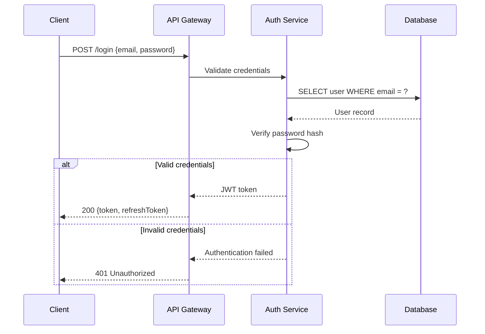
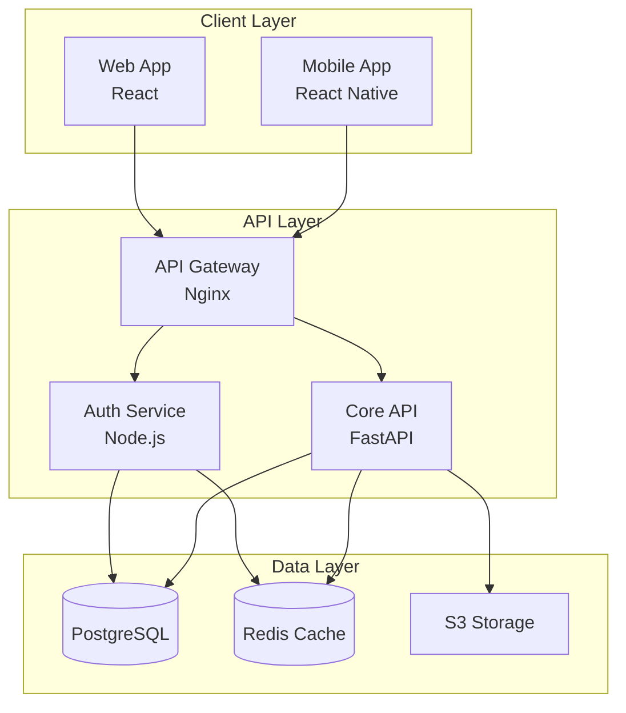
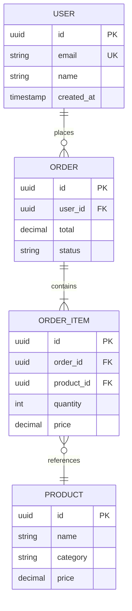
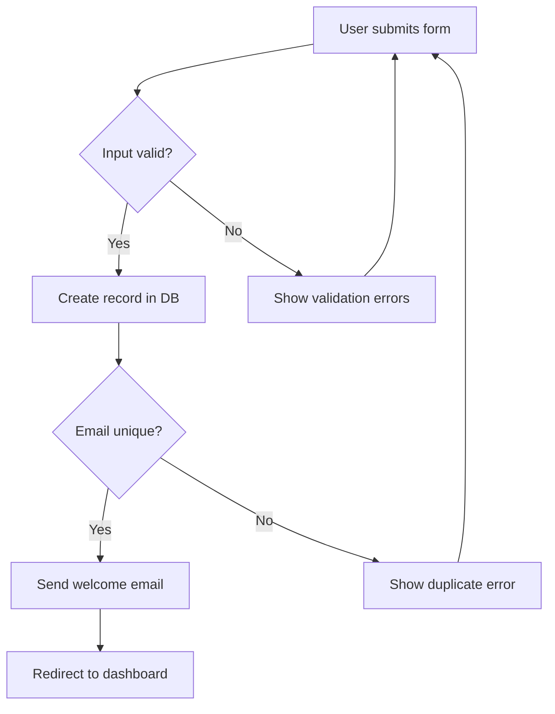
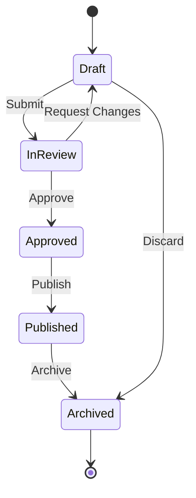

# Technical Writing for Developers

Write clear, maintainable developer documentation — from README files to full documentation sites.

## 1. Documentation Strategy

### 1.1 Diataxis framework

Organize documentation into four distinct types:

```
                     PRACTICAL                 THEORETICAL
                 (steps to follow)          (understanding)
            ┌─────────────────────┬─────────────────────────┐
  LEARNING  │     Tutorials       │      Explanation         │
  (study)   │  "Learning-oriented"│  "Understanding-oriented"│
            │  Hand-held lessons  │  Background, context     │
            ├─────────────────────┼─────────────────────────┤
  WORKING   │    How-to Guides    │      Reference           │
  (apply)   │  "Task-oriented"    │  "Information-oriented"  │
            │  Solve a problem    │  Dry, accurate, complete │
            └─────────────────────┴─────────────────────────┘
```

| Type | Goal | Example |
|------|------|---------|
| **Tutorial** | Teach a beginner by doing | "Build your first API in 10 minutes" |
| **How-to Guide** | Solve a specific problem | "How to add authentication" |
| **Reference** | Provide technical facts | API endpoint docs, config options |
| **Explanation** | Provide context and reasoning | "Why we chose PostgreSQL over MongoDB" |

### 1.2 Audience analysis

Before writing, answer:

1. **Who** is reading? (Beginner dev, senior engineer, DevOps, manager)
2. **What** do they know already? (Prerequisites, assumed knowledge)
3. **Why** are they reading? (Learn, solve problem, look up fact)
4. **Where** will they read? (IDE, phone, printed, terminal)

### 1.3 Documentation lifecycle

```
Create → Review (PR) → Publish → Maintain → Deprecate → Archive
                ↑                    │
                └────────────────────┘
                   (update cycle)
```

- **Create**: Write alongside the code it documents
- **Review**: Treat docs PRs like code PRs — review for accuracy and clarity
- **Maintain**: Update docs when code changes (enforce via CI)
- **Deprecate**: Mark outdated docs with warnings, link to replacements
- **Archive**: Move to an archive section rather than deleting

## 2. README Templates

### 2.1 Library / package README

````markdown
# library-name

> One-line description of what this library does.

[](https://www.npmjs.com/package/library-name)
[](https://github.com/org/library-name/actions)
[](LICENSE)

## Features

- Feature one — brief description
- Feature two — brief description
- Feature three — brief description

## Installation

```bash
npm install library-name
```

## Quick Start

```ts
import { something } from "library-name";

const result = something({ option: true });
console.log(result);
```

## Usage

### Basic usage

```ts
// Minimal example showing the most common use case
```

### Advanced usage

```ts
// Example showing configuration options, edge cases, or composition
```

## API Reference

### `functionName(options)`

| Parameter | Type | Default | Description |
|-----------|------|---------|-------------|
| `option1` | `string` | — | Required. Description. |
| `option2` | `boolean` | `false` | Optional. Description. |

**Returns:** `ResultType` — Description of return value.

**Example:**

```ts
const result = functionName({ option1: "value" });
```

## Configuration

| Option | Type | Default | Description |
|--------|------|---------|-------------|
| `debug` | `boolean` | `false` | Enable debug logging |
| `timeout` | `number` | `5000` | Request timeout in ms |

## Contributing

See [CONTRIBUTING.md](CONTRIBUTING.md) for development setup and guidelines.

## License

[MIT](LICENSE)
````

### 2.2 CLI tool README

````markdown
# my-cli

> One-line description of what the CLI does.

## Installation

```bash
# npm
npm install -g my-cli

# Homebrew
brew install my-cli

# Binary
curl -fsSL https://get.my-cli.dev | sh
```

## Quick Start

```bash
# Initialize a new project
my-cli init my-project

# Run the main command
my-cli run --config config.yml
```

## Commands

### `my-cli init [name]`

Create a new project.

```bash
my-cli init my-project --template minimal
```

| Flag | Short | Default | Description |
|------|-------|---------|-------------|
| `--template` | `-t` | `default` | Project template |
| `--force` | `-f` | `false` | Overwrite existing |

### `my-cli run`

Run the main process.

```bash
my-cli run --config custom.yml --verbose
```

| Flag | Short | Default | Description |
|------|-------|---------|-------------|
| `--config` | `-c` | `config.yml` | Config file path |
| `--verbose` | `-v` | `false` | Verbose output |
| `--dry-run` | | `false` | Show what would happen |

## Configuration File

```yaml
# config.yml
output: dist
verbose: false
plugins:
  - name: plugin-a
    option: value
```

## Environment Variables

| Variable | Default | Description |
|----------|---------|-------------|
| `MY_CLI_CONFIG` | `config.yml` | Config file path |
| `MY_CLI_LOG_LEVEL` | `info` | Log level |

## Exit Codes

| Code | Meaning |
|------|---------|
| `0` | Success |
| `1` | General error |
| `2` | Invalid arguments |
| `3` | Config file not found |
````

### 2.3 API service README

````markdown
# My API

> REST API for managing widgets.

**Base URL:** `https://api.example.com/v1`

## Authentication

All requests require a Bearer token:

```bash
curl -H "Authorization: Bearer YOUR_TOKEN" https://api.example.com/v1/widgets
```

## Quick Start

```bash
# Create a widget
curl -X POST https://api.example.com/v1/widgets \
  -H "Authorization: Bearer $TOKEN" \
  -H "Content-Type: application/json" \
  -d '{"name": "My Widget", "color": "blue"}'
```

## Endpoints

| Method | Path | Description |
|--------|------|-------------|
| `GET` | `/widgets` | List all widgets |
| `POST` | `/widgets` | Create a widget |
| `GET` | `/widgets/:id` | Get a widget |
| `PATCH` | `/widgets/:id` | Update a widget |
| `DELETE` | `/widgets/:id` | Delete a widget |

## Error Responses

All errors follow RFC 7807:

```json
{
  "type": "https://api.example.com/errors/not-found",
  "title": "Not Found",
  "status": 404,
  "detail": "Widget with ID 'abc' not found"
}
```

## Rate Limits

| Plan | Requests/minute |
|------|----------------|
| Free | 60 |
| Pro | 600 |

## SDKs

- [JavaScript](https://github.com/org/sdk-js)
- [Python](https://github.com/org/sdk-python)

## Running Locally

```bash
git clone https://github.com/org/my-api.git
cd my-api
cp .env.example .env
docker compose up -d
npm run dev
```
````

## 3. API Documentation

### 3.1 JSDoc / TSDoc patterns

```ts
/**
 * Fetches a user by their unique identifier.
 *
 * @param id - The unique user identifier (UUID format)
 * @returns The user object, or `null` if not found
 * @throws {AuthenticationError} If the request is not authenticated
 * @throws {RateLimitError} If the rate limit is exceeded
 *
 * @example
 * ```ts
 * const user = await getUser("550e8400-e29b-41d4-a716-446655440000");
 * if (user) {
 *   console.log(user.name);
 * }
 * ```
 *
 * @see {@link updateUser} for modifying user data
 * @since 1.2.0
 */
async function getUser(id: string): Promise<User | null> {
  // ...
}
```

### 3.2 Common JSDoc/TSDoc tags

| Tag | Purpose | Example |
|-----|---------|---------|
| `@param` | Document a parameter | `@param name - The user's display name` |
| `@returns` | Document return value | `@returns The created resource` |
| `@throws` | Document exceptions | `@throws {NotFoundError} If resource missing` |
| `@example` | Provide usage example | Code block with usage |
| `@see` | Cross-reference | `@see {@link OtherFunction}` |
| `@since` | Version introduced | `@since 2.0.0` |
| `@deprecated` | Mark as deprecated | `@deprecated Use newFunction instead` |
| `@default` | Default value | `@default false` |
| `@remarks` | Additional context | Extended explanation |
| `@internal` | Not part of public API | Excluded from generated docs |

### 3.3 Python docstrings (Google style)

```python
def create_order(
    user_id: str,
    items: list[OrderItem],
    *,
    discount_code: str | None = None,
) -> Order:
    """Create a new order for the given user.

    Validates inventory availability, applies any discount codes,
    and calculates the final total including tax.

    Args:
        user_id: The unique identifier of the customer.
        items: List of items to include in the order. Must not be empty.
        discount_code: Optional promotional discount code.

    Returns:
        The created Order object with a generated order ID and
        calculated totals.

    Raises:
        ValueError: If items list is empty.
        InsufficientStockError: If any item exceeds available inventory.
        InvalidDiscountError: If the discount code is expired or invalid.

    Example:
        >>> order = create_order(
        ...     user_id="user_123",
        ...     items=[OrderItem(sku="WIDGET-1", quantity=2)],
        ...     discount_code="SAVE10",
        ... )
        >>> print(order.total)
        18.00
    """
```

### 3.4 Generating docs from code

| Tool | Language | Command |
|------|----------|---------|
| typedoc | TypeScript | `npx typedoc --entryPoints src/index.ts --out docs` |
| sphinx-autodoc | Python | `sphinx-apidoc -o docs/api src/` |
| rustdoc | Rust | `cargo doc --open` |
| godoc | Go | `go doc -all ./...` |
| javadoc | Java | `javadoc -d docs src/**/*.java` |

## 4. Architecture Decision Records (ADRs)

### 4.1 Why ADRs matter

ADRs capture the **why** behind architectural decisions. Code shows **what**; ADRs explain **why** that approach was chosen over alternatives.

### 4.2 ADR template

````markdown
# ADR-001: Use PostgreSQL as primary database

## Status

Accepted (2025-01-15)

<!-- Proposed | Accepted | Deprecated | Superseded by ADR-XXX -->

## Context

We need a primary database for our application that handles:
- Transactional data (orders, users, payments)
- Full-text search on product descriptions
- JSON data for flexible product attributes
- Expected scale: 10M rows, 1000 req/s

## Decision

We will use **PostgreSQL 16** as our primary database.

## Consequences

### Positive
- Strong ACID compliance for financial data
- Native JSONB support eliminates need for a separate document store
- Built-in full-text search with `tsvector` avoids Elasticsearch dependency
- Excellent tooling: pgAdmin, pg_stat_statements, EXPLAIN ANALYZE

### Negative
- Horizontal scaling requires additional tooling (Citus, read replicas)
- Team needs to learn PostgreSQL-specific features (vs MySQL familiarity)
- Hosting cost is higher than SQLite for development

### Neutral
- Migration from current SQLite prototype requires data migration script
- Need to set up connection pooling (PgBouncer) for production

## Alternatives Considered

### MySQL 8
- Rejected: weaker JSON support, no native full-text search ranking

### MongoDB
- Rejected: eventual consistency not suitable for financial transactions

### SQLite
- Rejected: no concurrent write support for multi-server deployment
````

### 4.3 ADR file organization

```
docs/
  adr/
    index.md            # Table of contents
    0001-use-postgresql.md
    0002-adopt-event-sourcing.md
    0003-migrate-to-typescript.md
    template.md         # Copy this for new ADRs
```

### 4.4 ADR tooling

```bash
# adr-tools (shell-based)
brew install adr-tools
adr init docs/adr
adr new "Use PostgreSQL as primary database"
adr list

# Log4brains (web-based viewer)
npm install -g log4brains
log4brains init
log4brains adr new "Use PostgreSQL"
log4brains preview  # Opens browser
```

## 5. RFCs (Request for Comments)

### 5.1 RFC vs ADR

| Aspect | ADR | RFC |
|--------|-----|-----|
| Scope | Single decision | Larger design proposal |
| Length | 1-2 pages | 3-10+ pages |
| Process | Lightweight | Formal review period |
| Audience | Future maintainers | Current team for input |
| Timing | During/after decision | Before implementation |

### 5.2 RFC template

````markdown
# RFC: Implement Real-Time Notifications System

**Author:** Jane Smith
**Date:** 2025-02-01
**Status:** In Review
**Reviewers:** @backend-team, @frontend-team

## Summary

Proposal to add real-time push notifications using WebSocket connections
and a Redis Pub/Sub backend, replacing the current polling approach.

## Motivation

Current polling-based notifications:
- Add 500ms latency to notification delivery
- Generate 2M unnecessary API requests per day
- Account for 15% of server load

Users have requested instant notifications in feedback surveys (Issue #234).

## Detailed Design

### Architecture

```
Client ←── WebSocket ──→ WS Server ←── Redis Pub/Sub ──→ App Server
```

### Connection Lifecycle

1. Client authenticates via REST API, receives JWT
2. Client opens WebSocket to `wss://ws.example.com` with JWT
3. Server validates JWT, subscribes to user's Redis channel
4. App server publishes events to Redis
5. WS server forwards events to connected client

### Message Format

```json
{
  "id": "evt_abc123",
  "type": "notification",
  "data": {
    "title": "New comment on your post",
    "body": "John replied to your post...",
    "url": "/posts/123#comment-456"
  },
  "timestamp": "2025-02-01T12:00:00Z"
}
```

### Reconnection Strategy

- Exponential backoff: 1s, 2s, 4s, 8s, max 30s
- Resume from last received event ID (server-side buffer: 5 min)

## Drawbacks

- Added infrastructure complexity (Redis, WS server)
- WebSocket connections consume server memory (~2KB per connection)
- Requires new monitoring and alerting

## Alternatives Considered

### Server-Sent Events (SSE)
Simpler but unidirectional. Would work for notifications but limits
future bidirectional features (typing indicators, presence).

### Long Polling
Lower infrastructure cost but still has latency and unnecessary requests.

### Third-Party Service (Pusher/Ably)
Lower maintenance but adds vendor dependency and per-message cost
that becomes expensive at scale.

## Rollout Plan

1. **Phase 1** (Week 1-2): Infrastructure setup, basic WS server
2. **Phase 2** (Week 3-4): Integration with notification service
3. **Phase 3** (Week 5): Frontend integration, A/B test vs polling
4. **Phase 4** (Week 6): Full rollout, deprecate polling

## Unresolved Questions

- Should we support notifications when the browser tab is in the background?
- What is the maximum number of concurrent connections we need to support?
- Should we persist notification history in a database or only in-memory?
````

## 6. Changelogs

### 6.1 Keep a Changelog format

````markdown
# Changelog

All notable changes to this project will be documented in this file.

The format is based on [Keep a Changelog](https://keepachangelog.com/),
and this project adheres to [Semantic Versioning](https://semver.org/).

## [Unreleased]

### Added
- Support for custom themes in dashboard

## [2.1.0] - 2025-02-15

### Added
- Export data as CSV from any table view (#234)
- Dark mode toggle in settings

### Changed
- Improved search performance by 3x with new indexing strategy
- Updated React from 18.2 to 19.0

### Fixed
- Fixed timezone display for users in UTC+ zones (#456)
- Resolved memory leak in WebSocket connection handler

## [2.0.0] - 2025-01-01

### Added
- Real-time notifications via WebSocket

### Changed
- **BREAKING:** Authentication now uses JWT instead of session cookies
- **BREAKING:** Minimum Node.js version is now 20

### Removed
- Removed deprecated `/api/v1/` endpoints (use `/api/v2/`)

### Security
- Updated `jsonwebtoken` to fix CVE-2024-XXXXX

[Unreleased]: https://github.com/org/repo/compare/v2.1.0...HEAD
[2.1.0]: https://github.com/org/repo/compare/v2.0.0...v2.1.0
[2.0.0]: https://github.com/org/repo/releases/tag/v2.0.0
````

### 6.2 Changelog categories

| Category | When to use |
|----------|-------------|
| **Added** | New features |
| **Changed** | Changes in existing functionality |
| **Deprecated** | Soon-to-be removed features |
| **Removed** | Removed features |
| **Fixed** | Bug fixes |
| **Security** | Vulnerability fixes |

### 6.3 Automated changelogs

```bash
# release-please (Google) — generates changelog from conventional commits
npm install -D release-please

# changesets (Atlassian) — developer-authored change descriptions
npm install -D @changesets/cli
npx changeset init
npx changeset          # Create a changeset
npx changeset version  # Update versions + changelog
npx changeset publish  # Publish to npm
```

## 7. Runbooks and Playbooks

### 7.1 Incident response runbook template

````markdown
# Runbook: Database Connection Pool Exhaustion

**Severity:** P1 (Service degradation)
**On-call team:** Backend
**Last updated:** 2025-02-01

## Symptoms

- Application returns HTTP 503 errors
- Logs show: `Error: Cannot acquire connection from pool`
- Database monitoring shows max connections reached
- Response times spike above 5s

## Diagnosis

### Step 1: Confirm the issue

```bash
# Check active connections
psql -c "SELECT count(*) FROM pg_stat_activity WHERE state = 'active';"

# Check connection limits
psql -c "SHOW max_connections;"

# Check waiting connections
psql -c "SELECT count(*) FROM pg_stat_activity WHERE wait_event_type = 'Lock';"
```

### Step 2: Identify the cause

```bash
# Find long-running queries
psql -c "SELECT pid, now() - query_start AS duration, query
FROM pg_stat_activity
WHERE state = 'active' AND now() - query_start > interval '30 seconds'
ORDER BY duration DESC
LIMIT 10;"

# Check for idle-in-transaction connections
psql -c "SELECT count(*), state FROM pg_stat_activity GROUP BY state;"
```

### Step 3: Check application logs

```bash
# Look for connection errors
journalctl -u my-app --since "1 hour ago" | grep -i "connection\|pool\|timeout"
```

## Remediation

### Immediate (stop the bleeding)

```bash
# Kill idle connections older than 5 minutes
psql -c "SELECT pg_terminate_backend(pid)
FROM pg_stat_activity
WHERE state = 'idle in transaction'
AND now() - state_change > interval '5 minutes';"

# Restart application to reset connection pool
sudo systemctl restart my-app
```

### Short-term (prevent recurrence)

1. Increase `max_connections` in PostgreSQL config
2. Add statement timeout: `SET statement_timeout = '30s';`
3. Configure PgBouncer connection pooling

### Long-term (root cause fix)

1. Audit all database queries for missing connection releases
2. Add connection pool monitoring to Grafana dashboard
3. Set up alerts for connection count > 80% of max

## Escalation

If not resolved within 30 minutes:
1. Page the database team: @db-oncall
2. Consider enabling read-only mode
3. Contact cloud provider support if infrastructure-related

## Post-Incident

- [ ] Write post-mortem within 48 hours
- [ ] File tickets for long-term fixes
- [ ] Update this runbook with lessons learned
````

### 7.2 Post-mortem template

````markdown
# Post-Mortem: [Incident Title]

**Date:** 2025-02-15
**Duration:** 45 minutes (14:30 - 15:15 UTC)
**Severity:** P1
**Author:** Jane Smith

## Summary

Brief 2-3 sentence summary of what happened and the impact.

## Timeline (UTC)

| Time | Event |
|------|-------|
| 14:30 | Monitoring alert: HTTP 503 rate > 5% |
| 14:32 | On-call engineer acknowledged, began investigation |
| 14:38 | Identified database connection pool exhaustion |
| 14:42 | Killed idle-in-transaction connections |
| 14:45 | Restarted application pods |
| 14:50 | Error rate returned to normal |
| 15:15 | Incident officially resolved after monitoring period |

## Root Cause

A deployed migration added a new query that opened a transaction but
did not close it on one error path, causing connections to accumulate.

## Impact

- ~2,000 users experienced errors during the 20-minute peak
- 15% of API requests returned 503 errors
- No data loss occurred

## What Went Well

- Monitoring detected the issue within 2 minutes
- Runbook for connection pool exhaustion was accurate and up-to-date
- Team communication was clear in the incident Slack channel

## What Went Wrong

- The faulty migration passed code review without catching the missing connection release
- No automated test for connection leak scenarios
- Staging environment did not reproduce the issue (lower traffic)

## Action Items

| Action | Owner | Due Date | Ticket |
|--------|-------|----------|--------|
| Add connection leak test to CI | @john | 2025-02-22 | #789 |
| Add PgBouncer connection pooling | @jane | 2025-03-01 | #790 |
| Update migration review checklist | @team | 2025-02-18 | #791 |
````

## 8. Diagram-as-Code

### 8.1 Mermaid — Sequence diagram

````markdown

````

### 8.2 Mermaid — Architecture (C4-style)

````markdown

````

### 8.3 Mermaid — Entity Relationship

````markdown

````

### 8.4 Mermaid — Flowchart

````markdown

````

### 8.5 Mermaid — State diagram

````markdown

````

### 8.6 D2 diagrams

```d2
# D2 architecture diagram
direction: right

client: Client {
  web: Web App
  mobile: Mobile App
}

api: API Layer {
  gateway: API Gateway
  auth: Auth Service
  core: Core API
}

data: Data Layer {
  pg: PostgreSQL {shape: cylinder}
  redis: Redis {shape: cylinder}
}

client.web -> api.gateway
client.mobile -> api.gateway
api.gateway -> api.auth
api.gateway -> api.core
api.auth -> data.pg
api.core -> data.pg
api.core -> data.redis
```

### 8.7 ASCII art diagrams (for inline code comments)

```
Request Flow:
                                                    
  Client ──→ Load Balancer ──→ App Server ──→ Database
    │              │               │              │
    │         (round-robin)   (connection     (pg_pool)
    │                          pooling)           │
    └──────── Response ←──── Response ←──── Query Result
```

## 9. Writing Style Guide

### 9.1 Core principles

| Principle | Bad | Good |
|-----------|-----|------|
| **Be direct** | "It should be noted that the function might return null" | "The function returns `null` if the user is not found" |
| **Use active voice** | "The configuration file is read by the server" | "The server reads the configuration file" |
| **Use present tense** | "This command will create a directory" | "This command creates a directory" |
| **Address the reader** | "One should configure the timeout" | "Configure the timeout in `config.yml`" |
| **Be specific** | "Set the timeout to a reasonable value" | "Set the timeout to `30000` (30 seconds)" |
| **Avoid jargon** | "Hydrate the SSR payload" | "Load the server-rendered data on the client" |

### 9.2 Formatting conventions

| Element | Format | Example |
|---------|--------|---------|
| File paths | Inline code | `src/config.ts` |
| CLI commands | Code block | `npm install` |
| Config values | Inline code | Set `timeout` to `5000` |
| First mention of a term | **Bold** | **Service worker** is a background script... |
| UI elements | **Bold** | Click **Settings** > **Advanced** |
| Keyboard shortcuts | `Kbd` style | Press `Ctrl+S` to save |
| Variable names | Inline code | The `userId` parameter |
| Status/state | Inline code | The request returns `200 OK` |

### 9.3 Sentence structure

- **One idea per sentence.** Split long sentences at conjunctions.
- **Lead with the action.** "Run `npm install`" not "You need to run `npm install`"
- **Put conditions before instructions.** "If using TypeScript, add a `tsconfig.json`" not "Add a `tsconfig.json` if using TypeScript"
- **Use numbered lists for sequential steps.** Use bullet lists for unordered items.

### 9.4 Inclusive language

| Avoid | Use instead |
|-------|-------------|
| master/slave | primary/replica, leader/follower |
| whitelist/blacklist | allowlist/blocklist |
| sanity check | confidence check, quick check |
| dummy value | placeholder value, sample value |
| he/she | they |
| simple/easy | straightforward |

## 10. Documentation Site Generators

### 10.1 Comparison

| Feature | Docusaurus | Starlight | MkDocs Material | VitePress |
|---------|-----------|-----------|-----------------|-----------|
| Framework | React | Astro | Python/Jinja | Vue |
| Setup effort | Low | Low | Low | Low |
| Versioning | Built-in | Plugin | Plugin (mike) | Manual |
| Search | Algolia/local | Pagefind | Built-in | MiniSearch |
| i18n | Built-in | Built-in | Plugin | Manual |
| MDX support | Yes | Yes | No (but extensions) | Yes |
| Build speed | Medium | Fast | Fast | Fast |
| Best for | Large docs sites | Modern docs | Python projects | Vue ecosystem |

### 10.2 Docusaurus quick start

```bash
npx create-docusaurus@latest my-docs classic --typescript
cd my-docs
npm start
```

```
my-docs/
├── docs/
│   ├── intro.md
│   ├── getting-started/
│   │   ├── installation.md
│   │   └── configuration.md
│   └── api/
│       └── reference.md
├── blog/
├── src/
│   └── pages/
├── docusaurus.config.ts
└── sidebars.ts
```

### 10.3 Starlight (Astro) quick start

```bash
npm create astro@latest -- --template starlight my-docs
cd my-docs
npm run dev
```

### 10.4 VitePress quick start

```bash
npx vitepress init
npm run docs:dev
```

## 11. Docs-as-Code Workflow

### 11.1 CI checks for documentation

```yaml
# .github/workflows/docs.yml
name: Docs CI

on:
  pull_request:
    paths: ["docs/**", "**/*.md"]

jobs:
  lint:
    runs-on: ubuntu-latest
    steps:
      - uses: actions/checkout@v4

      - name: Markdown lint
        uses: DavidAnson/markdownlint-cli2-action@v18
        with:
          globs: "**/*.md"

      - name: Spell check
        uses: streetsidesoftware/cspell-action@v6
        with:
          files: "docs/**/*.md"

      - name: Check links
        uses: lycheeverse/lychee-action@v2
        with:
          args: --no-progress "docs/**/*.md"
          fail: true

      - name: Build docs
        run: npm run docs:build
```

### 11.2 markdownlint configuration

```json
// .markdownlint.json
{
  "MD013": false,
  "MD033": { "allowed_elements": ["br", "details", "summary", "img"] },
  "MD041": false,
  "MD024": { "siblings_only": true }
}
```

### 11.3 cspell configuration

```json
// cspell.json
{
  "version": "0.2",
  "language": "en",
  "words": [
    "docusaurus", "starlight", "vitepress", "mkdocs",
    "preconfigured", "monorepo", "runbook", "frontmatter"
  ],
  "ignorePaths": ["node_modules", "dist", "package-lock.json"]
}
```

## 12. Code Examples in Documentation

### 12.1 Principles

1. **Runnable** — examples should work if copy-pasted
2. **Realistic** — use domain-relevant variable names, not `foo`/`bar`
3. **Progressive** — start simple, add complexity gradually
4. **Complete** — show imports, setup, and cleanup
5. **Tested** — run examples in CI to prevent rot

### 12.2 Example structure

```ts
// BAD: incomplete, unrealistic
const x = await fn({ a: 1 });

// GOOD: complete, realistic, commented
import { createClient } from "@example/sdk";

// Initialize with your API key (get one at https://example.com/keys)
const client = createClient({
  apiKey: process.env.EXAMPLE_API_KEY!,
});

// Fetch a list of users with pagination
const users = await client.users.list({
  limit: 20,
  cursor: undefined, // First page
});

console.log(`Found ${users.total} users`);
for (const user of users.data) {
  console.log(`- ${user.name} (${user.email})`);
}
```

### 12.3 Testing code examples

```bash
# Extract code blocks from markdown and run them
npx ts-node scripts/test-examples.ts

# Or use doctest-style testing
# Python: pytest --doctest-modules
# Rust: cargo test --doc
```

## 13. Common Pitfalls

| Pitfall | Impact | Fix |
|---------|--------|-----|
| Writing docs after the project is "done" | Docs never get written; knowledge is lost | Write docs alongside code, in the same PR |
| No clear audience | Docs try to serve everyone, serve no one | State prerequisites and audience at the top |
| Tutorial disguised as reference | Beginners get lost in details; experts skip it | Separate tutorials from reference docs (Diataxis) |
| Undocumented prerequisites | Users fail at step 1 | List all required tools, versions, and setup steps |
| Stale code examples | Users copy broken code, lose trust | Test code examples in CI; pin dependency versions |
| Screenshots without alt text | Accessibility failure; breaks if image URL changes | Always add descriptive alt text; prefer text over screenshots |
| No changelog | Users don't know what changed between versions | Maintain a CHANGELOG.md; automate from conventional commits |
| Docs not in version control | No review process, no history, no blame | Store docs in the same repo as code |
| Wall of text | Readers skim and miss key information | Use headings, lists, tables, code blocks; chunk information |
| Assuming context | New readers don't have your mental model | Link to prerequisite docs; explain acronyms on first use |
| No search | Users can't find what they need | Use Algolia, Pagefind, or built-in search in doc generators |
| Broken internal links | Readers hit dead ends | Run link checker in CI (lychee, markdown-link-check) |
| Mixing instructions with explanation | Readers lose track of what to do | Put context in a separate section; keep steps action-only |
| No contribution guide | Only the original author updates docs | Add CONTRIBUTING.md with docs guidelines |
| Translating literally | Translated docs read unnaturally | Use i18n tools (Crowdin); have native speakers review |
| Over-documenting internal code | Maintenance burden with no external benefit | Document public APIs; use `@internal` for private code |
