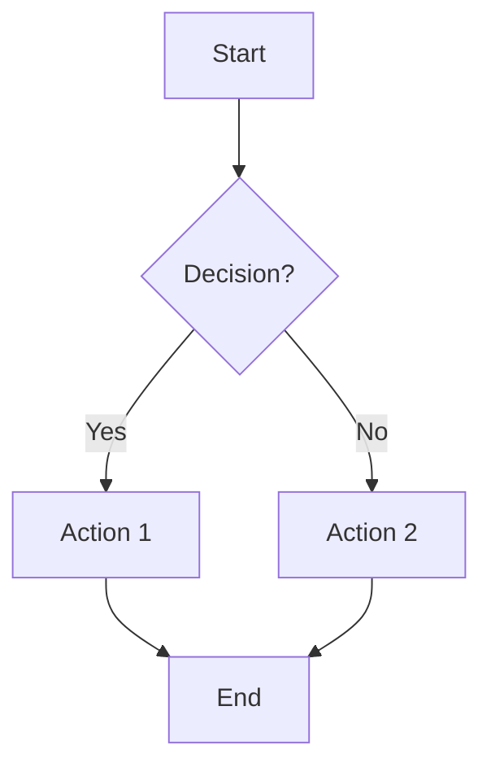
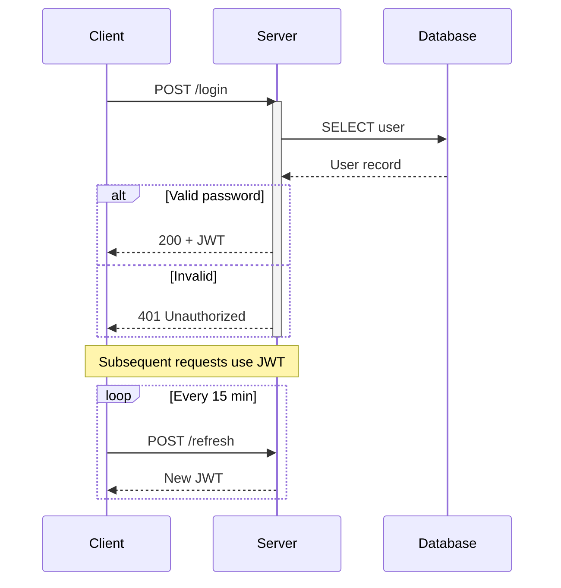
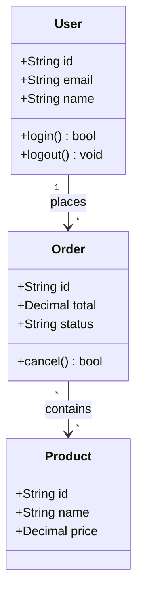
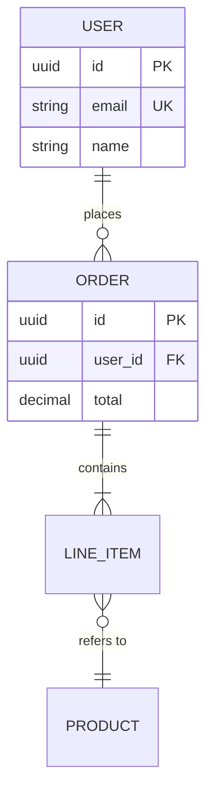
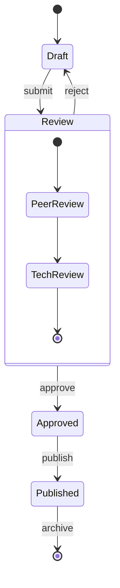
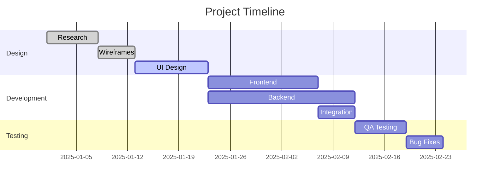
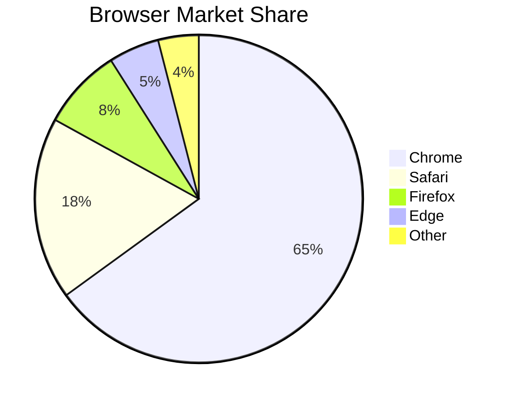
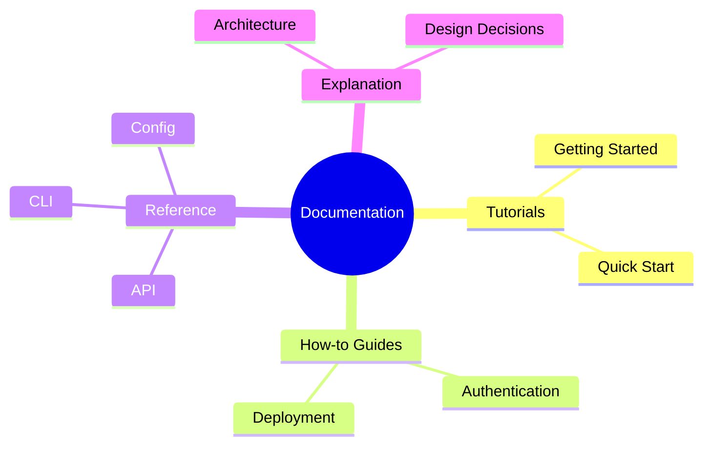
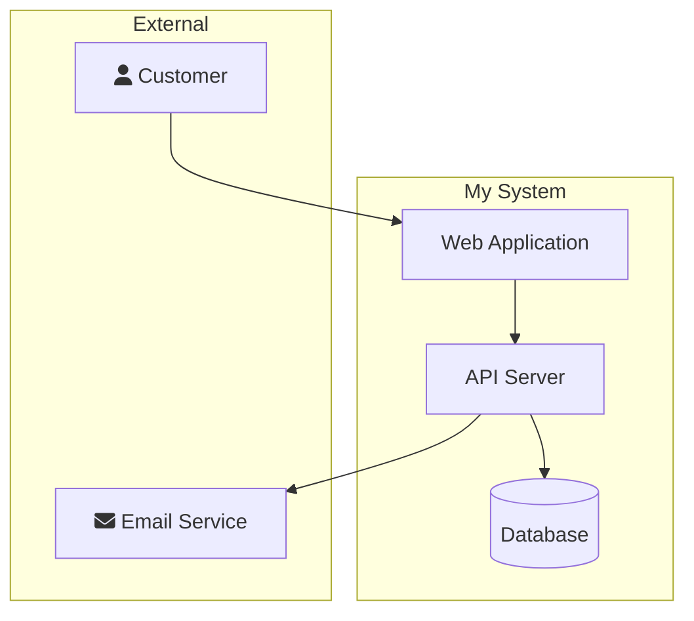

# Mermaid Diagram Cheatsheet

Quick reference for all major Mermaid diagram types. Renders natively on GitHub, GitLab, Docusaurus, and most documentation tools.

## Flowchart



**Node shapes:** `[text]` rectangle, `(text)` rounded, `{text}` diamond, `((text))` circle, `>text]` flag

**Arrow styles:** `-->` solid, `-.->` dotted, `==>` thick, `--text-->` labeled

**Direction:** `TD` top-down, `LR` left-right, `BT` bottom-top, `RL` right-left

## Sequence Diagram



**Arrow types:** `->>` solid, `-->>` dashed, `-x` cross (failed), `)` open

**Blocks:** `alt/else/end`, `loop/end`, `opt/end`, `par/and/end`, `critical/end`

## Class Diagram



**Visibility:** `+` public, `-` private, `#` protected, `~` package

**Relations:** `-->` association, `--|>` inheritance, `..|>` implementation, `--*` composition, `--o` aggregation

## Entity Relationship



**Cardinality:** `||` exactly one, `o|` zero or one, `}|` one or more, `}o` zero or more

## State Diagram



## Gantt Chart



## Pie Chart



## Git Graph

```mermaid
gitgraph
    commit id: "initial"
    branch develop
    checkout develop
    commit id: "feat-1"
    commit id: "feat-2"
    checkout main
    merge develop id: "v1.0"
    branch hotfix
    commit id: "fix-1"
    checkout main
    merge hotfix id: "v1.0.1"
```

## Mindmap



## C4 Context (using flowchart)



## Tips

- **GitHub:** Wrap in triple backticks with `mermaid` language tag
- **Docusaurus/VitePress:** Supported natively via MDX plugins
- **Live editor:** [mermaid.live](https://mermaid.live)
- **Max complexity:** Keep diagrams under ~30 nodes for readability
- **Accessibility:** Always add a text description near the diagram
