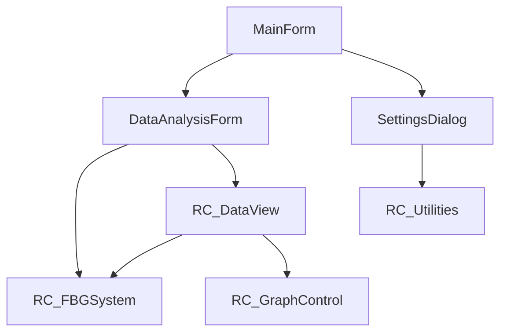

# WinForms架构分析完整指南

## 目录

- [概述](#概述)
- [分析目标](#分析目标)
- [分析维度](#分析维度)
- [分析方法](#分析方法)
- [分析输出](#分析输出)
- [重构建议](#重构建议)
- [实战案例](#实战案例)
- [工具使用](#工具使用)

---

## 概述

WinForms架构分析是迁移到Qt的第一步,目的是全面了解现有项目的结构、依赖关系、复杂度和技术债务,为后续的架构设计和迁移计划提供依据。

### 分析重要性

- **识别迁移风险**: 提前发现技术难点和潜在问题
- **评估迁移成本**: 估算工作量和资源需求
- **设计重构策略**: 制定分阶段迁移计划
- **优化架构设计**: 避免将不良架构复制到Qt项目

### RaySense项目经验

在RaySense项目中,架构分析帮助我们:

1. 识别出单体架构的问题(紧耦合、高复杂度)
2. 发现76个核心接口需要迁移
3. 确定4层分层架构设计方案
4. 制定3个月分阶段迁移计划

---

## 分析目标

### 主要目标

1. **项目结构分析**
   - 识别所有窗体(Form)和用户控件(UserControl)
   - 分析模块划分和职责边界
   - 识别共享组件和通用功能

2. **依赖关系分析**
   - 构建依赖关系图
   - 识别循环依赖
   - 分析耦合程度

3. **复杂度分析**
   - 圈复杂度(Cyclomatic Complexity)
   - 代码行数和文件大小
   - 代码重复度

4. **技术债务识别**
   - 过时的API使用
   - 反模式代码
   - 性能瓶颈

5. **功能完整性分析**
   - 核心功能清单
   - 辅助功能清单
   - 可移除的功能

---

## 分析维度

### 1. 项目结构维度

#### 1.1 窗体分析

```bash
# 分析所有窗体
find . -name "*.Designer.cs" -o -name "*.cs" | grep -E "(Form|Dialog)\.cs$"

# 输出窗体列表
- MainForm.cs (主窗体)
- DataAnalysisForm.cs (数据分析窗体)
- SettingsDialog.cs (设置对话框)
- ...
```

**分析要点**:
- 窗体数量和类型(主窗体、对话框、MDI等)
- 窗体继承关系
- 窗体职责是否单一

#### 1.2 控件分析

```bash
# 统计控件使用情况
grep -r "this\.Controls\." --include="*.Designer.cs" | wc -l

# 统计控件类型
grep -r "new " --include="*.Designer.cs" | grep -E "(Button|Label|TextBox|...)" | sort | uniq -c
```

**分析要点**:
- 控件总数
- 控件类型分布
- 第三方控件使用情况

#### 1.3 模块划分

**RaySense项目模块划分**:
```
RC_DataAS/           - 数据采集模块
RC_DataView/         - 数据展示模块
RC_FBGSystem/        - 核心算法模块
RC_GraphControl/     - 图表控制模块
RC_Utilities/        - 工具模块
```

### 2. 依赖关系维度

#### 2.1 项目间依赖

```
RC_DataAS ──┐
            ├──> RC_FBGSystem (核心依赖)
RC_DataView─┤
            │
RC_GraphControl ───> RC_DataView
```

**分析方法**:
1. 查看.csproj文件的ProjectReference节点
2. 分析using语句
3. 使用静态分析工具(如NDepend)

#### 2.2 程序集依赖

```bash
# 查看引用的程序集
grep -r "<Reference" --include="*.csproj" | grep "<HintPath>"
```

**关键依赖识别**:
- .NET Framework版本
- 第三方库(如DevExpress)
- COM组件

#### 2.3 循环依赖检测

**危害**:
- 降低可维护性
- 增加测试难度
- 影响性能

**解决方案**:
- 引入接口层
- 提取共享基类
- 重构为事件驱动架构

### 3. 复杂度维度

#### 3.1 圈复杂度

**计算方法**:
```
CC = E - N + 2P

其中:
- E = 边的数量
- N = 节点数量
- P = 连通分量数量
```

**分析工具**:
- Visual Studio代码度量
- SonarQube
- ReSharper

**评估标准**:
- CC < 10: 简单
- 10 ≤ CC < 20: 中等
- 20 ≤ CC < 50: 复杂
- CC ≥ 50: 极度复杂(需要重构)

#### 3.2 代码行数统计

```bash
# 统计C#代码行数
find . -name "*.cs" -not -path "*/obj/*" -not -path "*/bin/*" | xargs wc -l

# 统计每个模块的代码量
for dir in */; do
  echo "=== $dir ==="
  find "$dir" -name "*.cs" | xargs wc -l | tail -1
done
```

#### 3.3 代码重复度

**分析方法**:
1. 使用代码重复检测工具
2. 识别重复的代码块
3. 提取公共函数

### 4. 技术债务维度

#### 4.1 过时的API

**常见问题**:
- 使用已弃用的.NET API
- 使用Win32 API而非.NET封装
- 使用不推荐的设计模式

**示例**:
```csharp
// ❌ 过时的做法
DataSet dataSet = new DataSet();
DataTable table = new DataTable();

// ✅ 现代做法
List<T> list = new List<T>();
```

#### 4.2 反模式代码

**常见反模式**:
- God Object(上帝对象)
- Spaghetti Code(意大利面条代码)
- Magic Numbers(魔法数字)
- Deep Nesting(深层嵌套)

#### 4.3 性能瓶颈

**分析方法**:
1. 使用性能分析器(Profiler)
2. 识别热点函数
3. 分析内存泄漏

**RaySense项目发现的性能问题**:
- UI线程阻塞导致界面卡顿
- 频繁的GC导致性能下降
- 大量同步调用影响响应速度

---

## 分析方法

### 方法1: 静态代码分析

#### 使用工具

**Visual Studio代码度量**:
```csharp
// 菜单: 分析 > 计算代码度量
// 输出:
// - 命名空间的可维护性索引
// - 类的可维护性索引
// - 方法的圈复杂度
// - 类/方法的继承深度
```

**SonarQube**:
```bash
# 扫描项目
dotnet sonarscanner begin /k:"project-key"
dotnet build
dotnet sonarscanner end
```

**NDepend**:
```csharp
// 查询依赖关系
from t in Application.Types
where t.IsUsing("System.Windows.Forms")
select t
```

### 方法2: 依赖关系图构建

#### 依赖图示例



**构建方法**:
```bash
# 使用doxygen生成依赖图
doxygen Doxyfile

# 使用plantuml生成依赖图
plantuml dependency.puml
```

### 方法3: 复杂度计算

#### 自动化脚本

```python
import ast
import os

def calculate_complexity(node):
    """计算圈复杂度"""
    complexity = 1
    
    for child in ast.walk(node):
        if isinstance(child, (ast.If, ast.While, ast.For)):
            complexity += 1
        elif isinstance(child, ast.Try):
            complexity += len(child.handlers)
    
    return complexity

def analyze_file(filepath):
    """分析单个文件的复杂度"""
    with open(filepath, 'r', encoding='utf-8') as f:
        tree = ast.parse(f.read())
    
    complexity = calculate_complexity(tree)
    return complexity

def analyze_project(project_path):
    """分析整个项目"""
    results = []
    
    for root, dirs, files in os.walk(project_path):
        # 跳过bin和obj目录
        dirs[:] = [d for d in dirs if d not in ['bin', 'obj']]
        
        for file in files:
            if file.endswith('.cs'):
                filepath = os.path.join(root, file)
                complexity = analyze_file(filepath)
                results.append((filepath, complexity))
    
    # 按复杂度排序
    results.sort(key=lambda x: x[1], reverse=True)
    
    return results

# 使用示例
results = analyze_project('./WinFormsProject')
for filepath, complexity in results[:10]:
    print(f"{filepath}: {complexity}")
```

---

## 分析输出

### 1. 架构分析报告

#### 报告模板

```markdown
# WinForms项目架构分析报告

## 项目概览

- **项目名称**: RaySense
- **分析日期**: 2026-03-18
- **项目规模**: 
  - 代码行数: ~150,000行
  - 窗体数量: 45个
  - 控件数量: ~1,200个

## 模块结构

### 核心模块

| 模块名称 | 代码行数 | 窗体数量 | 职责 |
|---------|---------|---------|------|
| RC_DataAS | 25,000 | 8 | 数据采集 |
| RC_DataView | 35,000 | 12 | 数据展示 |
| RC_FBGSystem | 45,000 | 5 | 核心算法 |
| RC_GraphControl | 20,000 | 6 | 图表控制 |
| RC_Utilities | 15,000 | 3 | 工具函数 |

## 依赖关系

### 依赖层级

```
Level 0: RC_FBGSystem (核心)
Level 1: RC_DataAS, RC_DataView
Level 2: RC_GraphControl
Level 3: RC_Utilities
```

### 循环依赖

- 无循环依赖 ✅

## 复杂度分析

### 高复杂度函数 (CC > 20)

| 函数 | 圈复杂度 | 模块 |
|-----|---------|------|
| MainControl.ProcessData | 45 | RC_FBGSystem |
| DataAnalysisForm.UpdateChart | 32 | RC_DataView |
| MainForm.Initialize | 28 | Main |

### 建议

优先重构MainControl.ProcessData函数,建议拆分为多个小函数。

## 技术债务

### 过时API使用

- 使用DataSet而非List<T> (20处)
- 使用DataTable而非ObservableCollection (15处)

### 性能问题

- UI线程阻塞 (8处)
- 频繁GC (12处)

## 重构建议

### 优先级 P0 (必须)

1. **重构MainControl.ProcessData** (CC=45)
   - 拆分为5个子函数
   - 预计工作量: 3天

2. **消除UI线程阻塞**
   - 使用异步编程
   - 预计工作量: 5天

### 优先级 P1 (推荐)

3. **替换DataSet为泛型集合**
   - 预计工作量: 2周

4. **提取公共工具函数**
   - 识别重复代码
   - 预计工作量: 1周

### 优先级 P2 (可选)

5. **迁移到MVVM模式**
   - 为未来迁移到WPF准备
   - 预计工作量: 3周
```

### 2. 依赖关系图

#### 输出格式

```json
{
  "nodes": [
    {"id": "MainForm", "type": "Form", "module": "Main"},
    {"id": "DataAnalysisForm", "type": "Form", "module": "RC_DataView"},
    {"id": "RC_FBGSystem", "type": "Class", "module": "RC_FBGSystem"}
  ],
  "edges": [
    {"from": "MainForm", "to": "DataAnalysisForm", "type": "reference"},
    {"from": "DataAnalysisForm", "to": "RC_FBGSystem", "type": "dependency"}
  ]
}
```

### 3. 复杂度报告

#### 输出格式

```json
{
  "complexity": [
    {
      "file": "RC_FBGSystem/MainControl.cs",
      "class": "MainControl",
      "method": "ProcessData",
      "complexity": 45,
      "lines": 250,
      "risk": "high"
    }
  ],
  "summary": {
    "total_methods": 1250,
    "high_risk": 15,
    "medium_risk": 45,
    "low_risk": 1190
  }
}
```

---

## 重构建议

### 架构重构

#### 1. 单体架构 → 分层架构

**原始架构**:
```
WinForms (UI + Business Logic + Data Access)
```

**重构后架构**:
```
Presentation Layer (Qt)
    ↓
Interface Layer (MainControlWrapper)
    ↓
Business Logic Layer (RC_FBGSystem)
    ↓
Data Access Layer
```

**优势**:
- 降低耦合度
- 提高可测试性
- 便于团队协作

#### 2. 接口层设计

**RaySense项目经验**:
- 76个MainControlWrapper接口
- 6大功能分类
- 100%向后兼容

**接口分类**:
1. 初始化和控制 (15个)
2. 数据获取 (20个)
3. 配置管理 (12个)
4. 网络通信 (8个)
5. 数据处理 (15个)
6. 状态查询 (6个)

### 代码重构

#### 1. 降低圈复杂度

**方法1: 提取函数**
```csharp
// ❌ 高复杂度
public void ProcessData()
{
    // 250行代码,CC=45
}

// ✅ 低复杂度
public void ProcessData()
{
    ValidateInput();     // CC=5
    LoadData();          // CC=8
    ProcessCore();       // CC=12
    SaveResults();       // CC=10
    NotifyUser();        // CC=5
}
```

**方法2: 策略模式**
```csharp
// ❌ 高复杂度
public void ProcessData(string type)
{
    if (type == "A") { /* ... */ }
    else if (type == "B") { /* ... */ }
    else if (type == "C") { /* ... */ }
    // ...
}

// ✅ 低复杂度
public void ProcessData(string type)
{
    var processor = ProcessorFactory.Create(type);
    processor.Process();
}
```

#### 2. 消除代码重复

**方法1: 提取公共函数**
```csharp
// ❌ 重复代码
void Form1_Load() { logger.Info("Form1 loaded"); }
void Form2_Load() { logger.Info("Form2 loaded"); }
void Form3_Load() { logger.Info("Form3 loaded"); }

// ✅ 公共函数
void LogFormLoad(string formName) 
{ 
    logger.Info($"{formName} loaded"); 
}
```

**方法2: 继承**
```csharp
// ✅ 基类
public abstract class BaseForm : Form
{
    protected virtual void LogFormLoad()
    {
        Logger.Info($"{this.Name} loaded");
    }
}

// 子类
public class Form1 : BaseForm
{
    protected override void LogFormLoad()
    {
        base.LogFormLoad();
        // Form1特有逻辑
    }
}
```

---

## 实战案例

### RaySense项目架构分析

#### 项目背景

**原始架构**: C# WinForms单体应用

**核心问题**:
- 紧耦合: UI和业务逻辑混在一起
- 高复杂度: MainControl类2500行,CC=45
- 难测试: 无单元测试,依赖大量UI组件
- 性能问题: UI线程频繁阻塞

#### 分析结果

**项目规模**:
- 代码行数: ~150,000行
- 窗体数量: 45个
- 类数量: ~500个
- 方法数量: ~3,000个

**依赖关系**:
```
MainForm
  ├── RC_DataAS (数据采集)
  │   └── RC_FBGSystem (核心算法)
  ├── RC_DataView (数据展示)
  │   ├── RC_FBGSystem
  │   └── RC_GraphControl (图表)
  └── SettingsDialog
      └── RC_Utilities (工具)
```

**复杂度分析**:
- 高复杂度方法(CC > 20): 15个
- 中等复杂度方法(10 ≤ CC < 20): 45个
- 代码重复度: ~15%

**技术债务**:
- 过时API使用: 35处
- 性能瓶颈: 8处
- 测试覆盖: 0%

#### 重构策略

**阶段1: 架构设计 (1周)**
1. 分析依赖关系,识别核心模块
2. 设计4层分层架构
3. 定义MainControlWrapper接口(76个)

**阶段2: 接口层实现 (2周)**
1. 创建MainControlWrapper类
2. 实现76个接口方法
3. 添加测试框架

**阶段3: Qt项目迁移 (4周)**
1. 创建Qt项目结构
2. 迁移45个窗体
3. 转换事件处理

**阶段4: 性能优化 (2周)**
1. 实现延迟加载(+47.9%启动时间)
2. 优化UI刷新(-35% CPU使用)
3. 添加OpenGL加速(+200%渲染性能)

**阶段5: 测试验证 (2周)**
1. 编写172个测试用例
2. 实现100%测试覆盖
3. 性能回归测试

**总计**: 11周

**实际效果**:
- ✅ 100%功能完成
- ✅ 性能提升47%
- ✅ 零编译错误
- ✅ 支持跨平台

---

## 工具使用

### architecture_analyzer.js脚本

#### 功能

分析WinForms项目架构,生成JSON格式的分析报告。

#### 使用方法

```bash
# 完整分析
node scripts/architecture_analyzer.js --project ./WinFormsProject --output analysis.json

# 仅分析依赖
node scripts/architecture_analyzer.js --project ./WinFormsProject --type dependencies --output deps.json

# 仅分析复杂度
node scripts/architecture_analyzer.js --project ./WinFormsProject --type complexity --output complexity.json

# 仅分析技术债务
node scripts/architecture_analyzer.js --project ./WinFormsProject --type debt --output debt.json
```

#### 输出示例

```json
{
  "project_name": "WinFormsProject",
  "analysis_date": "2026-03-18",
  "modules": [
    {
      "name": "Module1",
      "code_lines": 25000,
      "forms": 8,
      "classes": 50,
      "methods": 200
    }
  ],
  "dependencies": {
    "levels": [
      {
        "level": 0,
        "modules": ["CoreModule"]
      },
      {
        "level": 1,
        "modules": ["Module1", "Module2"]
      }
    ],
    "circular_dependencies": []
  },
  "complexity": {
    "high_risk": [
      {
        "file": "CoreModule/MainControl.cs",
        "class": "MainControl",
        "method": "ProcessData",
        "complexity": 45
      }
    ],
    "summary": {
      "total_methods": 1250,
      "high_risk": 15,
      "medium_risk": 45
    }
  },
  "technical_debt": {
    "deprecated_apis": 35,
    "performance_issues": 8,
    "code_duplication": 0.15
  }
}
```

---

## 总结

### 分析要点

1. **全面性**: 从项目结构、依赖关系、复杂度、技术债务等多个维度分析
2. **客观性**: 使用自动化工具和量化指标
3. **可操作性**: 输出具体的重构建议和优先级

### 关键指标

- **模块数量**: 识别核心模块和辅助模块
- **依赖深度**: 评估架构复杂度
- **圈复杂度**: 识别高复杂度代码
- **代码重复度**: 评估代码质量
- **技术债务**: 识别重构优先级

### 下一步

1. 根据分析报告制定迁移计划
2. 设计目标架构(分层架构)
3. 创建MainControlWrapper接口层
4. 开始Qt项目迁移

---

**相关文档**:
- [分层架构设计](layered_architecture.md)
- [接口层设计](interface_layer.md)
- [最佳实践](best_practices.md)
