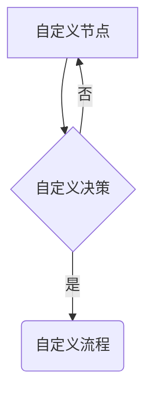

# Mermaid Workflow Skill

一个专门用于按照新工作流程创建和处理Mermaid图表的OpenClaw技能。

## 核心工作流程

1. **创建Mermaid定义文件** (.mmd)
2. **转换为PNG图片** (使用mmdc CLI)
3. **插入Markdown文件** (替换占位符或插入到指定位置)

## 快速开始

### 1. 安装依赖

```bash
# 安装Mermaid CLI
npm install -g @mermaid-js/mermaid-cli

# 或使用npx（无需安装）
npx @mermaid-js/mermaid-cli --version
```

### 2. 运行快速开始示例

```bash
cd /path/to/mermaid-workflow-skill
./quick_start.sh
```

### 3. 验证安装

```bash
# 检查mmdc
mmdc --version

# 检查Python脚本
python3 scripts/create_mermaid.py --help
```

## 使用方法

### 基本命令

#### 创建图表定义
```bash
python scripts/create_mermaid.py \
  --type roadmap \
  --title "技术路线图" \
  --output chart.mmd
```

#### 转换为PNG
```bash
python scripts/convert_mermaid.py \
  --input chart.mmd \
  --output chart.png
```

#### 插入到Markdown
```bash
python scripts/insert_to_md.py \
  --md-file report.md \
  --image chart.png \
  --placeholder "[CHART_PLACEHOLDER]"
```

### 支持的图表类型

- `roadmap`: 技术路线图（甘特图）
- `architecture`: 系统架构图
- `flowchart`: 流程图
- `sequence`: 序列图
- `class`: 类图
- `state`: 状态图
- `gantt`: 甘特图
- `er`: ER图

## 集成到OpenClaw

### 作为独立技能使用

在OpenClaw会话中直接调用：

```python
# 创建路线图
exec("python /path/to/mermaid-workflow-skill/scripts/create_mermaid.py --type roadmap --output roadmap.mmd")

# 转换为图片
exec("python /path/to/mermaid-workflow-skill/scripts/convert_mermaid.py --input roadmap.mmd --output roadmap.png")

# 插入到文档
exec("python /path/to/mermaid-workflow-skill/scripts/insert_to_md.py --md-file report.md --image roadmap.png --section '## 路线图'")
```

### 在技能中集成

在其他技能中调用Mermaid工作流：

```python
def generate_technical_document():
    # 创建图表
    create_mermaid_chart("roadmap", "项目路线图")
    
    # 转换为图片
    convert_to_png("roadmap.mmd", "roadmap.png")
    
    # 插入到文档
    insert_image_to_md("document.md", "roadmap.png", "## 项目路线图")
```

## 文件结构

```
mermaid-workflow-skill/
├── SKILL.md                    # 技能定义文件
├── README.md                   # 本文档
├── quick_start.sh              # 快速开始脚本
├── scripts/
│   ├── create_mermaid.py       # 创建Mermaid图表
│   ├── convert_mermaid.py      # 转换为PNG
│   └── insert_to_md.py         # 插入到Markdown
├── templates/                  # 图表模板
│   ├── roadmap.mmd
│   ├── architecture.mmd
│   └── flowchart.mmd
└── examples/                   # 示例文件
    └── example_workflow.md
```

## 配置

### Puppeteer配置文件

解决mmdc沙箱问题：

```json
{
  "args": ["--no-sandbox", "--disable-setuid-sandbox"]
}
```

使用配置文件：
```bash
python scripts/convert_mermaid.py --input chart.mmd --output chart.png --puppeteer-config puppeteer-config.json
```

### 环境变量

可以设置以下环境变量：

```bash
export MERMAID_THEME="forest"
export MERMAID_WIDTH="1600"
export MERMAID_HEIGHT="900"
```

## 故障排除

### 常见问题

1. **mmdc命令未找到**
   ```bash
   # 使用npx
   npx @mermaid-js/mermaid-cli --version
   
   # 或全局安装
   npm install -g @mermaid-js/mermaid-cli
   ```

2. **沙箱错误**
   ```
   Error: Failed to launch the browser process! No usable sandbox!
   ```
   创建Puppeteer配置文件并指定：
   ```bash
   python scripts/convert_mermaid.py --puppeteer-config puppeteer-config.json
   ```

3. **中文显示问题**
   ```bash
   # Ubuntu安装中文字体
   sudo apt-get install fonts-wqy-zenhei
   
   # 或在命令中指定字体
   mmdc --fontFamily "WenQuanYi Zen Hei"
   ```

4. **图片质量不佳**
   ```bash
   # 增加尺寸和DPI
   python scripts/convert_mermaid.py --width 2000 --height 1400
   ```

## 高级用法

### 批量处理

```bash
# 批量创建图表
for type in roadmap architecture flowchart; do
    python scripts/create_mermaid.py --type $type --output ${type}.mmd
done

# 批量转换
python scripts/convert_mermaid.py --input ./ --output ./png/ --batch

# 批量插入
python scripts/insert_to_md.py --md-file report.md --image-dir ./png/ --batch --placeholder-prefix "["
```

### 自定义模板

修改`templates/`目录中的模板文件：



### 自动化工作流

创建自动化脚本：

```bash
#!/bin/bash
# automate_workflow.sh

# 1. 创建图表
python scripts/create_mermaid.py --type "$1" --title "$2" --output "$3.mmd"

# 2. 转换为图片
python scripts/convert_mermaid.py --input "$3.mmd" --output "$3.png"

# 3. 插入到文档
python scripts/insert_to_md.py --md-file "$4" --image "$3.png" --section "$5"

echo "✅ 工作流完成: $3"
```

## 示例

### 完整工作流示例

```bash
# 创建项目目录
mkdir -p my_project
cd my_project

# 1. 创建图表
python ../mermaid-workflow-skill/scripts/create_mermaid.py \
  --type roadmap \
  --title "产品开发路线图" \
  --output product_roadmap.mmd

# 2. 转换为图片
python ../mermaid-workflow-skill/scripts/convert_mermaid.py \
  --input product_roadmap.mmd \
  --output product_roadmap.png

# 3. 创建报告
cat > report.md << EOF
# 项目报告

## 技术路线图

EOF

echo "✅ 工作流完成！"
```

## 许可证

MIT License

## 贡献

欢迎提交Issue和Pull Request！

1. Fork项目
2. 创建功能分支
3. 提交更改
4. 创建Pull Request