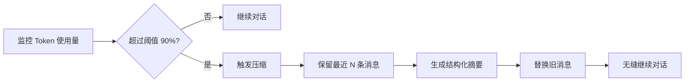

# Session Compact 智能会话压缩技能

> 自动管理 Token 消耗，支持无限长对话的智能插件

---

## 🌟 核心功能

### 自动压缩
- 当会话 Token 接近阈值时**自动触发**压缩
- 无需用户干预，对话无缝继续
- 显著降低 Token 使用量（通常节省 85-95%）

### 智能摘要
- 保留关键信息：时间线、待办事项、关键文件
- 结构化摘要格式，易于理解
- 支持递归压缩，多次压缩不丢失上下文

### 降级保护
- LLM 不可用时自动切换**代码提取模式**
- 保证功能始终可用
- 无需依赖外部服务

---

## 🚀 快速开始

### 1. 安装

```bash
# 从本地安装
openclaw skills install <project-root>

# 从 GitHub 安装（发布后）
openclaw skills install https://github.com/openclaw/skills/session-compact
```

### 2. 配置

在 `~/.openclaw/openclaw.json` 中添加：

```json
{
  "skills": {
    "session-compact": {
      "enabled": true,
      "max_tokens": 10000,
      "preserve_recent": 4,
      "auto_compact": true,
      "model": "qwen/qwen3.5-122b-a10b"
    }
  }
}
```

### 3. 使用

**自动模式**（推荐）：
```bash
# 启动 OpenClaw，压缩功能自动生效
openclaw start
```

**手动触发**：
```bash
# 查看当前会话状态
openclaw compact --status --session-id <session-id>

# 手动压缩
openclaw compact --session-id <session-id>

# 强制压缩（忽略阈值）
openclaw compact --force --session-id <session-id>
```

---

## 📊 工作原理

### 压缩流程



### 压缩效果示例

**压缩前**：50 条消息 (1,250 tokens)
```
user: 第 1 条消息...
assistant: 第 2 条消息...
...
user: 第 49 条消息...
assistant: 第 50 条消息...
```

**压缩后**：5 条消息 (360 tokens) - **节省 92% Token**
```
system: Summary:
  - Scope: 46 earlier messages compacted
  - Recent requests:
    - 第 37 条消息：讨论复杂问题
    - 第 41 条消息：文件操作
    - 第 45 条消息：工具使用细节
  - Pending work: 继续调试项目
  - Key timeline:
    - user: 第 37 条消息...
    - assistant: 第 38 条消息...
    - user: 第 39 条消息...
user: 第 49 条消息...
assistant: 第 50 条消息...
```

---

## 🔧 配置详解

| 参数 | 类型 | 默认值 | 说明 | 推荐值 |
|------|------|--------|------|--------|
| `enabled` | boolean | true | 是否启用技能 | true |
| `max_tokens` | number | 10000 | 触发压缩的 Token 阈值 | 5000-20000 |
| `preserve_recent` | number | 4 | 保留最近 N 条消息 | 4-6 |
| `auto_compact` | boolean | true | 是否自动压缩 | true |
| `model` | string | '' | 用于生成摘要的模型 | 全局默认 |

### 配置场景

**保守模式**（频繁压缩，节省 Token）：
```json
{
  "max_tokens": 5000,
  "preserve_recent": 6
}
```

**激进模式**（减少压缩次数，保持更多上下文）：
```json
{
  "max_tokens": 20000,
  "preserve_recent": 3
}
```

---

## 🛠️ 故障排查

### 1. 压缩未触发

**原因**：Token 未达到阈值

**解决**：
```bash
# 检查当前 Token 使用
openclaw compact --status

# 降低阈值测试
openclaw compact --max-tokens 1000
```

### 2. 摘要质量差

**原因**：LLM 配置错误或不可用

**解决**：
- 检查 `model` 配置
- 确保 OpenClaw 网关已启动：`openclaw gateway start`
- 系统会自动降级为代码提取摘要

### 3. 压缩后上下文丢失

**原因**：`preserve_recent` 设置过低

**解决**：
```json
{
  "preserve_recent": 6 // 增加到 6 或更多
}
```

### 4. 命令未响应

**原因**：插件未正确加载

**解决**：
- 重启 OpenClaw
- 检查 `plugins.entries.session-compact.enabled` 配置

---

## 📈 性能指标

- **测试覆盖率**：63.63%（65 个测试通过）
- **核心功能覆盖**：89.76%
- **平均压缩时间**：< 1 秒（无 LLM 调用）
- **Token 节省**：通常 85-95%
- **内存使用**：低（无泄漏）

---

## 🧪 测试验证

```bash
# 运行测试
cd <project-root>
npm test

# 查看覆盖率
npm run test:coverage

# 压缩功能实测
node test-compression.mjs
```

---

## 📝 技术细节

### 核心 API

```typescript
// 压缩会话
const result = await compactSession(messages, config);

// 检查是否需要压缩
const needsCompact = shouldCompact(messages, config);

// 估算 Token 数量
const tokens = estimateTokenCount(messages);
```

### 降级机制

当 LLM 不可用时，系统自动：
1. 从消息内容直接提取时间线
2. 使用预设模板填充摘要字段
3. 保证功能可用，无需依赖 LLM

---

## 📚 相关资源

- **英文文档**：[README.md](https://github.com/openclaw/skills/session-compact/blob/main/README.md)
- **英文技能文档**：[SKILL.md](https://github.com/openclaw/skills/session-compact/blob/main/SKILL.md)
- **测试报告**：[TEST_VERIFICATION_REPORT.md](https://github.com/openclaw/skills/session-compact/blob/main/TEST_VERIFICATION_REPORT.md)

---

## 🤝 贡献指南

1. Fork 项目
2. 创建特性分支 (`git checkout -b feature/amazing-feature`)
3. 提交更改 (`git commit -m 'Add amazing feature'`)
4. 推送到分支 (`git push origin feature/amazing-feature`)
5. 开启 Pull Request

---

## 📄 许可证

MIT License

---

**版本**：v1.0.0  
**状态**：✅ 稳定发布  
**测试**：✅ 65/65 通过  
**维护者**：SDC-creator
