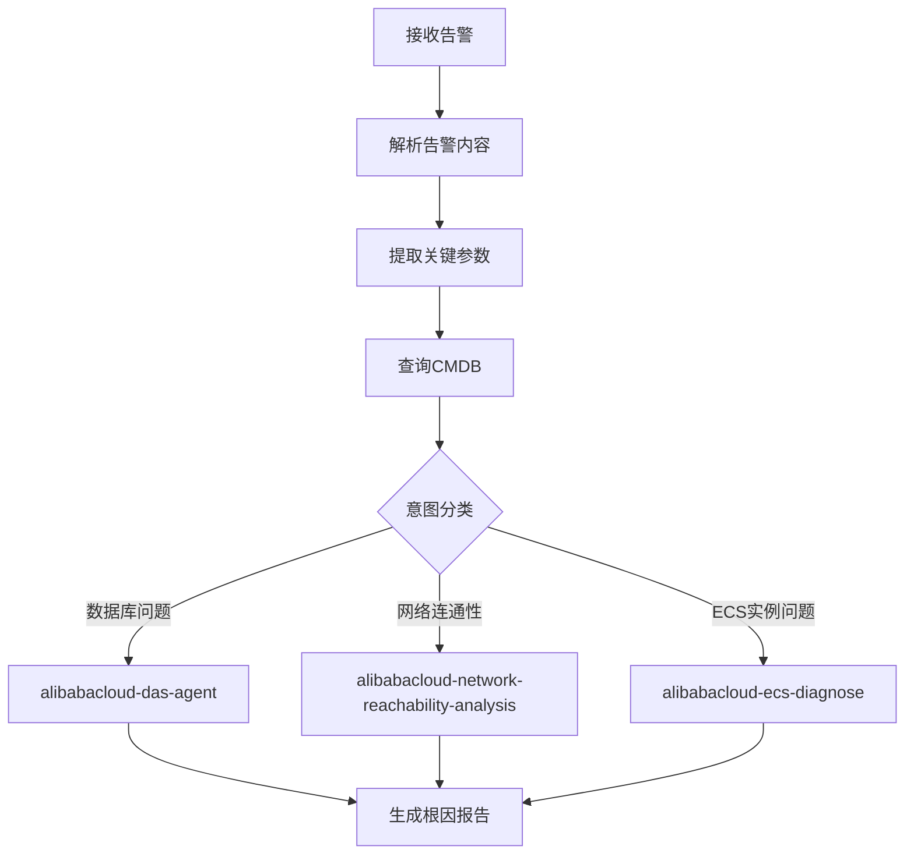

# 阿里云告警智能路由

本技能是一个**纯路由技能**，负责解析告警消息并将其路由到对应的后端诊断技能执行。

**架构**: `告警解析 → CMDB查询 → 意图路由 → 调用后端Skill → 生成根因报告`

**后端诊断技能**:
- `alibabacloud-ecs-diagnose` - ECS实例诊断
- `alibabacloud-network-reachability-analysis` - 网络可达性分析
- `alibabacloud-das-agent` - 数据库诊断



## 安装要求

> **前置检查:** 本技能为路由技能，具体诊断操作由后端技能执行。各后端技能的安装要求请参见对应技能文档。

| 技能 | 用途 | 前置要求 |
|------|------|----------|
| `alibabacloud-ecs-diagnose` | ECS实例诊断 | Aliyun CLI >= 3.3.1 |
| `alibabacloud-network-reachability-analysis` | 网络可达性分析 | Aliyun CLI >= 3.3.1, NIS开通 |
| `alibabacloud-das-agent` | 数据库诊断 | DAS Agent ID, uv (Python) |

---

# 第一阶段：告警解析与参数提取

## 1.1 解析告警消息

从告警中提取以下信息：

| 字段 | 说明 | 示例 |
|-----|------|-----|
| `alert_content` | 原始告警内容 | "ECS i-xxx 端口 22 连接异常" |
| `alert_source` | 告警来源 | CMS, ARMS, SLS, 自定义 |
| `resource_id` | 资源ID | i-bp1xxx, lb-xxx, rm-xxx |

## 1.2 意图分类与路由

根据 [references/intent-keywords.md](references/intent-keywords.md) 中的关键字匹配规则进行分类：

```
# 优先级1：数据库问题 → alibabacloud-das-agent
IF alert_content MATCHES database_keywords:
    intent = "database_diagnose"
    target_skill = "alibabacloud-das-agent"

# 优先级2：单个ECS实例问题 → alibabacloud-ecs-diagnose  
ELSE IF alert_content MATCHES ecs_keywords:
    intent = "ecs_diagnose"
    target_skill = "alibabacloud-ecs-diagnose"

# 优先级3：两个资源之间的连通性 → alibabacloud-network-reachability-analysis
ELSE IF alert_content MATCHES network_keywords:
    intent = "network_reachability"
    target_skill = "alibabacloud-network-reachability-analysis"

# 默认：ECS诊断
ELSE:
    intent = "ecs_diagnose"
    target_skill = "alibabacloud-ecs-diagnose"
```

**意图路由映射表：**

| 意图类别 | 关键字示例 | 路由到技能 |
|---------|-----------|------------|
| 数据库问题 | 数据库慢, SQL超时, RDS连接失败, 慢查询, 锁等待 | `alibabacloud-das-agent` |
| ECS实例问题 | SSH超时, 实例连不上, CPU告警, 磁盘满 | `alibabacloud-ecs-diagnose` |
| 网络连通性 | 端口不通, 网络超时, 从A访问B失败 | `alibabacloud-network-reachability-analysis` |

完成意图分类后，**必须**向用户展示分类结果：

```markdown
## 意图识别结果

| 字段 | 值 |
|-----|-----|
| 告警类型 | <告警类型描述> |
| 意图类别 | <database_diagnose / ecs_diagnose / network_reachability> |
| 路由技能 | <目标技能名称> |
| 匹配规则 | <匹配到的关键字> |
```

## 1.3 参数提取

### 数据库诊断参数

| 参数 | 提取模式 | 示例 |
|-----|---------|-----|
| instance_id | `rm-[a-z0-9]+`, `pc-[a-z0-9]+` | rm-bp1xxx |
| symptom | 慢查询, 连接异常, CPU高 | 数据库响应慢 |

### 网络可达性分析参数

| 参数 | 提取模式 | 示例 |
|-----|---------|-----|
| source_resource_id | `i-[a-z0-9]+`, 第一个匹配 | i-bp1abc123 |
| target_resource_id | `i-[a-z0-9]+`, 第二个匹配 | i-bp2def456 |
| target_port | `端口\s*(\d+)` | 22, 80, 3306 |

### ECS诊断参数

| 参数 | 提取模式 | 示例 |
|-----|---------|-----|
| instance_id | `i-[a-z0-9]+` | i-bp1abc123 |
| symptom | 连不上, 卡顿, 磁盘满 | SSH超时 |

---

# 第二阶段：资源信息查询

本阶段获取告警相关资源的详细信息，支持两种数据源：**CMDB** 和 **云平台 CLI**。

## 2.1 数据源优先级

```
1. 检查 CMDB 是否已配置 (references/cmdb.md)
   IF 文件存在 且 包含有效数据:
       CMDB 已配置 → 查询 CMDB
   ELSE:
       提示: "💡 企业 CMDB 未配置，使用云平台 API 查询资源信息"

2. 查询 CMDB
   IF CMDB 中找到资源: 使用 CMDB 数据
   ELSE: 继续 CLI 查询

3. 使用 CLI 查询云平台
   IF CLI 返回有效数据: 使用 CLI 数据
   ELSE: 进入步骤4

4. 资源不存在 → **立即停止执行**
   OUTPUT: "❌ 资源未找到，请手动提供资源 ID 和地域 ID"
   **必须等待用户提供有效信息后才能继续。**
```

## 2.2 资源查询输出

```markdown
## 资源信息查询结果

| 字段 | 值 |
|-----|-----|
| 数据来源 | <CMDB / 云平台API> |
| 资源 ID | <resource_id> |
| 地域 | <region_id> |
| 查询状态 | <找到 / 未找到> |
```

## 2.3 CMDB 配置

> CMDB（Configuration Management Database）为可选配置。配置位置: [references/cmdb.md](references/cmdb.md)

**CMDB 优势**: 支持业务名称映射（如 `db-prod-01` → `rm-bp1xxx`）、资源关联关系、网络拓扑信息。

---

# 第三阶段：调用后端诊断技能

根据意图分类结果，调用对应的后端诊断技能执行具体诊断。

> **重要**: 本技能为路由技能，不直接执行诊断操作。诊断由后端技能完成。

## 后端技能依赖检查

> **[必须] 前置检查**: 在调用后端技能之前，必须检查对应的技能是否已安装。
> 如果目标技能未安装，**立即停止**并提示用户安装所需技能。
>
> **❗禁止自主调用 CLI**: 当后端技能未安装时，**严禁**自行使用 Aliyun CLI 执行诊断操作。

**检查方法**:

```
found_in = []
FOR path IN [".qoder/skills/", ".claude/skills/", ".agents/skills/", "skills/"]:
    IF "<target_skill_name>" 在目录列表中:
        found_in.append(path)

IF found_in 为空:
    技能未安装 → 停止并提示用户安装
ELSE:
    继续执行
```

**检查结果输出**:

```markdown
## 后端技能依赖检查

| 技能名称 | 安装位置 | 状态 |
|---------|---------|------|
| <skill_name> | <path> | ✅ 已安装 / ❌ 未找到 |
```

**技能未安装时的处理**:

```
IF target_skill NOT installed:
    STOP execution
    OUTPUT: "❌ 无法执行诊断：所需技能 `<skill_name>` 未安装。请联系管理员安装。"
    EXIT  # 必须立即终止
```

> **⚠️ [严禁] 禁止使用替代方法**: 当后端技能未安装时，必须完全停止执行。禁止回退到 CLI 命令自行诊断。

## 后端技能调用规范

> **⚠️ [严禁] 禁止创建模拟脚本**: 严禁创建 shell 脚本来"模拟"后端技能的执行。

必须使用 **Skill 工具** 调用后端技能：

```
Skill(skill: "<backend_skill_name>", args: "<传递给后端技能的参数>")
```

**调用示例**:

```
# 数据库诊断
Skill(skill: "alibabacloud-das-agent", args: "请诊断RDS实例 rm-bp1xxx 的CPU使用率过高问题")

# 网络可达性分析
Skill(skill: "alibabacloud-network-reachability-analysis", args: "分析 i-bp1xxx 到 i-bp2xxx 端口 3306 的连通性")

# ECS 诊断
Skill(skill: "alibabacloud-ecs-diagnose", args: "诊断 ECS 实例 i-bp1xxx 的 SSH 连接超时问题")
```

## 3A. 路由到 alibabacloud-das-agent

当意图为 `database_diagnose` 时，调用 `alibabacloud-das-agent`。

**传递参数**: `question: "<基于告警内容构建的自然语言问题>"`, `instance_id: "<rm-xxx / pc-xxx>"`

## 3B. 路由到 alibabacloud-network-reachability-analysis

当意图为 `network_reachability` 时，调用该技能。

**传递参数**: `SourceId`, `TargetId`, `TargetPort`, `Protocol`, `RegionId`

## 3C. 路由到 alibabacloud-ecs-diagnose

当意图为 `ecs_diagnose` 时，调用该技能。

**传递参数**: `InstanceId`, `RegionId`, `symptom`

---

# 第四阶段：生成根因报告

后端技能诊断完成后，汇总结果并生成根因分析报告。

使用 [references/root-cause-report-template.md](references/root-cause-report-template.md) 模板生成报告。

---

# 使用限制

1. **路由限制**：本技能仅负责路由，具体诊断由后端技能执行
2. **后端技能限制**：各后端技能有各自的使用限制
3. **CMDB 可选**：未配置时使用云平台 API 查询

---

# 最佳实践

1. 准确识别告警意图，选择正确的后端技能
2. 使用CMDB补充资源关系信息
3. 传递完整的参数给后端技能
4. 汇总后端技能的诊断结果生成统一报告

---

# 参考文件

| 文件 | 内容 |
|-----|------|
| [references/cmdb.md](references/cmdb.md) | 企业CMDB资源关系表 |
| [references/intent-keywords.md](references/intent-keywords.md) | 意图分类关键字映射 |
| [references/ram-policies.md](references/ram-policies.md) | RAM权限策略 |
| [references/related-apis.md](references/related-apis.md) | API参考 |
| [references/root-cause-report-template.md](references/root-cause-report-template.md) | 根因报告模板 |
