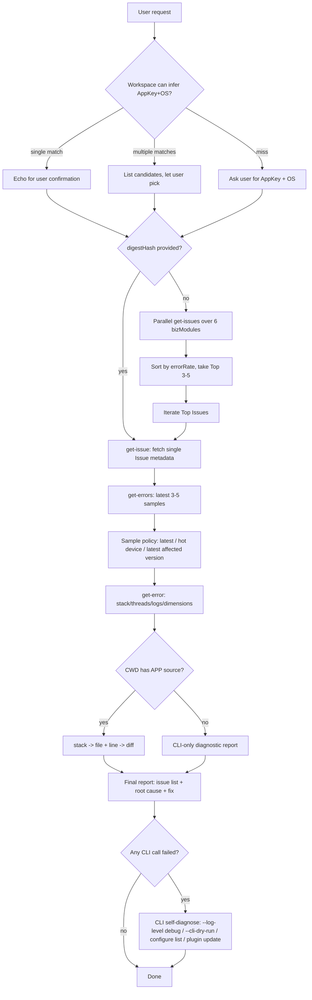

# alibabacloud-emas-apm-query

## 1. Scenario Description & Architecture

After a mobile app integrates Alibaba Cloud EMAS APM, the crash / anr / lag / custom / memory_leak / memory_alloc events it produces every day are aggregated and reported by the SDK to the backend. A typical troubleshooting workflow is:

1. **Figure out which Issues are most worth fixing**: sort by error rate / error count → pick Top 3~5
2. **Inspect what a specific Issue looks like**: fetch its aggregated metrics and affected versions
3. **Find several representative samples**: across different devices / versions / networks
4. **Read the stack + business log in a sample**: find actionable clues
5. **Compare against the app source code and propose a fix**

This skill stitches the 5 steps above into a single CLI pipeline. The entire process **only calls the 4 read-only APIs of `aliyun emas-appmonitor`**, and depends on no database / log service:

```
GetIssues  → GetIssue → GetErrors → GetError
   ↓
(optional) stack ↔ user APP source → precise file:line + fix diff
```

**Supported BizModules**: `crash` / `anr` / `lag` / `custom` / `memory_leak` / `memory_alloc`
**Supported OS**: `android` / `iphoneos` / `harmony` (`harmony` does not have `anr` / `memory_*`)

## 2. Prerequisites

| Item | Requirement | Self-check command |
| --- | --- | --- |
| Aliyun CLI version | >= `3.3.3` | `aliyun version` |
| Plugin | `aliyun-cli-emas-appmonitor` | `aliyun emas-appmonitor --help` |
| jq | any version (required by scripts) | `jq --version` |

Full installation steps: [`references/cli-installation-guide.md`](references/cli-installation-guide.md). Recommended: enable auto plugin installation once:

```bash
aliyun configure set --auto-plugin-install true
aliyun plugin update
```

## 3. Credential Pre-check

**Do NOT** print AK/SK values; just verify that an available profile exists:

```bash
aliyun configure list
```

The expected output contains a `current` profile whose `Mode` / `RegionId` are non-empty. If not, configure one of AK / OAuth / StsToken / RamRoleArn per [`references/cli-installation-guide.md#Configuration`](references/cli-installation-guide.md).

> **This skill never reads or forwards AK / SK field values themselves during its whole lifecycle.**

## 4. AI-mode Lifecycle

**Start** (before the skill runs):

```bash
aliyun configure ai-mode enable
aliyun configure ai-mode set-user-agent --user-agent "AlibabaCloud-Agent-Skills/alibabacloud-emas-apm-query"
```

**End** (after troubleshooting completes):

```bash
aliyun configure ai-mode disable
```

## 5. RAM Permissions

This skill only needs the 4 read-only `emasha:View*` actions (`ViewIssues` / `ViewIssue` / `ViewErrors` / `ViewError`). EMAS AppMonitor's RamCode is `emasha` and does **not** support resource-level authorization, so `Resource` is fixed to `"*"`.

For the full least-privilege JSON policy, the equivalent system policies (`AliyunEMASAppMonitorReadOnlyAccess` / `AliyunEMASAppMonitorFullAccess`), and common permission-error troubleshooting, see [`references/ram-policies.md`](references/ram-policies.md).

> **[MUST] Permission Failure Handling**: When any command or API call fails due to permission errors at any point during execution, follow this process:
> 1. Read `references/ram-policies.md` to get the full list of permissions required by this SKILL
> 2. Use `ram-permission-diagnose` skill to guide the user through requesting the necessary permissions
> 3. Pause and wait until the user confirms that the required permissions have been granted

## 6. Parameter Confirmation

> **IMPORTANT: Parameter Confirmation** — Before executing any command or API call,
> ALL user-customizable parameters (e.g., RegionId, instance names, CIDR blocks,
> passwords, domain names, resource specifications, etc.) MUST be confirmed with the
> user. Do NOT assume or use default values without explicit user approval.

| Parameter | Required | Type | Description | Default |
| --- | --- | --- | --- | --- |
| `app-key` | Yes | int64 | EMAS APP Key (typically 9+ digits). **Prefer to infer from SDK initialization code in the current workspace** (see the 6 rule families in [`references/appkey-detection.md`](references/appkey-detection.md)); if exactly one match is found, echo it and wait for user confirmation; if multiple, list candidates and let the user pick; on miss, ask the user to provide it manually. | None (default: probed from workspace) |
| `os` | Yes | enum | `android` / `iphoneos` / `harmony` (H5 goes to `h5`, which is out of scope). **Inferred together with `app-key` from the project type**: `build.gradle` / `AndroidManifest.xml` → `android`; `*.xcodeproj` / `Podfile` → `iphoneos`; `module.json5` + `ets/` → `harmony`. For cross-platform Flutter / Unity projects, the user MUST pick one (`android` / `iphoneos`). | None (default: probed from project type) |
| `time-range` | Yes | object | `StartTime=<ms> EndTime=<ms> Granularity=1 GranularityUnit=<HOUR\|DAY>` | Last 24 hours (user-overridable) |
| `biz-module` | No | list | If omitted, all 6 modules are scanned; if specified, only that module is analyzed | All 6 |
| `digest-hash` | No | string | If the user already knows a specific Issue, skip the Top-N stage and drill down directly | None |
| `top-n` | No | int | Number of Top issues | `5` |
| `filter-json` | No | string | Further narrow down (specific version / device model / region ...), a JSON string | Not applied |

**Timestamp unit**: every API uses **Unix milliseconds**. If the user passes a value in seconds (< 1e12), the scripts will automatically multiply by 1000.

**`biz-module` pitfall**: the CLI `--help` lists the legacy enum (`exception / crash / lag / custom / h5JsError / h5WhiteScreen`); however, **`anr / memory_leak / memory_alloc` are actually forwarded to the backend** and work. This skill scans all 6 modules requested by the user by default; see [`references/biz-module-reference.md`](references/biz-module-reference.md).

**`time-range` pitfall**: in some environments `Granularity=60 GranularityUnit=MINUTE` is rejected by the backend (returns `Code: 200, Message: "unknown error"`). **Always prefer** `Granularity=1 GranularityUnit=DAY` or `GranularityUnit=HOUR`.

**`--os` pitfall**: the CLI `--help` marks `--os` as optional, but in practice **omitting it returns an empty list without error** (`Model.Items=[]`, `Total=0`). All 4 APIs must pass `--os` explicitly.

**`--did` pitfall**: `get-error`'s `--did` is also marked optional in `--help`, but is **implicitly required by the backend**. Omitting it returns `Code: 100011 Parameter Not Enough`. Take it from `get-errors`' `Items[*].Did` (already handled by `dig_issue.sh`; when calling `aliyun emas-appmonitor get-error` manually, pass it explicitly).

**Dual semantics of `DigestHash`**: `get-errors` returns `Items[*].DigestHash`, which is the hash of a **single event**, different from the **aggregated** `--digest-hash` you passed in. When calling `get-error` next, still use the **aggregated** hash (the one you used in `get-issues` / `get-issue`); do not switch to the single-event hash.

**Reuse `biz-module`**: whichever `bizModule` was used to obtain a Top Issue from `get-issues` must be reused for the next three steps (`get-issue` / `get-errors` / `get-error`); otherwise the response will be empty (the same `DigestHash` exists under only one bizModule). `list_top_issues.sh` already attaches a `bm` field to each row so it can be reused.

## 7. Core Workflow



### 7.0 Runtime locate the Skill directory (`$SKILL_DIR`)

The Skill's own path is known to the Agent at the time SKILL.md is loaded (see the `fullPath` / `path` field under `<available_skills>` in the context). Before running any bash command that needs to read bundled resources from this Skill (`scripts/` / `assets/` / `references/`), **the Agent MUST** first export the directory of SKILL.md to `SKILL_DIR` exactly once:

```bash
# The Agent fills in the absolute path of SKILL.md into the placeholder, then exports once
export SKILL_DIR="$(cd "$(dirname "<ABSOLUTE_PATH_OF_SKILL.md>")" && pwd)"

# Self-check: all three directories must exist
[[ -d "$SKILL_DIR/scripts" && -d "$SKILL_DIR/assets" && -d "$SKILL_DIR/references" ]] \
  || { echo "[ERROR] SKILL_DIR does not point to the root of this Skill: $SKILL_DIR" >&2; exit 1; }
```

Rules:

1. **Do not hardcode `~/.cursor/skills-cursor/...` or `~/.claude/skills/...`**: this Skill can be distributed in the repository (`.agent/skills/alibabacloud-emas-apm-query/`) or at the user level, and the absolute path varies with the host.
2. **Do not rely on `cd` into the Skill directory to use relative paths**: the scripts drop artifacts into the current working directory (the user's APP source root); `cd` would break this semantic.
3. **The bash scripts have a fallback**: `scripts/list_top_issues.sh` and `scripts/dig_issue.sh` auto-detect their own location via `BASH_SOURCE` at the top, so they can locate `$SKILL_DIR` even if it was not exported. Other inline `jq` / `rg` commands inside SKILL.md still require the Agent to export `$SKILL_DIR` first.

### 7.1 Stage A: Top N (when `digest-hash` is not provided)

Use `scripts/list_top_issues.sh` to scan the 6 biz_modules in parallel:

```bash
bash "$SKILL_DIR/scripts/list_top_issues.sh" \
  --app-key <AppKey> \
  --os <iphoneos|android|harmony> \
  --start-time <startMs> \
  --end-time <endMs> \
  --top-n 5 \
  --order-by ErrorRate
```

The output is a merged Top-N table, each row containing `{bm, digestHash, ec, er, edc, edr, name, type, reason}`.
To add a Filter (e.g. "only version 3.5.x"), append `--filter-json '{"Key":"appVersion","Operator":"in","Values":["3.5.0","3.5.1"]}'`; see [`references/filter-reference.md`](references/filter-reference.md).

### 7.2 Stage B: Drill into a single Issue

Use `scripts/dig_issue.sh`:

```bash
bash "$SKILL_DIR/scripts/dig_issue.sh" \
  --app-key <AppKey> \
  --os <iphoneos|android|harmony> \
  --biz-module <crash|anr|lag|custom|memory_leak|memory_alloc> \
  --digest-hash <13-char Base36> \
  --start-time <startMs> --end-time <endMs> \
  --sample-size 3
```

Output directory:

```
emas-apm-dig-<AppKey>-<DigestHash>-<epoch>/
  01-get-issue.json
  02-get-errors.json           (contains the ClientTime/Uuid/Did triples)
  samples/<Uuid>.json          (complete JSON per sample, includes Backtrace/EventLog etc.)
  report.md                    (structured markdown report)
```

### 7.3 Stage C: Code mapping + diff (if the CWD contains APP source)

Follow [`references/troubleshoot-workflow.md`](references/troubleshoot-workflow.md):

1. Determine the platform (Android / iOS / Harmony / RN / Flutter / Web)
2. `Model.Backtrace` → keep APP user frames → grep the source → locate file:line
3. Enrich the timeline using `EventLog` + `Controllers` + `Threads` + `CustomInfo`
4. Emit the **smallest diff** (≤ 20 lines + one sentence of "why")

If the CWD does **not** contain the source: emit only a CLI diagnostic report (Issue overview, sample dimension comparison, representative stack), and append a hint that "switching to the APP source directory enables code-level localization".

### 7.4 Failure handling (CLI only)

When any `aliyun emas-appmonitor` call fails, run the following self-checks in order:

```bash
aliyun configure list                                   # 1. current profile / mode / region
aliyun plugin update                                    # 2. latest plugin
aliyun emas-appmonitor <cmd> ... --cli-dry-run          # 3. parameter serialization check
aliyun emas-appmonitor <cmd> ... --log-level debug      # 4. HTTP body + RequestId
```

**Do not guide the user to query any server-side data source.**

## 8. Success Verification

The full 6-step CLI self-verification (with runnable commands and pass/fail criteria for each step) is in [`references/verification-method.md`](references/verification-method.md). The correct-vs-incorrect CLI pattern matrix is in [`references/acceptance-criteria.md`](references/acceptance-criteria.md). Core criteria:

1. **Reachable**: `get-issues` dry-run prints the HTTP body successfully
2. **Non-empty**: some biz_module has `Model.Total >= 1`
3. **Stable**: two calls with identical parameters return the same Top 5 `DigestHash`
4. **Filter works**: after adding a filter, `Total` is strictly <= the full count
5. **Three-level chain**: `issues → issue → errors → error` can pull a Stack end to end
6. **Diagnosable**: on induced errors, the output includes `RequestId` and `ErrorCode`

## 9. Cleanup

This skill is **read-only**; it **does not** create any cloud resources that need cleanup.

Tear-down is only two things:

```bash
aliyun configure ai-mode disable

# (optional) delete the local JSON directories produced by dig_issue.sh
rm -rf ./emas-apm-dig-*
```

## 10. Best Practices

1. **Probe first, ask later**: before entering the main flow, grep SDK initialization code from the user's workspace per [`references/appkey-detection.md`](references/appkey-detection.md) to infer `app-key` / `os`; confirm with the user only after a hit, rather than asking upfront.
2. **Top first, then drill**: do not run `dig_issue.sh` against every Issue from the start — first use `list_top_issues.sh` to aggregate the Top N, then drill into each of them. The total number of CLI calls is `O(N)` rather than `O(all)`.
3. **Always pass `--os`**: `--os` on all 4 APIs is marked optional in `--help`, but omitting it returns empty results silently. Always specify `android / iphoneos / harmony` explicitly.
4. **`get-error` MUST carry `--did`**: marked optional in `--help` but implicitly required by the backend; take it from `Items[*].Did` in the `get-errors` response.
5. **Reuse `biz-module`**: the next `get-issue` / `get-errors` / `get-error` calls must use the same bizModule that produced the Issue in `get-issues`; switching will return empty.
6. **Shrink the time window from "wide" to "narrow"**: start diagnosis with 24h / `Granularity=1 GranularityUnit=DAY`; once a specific version / device is located, shrink to 1~4 hours with `GranularityUnit=HOUR`.
7. **Filters are JSON strings**: the entire `--filter` value must be a single JSON string; build nested `SubFilters` with `jq -cn` to avoid manual escape errors (see [`references/filter-reference.md`](references/filter-reference.md)).
8. **Multi-account scenarios**: confirm the profile via `aliyun configure list` and pass `--profile <name>` explicitly rather than relying on implicit env-var switching.
9. **Persist `get-error`**: this API response can be from hundreds of KB to several MB; do not truncate JSON with `head` / `tail`. Write to `> /tmp/emas-error-XXX.json` first and then process with `jq`.
10. **Android obfuscation**: when you see class names like `a.a.a.b.c`, ask the user for `mapping.txt` before attempting code mapping rather than guessing.
11. **iOS not symbolicated**: when `Model.SymbolicStatus=false`, the `Stack` contains many raw addresses; only emit conclusions at device / version dimensions, and re-analyze after dSYM is uploaded.
12. **Parallel QPS control**: `list_top_issues.sh` has a built-in `sleep 0.3s` to avoid throttling; scanning 6 biz_modules takes 2~3 seconds in total and does not need extra concurrency.
13. **Empty `biz-module` results are not errors**: `anr / memory_*` under `harmony` or very-low-traffic AppKeys returning `Total=0` is normal and should not be retried.
14. **Do not** reverse-use this skill to **write data**: all 4 APIs are `Get*` / `View*`. If the user wants to "update Issue status" or "mark as fixed", that falls under write APIs like `UpdateIssueStatus` and is out of scope.

## 11. Reference Links

| Document | Purpose |
| --- | --- |
| [`references/cli-installation-guide.md`](references/cli-installation-guide.md) | Aliyun CLI installation / configuration / plugins / credentials |
| [`references/appkey-detection.md`](references/appkey-detection.md) | Identify AppKey and OS from the user's workspace across Android / iOS / Harmony / Flutter / Unity / H5 |
| [`references/ram-policies.md`](references/ram-policies.md) | Least-privilege JSON + Permission Failure Handling |
| [`references/get-issues.md`](references/get-issues.md) | `GetIssues` parameters / response / ordering |
| [`references/get-issue.md`](references/get-issue.md) | `GetIssue` parameters / response |
| [`references/get-errors.md`](references/get-errors.md) | `GetErrors` parameters / response |
| [`references/get-error.md`](references/get-error.md) | `GetError` parameters / response |
| [`references/filter-reference.md`](references/filter-reference.md) | `--filter` structure / operators / SubFilters / dry-run validation |
| [`references/biz-module-reference.md`](references/biz-module-reference.md) | 6 biz_modules x platforms x available `filterCode` list |
| [`references/troubleshoot-workflow.md`](references/troubleshoot-workflow.md) | Full flow for stack -> source -> diff |
| [`references/related-commands.md`](references/related-commands.md) | Cheat sheet for all `aliyun emas-appmonitor` commands + skill boundary |
| [`references/verification-method.md`](references/verification-method.md) | 6-step runnable CLI verification with pass/fail criteria |
| [`references/acceptance-criteria.md`](references/acceptance-criteria.md) | Correct vs incorrect CLI pattern matrix (for review / self-check) |
| [`assets/system-filters/index.json`](assets/system-filters/index.json) | Index of 14 static filter snapshots (biz_module x platform) |
