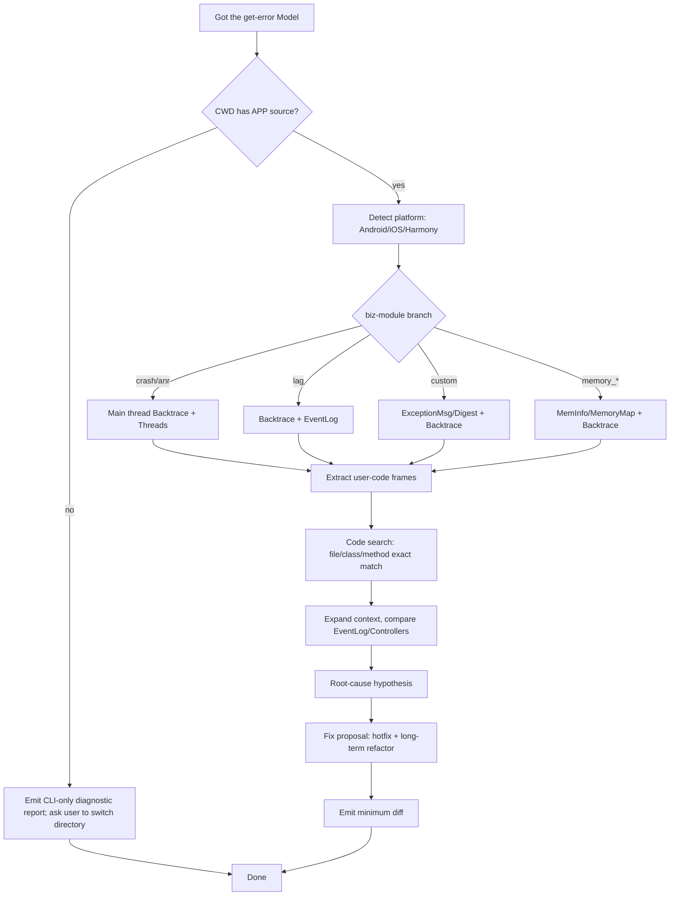

# Troubleshooting workflow: from sample to code fix

This document describes how the Skill, after obtaining the sample details from `get-error`, locates the issue inside the **APP source code in the user's current working directory (CWD)** and proposes a fix. The entire flow relies only on CLI output plus Cursor's built-in code search - no external data source is required.

## 1. Overview



## 2. Detect whether the CWD contains APP source

**One cross-platform check** (any single hit means "has source"):

| Platform | Signature files |
| --- | --- |
| Android | `build.gradle` / `build.gradle.kts` / `settings.gradle` / `AndroidManifest.xml` / `gradle.properties` |
| iOS | `*.xcodeproj` / `*.xcworkspace` / `Podfile` / `Podfile.lock` / `Package.swift` |
| Harmony | `build-profile.json5` / `oh-package.json5` / `hvigor-config.json5` |
| Generic / cross-platform | `package.json` + `android/` or `ios/` (React Native / Flutter / Taro) |

Detection snippet:

```bash
check_has_app_code() {
  local dir="${1:-.}"
  local hit=$(ls "$dir" 2>/dev/null | grep -Ec 'build\.gradle|settings\.gradle|Podfile|\.xcodeproj|\.xcworkspace|build-profile\.json5|package\.json')
  [ "$hit" -gt 0 ]
}
```

When `hit=0`, take the "CLI-only diagnostic report" branch and tell the user:
> The current directory has no APP source. Switch to the APP repository root and the Skill will map stack frames to file:line and propose fixes.

## 3. Key fields (`get-error` response)

All field names used in this workflow come from `get-error.Model`; the most relevant ones are:

| Field | Purpose |
| --- | --- |
| `Backtrace` | **Crash thread stack**, format varies per platform; nearly all code mapping starts here |
| `Threads` | All threads (mandatory for crash / anr) |
| `ExceptionType` / `ExceptionSubtype` / `ExceptionCodes` / `ExceptionMsg` / `ExceptionDetail` | Exception description |
| `EventLog` | Time-ordered event stream (page navigation, lifecycle, custom events) |
| `MainLog` | Main thread log (tail of Android logcat / iOS main thread log) |
| `Controllers` | Page path (iOS VC stack / Android Activity stack) |
| `CustomInfo` / `AdditionalCustomInfo` | Key-values injected by the developer |
| `MemInfo` / `MemoryMap` / `FileDescriptor` | Memory / FD snapshot (memory_* / OOM crash) |

## 4. Rules for mapping stack -> source file

### 4.1 Android (Java / Kotlin / JVM frames)

Frame format: `at <package>.<Class>.<method>(<FileName>.java:<line>)`

**Mapping steps**:

1. Read `Model.Backtrace` and scan frame by frame.
2. **Skip system frames**: anything starting with `java.`, `kotlin.`, `android.`, `androidx.`, `dalvik.`, `sun.`, `com.google.`.
3. **Locate user frames**: keep frames starting with the APP `applicationId` (read it from `build.gradle` `applicationId` or the `package` attribute in `AndroidManifest.xml`).
4. **Regex-match the class name**: `at <pkg>.<Class>.<method>(File.java:<L>)`.
5. **Search in the repo**:
   - Prefer mapping the **fully qualified class name** to a file path: `com.example.foo.Bar` -> parallel Grep/Glob for `**/Bar.java|kt`.
   - Once found, jump to `line` +/- 10 and verify the signature matches the frame.
6. **Kotlin specifics**:
   - `$lambda$<n>` / `Companion` / `$default` suffixes come from the Kotlin compiler; they can map back to source but the line number may be off by 1~3 lines - find the matching lambda signature nearby.
   - `<init>` is a constructor.
7. **Obfuscation**: when class names look like `a.a.a.b.c`, ask the user for `mapping.txt` to deobfuscate; otherwise only offer a "post-obfuscation stack summary + device/version" level conclusion.

### 4.2 iOS (Objective-C / Swift frames)

`Backtrace` typically has two formats:

- Pre-symbolicated: `0   apm_ios_demo   0x1030e93d0 0x103098000 + 332752`
- Post-symbolicated: `0   apm_ios_demo   EAPMDemoTriggerStackOverflow(unsigned long)` or `0   apm_ios_demo   -[MyViewController tableView:didSelectRowAtIndexPath:]`

**Is it symbolicated?** If `Backtrace` contains frames like `apm_ios_demo\s+-\[ClassName method]` or `apm_ios_demo\s+C\+\+Symbol`, yes; if it is mostly `0x...` or UUID strings (`2F32D384-4637-3018-...`), no.

**Mapping steps**:

1. Not symbolicated -> tell the user to "upload the dSYM for this version to the EMAS console, wait 5-10 minutes, then use the same `get-errors` to pull the latest samples". This round only provides device / version / type / count comparisons.
2. Symbolicated -> scan frame by frame:
   - **Skip system frames**: `UIKitCore`, `Foundation`, `libobjc.A.dylib`, `libSystem.B.dylib`, `CoreFoundation`, `QuartzCore`, `libdispatch.dylib`, etc.
   - Keep frames whose image name equals the APP executable name (usually the target name in `Podfile`, e.g. `apm_ios_demo`).
   - Extract the **class name + method name** pair.
3. Grep/Glob for the file:
   - OC: `<ClassName>.h` + `<ClassName>.m` (read both to confirm header/impl split).
   - Swift: `<ClassName>.swift` (Swift's type system makes duplicated class names rare).
4. Common combinations of `ExceptionType` / `ExceptionCodes`:
   - `EXC_BAD_ACCESS(KERN_PROTECTION_FAILURE)` -> wild pointer / write to read-only segment / stack overflow (the `EAPMDemoTriggerStackOverflow` recursion is this family)
   - `EXC_BAD_ACCESS(KERN_INVALID_ADDRESS)` -> use-after-free / KVO not unregistered
   - `EXC_CRASH + SIGABRT` -> explicit `abort()`, read the message in `ExceptionDetail` (often from `NSAssert` / `fatalError`)
   - `NSInvalidArgumentException` + `unrecognized selector` -> dynamic dispatch failure (wrong selector / target already released)

### 4.3 Harmony (ArkTS)

Frame format: `at <module>.<ClassName>.<method> (<file>.ts:<line>:<column>)`

- Skip system modules like `@ohos.*` / `@system.*`.
- The `<module>` in user frames is the `name` field of `oh-package.json5`.
- File paths are organized under `src/main/ets/**`; grepping the class name hits directly.

### 4.4 React Native / Flutter / cross-platform

- **JS stack**: `<function>@<bundlePath>:<line>:<column>` - requires sourcemap to resolve; in this case the Skill only groups by device dimensions and does not do code-level localization.
- **Dart stack**: `#0      MyWidget.build (package:app/pages/home.dart:42:7)` - parse `package:app/...` into `lib/pages/home.dart`.

## 5. Combine `EventLog` / `Controllers` / `Threads`

After obtaining the sample, **do not look only at the crashing thread**. Most crashes / anrs have observable "precursor signals":

1. **`EventLog`** (time-ordered event stream): scan the last 20~50 lines for:
   - The most recent page navigation / `PageAppear` / `ViewController transition`
   - The most recent network request URL + status code
   - The most recent major lifecycle transition (`AppDidBecomeActive` / `ApplicationOnStop`)
2. **`Controllers`** (page stack snapshot): the page path at crash time; combined with `EventLog` it tells you "which page triggered which operation".
3. **`MainLog`**: main-thread logs reported via tlog (tail of Android `logcat`, `NSLog` on iOS main thread).
   - Prioritize lines with `level=ERROR`.
   - Lines carrying a business serial number (`requestId` / `traceId`) can be cross-referenced with app-side instrumentation.
4. **`CustomInfo`** / **`AdditionalCustomInfo`**: key-values the developer manually injected; often contain "user-state data" (logged-in, channel, ABTest bucket, etc.).
5. **`Threads`** (anr / crash specific):
   - anr: find the "lock-holding" thread (stack stopped at `synchronized` / `ReentrantLock.lock` / `pthread_mutex_lock`)
   - crash: check whether background threads other than the main one are writing the same resource

Stitching precursor signals into a timeline alongside the crashing frame localizes the root cause faster than reading `Backtrace` in isolation.

## 6. Output format

The Skill's final report follows this structure:

```markdown
# Troubleshooting report for APP <name>

## 1. Issue list (Top N)
| # | DigestHash | biz_module | Status | ErrorRate | ErrorCount | Representative symptom |
| ...

## 2. Detailed analysis
### 2.1 <DigestHash-1>  <Title>
**Overview**: ExceptionType / ExceptionMsg / FirstVersion / AffectedVersions
**Trigger path**: EventLog + Controllers timeline
**Code localization**:
- `src/.../Foo.java:123` - `foo()` missing null check
- `src/.../Bar.swift:45` - synchronous IO on main thread

**Root-cause hypothesis**: ...

**Fix proposal**:
- Immediate hotfix: add a null guard at Foo.java:123 (see diff below)
- Long-term refactor: ...

**Diff**:
\`\`\`diff
--- a/src/.../Foo.java
+++ b/src/.../Foo.java
@@ -120,7 +120,11 @@
   public void foo() {
-      user.getProfile().load();
+      if (user == null || user.getProfile() == null) {
+          return;
+      }
+      user.getProfile().load();
   }
\`\`\`
...
```

## 7. Edge cases

- **Empty `Backtrace`**: memory_leak / memory_alloc may have no stack; fall back to `MemoryMap` / `MemInfo` + `Digest` (stack summary) and offer a reference-chain analysis instead.
- **Obfuscated stack (Android R8/ProGuard)**: class names like `a.a.a.b.c` - ask the user for `mapping.txt` and re-analyze.
- **Native stack not symbolicated**: mostly `0x...` addresses - ask the user to upload the `.so` symbol file to the EMAS console, or do offline symbolication locally with `addr2line`.
- **Truncated sample**: when `Backtrace` / `EventLog` exceeds 64KB, the backend truncates it (trailing "...(truncated)"). Ask the user to pull a newer sample or to increment `--page-index` to the next page and pick a smaller sample.

## 8. Minimum-diff convention

- Keep a single-file diff **<= 20 lines**, do not drag surrounding code in.
- 3 lines of context before and after, so reviewers can align visually.
- Do NOT put `// TODO` / `// FIXME` in the diff; either fix it or state "to be discussed".
- Precede each diff with a **one-sentence why** (not what):
  > "Add a null guard to prevent `getProfile()` from returning null when the user is not logged in, which causes `NullPointerException` (frame 3 of the crash stack)."

## 9. Interop with CLI errors

If `get-error` itself returns no data (`Success=true` but `Model=null`):

- Ask the user to widen `get-errors`' `--time-range` (7 days first, then 30) and obtain a new `ClientTime+Uuid`
- Try a different `Uuid` (pick a newer one from the sample list)
- Add `--biz-force true` to bypass the cache and retry (rarely effective)
- If still impossible, fall back to a report based purely on `get-issue` aggregated info, explicitly marking "no per-sample stack"

**This flow never directs the user to query a server-side data source** - it uses only CLI output.
