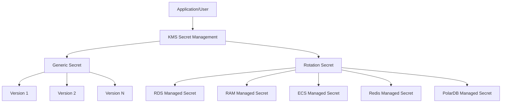

# Alibaba Cloud KMS Secret Management

This Skill provides core functionality for Alibaba Cloud Key Management Service (KMS) secret management, supporting CRUD operations on secrets.

## Scenario Description

KMS Secret Management service is used to securely store, manage, and access sensitive information, such as:
- Database connection credentials
- API keys
- OAuth tokens
- Certificate private keys
- Other sensitive data requiring secure storage

**Architecture:** Alibaba Cloud KMS Service + Secret Management (Secrets Manager)



---

## Environment Setup

> **Dependency**: Aliyun CLI. If `command not found` error occurs, refer to [references/cli-installation-guide.md](references/cli-installation-guide.md) for installation.

### Timeout Configuration

Set appropriate timeouts for CLI commands to avoid hanging:

```bash
# Set timeout environment variables (in seconds)
export ALIBABA_CLOUD_CONNECT_TIMEOUT=30
export ALIBABA_CLOUD_READ_TIMEOUT=30
```

Or use command-line flags:
```bash
aliyun kms <action> --connect-timeout 30 --read-timeout 30 ...
```

**Recommended timeout values:**
- Connection timeout: 30 seconds
- Read timeout: 30 seconds

---

## Security Rules

> - **Prohibited**: Reading, printing, or displaying AK/SK values
> - **Prohibited**: Requiring users to directly input AK/SK in conversation
> - **Sensitive Data Masking**: Secret values returned by GetSecretValue are masked by default (e.g., `***`), only output in plaintext when user explicitly requests

---

## RAM Permission Requirements

Ensure the executing user has the following KMS permissions. For detailed policies, see [references/ram-policies.md](references/ram-policies.md).

**Minimum Permissions (Read-Only):**
```
kms:DescribeSecret, kms:ListSecrets, kms:GetSecretValue, kms:ListSecretVersionIds, kms:GetSecretPolicy
```

**Full Permissions (Read-Write):**
```
kms:CreateSecret, kms:DeleteSecret, kms:UpdateSecret, kms:DescribeSecret, 
kms:ListSecrets, kms:GetSecretValue, kms:PutSecretValue, kms:ListSecretVersionIds,
kms:UpdateSecretVersionStage, kms:UpdateSecretRotationPolicy, kms:RotateSecret,
kms:RestoreSecret, kms:SetSecretPolicy, kms:GetSecretPolicy,
kms:ListKmsInstances, kms:ListKeys, kms:CreateKey
```

---

## Core Workflows

### 1. Create Secret

Creating a secret requires obtaining the KMS instance ID and encryption key ID first, then executing the creation.

```bash
# Step 1: Get KMS Instance ID
aliyun kms ListKmsInstances --PageNumber 1 --PageSize 10 --region <region-id> --user-agent AlibabaCloud-Agent-Skills
# → Extract KmsInstances.KmsInstance[0].KmsInstanceId

# Step 2: Get Encryption Key ID
aliyun kms ListKeys --Filters '[{"Key":"KeySpec","Values":["Aliyun_AES_256"]},{"Key":"DKMSInstanceId","Values":["<instance-id>"]}]' --PageNumber 1 --PageSize 10 --region <region-id> --user-agent AlibabaCloud-Agent-Skills
# → Extract Keys.Key[0].KeyId

# Step 3: Create Secret (requires DKMSInstanceId and EncryptionKeyId)
aliyun kms CreateSecret --SecretName "<secret-name>" --SecretData "<secret-value>" --VersionId "<version-id>" --EncryptionKeyId "<key-id>" --DKMSInstanceId "<instance-id>" --region <region-id> --user-agent AlibabaCloud-Agent-Skills
```

---

### 2. List Secrets

```bash
aliyun kms ListSecrets --region <region-id> --user-agent AlibabaCloud-Agent-Skills
```

---

### 3. Get Secret Value

> **Security Policy**: 
> - **If user does NOT explicitly request the secret value**: Only provide the CLI command or Python code script. **DO NOT execute**.
> - **If user explicitly requests to get/retrieve/show the secret value**: Provide the command/script first, then execute after user confirms.

**CLI Command:**
```bash
aliyun kms GetSecretValue --SecretName "<secret-name>" --region <region-id> --user-agent AlibabaCloud-Agent-Skills
```

**Python SDK Example:**
```python
from alibabacloud_tea_openapi.client import Client as OpenApiClient
from alibabacloud_tea_openapi import models as open_api_models
from alibabacloud_credentials.client import Client as CredentialClient
from alibabacloud_tea_util import models as util_models

credential = CredentialClient()
config = open_api_models.Config(credential=credential)
config.endpoint = 'kms.<region-id>.aliyuncs.com'
client = OpenApiClient(config)

params = open_api_models.Params(
    action='GetSecretValue',
    version='2016-01-20',
    protocol='HTTPS',
    method='POST',
    auth_type='AK',
    style='RPC',
    pathname='/',
    req_body_type='json',
    body_type='json'
)

body = {'SecretName': '<secret-name>'}
runtime = util_models.RuntimeOptions()
request = open_api_models.OpenApiRequest(body=body)
response = client.call_api(params, request, runtime)
print(response.body)
```

> **Note**: 
> - Only execute the retrieval after user explicitly confirms
> - The secret value contains sensitive information that should be handled with care
> - **Always remind user to execute in a secure environment** (private terminal, no screen sharing, no logging)

---

### 4. Delete Secret

**Pre-check before deletion (Safety Requirement):**

Before force deleting a secret, always verify its existence and check if it's still in use:

```bash
# Step 1: Describe the secret to verify existence and check metadata
aliyun kms DescribeSecret --SecretName "<secret-name>" --region <region-id> --user-agent AlibabaCloud-Agent-Skills
# → Check SecretName, CreateTime, and other metadata to confirm this is the correct secret
```

**If DescribeSecret returns error (secret not found):**
- Stop and inform user: "Secret does not exist, no deletion needed"

**If DescribeSecret succeeds:**
- Review the secret metadata
- Confirm with user before proceeding with force deletion

```bash
# Step 2: Force delete (immediate deletion, cannot be recovered)
aliyun kms DeleteSecret --SecretName "<secret-name>" --ForceDeleteWithoutRecovery true --region <region-id> --user-agent AlibabaCloud-Agent-Skills
```

> **Idempotency**: If `Forbidden.ResourceNotFound` error is returned, it means the secret does not exist, treat as deletion successful and continue with subsequent operations.

---

### 5. Update Secret Value

```bash
aliyun kms PutSecretValue --SecretName "<secret-name>" --SecretData "<new-secret-value>" --VersionId "<new-version-id>" --region <region-id> --user-agent AlibabaCloud-Agent-Skills
```

---

### 6. Describe Secret

```bash
aliyun kms DescribeSecret --SecretName "<secret-name>" --region <region-id> --user-agent AlibabaCloud-Agent-Skills
```

---

### 7. List Secret Versions

```bash
aliyun kms ListSecretVersionIds --SecretName "<secret-name>" --IncludeDeprecated true --region <region-id> --user-agent AlibabaCloud-Agent-Skills
```

---

### 8. Configure Rotation Policy

```bash
aliyun kms UpdateSecretRotationPolicy --SecretName "<secret-name>" --EnableAutomaticRotation true --RotationInterval 7d --region <region-id> --user-agent AlibabaCloud-Agent-Skills
```

---

### 9. Restore Deleted Secret

```bash
aliyun kms RestoreSecret --SecretName "<secret-name>" --region <region-id> --user-agent AlibabaCloud-Agent-Skills
```

> **Idempotency**: If `Rejected.ResourceInUse` error is returned, it means the secret has been restored or was not deleted, treat as restore successful and continue with subsequent operations.

---

## Advanced Features

For managed credentials and other advanced features, see [references/managed-credentials.md](references/managed-credentials.md).

---

## Reference Links

| Document | Description |
|----------|-------------|
| [references/related-apis.md](references/related-apis.md) | API detailed description |
| [references/ram-policies.md](references/ram-policies.md) | RAM permission policies |
| [references/managed-credentials.md](references/managed-credentials.md) | Managed credentials guide |
