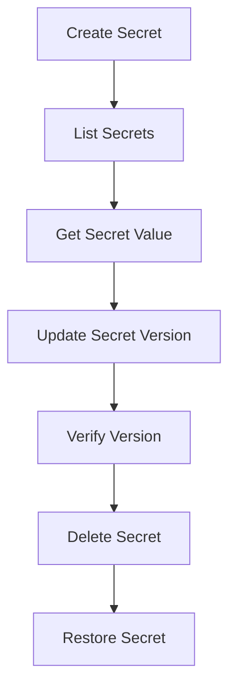

# KMS Secret Management Verification Methods

This document provides methods for verifying whether various KMS secret management operations were executed successfully.

## Verification Process Overview



---

## 1. Create Secret Verification

### Verification Command

```bash
# After creating secret, use DescribeSecret to verify creation success
aliyun kms DescribeSecret \
  --SecretName <secret-name> \
  --region <region-id> \
  --user-agent AlibabaCloud-Agent-Skills
```

### Success Indicators

- HTTP status code: 200
- Response contains `SecretName` field with value matching creation
- `CreateTime` field shows creation time

### Example Response

```json
{
  "SecretName": "my-secret",
  "CreateTime": "2024-01-15T10:30:00Z",
  "SecretType": "Generic",
  "Description": "Test secret",
  "RequestId": "xxx"
}
```

---

## 2. Secret List Verification (Pagination Query)

### Basic Query Verification

```bash
# Query secret list, confirm secret exists in list
aliyun kms ListSecrets \
  --region <region-id> \
  --user-agent AlibabaCloud-Agent-Skills
```

### Pagination Query Verification

```bash
# Verify pagination parameters take effect
aliyun kms ListSecrets \
  --PageNumber 1 \
  --PageSize 5 \
  --region <region-id> \
  --user-agent AlibabaCloud-Agent-Skills
```

### Success Indicators

- HTTP status code: 200
- `SecretList` array contains target secret
- `TotalCount` shows correct total number of secrets
- `PageNumber` matches request parameter
- `PageSize` matches request parameter
- Number of returned secrets does not exceed PageSize

### Pagination Traversal Verification

```bash
# First page
aliyun kms ListSecrets \
  --PageNumber 1 \
  --PageSize 10 \
  --region <region-id> \
  --user-agent AlibabaCloud-Agent-Skills

# Second page (if TotalCount > 10)
aliyun kms ListSecrets \
  --PageNumber 2 \
  --PageSize 10 \
  --region <region-id> \
  --user-agent AlibabaCloud-Agent-Skills
```

### Filter Query Verification

```bash
# Filter by name
aliyun kms ListSecrets \
  --Filters '[{"Key":"SecretName","Values":["<secret-name>"]}]' \
  --region <region-id> \
  --user-agent AlibabaCloud-Agent-Skills

# Filter by type
aliyun kms ListSecrets \
  --Filters '[{"Key":"SecretType","Values":["Generic"]}]' \
  --region <region-id> \
  --user-agent AlibabaCloud-Agent-Skills
```

---

## 3. Get Secret Value Verification

### Verification Command

```bash
# Get secret value, verify secret content is correct
aliyun kms GetSecretValue \
  --SecretName <secret-name> \
  --region <region-id> \
  --user-agent AlibabaCloud-Agent-Skills
```

### Success Indicators

- HTTP status code: 200
- `SecretData` field contains secret value
- `VersionId` field shows version ID
- `VersionStages` contains `ACSCurrent`

### Example Response

```json
{
  "SecretName": "my-secret",
  "SecretData": "my-secret-value",
  "VersionId": "v1",
  "VersionStages": {
    "VersionStage": ["ACSCurrent"]
  },
  "SecretDataType": "text",
  "RequestId": "xxx"
}
```

---

## 4. Store New Version Verification

### Verification Command

```bash
# After storing new version, query version list to verify
aliyun kms ListSecretVersionIds \
  --SecretName <secret-name> \
  --region <region-id> \
  --user-agent AlibabaCloud-Agent-Skills
```

### Success Indicators

- HTTP status code: 200
- `VersionIds` array contains new version ID
- New version's `VersionStages` contains `ACSCurrent`
- Old version's `VersionStages` becomes `ACSPrevious`

### Verify New Version Value

```bash
aliyun kms GetSecretValue \
  --SecretName <secret-name> \
  --VersionId <new-version-id> \
  --region <region-id> \
  --user-agent AlibabaCloud-Agent-Skills
```

---

## 5. Update Metadata Verification

### Verification Command

```bash
# After updating description, query secret info to verify
aliyun kms DescribeSecret \
  --SecretName <secret-name> \
  --region <region-id> \
  --user-agent AlibabaCloud-Agent-Skills
```

### Success Indicators

- HTTP status code: 200
- `Description` field shows updated description
- `LastRotationDate` or other metadata fields are updated

---

## 6. Version Stage Verification

### Verification Command

```bash
# After updating version stage, query version list to verify
aliyun kms ListSecretVersionIds \
  --SecretName <secret-name> \
  --region <region-id> \
  --user-agent AlibabaCloud-Agent-Skills
```

### Success Indicators

- Specified version's `VersionStages` is updated
- `ACSCurrent` label points to expected version

---

## 7. Rotation Policy Verification

### Verification Command

```bash
# After updating rotation policy, query secret info to verify
aliyun kms DescribeSecret \
  --SecretName <secret-name> \
  --region <region-id> \
  --user-agent AlibabaCloud-Agent-Skills
```

### Success Indicators

- `AutomaticRotation` field shows `Enabled` or `Disabled`
- `RotationInterval` field shows set rotation interval
- `NextRotationDate` shows next rotation time (if enabled)

### Example Response

```json
{
  "SecretName": "my-secret",
  "AutomaticRotation": "Enabled",
  "RotationInterval": "604800s",
  "NextRotationDate": "2024-01-22T10:30:00Z",
  "RequestId": "xxx"
}
```

---

## 8. Manual Rotation Verification

### Verification Command

```bash
# After manual rotation, get current version secret value
aliyun kms GetSecretValue \
  --SecretName <secret-name> \
  --region <region-id> \
  --user-agent AlibabaCloud-Agent-Skills
```

### Success Indicators

- `VersionId` shows new version ID after rotation
- `VersionStages` contains `ACSCurrent`
- Getting `ACSPrevious` version can retrieve old value

### Verify Old Version

```bash
aliyun kms GetSecretValue \
  --SecretName <secret-name> \
  --VersionStage ACSPrevious \
  --region <region-id> \
  --user-agent AlibabaCloud-Agent-Skills
```

---

## 9. Delete Secret Verification

### Verification Command (Soft Delete)

```bash
# After soft delete, secret enters deletion waiting period
aliyun kms DescribeSecret \
  --SecretName <secret-name> \
  --region <region-id> \
  --user-agent AlibabaCloud-Agent-Skills
```

### Success Indicators (Soft Delete)

- HTTP status code: 200
- `PlannedDeleteTime` field shows planned deletion time

### Verification Command (Force Delete)

```bash
# After force delete, secret is immediately deleted, query should return error
aliyun kms DescribeSecret \
  --SecretName <secret-name> \
  --region <region-id> \
  --user-agent AlibabaCloud-Agent-Skills
```

### Success Indicators (Force Delete)

- Returns error: `Forbidden.ResourceNotFound` or `EntityNotExist.Secret`

---

## 10. Restore Secret Verification

### Verification Command

```bash
# After restore, query secret info to verify
aliyun kms DescribeSecret \
  --SecretName <secret-name> \
  --region <region-id> \
  --user-agent AlibabaCloud-Agent-Skills
```

### Success Indicators

- HTTP status code: 200
- `PlannedDeleteTime` field does not exist or is empty
- Secret status returns to normal

---

## 11. Secret Policy Verification

### Verify Set Policy

```bash
# After setting policy, query policy to verify
aliyun kms GetSecretPolicy \
  --SecretName <secret-name> \
  --region <region-id> \
  --user-agent AlibabaCloud-Agent-Skills
```

### Success Indicators

- HTTP status code: 200
- `Policy` field contains set policy content

---

## Common Errors and Handling

| Error Code | Description | Handling Method |
|-----------|-------------|-----------------|
| `Forbidden.ResourceNotFound` | Secret does not exist | Check if secret name and region are correct |
| `EntityNotExist.Secret` | Secret does not exist | Confirm if secret was created or has been deleted |
| `Rejected.DuplicateSecretName` | Secret name duplicate | Use another name or check if in recovery period |
| `Rejected.DuplicateVersionId` | Version ID duplicate | Use unique version ID |
| `Forbidden.NoPermission` | No permission | Check RAM permission configuration |
| `InvalidParameter` | Parameter error | Check parameter format and values |

---

## Complete Verification Script Example

```bash
#!/bin/bash
# KMS Secret Management Complete Verification Script

SECRET_NAME="test-secret-$(date +%s)"
REGION="cn-hangzhou"
VERSION_1="v1"
VERSION_2="v2"

echo "=== 1. Create Secret ==="
aliyun kms CreateSecret \
  --SecretName "$SECRET_NAME" \
  --SecretData "initial-value" \
  --VersionId "$VERSION_1" \
  --Description "Test secret" \
  --region "$REGION" \
  --user-agent AlibabaCloud-Agent-Skills

echo "=== 2. Verify Creation ==="
aliyun kms DescribeSecret \
  --SecretName "$SECRET_NAME" \
  --region "$REGION" \
  --user-agent AlibabaCloud-Agent-Skills

echo "=== 3. Get Secret Value ==="
aliyun kms GetSecretValue \
  --SecretName "$SECRET_NAME" \
  --region "$REGION" \
  --user-agent AlibabaCloud-Agent-Skills

echo "=== 4. Store New Version ==="
aliyun kms PutSecretValue \
  --SecretName "$SECRET_NAME" \
  --SecretData "new-value" \
  --VersionId "$VERSION_2" \
  --region "$REGION" \
  --user-agent AlibabaCloud-Agent-Skills

echo "=== 5. Verify Version List ==="
aliyun kms ListSecretVersionIds \
  --SecretName "$SECRET_NAME" \
  --region "$REGION" \
  --user-agent AlibabaCloud-Agent-Skills

echo "=== 6. Delete Secret (Soft Delete) ==="
aliyun kms DeleteSecret \
  --SecretName "$SECRET_NAME" \
  --RecoveryWindowInDays 7 \
  --region "$REGION" \
  --user-agent AlibabaCloud-Agent-Skills

echo "=== 7. Restore Secret ==="
aliyun kms RestoreSecret \
  --SecretName "$SECRET_NAME" \
  --region "$REGION" \
  --user-agent AlibabaCloud-Agent-Skills

echo "=== 8. Force Delete Secret ==="
aliyun kms DeleteSecret \
  --SecretName "$SECRET_NAME" \
  --ForceDeleteWithoutRecovery true \
  --region "$REGION" \
  --user-agent AlibabaCloud-Agent-Skills

echo "=== Verification Complete ==="
```
