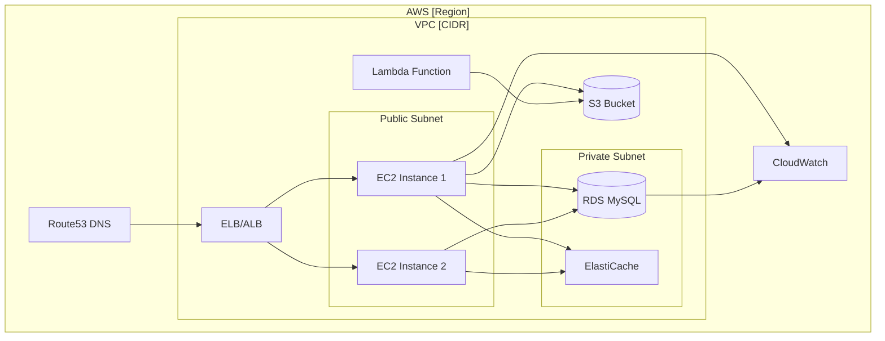
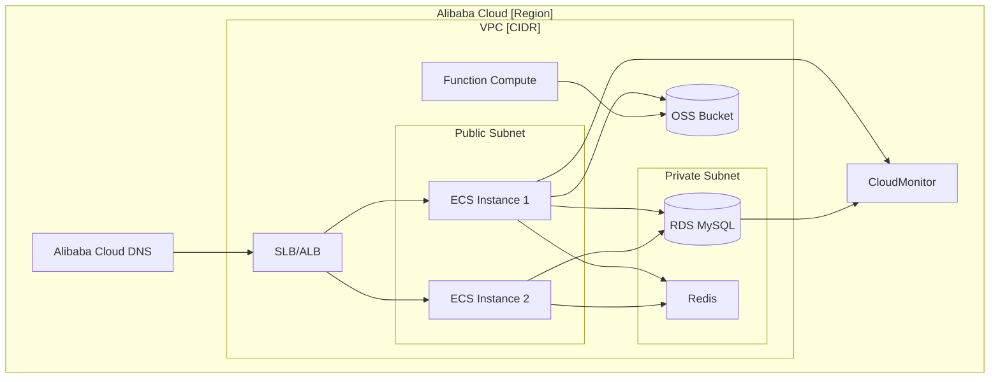

# AWS → Alibaba Cloud Migration Assessment Report

**Project Name:** [Enter project name]  
**Assessment Date:** [YYYY-MM-DD]  
**Assessed By:** [Name/Team]  
**Version:** 1.0

---

## 1. Executive Summary

### Migration Scope
- **Source AWS Account:** [Account ID or name]
- **Source AWS Region:** [e.g., us-east-1]
- **Target Alibaba Cloud Account:** [Account ID or name]
- **Target Alibaba Cloud Region:** [e.g., ap-southeast-1]

### Resource Summary
| Resource Type | Count |
|---------------|-------|
| Compute (EC2/ECS) | [number] |
| Storage (S3/OSS) | [number] |
| Database (RDS) | [number] |
| Networking (VPC/ELB) | [number] |
| Serverless (Lambda/FC) | [number] |
| DNS/CDN (Route53/DCDN) | [number] |
| Other | [number] |
| **Total** | [total] |

### Overall Readiness Assessment
**Status:** [Ready / Ready with Caveats / Not Ready]

**Justification:** [Brief explanation of readiness level]

### Estimated Migration Timeline
- **Start Date:** [YYYY-MM-DD]
- **End Date:** [YYYY-MM-DD]
- **Total Duration:** [X weeks/months]

### Key Risks and Mitigations
| Risk | Summary | Mitigation |
|------|---------|------------|
| [Risk 1] | [Brief description] | [Mitigation strategy] |
| [Risk 2] | [Brief description] | [Mitigation strategy] |

---

## 2. Resource Inventory

### Compute
| Resource Name | AWS Service | AWS Resource ID | Specs (type/size/config) | Alibaba Cloud Target | Migration Tool | Complexity | Notes |
|---------------|-------------|-----------------|--------------------------|----------------------|----------------|------------|-------|
| [e.g., web-server-1] | EC2 | [e.g., i-0abc123def] | [e.g., t3.medium, 2 vCPU, 4GB] | ECS [e.g., ecs.g6.large] | SMC | Low | [Any notes] |
| | | | | | | | |

### Storage
| Resource Name | AWS Service | AWS Resource ID | Specs (type/size/config) | Alibaba Cloud Target | Migration Tool | Complexity | Notes |
|---------------|-------------|-----------------|--------------------------|----------------------|----------------|------------|-------|
| [e.g., app-assets] | S3 | [e.g., my-bucket-123] | [e.g., Standard, 500GB] | OSS [e.g., Standard] | ossutil/rsync | Low | [Any notes] |
| | | | | | | | |

### Database
| Resource Name | AWS Service | AWS Resource ID | Specs (type/size/config) | Alibaba Cloud Target | Migration Tool | Complexity | Notes |
|---------------|-------------|-----------------|--------------------------|----------------------|----------------|------------|-------|
| [e.g., main-db] | RDS MySQL | [e.g., db-abc123] | [e.g., db.t3.medium, 100GB] | RDS MySQL [e.g., mysql.n2.medium.2c] | DTS | Medium | [Any notes] |
| | | | | | | | |

### Networking
| Resource Name | AWS Service | AWS Resource ID | Specs (type/size/config) | Alibaba Cloud Target | Migration Tool | Complexity | Notes |
|---------------|-------------|-----------------|--------------------------|----------------------|----------------|------------|-------|
| [e.g., main-vpc] | VPC | [e.g., vpc-abc123] | [e.g., 10.0.0.0/16] | VPC [e.g., 10.1.0.0/16] | Terraform | Low | [Any notes] |
| | | | | | | | |

### Serverless
| Resource Name | AWS Service | AWS Resource ID | Specs (type/size/config) | Alibaba Cloud Target | Migration Tool | Complexity | Notes |
|---------------|-------------|-----------------|--------------------------|----------------------|----------------|------------|-------|
| [e.g., image-processor] | Lambda | [e.g., img-proc-func] | [e.g., 128MB, 3s timeout] | Function Compute [e.g., 128MB, 3s] | Manual/Terraform | Medium | [Any notes] |
| | | | | | | | |

### DNS/CDN
| Resource Name | AWS Service | AWS Resource ID | Specs (type/size/config) | Alibaba Cloud Target | Migration Tool | Complexity | Notes |
|---------------|-------------|-----------------|--------------------------|----------------------|----------------|------------|-------|
| [e.g., main-domain] | Route53 | [e.g., Z123ABC] | [e.g., Hosted Zone] | Alibaba Cloud DNS | Manual | Low | [Any notes] |
| | | | | | | | |

### Other
| Resource Name | AWS Service | AWS Resource ID | Specs (type/size/config) | Alibaba Cloud Target | Migration Tool | Complexity | Notes |
|---------------|-------------|-----------------|--------------------------|----------------------|----------------|------------|-------|
| | | | | | | | |

---

## 3. Service Mapping

### Mapped Services
| AWS Service | Alibaba Cloud Equivalent | Mapping Confidence | Gap/Limitation |
|-------------|--------------------------|-------------------|----------------|
| [e.g., EC2] | ECS | High | [e.g., Some instance types unavailable] |
| [e.g., S3] | OSS | High | [e.g., API differences] |
| [e.g., RDS] | RDS | High | [e.g., Version compatibility] |
| [e.g., Lambda] | Function Compute | Medium | [e.g., Different runtime support] |
| | | | |

### Unmapped Services (Manual Handling Required)
| AWS Service | Reason Unmapped | Manual Approach |
|-------------|-----------------|-----------------|
| [e.g., AWS-specific service] | [e.g., No direct equivalent] | [e.g., Replace with third-party or custom solution] |
| | | |

---

## 4. Integration & Dependency Mapping

### Resource Dependencies
| Source Resource | Depends On | Dependency Type | Migration Impact |
|-----------------|------------|-----------------|------------------|
| [e.g., web-server-1] | [e.g., main-db] | Network (port 3306) | Migrate DB first |
| [e.g., api-lambda] | [e.g., app-assets] | API (S3 GET) | Migrate S3 first |
| [e.g., worker-ec2] | [e.g., SQS queue] | API (SQS poll) | Migrate queue service first |
| | | | |

### External Integrations
| External System | Integration Type | AWS Resource | Alibaba Cloud Resource | Notes |
|-----------------|------------------|--------------|------------------------|-------|
| [e.g., Stripe API] | HTTPS API | [e.g., NAT Gateway] | [e.g., NAT Gateway] | [e.g., No changes needed] |
| [e.g., On-prem DB] | VPN/Direct Connect | [e.g., VGW] | [e.g., Express Connect] | [e.g., Reconfigure tunnel] |
| | | | | |

---

## 5. Architecture Diagrams

### Current State Architecture (AWS)

**Replace above with actual AWS architecture. Include:**
- All compute resources (EC2, Lambda, ECS, etc.)
- All data stores (RDS, S3, DynamoDB, etc.)
- Network topology (VPC, subnets, load balancers)
- External integrations

### Target State Architecture (Alibaba Cloud)

**Replace above with actual target architecture. Ensure:**
- Equivalent services are mapped correctly
- Network topology maintains security posture
- All dependencies are preserved

---

## 6. Network Topology

### VPC/Subnet Layout

#### Current AWS VPC
| VPC Name | CIDR | Subnet Name | Subnet CIDR | Type (Public/Private) |
|----------|------|-------------|-------------|----------------------|
| [e.g., main-vpc] | [e.g., 10.0.0.0/16] | [e.g., public-subnet-1a] | [e.g., 10.0.1.0/24] | Public |
| | | [e.g., private-subnet-1a] | [e.g., 10.0.2.0/24] | Private |
| | | | | |

#### Target Alibaba Cloud VPC
| VPC Name | CIDR | Subnet Name | Subnet CIDR | Type (Public/Private) |
|----------|------|-------------|-------------|----------------------|
| [e.g., main-vpc] | [e.g., 10.1.0.0/16] | [e.g., public-subnet-1a] | [e.g., 10.1.1.0/24] | Public |
| | | [e.g., private-subnet-1a] | [e.g., 10.1.2.0/24] | Private |
| | | | | |

**Note:** Ensure CIDR ranges do not conflict if running hybrid during migration.

### Security Group Mapping
| AWS Security Group | Purpose | Inbound Rules | Outbound Rules | Alibaba Cloud Security Group |
|--------------------|---------|---------------|----------------|------------------------------|
| [e.g., sg-web] | Web servers | 80, 443 from 0.0.0.0/0 | All | [e.g., sg-web-ali] |
| [e.g., sg-db] | Database | 3306 from sg-web | All | [e.g., sg-db-ali] |
| | | | | |

### Hybrid Connectivity (During Migration)
| Requirement | AWS Side | Alibaba Cloud Side | Tool/Service | Status |
|-------------|----------|-------------------|--------------|--------|
| Site-to-Site VPN | [e.g., VGW] | [e.g., IPsec-VPN] | [e.g., IPsec tunnel] | [Planned/Configured] |
| Direct Connect | [e.g., DX] | [e.g., Express Connect] | [e.g., Dedicated line] | [Planned/Configured] |
| None (online only) | N/A | N/A | N/A | N/A |

---

## 7. IAM & Security Mapping

### IAM/RAM Entity Mapping
| AWS IAM Entity | Type (User/Role/Policy) | Alibaba Cloud RAM Equivalent | Notes |
|----------------|-------------------------|------------------------------|-------|
| [e.g., ec2-admin-role] | Role | [e.g., ecs-admin-role] | [e.g., Custom least-privilege policy scoped to required ECS actions] |
| [e.g., s3-read-policy] | Policy | [e.g., oss-read-policy] | [e.g., Custom policy for OSS read] |
| [e.g., lambda-exec-role] | Role | [e.g., fc-exec-role] | [e.g., Custom least-privilege policy scoped to accessed services] |
| | | | |

### Function Compute Execution Role Requirements
> **CRITICAL**: Every FC function that accesses other Alibaba Cloud services (OSS, SLS, Tablestore, MNS, etc.) **MUST** have a RAM role assigned via the `role` parameter. Without this, the function will fail at runtime with authentication errors (e.g., OSS `AccessDenied`).

| Lambda Function | AWS Execution Role | Services Accessed | Required RAM Policy Actions | Alibaba Cloud RAM Role Name |
|-----------------|-------------------|-------------------|----------------------------|----------------------------|
| [e.g., my-func] | [e.g., lambda-s3-role] | [e.g., S3 read/write] | [e.g., oss:GetObject, oss:PutObject] | [e.g., fc-my-func-role] |
| | | | | |

### Encryption Mapping
| AWS Service | Encryption Method | Alibaba Cloud Equivalent | Notes |
|-------------|-------------------|--------------------------|-------|
| S3 | SSE-S3 / SSE-KMS | OSS Server-Side Encryption | [e.g., Use KMS key] |
| RDS | KMS key | RDS TDE with KMS | [e.g., Key ID mapping] |
| EBS | KMS key | Cloud Disk Encryption | [e.g., Key ID mapping] |
| | | | |

### Compliance Requirements
| Requirement | AWS Implementation | Alibaba Cloud Implementation | Status |
|-------------|--------------------|------------------------------|--------|
| [e.g., Data residency] | [e.g., us-east-1 region] | [e.g., ap-southeast-1 region] | [Compliant/Review needed] |
| [e.g., Encryption at rest] | [e.g., KMS for all storage] | [e.g., KMS for all storage] | [Compliant/Review needed] |
| | | | |

---

## 8. Monitoring & Observability Mapping

| AWS Service | Alibaba Cloud Equivalent | Config Notes |
|-------------|--------------------------|--------------|
| CloudWatch Metrics | CloudMonitor | [e.g., Set up custom metrics for ECS] |
| CloudWatch Logs | SLS (Simple Log Service) | [e.g., Configure Logtail on ECS] |
| CloudWatch Alarms | CloudMonitor Alerts | [e.g., Recreate alarm thresholds] |
| X-Ray | ARMS (Application Real-Time Monitoring Service) | [e.g., Install ARMS agent] |
| CloudTrail | ActionTrail | [e.g., Enable for all regions] |
| AWS Config | Config Audit | [e.g., Set up compliance rules] |
| | | |

### Dashboard Migration
| AWS Dashboard | Purpose | Alibaba Cloud Dashboard | Status |
|---------------|---------|-------------------------|--------|
| [e.g., Main Ops Dashboard] | [e.g., Overall system health] | [e.g., CloudMonitor Dashboard] | [Planned/Complete] |
| | | | |

---

## 9. Data Migration Strategy

### Database Migration
| Database Name | AWS RDS Instance | Alibaba Cloud RDS Instance | Migration Approach | Data Volume | Est. Transfer Time | Cutover Window |
|---------------|------------------|----------------------------|--------------------|-------------|--------------------|----------------|
| [e.g., main-db] | [e.g., db-abc123] | [e.g., rm-xyz789] | [Full + Incremental via DTS] | [e.g., 100GB] | [e.g., 4 hours] | [e.g., 2 hours] |
| | | | | | | |

**Migration Steps:**
1. [ ] Create DTS migration task (full data migration)
2. [ ] Enable incremental sync
3. [ ] Monitor sync lag
4. [ ] Schedule cutover window
5. [ ] Stop writes to source
6. [ ] Wait for sync completion
7. [ ] Update application connection strings
8. [ ] Verify data integrity
9. [ ] Decommission source (after validation period)

### Storage Migration
| Storage Name | AWS S3 Bucket | Alibaba Cloud OSS Bucket | Migration Approach | Data Volume | Est. Transfer Time | Cutover Window |
|--------------|---------------|--------------------------|--------------------|-------------|--------------------|----------------|
| [e.g., app-assets] | [e.g., my-bucket] | [e.g., my-bucket-ali] | [ossutil sync / online] | [e.g., 500GB] | [e.g., 8 hours] | [e.g., None (online)] |
| | | | | | | |

**Migration Steps:**
1. [ ] Create OSS bucket
2. [ ] Configure ossutil
3. [ ] Run initial sync: `ossutil sync oss://source oss://target -r`
4. [ ] Schedule periodic syncs for delta
5. [ ] Final sync during cutover (if needed)
6. [ ] Update application endpoints
7. [ ] Verify file integrity
8. [ ] Decommission source (after validation period)

---

## 10. Cost Estimation

### Resource Cost Comparison
| Resource | AWS Monthly Cost (USD) | Alibaba Cloud Monthly Cost (USD) | Notes |
|----------|------------------------|----------------------------------|-------|
| [e.g., EC2 t3.medium x4] | [$XXX] | [$XXX] | [e.g., ECS g6.large equivalent] |
| [e.g., RDS db.t3.medium] | [$XXX] | [$XXX] | [e.g., Similar specs] |
| [e.g., S3 500GB] | [$XXX] | [$XXX] | [e.g., OSS Standard] |
| [e.g., ELB] | [$XXX] | [$XXX] | [e.g., SLB equivalent] |
| [e.g., Data transfer] | [$XXX] | [$XXX] | [e.g., Egress costs] |
| **Total Monthly** | **[$XXX]** | **[$XXX]** | **Savings: $XXX (XX%)** |

### Migration Tool Costs
| Tool | Cost Type | Estimated Cost | Notes |
|------|-----------|----------------|-------|
| SMC (Server Migration Center) | Free | $0 | [e.g., No charge for migration] |
| DTS (Data Transmission Service) | Free + Data Transfer | $XXX | [e.g., Pay for data transfer only] |
| ossutil | Free | $0 | [e.g., No charge, pay for egress] |
| AWS Data Egress | Per GB | $XXX | [e.g., $0.09/GB for us-east-1] |
| **One-Time Migration Cost** | | **[$XXX]** | |

### Ongoing Costs Post-Migration
| Cost Category | Monthly Estimate | Notes |
|---------------|------------------|-------|
| Compute | [$XXX] | |
| Storage | [$XXX] | |
| Database | [$XXX] | |
| Network | [$XXX] | |
| Monitoring | [$XXX] | |
| **Total** | **[$XXX]** | |

---

## 11. Risk Assessment

| Risk | Probability | Impact | Mitigation |
|------|-------------|--------|------------|
| Data loss during migration | Low | High | [Use DTS with verification; keep source intact until validation complete] |
| Extended downtime | Medium | High | [Plan cutover during low-traffic window; test rollback procedure] |
| Performance degradation | Medium | Medium | [Benchmark target resources before cutover; scale up if needed] |
| IAM/permission issues | Medium | Medium | [Test RAM policies in staging; use least-privilege principle] |
| DNS propagation delay | Low | Medium | [Lower TTL 48h before cutover; use health checks] |
| Application compatibility | Medium | High | [Test thoroughly in staging; have rollback ready] |
| Cost overrun | Low | Low | [Monitor costs daily; set budget alerts] |
| Third-party integration failure | Low | High | [Test all external integrations in staging; have fallback] |

**Probability:** Low (<20%), Medium (20-50%), High (>50%)  
**Impact:** Low (minor inconvenience), Medium (significant disruption), High (business-critical failure)

---

## 12. Migration Plan (Phase Summary)

| Phase | Resources | Tool | Dependencies | Estimated Duration | Status |
|-------|-----------|------|--------------|--------------------|--------|
| 1. Network Setup | VPC, Subnets, Security Groups, NAT Gateway | Terraform | None | [e.g., 1 week] | [Not Started] |
| 2. Server Migration | EC2 instances → ECS | SMC | Phase 1 complete | [e.g., 2 weeks] | [Not Started] |
| 3. Database Migration | RDS → RDS | DTS | Phase 1 complete | [e.g., 1 week + cutover] | [Not Started] |
| 4. Storage Migration | S3 → OSS | ossutil | Phase 1 complete | [e.g., 1 week] | [Not Started] |
| 5. Serverless Migration | Lambda → Function Compute | Manual/Terraform | Phase 1, 4 complete | [e.g., 1 week] | [Not Started] |
| 6. DNS/CDN Cutover | Route53 → Alibaba Cloud DNS | Manual | All phases complete | [e.g., 1 day] | [Not Started] |
| 7. Validation & Decommission | All resources | Manual | All phases complete | [e.g., 1 week] | [Not Started] |

### Rollback Strategy per Phase
| Phase | Rollback Trigger | Rollback Procedure |
|-------|------------------|--------------------|
| 1. Network Setup | Configuration errors | Destroy and recreate VPC with corrected config |
| 2. Server Migration | Application fails on ECS | Revert DNS to AWS ELB; terminate ECS instances |
| 3. Database Migration | Data integrity issues | Stop DTS; revert application to AWS RDS endpoint |
| 4. Storage Migration | File access issues | Revert application to S3 endpoints |
| 5. Serverless Migration | Function failures | Revert to AWS Lambda; update API Gateway |
| 6. DNS/CDN Cutover | Critical failures | Update DNS records back to AWS (respect TTL) |
| 7. Validation | Any critical issue | Execute phase-specific rollback |

---

## 13. Rollback Plan

### Point of No Return Criteria
**Do NOT proceed past this point until:**
- [ ] All data migrations verified (checksums match)
- [ ] All applications tested in staging
- [ ] All stakeholders signed off
- [ ] Rollback procedure tested
- [ ] Backup of all source resources confirmed

### DNS Rollback (Fastest Path)
1. Update DNS records to point back to AWS ELB/CloudFront
2. Wait for TTL expiration (reduced to [X minutes] before cutover)
3. Verify traffic routing to AWS
4. Monitor application health

**Estimated DNS Rollback Time:** [X minutes to X hours depending on TTL]

### DTS Reverse Sync Capability
- **Supported:** Yes (if DTS task configured bidirectionally)
- **Procedure:**
  1. Stop writes to Alibaba Cloud RDS
  2. Enable reverse sync in DTS (Alibaba Cloud → AWS)
  3. Wait for sync completion
  4. Update application connection strings to AWS RDS
  5. Verify data integrity

### Data Rollback per Phase
| Phase | Rollback Data Source | Rollback Time Estimate |
|-------|----------------------|------------------------|
| 2. Server Migration | AWS EC2 (still running) | Immediate (DNS switch) |
| 3. Database Migration | AWS RDS (via DTS reverse sync) | [X hours] |
| 4. Storage Migration | AWS S3 (still intact) | Immediate (endpoint switch) |
| 5. Serverless Migration | AWS Lambda (still deployed) | [X minutes] |

---

## 14. Next Steps

### Pre-Migration Checklist
- [ ] Complete resource inventory (Section 2)
- [ ] Validate service mappings (Section 3)
- [ ] Document all dependencies (Section 4)
- [ ] Create architecture diagrams (Section 5)
- [ ] Configure network topology (Section 6)
- [ ] Set up IAM/RAM policies (Section 7)
- [ ] Configure monitoring (Section 8)
- [ ] Test data migration in staging (Section 9)
- [ ] Review cost estimates (Section 10)
- [ ] Review and accept risks (Section 11)
- [ ] Finalize migration plan (Section 12)
- [ ] Test rollback procedure (Section 13)
- [ ] Schedule cutover window with stakeholders
- [ ] Prepare communication plan for downtime

### Sign-Off

**Migration Lead:** ________________________  **Date:** _______________

**Technical Approver:** ________________________  **Date:** _______________

**Business Stakeholder:** ________________________  **Date:** _______________

**Security/Compliance:** ________________________  **Date:** _______________

---

**Document Version History:**
| Version | Date | Author | Changes |
|---------|------|--------|---------|
| 1.0 | [YYYY-MM-DD] | [Name] | Initial assessment |
| | | | |
