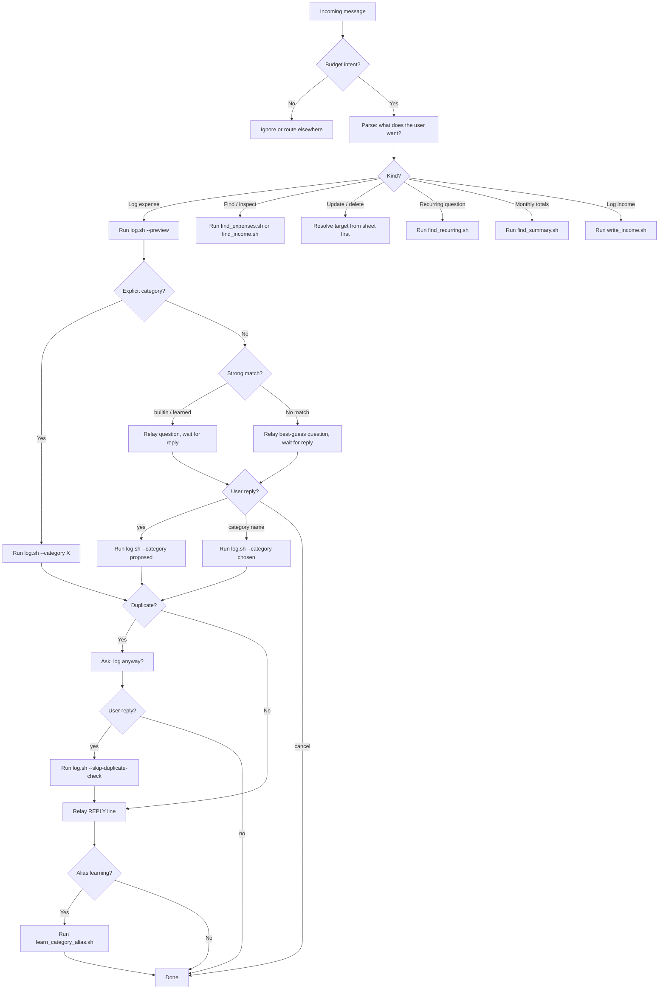

# Simplify Budget Conversation Workflow

This file is the visual source of truth for the budget conversation layer.

OpenClaw handles orchestration natively through its active conversation model and conversation context. No external state machine is required.

## How State Works

The active OpenClaw conversation model's conversation context is the state. No external storage is needed.

When OpenClaw asks "Log mcdonalds under Dining Out?" and the user replies "yes", the current conversation model resolves what "yes" refers to from the conversation history. No classify-reply script, no pending state file, and no session keys are required.

## Rules

- Script output is the only source of truth. Never answer from memory.
- Relay `REPLY:` lines verbatim.
- User-facing confirmations come from the `question` field in preview output.
- If context is lost (session restart), re-run the preview and ask again.
