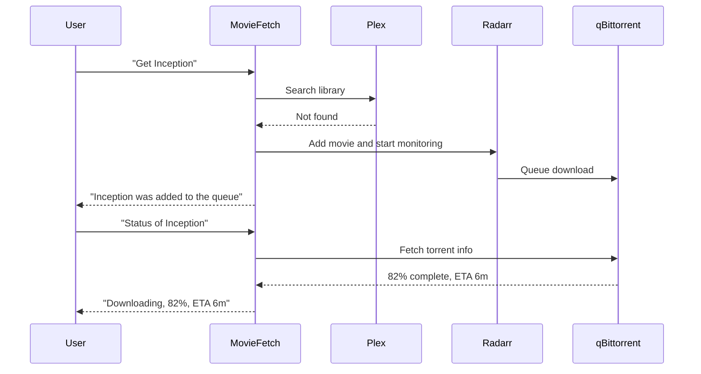

# MovieFetch

MovieFetch turns chat into a remote control for your movie pipeline.

Ask for a film, and MovieFetch can download it for you. It checks whether it is already in Plex, sends new requests to Radarr, lets qBittorrent handle the transfer, and gives you status updates without making you tab through three different dashboards.

## The Pitch

MovieFetch is built for the common home-media loop:

- You remember a movie you want to watch.
- You ask for it in chat.
- MovieFetch starts the download flow for you.
- The system checks Plex first so you do not request duplicates.
- Radarr queues the movie.
- qBittorrent downloads it.
- Plex becomes the final destination.

It is not a giant media automation suite. It is a focused skill that makes your existing stack feel conversational.

## What It Can Do

### 1. Check Before You Queue

Before adding anything, MovieFetch can search your Plex movie library and tell you whether the title is already available.

Example prompts:
- `Do I already have Dune Part Two?`
- `Check if Spider-Man: Across the Spider-Verse is in Plex`

### 2. Request a Movie From Chat

MovieFetch can take a plain-language movie request and start downloading it through your Radarr and qBittorrent pipeline.

Example prompts:
- `Get The Nice Guys`
- `Download Arrival`
- `Add The Dark Knight to Plex`

### 3. Track Live Download Progress

Once a movie is in flight, MovieFetch can query qBittorrent and return a human-readable progress snapshot with state, ETA, and size.

Example prompts:
- `Status of Oppenheimer`
- `How far along is Blade Runner 2049?`
- `Check download progress for Interstellar`

### 4. Remove a Movie Cleanly

If you want to cancel, clean up, or make space, MovieFetch can remove a title from Radarr and optionally delete the files too.

Example prompts:
- `Remove Joker`
- `Delete Tenet and remove the files`
- `Cancel The Batman`

## How It Feels In Use

## Tooling Model

MovieFetch currently exposes four focused tools:

| Tool | Purpose |
|---|---|
| `check_plex` | Check whether a movie already exists in Plex |
| `request_movie` | Add a movie to Radarr and kick off the movie download flow |
| `check_download` | Read live qBittorrent progress for a requested movie |
| `remove_movie` | Remove a movie from Radarr and optionally delete files |

## Setup

### Requirements

- Radarr with API access
- qBittorrent Web UI enabled
- Plex server access token

### Environment Variables

Configure these in your OpenClaw environment or shell:

| Variable | Description | Default |
|---|---|---|
| `RADARR_URL` | Base URL of the Radarr API | `http://localhost:7878/api/v3` |
| `RADARR_API_KEY` | Radarr API key | Required |
| `RADARR_QUALITY_PROFILE_ID` | Quality profile used for new requests | `1` |
| `RADARR_ROOT_FOLDER` | Root folder path for imported movies | `/tmp/plex_movies/` |
| `PLEX_URL` | Plex server URL | `http://localhost:32400` |
| `PLEX_TOKEN` | Plex token | Required |
| `PLEX_MOVIE_LIBRARY` | Plex movie library name | `Movies` |
| `QBIT_URL` | qBittorrent Web UI URL | `http://localhost:8080` |
| `QBIT_USERNAME` | qBittorrent username | `admin` |
| `QBIT_PASSWORD` | qBittorrent password | Required in most setups |

## Why It Plays Well On ClawHub

- Clear job to be done: download, track, and remove movies
- Tight integration with a stack many self-hosters already run
- Simple natural-language prompts with immediate utility
- Focused surface area instead of a bloated “do everything” media assistant

## Publish Notes

If you publish this on ClawHub, use a listing description close to:

> Request, track, and remove movies across Plex, Radarr, and qBittorrent from chat.
>
> Or more directly:
>
> Download, track, and remove movies across Plex, Radarr, and qBittorrent from chat.
