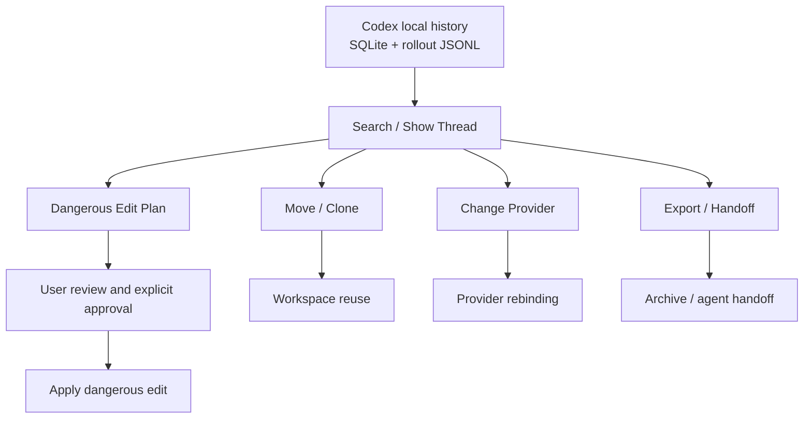

# Codex History Manager

[](https://github.com/severinzhong/codex-history-manager/actions/workflows/ci.yml)

[中文说明](./README_zh.md)

`codex-history-manager` is a local-first skill and CLI for managing Codex history stored on disk. It can search, read, export, migrate, clone, rebind provider metadata, and perform guarded history rewrites under an explicit high-risk workflow.

It operates on two local Codex data stores:

- `~/.codex/state_5.sqlite` for thread metadata
- `~/.codex/sessions/.../rollout-*.jsonl` and `~/.codex/archived_sessions/...` for event logs

## Workflow



## Installation

Run directly from the repository:

```bash
python3 scripts/codex_history_manager.py --help
```

Install as a system command:

```bash
python3 -m pip install .
codex-history-manager --help
```

Or use `pipx`:

```bash
pipx install .
codex-history-manager --help
```

## What It Can Do

- Search historical threads
- Read the visible transcript of a single thread
- Export a thread as `markdown`, `json`, or `jsonl`
- Generate handoff documents for agent-to-agent continuation
- Rebind `provider` by thread, workspace, or across all local threads
- Move or clone threads by thread or by workspace
- Rewrite stored history content through an explicit high-risk confirmation flow

## Good Fits

- “Find the thread where I discussed this in another workspace”
- “Copy this thread into a new workspace so I can continue there”
- “Move all threads in this workspace to another provider bucket”
- “Export this conversation for archiving or handoff”
- “Make a controlled, auditable correction to stored history”

## Not a Good Fit

- Managing remote ChatGPT / Claude / Gemini web history
- Modifying server-side history stored by OpenAI or Anthropic
- Bulk rewriting chat content without confirmation
- Acting as a generic database repair tool for arbitrary internal fields

## Common Commands

### Search and Read

```bash
./codex-history-manager search --query "payments"
./codex-history-manager show-thread --id <thread-id>
```

### Export and Handoff

```bash
./codex-history-manager export-thread --id <thread-id> --format markdown --output /tmp/thread.md
./codex-history-manager handoff --id <thread-id> --output /tmp/handoff.md
```

### Workspace Move and Clone

```bash
./codex-history-manager move-workspace --cwd /abs/src --to-cwd /abs/dst --dry-run
./codex-history-manager clone-workspace --cwd /abs/src --to-cwd /abs/dst --dry-run
```

### Provider Rebinding

```bash
./codex-history-manager change-provider --id <thread-id> --provider openai1 --dry-run
./codex-history-manager change-provider-workspace --cwd /abs/path --provider anthropic --dry-run
./codex-history-manager change-provider-all --provider openai1 --dry-run
```

## Dangerous Operations

This tool supports the highest-risk class of operation: rewriting stored history content. That flow is intentionally two-step.

1. Generate a plan:

```bash
./codex-history-manager plan-dangerous-edit --id <thread-id> --find "old text" --replace "new text" --output /tmp/edit-plan.json
```

2. Show the warning and exact change list to the user, obtain explicit approval, then apply:

```bash
./codex-history-manager apply-dangerous-edit --plan /tmp/edit-plan.json --confirm-plan-id <plan-id> --acknowledge-history-rewrite --apply
```

This rewrites stored history content. It is not a metadata-only change.

## Safety Principles

- Run write operations as `--dry-run` first
- Prefer `clone` over `move` when you want reversible workspace reuse
- Review scope counts before running commands such as `change-provider-all`
- Real writes always create backups first
- Dangerous history rewrites must go through: plan, in-chat approval, then apply

## References

- [SKILL.md](./SKILL.md)
- [references/commands.md](./references/commands.md)
- [references/safety.md](./references/safety.md)
- [references/storage.md](./references/storage.md)
