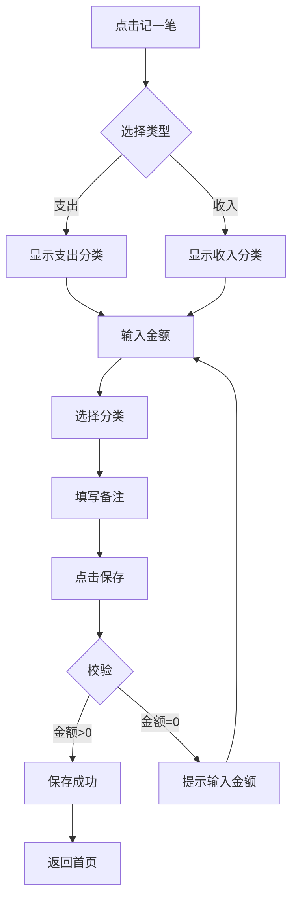

# 08 功能规格

## 8.1 F01 快速记账

### 基本信息

| 属性 | 内容 |
|-----|------|
| 功能编号 | F01 |
| 功能名称 | 快速记账 |
| 优先级 | P0 |
| 功能描述 | 用户快速记录一笔收入或支出 |
| 前置条件 | 用户已登录 |
| 触发条件 | 点击首页"记一笔"按钮 |

### 详细规则

**记账类型选择**
- 默认显示支出，可切换为收入
- 类型切换动画：滑动切换，300ms

**金额输入**
- 数字键盘，支持小数点后两位
- 快捷金额：10、50、100、200、500
- 支持加减法（如 50+30）

**分类选择**
- 一级分类：餐饮、交通、购物、娱乐、居住、医疗、教育、其他
- 最近使用：显示最近3个使用的分类
- 支持自定义分类（P1）

**备注（可选）**
- 最大50字
- 支持语音输入转文字

**时间**
- 默认为当前时间
- 可选择其他时间（当月内）

### 业务流程

### 异常处理

| 异常情况 | 处理方式 |
|---------|---------|
| 金额为空 | 保存按钮禁用，提示"请输入金额" |
| 网络异常 | 本地保存，联网后自动同步 |
| 分类未选择 | 使用默认分类"其他" |

### 页面元素

| 元素 | 类型 | 说明 |
|-----|------|------|
| 类型切换 | Tab | 支出/收入切换 |
| 金额显示 | Text | 大号字体，实时显示 |
| 数字键盘 | Grid | 0-9、小数点、删除 |
| 分类图标 | IconButton | 4列网格布局 |
| 备注输入 | Input | 单行输入框 |
| 保存按钮 | Button | 底部固定，主色填充 |

## 8.2 F02 账单列表

### 基本信息

| 属性 | 内容 |
|-----|------|
| 功能编号 | F02 |
| 功能名称 | 账单列表 |
| 优先级 | P0 |

### 详细规则

**列表展示**
- 按日期倒序排列
- 日期分组：今天、昨天、本周、本月、更早
- 左滑显示删除/编辑按钮

**筛选**
- 按类型：全部/支出/收入
- 按分类：可多选
- 按时间：本月/上月/自定义

**搜索**
- 支持按备注内容搜索
- 搜索结果高亮关键词

## 8.3 F03 数据统计

### 基本信息

| 属性 | 内容 |
|-----|------|
| 功能编号 | F03 |
| 功能名称 | 数据统计 |
| 优先级 | P0 |

### 详细规则

**月度概览**
- 总收入、总支出、结余
- 环比上月变化

**支出分析**
- 饼图：分类占比
- 趋势图：近6个月支出趋势
- 排行榜：支出最多的分类TOP5

**预算执行情况**
- 预算使用进度条
- 超支预警（使用≥80%黄色，≥100%红色）
