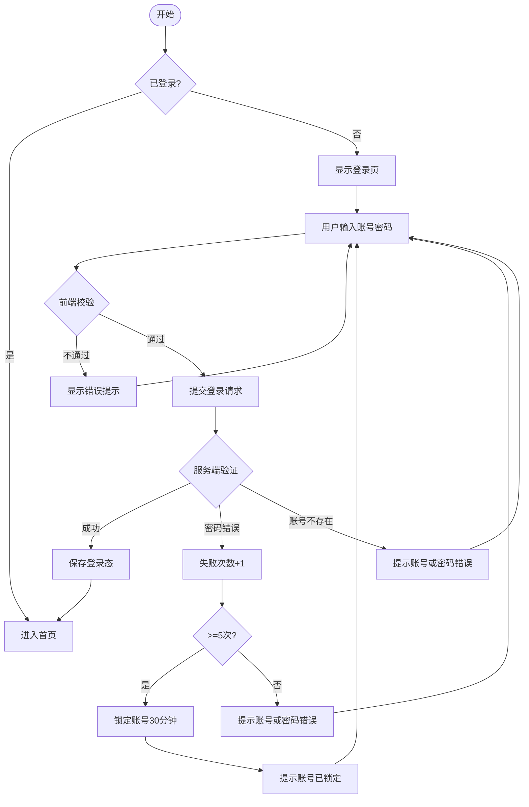

# 示例：登录功能完整 PRD 章节

这是一个完整的登录功能 PRD 示例，供产品经理参考。

---

## 1. 需求背景

### 用户痛点
- 新用户不知道如何注册
- 老用户经常忘记密码
- 多设备切换时需要重新登录

### 功能目标
- 支持多种登录方式（手机号/邮箱/第三方）
- 登录成功率 > 95%
- 平均登录耗时 < 3秒

---

## 2. 功能规格

### 2.1 登录方式

| 登录方式 | 优先级 | 说明 |
|---------|-------|------|
| 手机号+密码 | P0 | 主要方式 |
| 手机号+验证码 | P0 | 快捷登录/忘记密码 |
| 邮箱+密码 | P1 | 国际用户 |
| 微信授权 | P1 | 国内主流 |
| Apple ID | P2 | iOS 用户 |

### 2.2 页面原型

```
┌─────────────────────────┐
│         登录            │
│                         │
│   ┌─────────────────┐   │
│   │ 请输入手机号     │   │
│   └─────────────────┘   │
│                         │
│   ┌─────────────────┐   │
│   │ 请输入密码      │ 👁 │
│   └─────────────────┘   │
│                         │
│   [ ] 记住我            │
│                         │
│   ┌─────────────────┐   │
│   │      登 录      │   │
│   └─────────────────┘   │
│                         │
│   忘记密码？  |  立即注册 │
│                         │
│   ──── 其他登录方式 ──── │
│      [微信]  [Apple]    │
│                         │
└─────────────────────────┘
```

### 2.3 交互说明

**场景1：输入手机号**
- 输入框获得焦点时：显示数字键盘
- 输入时：实时校验格式（1开头的11位数字）
- 格式错误时：输入框边框变红，下方提示"请输入正确的手机号"

**场景2：密码输入**
- 默认隐藏密码，点击眼睛图标切换显示
- 输入时：显示密码强度（弱/中/强）

**场景3：登录按钮**
- 手机号和密码都输入后才可点击
- 点击后：按钮变为加载状态，文字改为"登录中..."

---

## 3. 流程图



---

## 4. 数据模型

### 4.1 用户表

```sql
CREATE TABLE user (
    id BIGINT PRIMARY KEY AUTO_INCREMENT,
    phone VARCHAR(20) UNIQUE COMMENT '手机号',
    email VARCHAR(100) UNIQUE COMMENT '邮箱',
    password_hash VARCHAR(255) NOT NULL COMMENT '密码哈希',
    salt VARCHAR(32) NOT NULL COMMENT '盐值',
    status TINYINT DEFAULT 1 COMMENT '0-禁用 1-正常 2-锁定',
    lock_until DATETIME COMMENT '锁定截止时间',
    failed_login_count INT DEFAULT 0 COMMENT '连续登录失败次数',
    last_login_at DATETIME COMMENT '最后登录时间',
    created_at DATETIME NOT NULL DEFAULT CURRENT_TIMESTAMP,
    updated_at DATETIME NOT NULL DEFAULT CURRENT_TIMESTAMP ON UPDATE CURRENT_TIMESTAMP,
    INDEX idx_phone (phone),
    INDEX idx_email (email)
) ENGINE=InnoDB COMMENT='用户表';
```

### 4.2 登录日志表

```sql
CREATE TABLE login_log (
    id BIGINT PRIMARY KEY AUTO_INCREMENT,
    user_id BIGINT COMMENT '用户ID',
    login_type TINYINT NOT NULL COMMENT '1-密码 2-验证码 3-微信 4-Apple',
    ip_address VARCHAR(50) COMMENT 'IP地址',
    user_agent VARCHAR(500) COMMENT '设备信息',
    status TINYINT NOT NULL COMMENT '0-失败 1-成功',
    fail_reason VARCHAR(255) COMMENT '失败原因',
    created_at DATETIME NOT NULL DEFAULT CURRENT_TIMESTAMP,
    INDEX idx_user_id (user_id),
    INDEX idx_created_at (created_at)
) ENGINE=InnoDB COMMENT='登录日志表';
```

---

## 5. 接口文档

### 5.1 密码登录

**POST** `/api/v1/auth/login`

**请求参数**

| 参数 | 类型 | 必填 | 说明 |
|-----|------|------|------|
| account | string | 是 | 手机号/邮箱/用户名 |
| password | string | 是 | 密码（明文，HTTPS传输） |
| captcha | string | 否 | 图形验证码（失败3次后必填） |

**响应示例（成功）**
```json
{
  "code": 0,
  "message": "success",
  "data": {
    "accessToken": "eyJhbGciOiJIUzI1NiIs...",
    "refreshToken": "eyJhbGciOiJIUzI1NiIs...",
    "expiresIn": 604800,
    "tokenType": "Bearer",
    "user": {
      "id": 12345,
      "username": "张三",
      "phone": "138****8888",
      "avatar": "https://example.com/avatar.jpg"
    }
  }
}
```

**响应示例（失败）**
```json
{
  "code": 1001,
  "message": "账号或密码错误"
}
```

**错误码**

| 错误码 | 说明 |
|-------|------|
| 1001 | 账号或密码错误 |
| 1002 | 账号已被锁定 |
| 1003 | 请输入验证码 |
| 1004 | 验证码错误 |
| 1005 | 请求过于频繁 |

---

## 6. 测试用例

### 6.1 功能测试

| 用例ID | 用例名称 | 前置条件 | 测试步骤 | 预期结果 |
|-------|---------|---------|---------|---------|
| TC-001 | 正常登录 | 用户已注册 | 1.输入正确手机号 2.输入正确密码 3.点击登录 | 登录成功，跳转首页 |
| TC-002 | 密码错误 | 用户已注册 | 输入正确手机号+错误密码 | 提示"账号或密码错误"，失败次数+1 |
| TC-003 | 账号锁定 | 已连续失败4次 | 再次输入错误密码 | 提示"账号已锁定" |
| TC-004 | 空账号 | - | 不输入账号，直接点击登录 | 提示"请输入账号"，登录按钮禁用 |
| TC-005 | 记住登录态 | - | 勾选"记住我"后登录 | 7天内免登录 |

### 6.2 兼容性测试

| 测试项 | 测试环境 | 预期结果 |
|-------|---------|---------|
| iOS登录 | iPhone 14, iOS 17 | 正常登录 |
| Android登录 | Xiaomi 13, Android 14 | 正常登录 |
| Web登录 | Chrome 120 | 正常登录 |
| 弱网登录 | 3G网络 | 提示网络错误，不崩溃 |

---

## 7. 数据埋点

### 7.1 事件定义

| 事件ID | 事件名称 | 触发时机 | 属性 |
|-------|---------|---------|------|
| login_page_view | 登录页浏览 | 进入登录页 | source:来源页面 |
| login_click | 点击登录 | 点击登录按钮 | login_type:登录方式 |
| login_success | 登录成功 | 接口返回成功 | duration_ms:耗时 |
| login_fail | 登录失败 | 接口返回失败 | fail_reason:失败原因 |
| login_lock | 账号锁定 | 触发锁定时 | fail_count:失败次数 |

### 7.2 漏斗分析

```
登录转化漏斗：

登录页浏览  100%
    ↓
输入账号密码  85%（流失15%直接离开）
    ↓
点击登录  70%（流失15%中途放弃）
    ↓
登录成功  65%（失败5%）

目标：将成功率从 65% 提升到 80%
优化方向：
1. 增加一键登录减少输入
2. 优化错误提示，明确问题
3. 增加验证码登录备选
```

---

## 8. 非功能需求

### 8.1 性能要求

- 登录接口响应时间：P95 < 200ms
- 并发支持：1000 QPS
- 页面加载时间：< 1.5s

### 8.2 安全要求

- 密码存储：bcrypt 加密，cost=10
- 传输加密：全站 HTTPS
- 防暴力破解：5次错误锁定30分钟
- 防SQL注入：参数化查询

---

## 9. 迭代记录

| 版本 | 日期 | 变更内容 | 负责人 |
|-----|------|---------|-------|
| v1.0.0 | 2024-01-15 | 初版，支持手机号+密码登录 | 张三 |
| v1.1.0 | 2024-02-01 | 增加微信登录、忘记密码 | 李四 |
| v1.2.0 | 2024-03-10 | 增加验证码登录、账号锁定 | 王五 |
