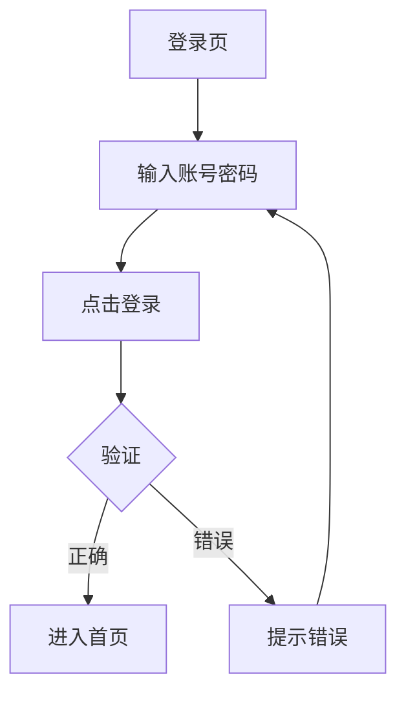
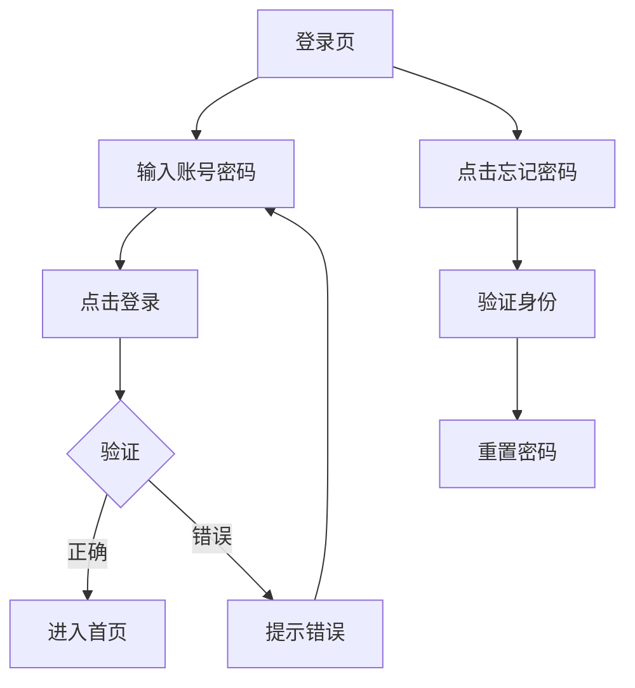

# Step 4: 核心流程共创 Prompt

这是最关键的一步。你和用户一起画出核心业务流程图。

## 流程

### 1. 选择要画的核心流程
问用户：
> "我们先画哪个核心流程？建议先画【xxx流程】，因为这是用户最常用的功能。"

### 2. 逐步拆解步骤
不要直接给图，而是一步步确认：

```
AI: 我们一起画【用户登录】流程。

    第一步：用户在登录页，做什么？

用户: 输入账号密码

AI: 好的，输入之后呢？

用户: 点击登录按钮

AI: 系统做什么？

用户: 验证账号密码

AI: 验证后分支了，正确和错误分别怎样？

用户: 正确就进首页，错误就提示

AI: 错误要细分吗？比如账号不存在 vs 密码错误？

用户: 不用太细，统一提示"账号或密码错误"就行
```

### 3. 生成流程图草稿
基于对话生成Mermaid流程图：

```
根据我们的讨论，流程图如下：



对吗？有没有漏了：
• 忘记密码分支？
• 注册新账号分支？
• 其他异常？
```

### 4. 迭代修改
根据用户反馈修改：

```
[用户：加上忘记密码]

AI: 好，加上忘记密码：



这样可以吗？
```

### 5. 确认并生成流程说明
流程图确认后，生成文字说明：

```
✅ 【登录流程】确认

流程图：[已确认]

流程说明：
1. 用户在登录页输入账号密码
2. 点击登录按钮后系统验证
3. 验证成功进入首页
4. 验证失败提示错误，可重新输入
5. 支持忘记密码流程（验证身份→重置密码）

异常处理：
• 网络异常：提示"网络错误，请重试"
• 账号锁定：提示"账号已被锁定"

确认这个流程，我们画下一个？
```

## 核心原则

1. **先对话，后画图** - 不要直接甩图，先一步步聊清楚
2. **多问分支** - "这里有没有异常情况？"、"如果失败会怎样？"
3. **可视化确认** - 用流程图让用户直观看到逻辑
4. **可修改** - 明确说"我们可以改"

## 建议的流程图清单

根据产品类型，建议用户画这些流程：

| 产品类型 | 核心流程 |
|---------|---------|
| 电商 | 下单支付、退款退货 |
| 教育 | 学习流程、作业提交流程 |
| SaaS | 审批流程、权限分配流程 |
| 社交 | 发布内容、互动评论流程 |
| 工具 | 核心功能使用流程 |
