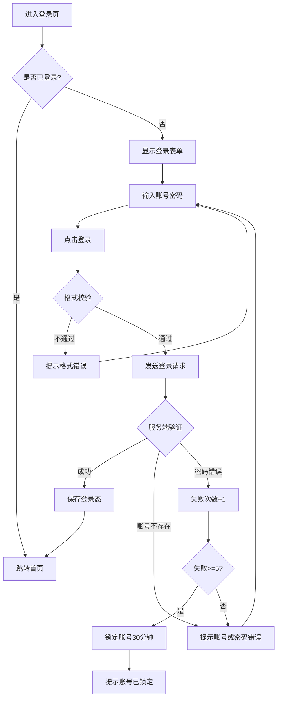
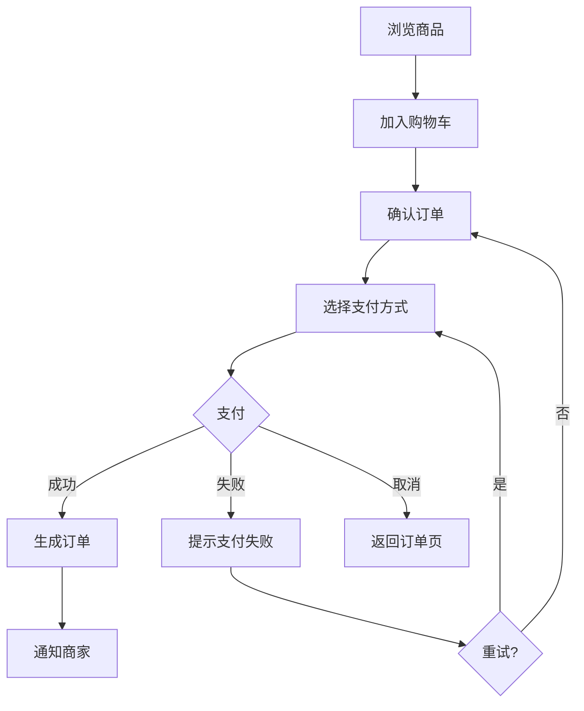

# 快捷指令模板

产品经理在协作过程中可以快速调用的标准回复模板。

---

## 功能规格快速生成

### /login 登录功能

**指令效果**：按标准模板生成完整的登录功能规格

```
【功能编号】F01
【功能名称】用户登录
【优先级】P0

【功能描述】
用户通过手机号/邮箱/用户名 + 密码登录系统，验证身份后获取访问凭证。

【前置条件】
• 用户已注册账号
• 账号状态正常（未锁定/未禁用）
• 网络连接正常

【触发条件】
• 用户主动点击"登录"
• 访问需要登录态的页面时自动跳转
• Token 过期后重新登录

【详细规则】

1. 账号输入规则
   • 支持格式：手机号(11位)、邮箱(含@)、用户名(4-20位字母数字)
   • 自动去除首尾空格
   • 输入时实时格式校验

2. 密码输入规则
   • 长度：8-20位
   • 复杂度：必须包含大小写字母+数字
   • 支持显示/隐藏切换
   • 连续5次错误锁定30分钟

3. 登录流程
   Step 1: 用户输入账号密码
   Step 2: 前端格式校验
   Step 3: 发送登录请求
   Step 4: 服务端验证
   Step 5: 成功则返回 Token，失败则提示错误

4. 异常处理
   • 账号不存在：提示"账号或密码错误"
   • 密码错误：提示"账号或密码错误"，记录失败次数
   • 账号锁定：提示"账号已锁定，请30分钟后重试"
   • 网络异常：提示"网络错误，请检查网络后重试"

【页面元素】
| 元素 | 类型 | 说明 |
|-----|------|------|
| 账号输入框 | Input | 占位符"手机号/邮箱/用户名" |
| 密码输入框 | Input | 占位符"请输入密码"，支持显隐切换 |
| 登录按钮 | Button | 默认禁用，输入完整后启用 |
| 忘记密码 | Link | 跳转密码重置页 |
| 注册账号 | Link | 跳转注册页 |
| 记住我 | Checkbox | 默认勾选，记住登录态7天 |

【接口信息】
POST /api/v1/auth/login
请求：{ account, password, captcha? }
响应：{ accessToken, refreshToken, expiresIn, userInfo }

【数据埋点】
• login_page_view - 登录页浏览
• login_click - 点击登录按钮
• login_success - 登录成功
• login_fail - 登录失败（含失败原因）
```

### /register 注册功能

```
【功能编号】F02
【功能名称】用户注册
【优先级】P0

【功能描述】
新用户通过手机号+验证码注册账号，设置密码后完成注册。

【注册流程】
1. 输入手机号 → 格式校验
2. 点击获取验证码 → 倒计时60秒
3. 输入验证码 → 校验
4. 设置密码 → 复杂度校验
5. 点击注册 → 完成

【密码规则】
• 8-20位
• 必须包含大小写字母+数字
• 可选特殊字符

【接口信息】
POST /api/v1/auth/register
POST /api/v1/auth/send-sms-code
```

### /profile 个人中心

```
【功能编号】F03
【功能名称】个人中心
【优先级】P1

【功能描述】
用户查看和编辑个人资料，管理账号设置。

【页面结构】
• 头部：头像、昵称、ID
• 资料区：编辑个人资料入口
• 功能列表：
  - 我的订单/记录
  - 消息通知
  - 账号安全
  - 设置
  - 帮助与反馈
  - 关于我们
  - 退出登录

【编辑资料】
• 头像上传（支持裁剪）
• 昵称修改（2-20字）
• 性别选择
• 简介编辑
```

---

## 流程图快速生成

### /flow-login



### /flow-order



---

## 数据表快速定义

### /table-user

```
【用户表 user】

| 字段 | 类型 | 约束 | 说明 |
|-----|------|------|------|
| id | BIGINT | PK, AUTO | 主键 |
| username | VARCHAR(50) | UNIQUE | 用户名 |
| phone | VARCHAR(20) | UNIQUE, NULL | 手机号 |
| email | VARCHAR(100) | UNIQUE, NULL | 邮箱 |
| password_hash | VARCHAR(255) | NOT NULL | 密码哈希 |
| avatar | VARCHAR(500) | NULL | 头像URL |
| status | TINYINT | DEFAULT 1 | 0-禁用 1-正常 2-锁定 |
| created_at | DATETIME | NOT NULL | 创建时间 |
| updated_at | DATETIME | NOT NULL | 更新时间 |
| last_login_at | DATETIME | NULL | 最后登录时间 |

索引：
• phone_idx (phone)
• email_idx (email)
• created_at_idx (created_at)
```

### /table-order

```
【订单表 order】

| 字段 | 类型 | 约束 | 说明 |
|-----|------|------|------|
| id | BIGINT | PK | 主键 |
| order_no | VARCHAR(32) | UNIQUE | 订单号 |
| user_id | BIGINT | FK | 用户ID |
| total_amount | DECIMAL(10,2) | NOT NULL | 订单金额 |
| status | TINYINT | DEFAULT 0 | 0-待支付 1-已支付 2-已发货 3-已完成 4-已取消 |
| pay_time | DATETIME | NULL | 支付时间 |
| created_at | DATETIME | NOT NULL | 创建时间 |
```

---

## 测试用例快速生成

### /tc-login

```
【登录功能测试用例】

TC-001: 正常登录
前置：用户已注册，状态正常
步骤：输入正确账号密码 → 点击登录
预期：登录成功，跳转首页，生成Token

TC-002: 密码错误
前置：用户已注册
步骤：输入正确账号+错误密码
预期：提示"账号或密码错误"，不暴露账号是否存在

TC-003: 账号不存在
步骤：输入未注册账号
预期：提示"账号或密码错误"（与密码错误一致）

TC-004: 账号锁定
前置：已连续失败5次
步骤：输入正确账号密码
预期：提示"账号已锁定，请30分钟后重试"

TC-005: 空账号
步骤：账号为空，输入密码
预期：提示"请输入账号"

TC-006: 格式校验-手机号
步骤：输入"123"作为账号
预期：提示"请输入正确的手机号/邮箱/用户名"

TC-007: 记住登录态
步骤：勾选"记住我"后登录
预期：7天内免登录

TC-008: Token过期
前置：Token已过期
步骤：访问需要登录的页面
预期：自动跳转登录页，登录后回到原页面
```

---

## 埋点事件快速定义

### /track-user

```
【用户相关事件】

| 事件ID | 触发时机 | 属性 |
|-------|---------|------|
| app_launch | App启动 | source, version |
| page_view | 页面浏览 | page_name, page_url, referer |
| login_click | 点击登录 | login_type |
| login_success | 登录成功 | duration_ms, login_type |
| login_fail | 登录失败 | fail_reason, fail_count |
| register_click | 点击注册 | source |
| register_success | 注册完成 | register_channel, duration_ms |
| logout | 退出登录 | - |
```

### /track-business

```
【业务相关事件】（以电商为例）

| 事件ID | 触发时机 | 属性 |
|-------|---------|------|
| product_view | 浏览商品 | product_id, category_id |
| add_to_cart | 加入购物车 | product_id, quantity, price |
| cart_view | 查看购物车 | item_count, total_amount |
| checkout_start | 开始结算 | item_count, total_amount |
| checkout_complete | 完成订单 | order_id, amount, pay_method |
| pay_success | 支付成功 | order_id, amount, pay_method |
| pay_fail | 支付失败 | order_id, fail_reason |
```

---

## 使用方式

在对话中，产品经理可以直接说：

- "用标准模板生成登录功能" → AI 识别并输出 /login 模板
- "画一个登录流程图" → AI 输出 /flow-login 流程图
- "用户表怎么设计" → AI 输出 /table-user 结构
- "登录功能测试用例" → AI 输出 /tc-login 用例

AI 也可以主动推荐：
"这个功能很常见，我有标准模板，需要我按模板生成吗？"
