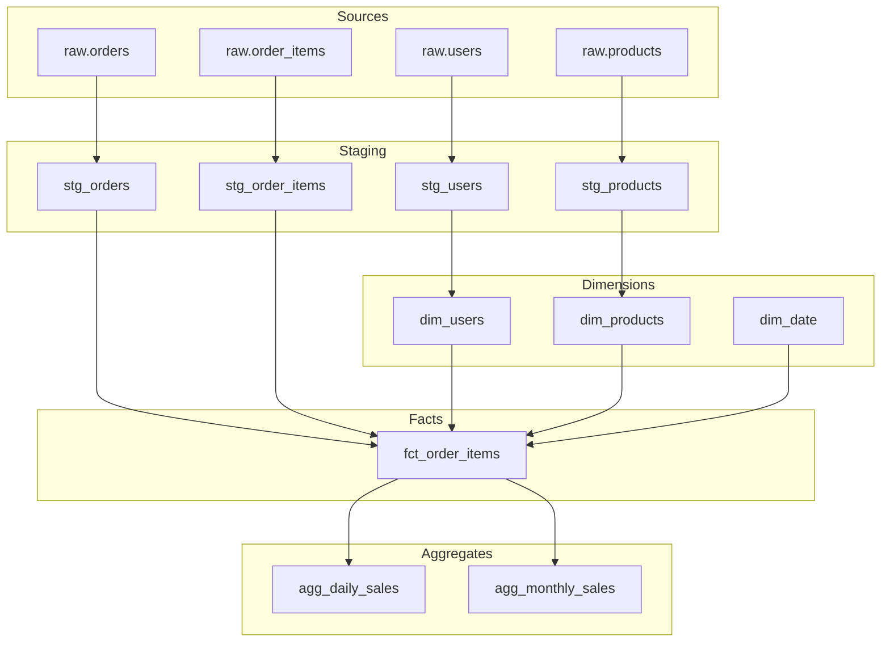

# 示例：电商数据仓库建模完整流程

## 场景描述

为电商业务建立数据仓库，支持销售分析、用户行为分析、商品分析。

---

## 阶段1：模型设计

### 输入

```
/model-design
业务场景：电商订单销售流程
分析需求：
1. 销售趋势分析（按日/周/月/年）
2. 用户购买行为分析（新老用户、复购率）
3. 商品销售分析（热销商品、品类分析）
4. 地域销售分析

数据源：
- ods_orders：订单主表（1亿记录）
- ods_order_items：订单明细表（3亿记录）
- ods_users：用户表（1000万记录）
- ods_products：商品表（50万记录）
- ods_categories：类目表（1万记录）

特殊需求：
- 需要追踪用户等级变化历史
- 需要支持缓慢变化维度的商品信息
- 日增订单100万，保留3年历史数据
```

### 输出

```markdown
# 电商数据仓库模型设计方案

## 1. 业务背景

**业务流程**：用户浏览商品 → 下单 → 支付 → 发货 → 确认收货
**分析需求**：销售分析、用户分析、商品分析、地域分析
**数据规模**：日增100万订单，3年历史，总计约10亿订单项

## 2. 模型架构

采用星型模型，以订单项为最细粒度。

```
                              ┌─────────────┐
                              │   dim_date  │
                              └──────┬──────┘
                                     │
    ┌─────────────┐   ┌─────────────┼─────────────┐   ┌─────────────┐
    │  dim_user   │   │ dim_product │             │   │ dim_region  │
    │  (SCD2)     │   │   (SCD2)    │             │   │             │
    └──────┬──────┘   └──────┬──────┘             │   └──────┬──────┘
           │                 │                    │          │
           │                 │                    │          │
           └─────────────────┼────────────────────┴──────────┘
                             │
                       ┌─────┴─────────────┐
                       │ fact_order_items  │
                       │  (订单项事实表)    │
                       └───────────────────┘
```

## 3. 事实表设计

### fact_order_items（订单项事实表）

**粒度**：单个订单中的单个商品项

| 字段名 | 数据类型 | 说明 | 来源 |
|--------|----------|------|------|
| order_item_sk | BIGINT | 代理键（主键） | 生成 |
| date_key | INT | 日期外键 → dim_date | ods_orders.created_at |
| user_sk | BIGINT | 用户外键 → dim_user | ods_orders.user_id |
| product_sk | BIGINT | 商品外键 → dim_product | ods_order_items.product_id |
| region_sk | INT | 地区外键 → dim_region | ods_users.city_code |
| order_id | VARCHAR(32) | 订单号（退化维度） | ods_orders.order_id |
| order_item_id | VARCHAR(32) | 订单项ID（退化维度） | ods_order_items.item_id |
| quantity | INT | 数量 | ods_order_items.quantity |
| unit_price | DECIMAL(10,2) | 单价 | ods_order_items.unit_price |
| discount_amount | DECIMAL(10,2) | 优惠金额 | 计算 |
| shipping_amount | DECIMAL(10,2) | 运费分摊 | 计算 |
| total_amount | DECIMAL(10,2) | 总金额 | 计算 |

**分区策略**：按date_key按月分区
**索引**：date_key, user_sk, product_sk

## 4. 维度表设计

### dim_user（用户维度表 - SCD Type 2）

| 字段名 | 类型 | 说明 | SCD类型 |
|--------|------|------|---------|
| user_sk | BIGINT PK | 代理键 | - |
| user_id | BIGINT | 用户自然键 | Type 0 |
| username | VARCHAR(50) | 用户名 | Type 2 |
| email | VARCHAR(100) | 邮箱 | Type 2 |
| phone | VARCHAR(20) | 手机号 | Type 2 |
| gender | VARCHAR(10) | 性别 | Type 2 |
| birth_date | DATE | 生日 | Type 0 |
| register_date | DATE | 注册日期 | Type 0 |
| user_level | VARCHAR(20) | 用户等级 | Type 2 |
| city_code | VARCHAR(10) | 城市代码 | Type 2 |
| city_name | VARCHAR(50) | 城市名称 | Type 2 |
| province_code | VARCHAR(10) | 省份代码 | Type 2 |
| province_name | VARCHAR(50) | 省份名称 | Type 2 |
| valid_from | DATE | 生效日期 | - |
| valid_to | DATE | 失效日期 | - |
| is_current | BOOLEAN | 是否当前版本 | - |

### dim_product（商品维度表 - SCD Type 2）

| 字段名 | 类型 | 说明 | SCD类型 |
|--------|------|------|---------|
| product_sk | BIGINT PK | 代理键 | - |
| product_id | BIGINT | 商品自然键 | Type 0 |
| product_name | VARCHAR(200) | 商品名称 | Type 2 |
| category_id | BIGINT | 类目ID | Type 2 |
| category_name | VARCHAR(100) | 类目名称 | Type 2 |
| brand_name | VARCHAR(100) | 品牌 | Type 2 |
| price | DECIMAL(10,2) | 标价 | Type 2 |
| valid_from | DATE | 生效日期 | - |
| valid_to | DATE | 失效日期 | - |
| is_current | BOOLEAN | 是否当前版本 | - |

### dim_date（日期维度表）

| 字段名 | 类型 | 说明 |
|--------|------|------|
| date_key | INT PK | 日期键 (YYYYMMDD) |
| date | DATE | 日期 |
| year | INT | 年 |
| quarter | INT | 季度 |
| month | INT | 月 |
| week | INT | 周 |
| day | INT | 日 |
| is_weekend | BOOLEAN | 是否周末 |
| is_holiday | BOOLEAN | 是否节假日 |

## 5. ETL映射关系

### 数据流

| 目标表 | 源表 | 转换逻辑 |
|--------|------|----------|
| fact_order_items | ods_orders + ods_order_items | JOIN关联，金额计算，代理键查找 |
| dim_user | ods_users | SCD Type 2处理，版本管理 |
| dim_product | ods_products + ods_categories | JOIN关联，SCD Type 2处理 |
| dim_date | 生成 | 预生成日期维度数据 |

### 加载策略

| 表 | 加载频率 | 加载方式 | 历史处理 |
|----|----------|----------|----------|
| fact_order_items | 每小时 | 增量 | 追加 |
| dim_user | 每日 | 增量+SCD | Type 2版本 |
| dim_product | 每日 | 增量+SCD | Type 2版本 |
| dim_date | 每年 | 全量 | 预生成10年 |

## 6. 物理设计建议

### 分区策略
```sql
-- 按月分区，支持高效删除和查询
PARTITION BY RANGE (date_key / 100) (
    PARTITION p202401 VALUES LESS THAN (202402),
    PARTITION p202402 VALUES LESS THAN (202403),
    ...
);
```

### 索引策略
```sql
-- 事实表索引
CREATE INDEX idx_fact_date ON fact_order_items(date_key);
CREATE INDEX idx_fact_user ON fact_order_items(user_sk);
CREATE INDEX idx_fact_product ON fact_order_items(product_sk);

-- 维度表索引
CREATE INDEX idx_dim_user_natural ON dim_user(user_id);
CREATE INDEX idx_dim_user_current ON dim_user(user_id, is_current);
```
```

---

## 阶段2：dbt模型开发

### 2.1 生成Staging模型

#### stg_orders.sql

```sql
/*
 * Staging: stg_orders
 * Source: raw.orders
 * Description: 清洗后的订单主表数据
 */

WITH source AS (
    SELECT * FROM {{ source('raw', 'orders') }}
),

renamed AS (
    SELECT
        -- 主键
        order_id,

        -- 外键
        user_id,

        -- 属性
        order_status,
        payment_method,
        shipping_address,

        -- 数值
        order_amount,
        discount_amount,
        shipping_amount,
        total_amount,

        -- 时间戳
        created_at,
        updated_at,
        paid_at,
        shipped_at,
        delivered_at

    FROM source
    WHERE deleted_at IS NULL  -- 排除已删除订单
)

SELECT * FROM renamed
```

对应的schema配置：
```yaml
version: 2

models:
  - name: stg_orders
    description: "清洗后的订单主表数据"
    columns:
      - name: order_id
        description: "订单唯一标识"
        tests:
          - unique
          - not_null

      - name: user_id
        description: "用户ID"
        tests:
          - not_null
          - relationships:
              to: ref('stg_users')
              field: user_id

      - name: order_status
        description: "订单状态"
        tests:
          - not_null
          - accepted_values:
              values: ['pending', 'paid', 'shipped', 'delivered', 'cancelled', 'refunded']

      - name: total_amount
        description: "订单总金额"
        tests:
          - not_null
```

#### stg_order_items.sql

```sql
/*
 * Staging: stg_order_items
 * Source: raw.order_items
 * Description: 清洗后的订单明细数据
 */

WITH source AS (
    SELECT * FROM {{ source('raw', 'order_items') }}
),

renamed AS (
    SELECT
        item_id AS order_item_id,
        order_id,
        product_id,
        quantity,
        unit_price,
        discount_amount,
        (quantity * unit_price - discount_amount) AS item_total,
        created_at

    FROM source
)

SELECT * FROM renamed
```

### 2.2 生成Dimension模型

#### dim_users.sql (SCD Type 2)

```sql
/*
 * Dimension: dim_users
 * Grain: One row per user per version
 * SCD Type: Type 2 (保留历史)
 */

WITH source AS (
    SELECT * FROM {{ ref('stg_users') }}
),

-- 检测变化的记录
changes AS (
    SELECT
        user_id,
        username,
        email,
        phone,
        user_level,
        city_code,
        city_name,
        province_code,
        province_name,
        updated_at,

        -- 获取上一版本的关键字段
        LAG(user_level) OVER (PARTITION BY user_id ORDER BY updated_at) AS prev_level,
        LAG(city_code) OVER (PARTITION BY user_id ORDER BY updated_at) AS prev_city,

        -- 标记是否变化
        CASE
            WHEN user_level != LAG(user_level) OVER (PARTITION BY user_id ORDER BY updated_at)
              OR city_code != LAG(city_code) OVER (PARTITION BY user_id ORDER BY updated_at)
            THEN TRUE
            ELSE FALSE
        END AS has_changed,

        -- 行号用于版本控制
        ROW_NUMBER() OVER (PARTITION BY user_id ORDER BY updated_at) AS version_num

    FROM source
),

-- SCD Type 2 处理
scd AS (
    SELECT
        {{ dbt_utils.generate_surrogate_key(['user_id', 'version_num']) }} AS user_sk,
        user_id,
        username,
        email,
        phone,
        user_level,
        city_code,
        city_name,
        province_code,
        province_name,
        updated_at AS valid_from,
        COALESCE(
            LEAD(updated_at) OVER (PARTITION BY user_id ORDER BY updated_at),
            '9999-12-31'::timestamp
        ) AS valid_to,
        CASE
            WHEN LEAD(updated_at) OVER (PARTITION BY user_id ORDER BY updated_at) IS NULL
            THEN TRUE
            ELSE FALSE
        END AS is_current

    FROM changes
    WHERE version_num = 1 OR has_changed = TRUE
)

SELECT * FROM scd
```

### 2.3 生成Fact模型

#### fct_order_items.sql

```sql
/*
 * Fact: fct_order_items
 * Grain: One row per order line item
 * Description: 订单项事实表
 */

WITH stg_orders AS (
    SELECT * FROM {{ ref('stg_orders') }}
),

stg_order_items AS (
    SELECT * FROM {{ ref('stg_order_items') }}
),

-- 关联订单和订单明细
order_items AS (
    SELECT
        oi.order_item_id,
        o.order_id,
        o.user_id,
        oi.product_id,
        DATE(o.created_at) AS order_date,
        o.order_status,
        oi.quantity,
        oi.unit_price,
        oi.discount_amount,
        oi.item_total,
        -- 运费分摊（简化处理：按金额比例分摊）
        ROUND(o.shipping_amount * oi.item_total / o.total_amount, 2) AS shipping_amount

    FROM stg_order_items oi
    JOIN stg_orders o ON oi.order_id = o.order_id
    WHERE o.order_status NOT IN ('cancelled', 'refunded')  -- 排除取消/退款订单
),

final AS (
    SELECT
        -- 代理键
        {{ dbt_utils.generate_surrogate_key(['order_item_id']) }} AS order_item_sk,

        -- 维度外键（使用当前版本的维度）
        {{ dbt_utils.generate_surrogate_key(['order_date']) }} AS date_sk,
        u.user_sk,
        p.product_sk,

        -- 退化维度
        oi.order_id,
        oi.order_item_id,
        oi.order_status,

        -- 度量
        oi.quantity,
        oi.unit_price,
        oi.discount_amount,
        oi.shipping_amount,
        oi.item_total AS total_amount,

        -- 审计字段
        CURRENT_TIMESTAMP AS loaded_at

    FROM order_items oi
    LEFT JOIN {{ ref('dim_users') }} u
        ON oi.user_id = u.user_id
        AND u.is_current = TRUE
    LEFT JOIN {{ ref('dim_products') }} p
        ON oi.product_id = p.product_id
        AND p.is_current = TRUE
)

SELECT * FROM final
```

---

## 阶段3：血缘分析

### 输入

```
/lineage-doc 分析models/marts/fct_order_items.sql的完整血缘关系
```

### 输出

```markdown
# 数据血缘文档 - fct_order_items

## 概览

| 属性 | 值 |
|------|-----|
| 模型名 | fct_order_items |
| 模型类型 | Fact Table |
| 上游依赖 | 5个直接依赖 + 2个间接依赖 |
| 下游消费 | 3个模型 |
| 血缘深度 | 3层 |

## 血缘概览图



## 详细血缘

### 上游依赖

#### 第一层依赖（直接依赖）

| 表名 | 类型 | Join类型 | 字段映射 |
|------|------|----------|----------|
| stg_orders | ref | INNER JOIN | order_id → order_id |
| stg_order_items | ref | INNER JOIN | order_item_id → order_item_id |
| dim_users | ref | LEFT JOIN | user_id → user_sk |
| dim_products | ref | LEFT JOIN | product_id → product_sk |
| dim_date | ref | LEFT JOIN | order_date → date_sk |

#### 第二层依赖（间接依赖）

| 表名 | 类型 | 被谁依赖 |
|------|------|----------|
| stg_users | ref | dim_users |
| stg_products | ref | dim_products |

#### 第三层依赖（Source层）

| 表名 | 类型 | 被谁依赖 |
|------|------|----------|
| raw.orders | source | stg_orders |
| raw.order_items | source | stg_order_items |
| raw.users | source | stg_users |
| raw.products | source | stg_products |

### 下游消费

| 表名 | 类型 | 说明 |
|------|------|------|
| agg_daily_sales | ref | 日销售汇总 |
| agg_monthly_sales | ref | 月销售汇总 |
| rpt_sales_dashboard | ref | 销售报表 |

## 字段级血缘

| 目标字段 | 源表 | 源字段 | 转换 |
|----------|------|--------|------|
| order_item_sk | - | order_item_id | surrogate_key() |
| order_id | stg_orders | order_id | 直接映射 |
| user_sk | dim_users | user_sk | 代理键查找 |
| quantity | stg_order_items | quantity | 直接映射 |
| total_amount | stg_order_items | item_total | 直接映射 |
| loaded_at | - | - | CURRENT_TIMESTAMP |

## 影响分析

### 如果修改 fct_order_items，将影响：

1. **agg_daily_sales** - 日销售汇总（重要）
2. **agg_monthly_sales** - 月销售汇总（重要）
3. **rpt_sales_dashboard** - 销售报表（重要）

**建议**：修改前需通知下游使用者，并在测试环境充分验证。

### 如果上游 raw.orders 变更，将影响：

1. stg_orders
2. fct_order_items
3. agg_daily_sales, agg_monthly_sales, rpt_sales_dashboard

**建议**：Source层变更需格外谨慎，建议通过数据合约管理。
```

---

## 完整工作流程总结

```
━━━━━━━━━━━━━━━━━━━━━━━━━━━━━━━━━━━━━━━━━━━━━━━━━━━━━━━━━━━━
电商数据仓库建模流程
━━━━━━━━━━━━━━━━━━━━━━━━━━━━━━━━━━━━━━━━━━━━━━━━━━━━━━━━━━━━

阶段1: 模型设计 (2小时)
├─ 业务需求分析
├─ 确定粒度：订单项级别
├─ 识别维度：用户、商品、日期、地区
├─ 设计4个维度表（SCD Type 2）
└─ 设计1个事实表

阶段2: dbt模型开发 (4小时)
├─ Staging模型：4个（orders, order_items, users, products）
├─ Dimension模型：4个（dim_users, dim_products, dim_date, dim_region）
├─ Fact模型：1个（fct_order_items）
└─ Schema配置和测试

阶段3: 血缘文档 (30分钟)
├─ 表级血缘分析
├─ 字段级血缘映射
├─ 影响分析
└─ 可视化血缘图

总耗时: 约6.5小时
━━━━━━━━━━━━━━━━━━━━━━━━━━━━━━━━━━━━━━━━━━━━━━━━━━━━━━━━━━━━

产出物:
✅ 完整模型设计方案
✅ 9个dbt模型
✅ 完整的测试配置
✅ 血缘分析文档
```

---

## 部署清单

### 模型清单

| 层级 | 模型名 | 类型 | 优先级 |
|------|--------|------|--------|
| Staging | stg_orders | view | 高 |
| Staging | stg_order_items | view | 高 |
| Staging | stg_users | view | 高 |
| Staging | stg_products | view | 高 |
| Dimension | dim_users | table + incremental | 高 |
| Dimension | dim_products | table + incremental | 高 |
| Dimension | dim_date | seed | 中 |
| Dimension | dim_region | seed | 中 |
| Fact | fct_order_items | table + incremental | 高 |

### 部署顺序

```
1. Seeds（dim_date, dim_region）
2. Staging（所有stg_*）
3. Dimensions（dim_users, dim_products）
4. Facts（fct_order_items）
```
