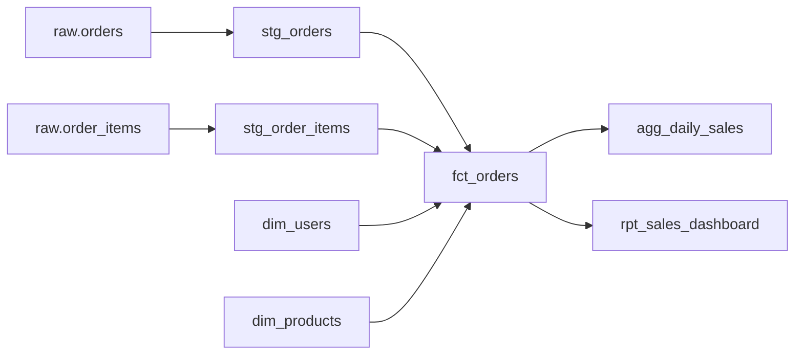
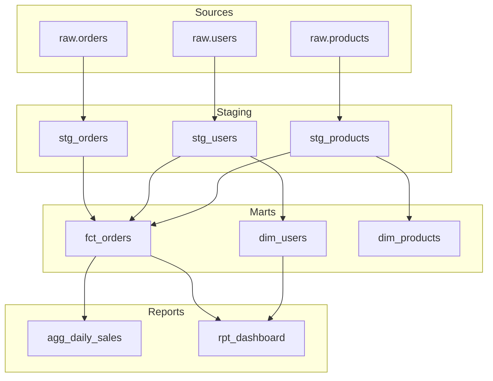
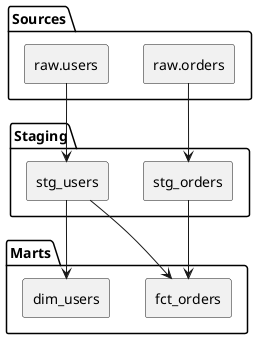

# 数据血缘文档生成器

分析SQL代码或dbt项目中的血缘关系，生成可视化的血缘文档。

## 血缘分析维度

### 1. 表级血缘
分析表与表之间的依赖关系

```
upstream_sources      upstream_models      current_model       downstream_models
     │                      │                    │                     │
     ▼                      ▼                    ▼                     ▼
┌─────────┐           ┌──────────┐         ┌──────────┐          ┌──────────┐
│ raw.orders│           │stg_orders│    ───► │fct_orders│   ───►  │agg_daily │
│ raw.users │     ───►  │stg_users │         └──────────┘          │  _sales  │
└─────────┘           └──────────┘                                 └──────────┘
```

### 2. 字段级血缘
分析字段与字段的映射关系

```
Source: raw.orders.order_id ──┐
                              ├──► Target: fct_orders.order_id
Source: raw.items.order_id  ──┘
```

### 3. 列级血缘映射
| Source Table | Source Column | Target Table | Target Column | Transform |
|--------------|---------------|--------------|---------------|-----------|
| raw.orders | order_id | fct_orders | order_id | 直接映射 |
| raw.orders | amount | fct_orders | total_amount | 单位转换 |
| raw.items | quantity | fct_orders | item_count | SUM聚合 |

## 输入格式

### 格式1：单个SQL文件
```
/lineage-doc 分析文件: models/marts/fct_orders.sql
```

### 格式2：整个dbt项目
```
/lineage-doc 分析项目: ./dbt_project，输出格式: mermaid
```

### 格式3：指定模型
```
/lineage-doc 分析模型: fct_orders，深度: 3层
```

## 输出格式

### 1. Markdown表格

```markdown
## 表级血缘 - fct_orders

### 上游依赖

| 层级 | 表名 | 类型 | 关系 | 字段映射 |
|------|------|------|------|----------|
| 1 | stg_orders | ref | LEFT JOIN | order_id → order_id |
| 1 | stg_order_items | ref | LEFT JOIN | item_id → item_id |
| 2 | raw.orders | source | stg_orders依赖 | - |
| 2 | raw.order_items | source | stg_order_items依赖 | - |
| 1 | dim_users | ref | LEFT JOIN | user_id → user_sk |
| 1 | dim_products | ref | LEFT JOIN | product_id → product_sk |

### 下游消费

| 层级 | 表名 | 类型 | 关系 |
|------|------|------|------|
| 1 | agg_daily_sales | ref | 聚合依赖 |
| 1 | rpt_sales_dashboard | ref | 报表依赖 |

### 血缘图 (Mermaid)


```

### 2. YAML格式

```yaml
# lineage_fct_orders.yml
model: fct_orders
type: fact

lineage:
  upstream:
    - table: stg_orders
      type: ref
      depth: 1
      join_type: LEFT JOIN
      mapping:
        - from: order_id
          to: order_id
      upstream_of:
        - table: raw.orders
          type: source
          depth: 2

    - table: stg_order_items
      type: ref
      depth: 1
      join_type: LEFT JOIN
      mapping:
        - from: item_id
          to: item_id
      upstream_of:
        - table: raw.order_items
          type: source
          depth: 2

    - table: dim_users
      type: ref
      depth: 1
      join_type: LEFT JOIN

    - table: dim_products
      type: ref
      depth: 1
      join_type: LEFT JOIN

  downstream:
    - table: agg_daily_sales
      type: ref
      depth: 1

    - table: rpt_sales_dashboard
      type: ref
      depth: 1

  fields:
    - name: order_id
      upstream:
        - table: stg_orders
          field: order_id
          transform: direct
      downstream:
        - table: agg_daily_sales
          field: order_id

    - name: total_amount
      upstream:
        - table: stg_orders
          field: amount
          transform: "SUM(amount)"
```

### 3. JSON格式

```json
{
  "model": "fct_orders",
  "lineage": {
    "upstream": [
      {
        "table": "stg_orders",
        "type": "ref",
        "depth": 1,
        "fields": ["order_id", "user_id", "amount"],
        "mapping": {
          "order_id": "order_id",
          "user_id": "user_id",
          "amount": "total_amount"
        }
      }
    ],
    "downstream": [
      {
        "table": "agg_daily_sales",
        "type": "ref",
        "fields": ["order_id", "total_amount"]
      }
    ]
  }
}
```

## 血缘分析规则

### SQL血缘提取

分析以下SQL元素：
- `FROM` / `JOIN` 子句中的表
- `SELECT` 中的字段映射
- `WHERE` 中的过滤条件来源
- `GROUP BY` 中的聚合字段

### dbt血缘提取

识别dbt特有语法：
- `{{ source('schema', 'table') }}` - Source
- `{{ ref('model') }}` - Ref
- `{{ var('variable') }}` - 变量
- 宏调用中的依赖

### 字段映射识别

```sql
-- 直接映射
SELECT order_id FROM source

-- 重命名映射
SELECT order_id AS id FROM source

-- 计算映射
SELECT amount * 100 AS amount_cents FROM source

-- 聚合映射
SELECT SUM(amount) AS total_amount FROM source GROUP BY order_id

-- CASE映射
SELECT
  CASE
    WHEN amount > 100 THEN 'high'
    ELSE 'low'
  END AS amount_level
FROM source
```

## 血缘可视化格式

### Mermaid图



### PlantUML图



## 输出模板

```markdown
# 数据血缘文档 - {{ model_name }}

## 概览

| 属性 | 值 |
|------|-----|
| 模型名 | {{ model_name }} |
| 模型类型 | {{ model_type }} |
| 上游依赖 | {{ upstream_count }} 个 |
| 下游消费 | {{ downstream_count }} 个 |
| 分析深度 | {{ depth }} 层 |

## 血缘概览图

{{ mermaid_diagram }}

## 详细血缘

### 上游依赖 (Upstream)

#### 第一层依赖

{{ upstream_level_1 }}

#### 第二层依赖

{{ upstream_level_2 }}

### 下游消费 (Downstream)

{{ downstream }}

## 字段级血缘

{{ field_lineage }}

## 影响分析

### 如果修改 {{ model_name }}，将影响：

{{ impact_analysis }}

### 如果上游 {{ upstream_model }} 变更，将影响：

{{ reverse_impact_analysis }}

## 数据流说明

{{ data_flow_description }}
```

## 当前分析对象

$ARGUMENTS

---

**分析血缘时**：
1. 识别所有的Sources和Refs
2. 构建表级依赖关系图
3. 分析字段级映射关系
4. 生成可视化的血缘图（Mermaid/PlantUML）
5. 输出结构化的血缘文档
6. 提供影响分析报告
