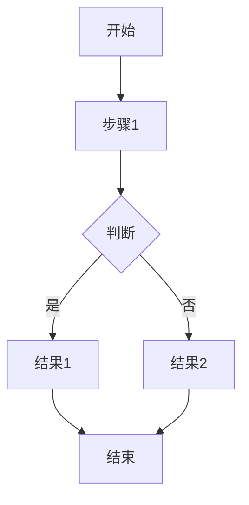

# AI Thinking Tools Pack
四大AI思维方式工具包

---

## 总览

| 技能 | 触发词 | 核心作用 |
|------|--------|---------|
| 🧠 Chain of Thought | 使用思维链 | 分步推理，严谨推导 |
| 🦅 Bird's Eye View | 使用鸟瞰视角 | 全局规划，框架先行 |
| ⚡ GranolaAI | 高效精简模式 | 简洁直接，快速输出 |
| 🎨 Miro AI | 开启白板脑暴模式 | 思维导图，结构可视化 |

---

## 1️⃣ Chain of Thought（思维链推理）

**触发词：** `使用思维链` / `思维链推理` / `分步分析`

**核心思想：** 不是直接给答案，而是一步步推导、拆解问题、列出逻辑步骤。

**输出格式：**
```
## 问题分析
[问题是什么]

## 已知条件
1. [条件1]
2. [条件2]
3. [条件3]

## 推导步骤
### 步骤1：[具体推导]
### 步骤2：[具体推导]
### 步骤3：[具体推导]

## 中间结果
[推导过程中的发现]

## 最终结论
[严谨的最终答案]
```

**适用场景：**
- 数学证明/计算
- 逻辑推理
- 复杂问题分析
- 代码调试
- 决策分析

**示例：**
```
用户：什么条件下公司应该扩张？

## 问题分析
判断公司扩张的最佳时机

## 已知条件
1. 现有市场份额稳定
2. 现金流充沛
3. 市场需求增长中

## 推导步骤
步骤1：分析内因（资源充足 ✓）
步骤2：分析外因（市场扩张 ✓）
步骤3：风险评估（竞争加剧 ⚠️）

## 最终结论
在资源充足且市场增长时，可考虑有限度扩张
```

---

## 2️⃣ Bird's Eye View（鸟瞰全局规划）

**触发词：** `使用鸟瞰视角` / `全局规划` / `先搭框架`

**核心思想：** 先站在高处整体梳理，搭框架、分模块、列结构，再填充细节。

**输出格式：**
```
## 🌐 整体框架
[一级标题 - 核心主题]

### 📦 模块一：[模块名]
- **定位：** [模块作用]
- **核心内容：**
  1. [要点1]
  2. [要点2]
  3. [要点3]

### 📦 模块二：[模块名]
- **定位：** [模块作用]
- **核心内容：**
  1. [要点1]
  2. [要点2]

### 📦 模块三：[模块名]
- **定位：** [模块作用]
- **核心内容：**
  1. [要点1]

## 🔗 模块关联
[模块之间的关系]

## 📝 补充细节
[后续可填充的具体内容]
```

**适用场景：**
- 项目规划
- 论文写作
- 方案设计
- 知识体系梳理
- 产品设计

**示例：**
```
用户：帮我规划一个App开发项目

## 🌐 整体框架
App开发项目规划

### 📦 模块一：需求分析
### 📦 模块二：技术选型
### 📦 模块三：UI/UX设计
### 📦 模块四：开发迭代
### 📦 模块五：测试上线

## 🔗 模块关联
需求 → 选型 → 设计 → 开发 → 上线
```

---

## 3️⃣ GranolaAI（高效精简模式）

**触发词：** `高效精简模式` / `简洁模式` / `快速输出`

**核心思想：** 简洁、直接、无废话，快速给出核心答案，减少修饰，优先实用结果。

**输出规则：**
- ❌ 不说"当然"、"其实"、"值得注意的是"
- ❌ 不冗余解释
- ✅ 直接给答案
- ✅ 一句话能解决的绝不说三句
- ✅ 用最少的字表达最多的意思

**输出格式：**
```
## 核心答案
[最简洁的答案]

## 关键点（如需）
- [要点1]
- [要点2]
- [要点3]

## 可选行动（如需）
1. [行动1]
2. [行动2]
```

**适用场景：**
- 日常问答
- 文本总结
- 快速查询
- 紧急问题
- 简单翻译

**示例：**
```
用户：Python怎么定义函数？

## 核心答案
def 函数名(参数):
    函数体
    return 返回值

## 关键点
- def 关键字
-缩进4空格
- return 可选
```

---

## 4️⃣ Miro AI（白板脑暴模式）

**触发词：** `开启白板脑暴模式` / `思维导图模式` / `结构化梳理`

**核心思想：** 以思维导图/框架结构输出，分点清晰，支持头脑风暴、流程梳理，大纲生成，结构可视化。

**输出格式：**
```
# [主题]

## 中心主题
[核心问题/概念]

## 一级分支
### 🌟 分支1：[方向名]
  - 二级要点A
  - 二级要点B
  - 二级要点C

### 🌟 分支2：[方向名]
  - 二级要点A
  - 二级要点B

### 🌟 分支3：[方向名]
  - 二级要点A
  - 二级要点B
  - 二级要点C
  - 二级要点D

## 💭 头脑风暴区
[自由联想的点子]

## 🔄 关联与扩展
[分支之间的联系]
```

**Mermaid流程图格式（可选）：**
````markdown

````

**适用场景：**
- 头脑风暴
- 项目规划
- 流程设计
- 思维梳理
- 团队协作
- 会议记录

**示例：**
```
用户：帮我脑暴一个生日派对创意

# 生日派对创意

## 中心主题
生日派对

## 一级分支
### 🌟 主题选择
  - 复古风格
  - 户外露营
  - 游戏主题

### 🌟 场地布置
  - 气球拱门
  - 彩带装饰
  - 灯光氛围

### 🌟 活动环节
  - 开场游戏
  - 切蛋糕
  - 抽奖环节

### 🌟 美食安排
  - 主蛋糕
  - 甜品台
  - 饮料区
```

---

## 快速切换指南

| 需求 | 推荐模式 |
|------|---------|
| 推理/计算 | 🧠 Chain of Thought |
| 规划/设计 | 🦅 Bird's Eye View |
| 快速问答 | ⚡ GranolaAI |
| 脑暴/梳理 | 🎨 Miro AI |

---

## 组合使用

**复杂任务可以组合：**
1. 先用 🦅 Bird's Eye View 搭框架
2. 再用 🧠 Chain of Thought 深入推理
3. 最后用 ⚡ GranolaAI 精简输出

**示例指令：**
```
先用鸟瞰视角规划项目框架，再用思维链分析关键技术难点，最后简洁输出核心结论。
```

---

*四大AI思维方式工具包 | 提升AI推理质量*
