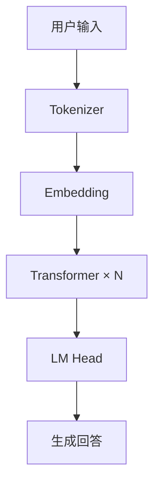
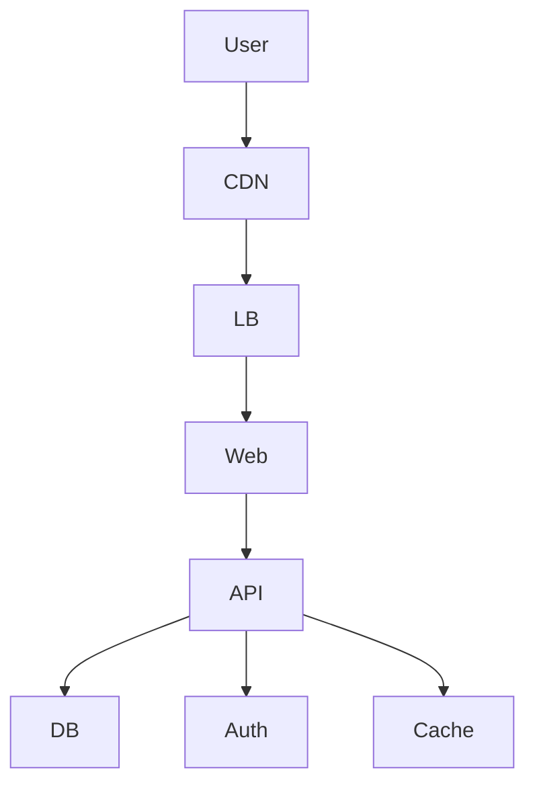

# Architecture Diagram / 架构图生成助手

## AI 架构图生成工具 / AI Architecture Diagram Generator

支持生成 Mermaid 架构图：系统架构、云架构、AI大模型架构、神经网络、图论、流程图、ER图、网络拓扑、Docker/K8s架构。

### Features / 功能

- 🌐 **Cloud Architecture** 云架构 (AWS, 阿里云, etc.)
- 🖥️ **System Architecture** 系统架构
- 🤖 **AI/LLM Architecture** AI大模型架构
- 🧠 **Neural Network** 神经网络
- 📊 **Graph Theory** 图论 / 7×7矩阵
- 🔀 **Flowchart** 流程图
- 📋 **ER Diagram** ER图
- 🌐 **Network Topology** 网络拓扑
- 🐳 **Docker/K8s** 容器架构

### Quick Start / 快速开始

```
架构图 云服务架构
architecture cloud aws
diagram neural network
mermaid flowchart
```

### Examples / 示例

#### AI/LLM Architecture


#### Cloud Architecture


### Online Render / 在线渲染

https://mermaid.live/

### License / 许可证

MIT
