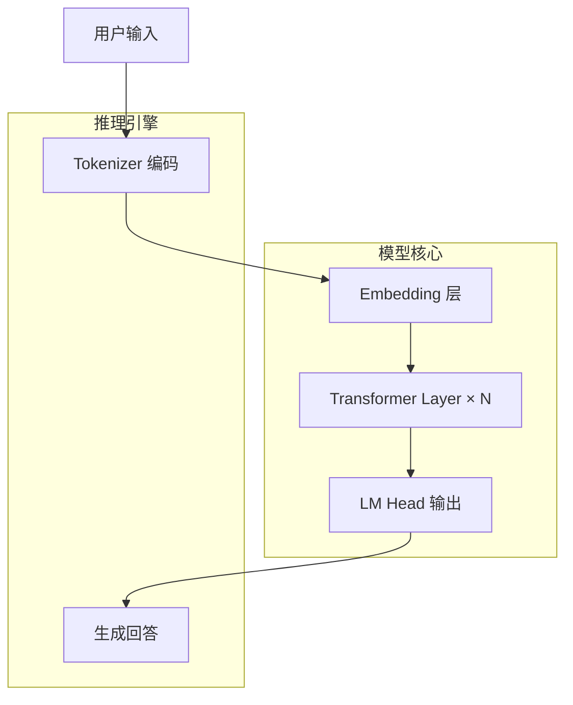
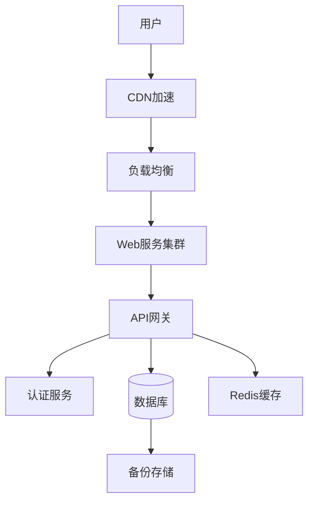
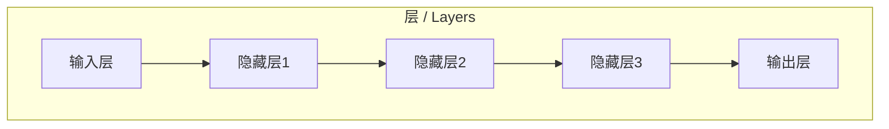
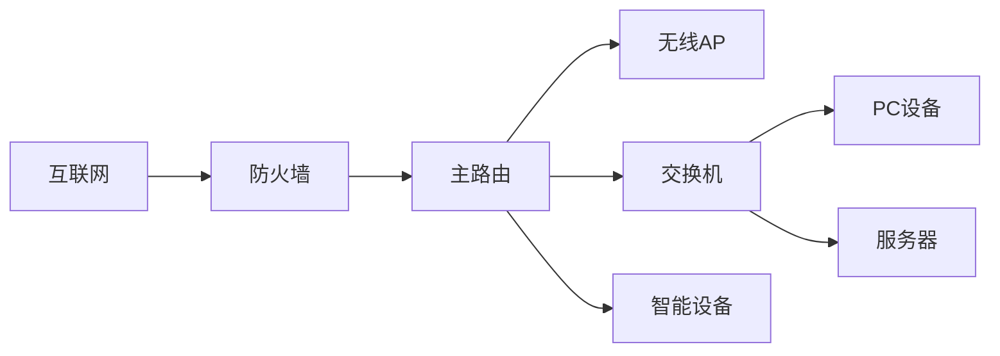
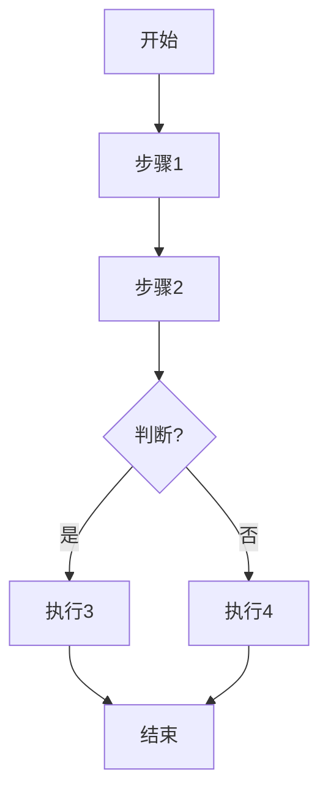
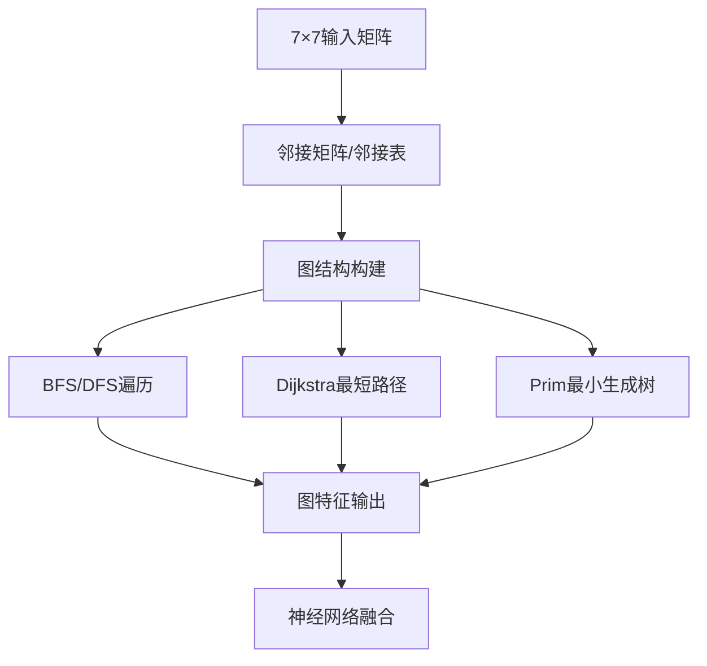
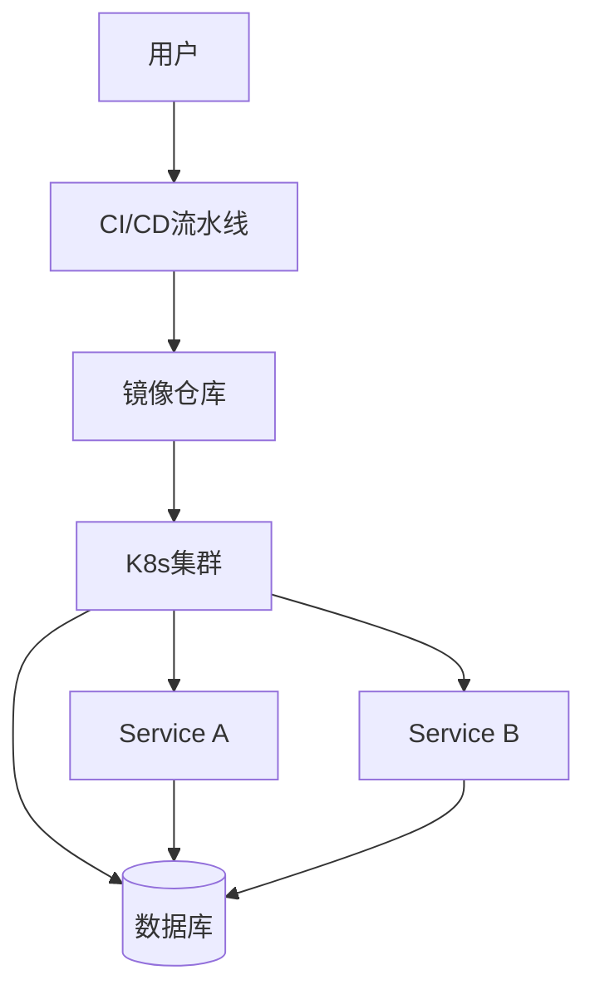

# Architecture Diagram / 架构图生成助手

## 功能 / Features

1. **Generate Mermaid code** (copy & paste anywhere)
2. **Direct image generation** via Kroki API (free, no API key!)
3. **Online editor link** for customization

### Supported Types / 支持类型

| 类型 | 关键词 |
|------|--------|
| 🤖 AI/LLM 大模型 | `大模型`, `llm`, `neural`, `transformer` |
| 📊 图论/矩阵 | `图论`, `7x7`, `矩阵`, `graph`, `matrix` |
| ☁️ 云架构 | `云`, `aws`, `cloud`, `azure`, `阿里云` |
| 🌐 网络拓扑 | `网络`, `router`, `network`, `openwrt` |
| 🔀 流程图 | `流程`, `flow`, `flowchart`, `工作流` |
| 📋 ER图 | `er`, `database`, `数据库` |
| 🐳 Docker/K8s | `docker`, `k8s`, `container` |

## Usage / 使用方法

### Command Format / 命令格式

```
生成架构图 <描述>      # 中文
architecture <desc>   # English
```

### Examples / 示例

```
生成架构图 大模型系统架构
architecture cloud aws architecture
生成架构图 神经网络
architecture neural network
```

## Image Generation / 图片生成

Uses **Kroki API** (https://kroki.io) - 100% free, no API key needed!

**IMPORTANT: Use PNG format, NOT SVG!**
- SVG → image conversion (cairosvg/PIL) loses text inside boxes
- Kroki PNG API directly bakes text into the image correctly
- PNG format works perfectly on Telegram, mobile, and desktop

```python
import urllib.request
import base64
import zlib

def generate_diagram_image(mermaid_code: str, output_path: str = "diagram.png"):
    """Generate PNG image from Mermaid code using Kroki API (text intact!)"""
    
    # Encode: zlib compress + base64 URL-safe encode
    compressed = zlib.compress(mermaid_code.encode('utf-8'))
    encoded = base64.urlsafe_b64encode(compressed).decode('ascii')
    
    # Use PNG format - text renders correctly, no font dependencies
    url = f"https://kroki.io/mermaid/png/{encoded}"
    
    req = urllib.request.Request(url, headers={'User-Agent': 'Mozilla/5.0'})
    with urllib.request.urlopen(req, timeout=30) as response:
        with open(output_path, 'wb') as f:
            f.write(response.read())
    
    return output_path
```

## Mermaid Templates / Mermaid 模板

### 1. AI/LLM Architecture (default)



### 2. Cloud Architecture



### 3. Neural Network



### 4. Network Topology



### 5. Flowchart



### 6. Graph Theory 7×7



### 7. Docker/K8s Architecture



## Output Format / 输出格式

When user requests image, generate:

```markdown
🤖 **架构图：{标题}**
━━━━━━━━━━━━━━━━━━━━


📊 **Mermaid 代码：**
```mermaid
{mermaid_code}
```

🔗 [在线编辑](https://mermaid.live/edit#pako:{encoded})
```

**For Telegram/mobile:** Always use PNG format directly - text is baked in and displays correctly everywhere.

## Smart Detection / 智能识别

```python
def detect_type(input_text):
    text = input_text.lower()
    
    if any(k in text for k in ["大模型", "llm", "神经网络", "neural", "transformer", "ai"]):
        return "ai_llm"
    elif any(k in text for k in ["图论", "7x7", "矩阵", "graph", "matrix"]):
        return "graph_theory"
    elif any(k in text for k in ["云", "aws", "cloud", "azure", "阿里云"]):
        return "cloud"
    elif any(k in text for k in ["网络", "router", "network", "openwrt", "拓扑"]):
        return "network"
    elif any(k in text for k in ["流程", "flow", "flowchart", "工作流"]):
        return "flowchart"
    elif any(k in text for k in ["er", "database", "数据库", "er图"]):
        return "er"
    elif any(k in text for k in ["docker", "k8s", "container", "容器"]):
        return "docker"
    else:
        return "general"
```

## Color Themes / 配色主题

```mermaid
%%{init: {'theme':'base'}}%%
%%{init: {'theme':'dark'}}%%
%%{init: {'theme':'neutral'}}%%
```

Add theme in SKILL.md body for custom styling.

## Notes / 注意事项

- **Always use PNG format** - SVG to image conversion loses text, use Kroki PNG API directly
- **Kroki API** (https://kroki.io) is 100% free, no registration required
- **Online editor** (https://mermaid.live) allows visual customization
- **PNG works everywhere** - Telegram, mobile, desktop - text renders correctly
