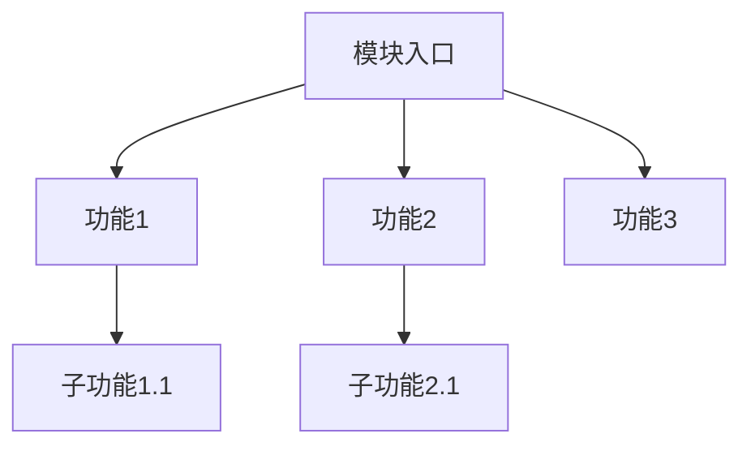
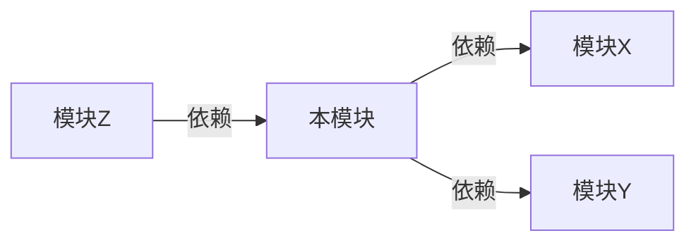

# 模块设计文档模板

## 1. 模块基本信息

| 字段 | 内容 |
|-----|------|
| 模块名称 | |
| 所属层级 | 基础模块层 / 业务模块层 / 支撑模块层 / 公共模块 |
| 优先级 | P0 / P1 / P2 |
| 负责人 | |
| 创建日期 | |
| 最后更新 | |

## 2. 功能概述

### 2.1 模块定位
[描述模块在整体架构中的位置和作用]

### 2.2 核心功能
[列出模块的核心功能点]

### 2.3 边界定义
[明确模块的职责边界]

## 3. 功能详细设计

### 3.1 功能分解



### 3.2 数据流设计

| 数据来源 | 数据类型 | 处理逻辑 | 数据去向 |
|---------|---------|---------|---------|
| | | | |

## 4. 接口设计

### 4.1 对外接口

| 接口名称 | 方法 | 输入 | 输出 | 说明 |
|---------|-----|------|------|------|
| | | | | |

### 4.2 依赖接口

| 依赖模块 | 接口名称 | 数据格式 | 调用时机 |
|---------|---------|---------|---------|
| | | | |

### 4.3 回调接口

| 回调事件 | 触发条件 | 回调数据 | 处理逻辑 |
|---------|---------|---------|---------|
| | | | |

## 5. 数据结构设计

### 5.1 核心数据模型

```json
{
    "id": "唯一标识",
    "type": "数据类型",
    "version": "版本号",
    "timestamp": "时间戳",
    "payload": {}
}
```

### 5.2 数据库设计（如适用）

| 表名 | 字段 | 类型 | 说明 |
|-----|------|-----|------|
| | | | |

## 6. 模块依赖关系



### 6.1 前置依赖
[列出必须先完成的依赖模块]

### 6.2 后置影响
[列出依赖本模块的其他模块]

## 7. 测试策略

### 7.1 测试要点
| 测试类型 | 测试内容 | 通过标准 |
|---------|---------|---------|
| 单元测试 | | |
| 集成测试 | | |
| 性能测试 | | |

### 7.2 验收标准
- [ ] 验收点1
- [ ] 验收点2

## 8. 风险评估

| 风险项 | 影响程度 | 应对措施 |
|-------|---------|---------|
| | | |

## 9. 变更记录

| 日期 | 版本 | 变更内容 | 变更人 |
|-----|------|---------|-------|
| | | | |
