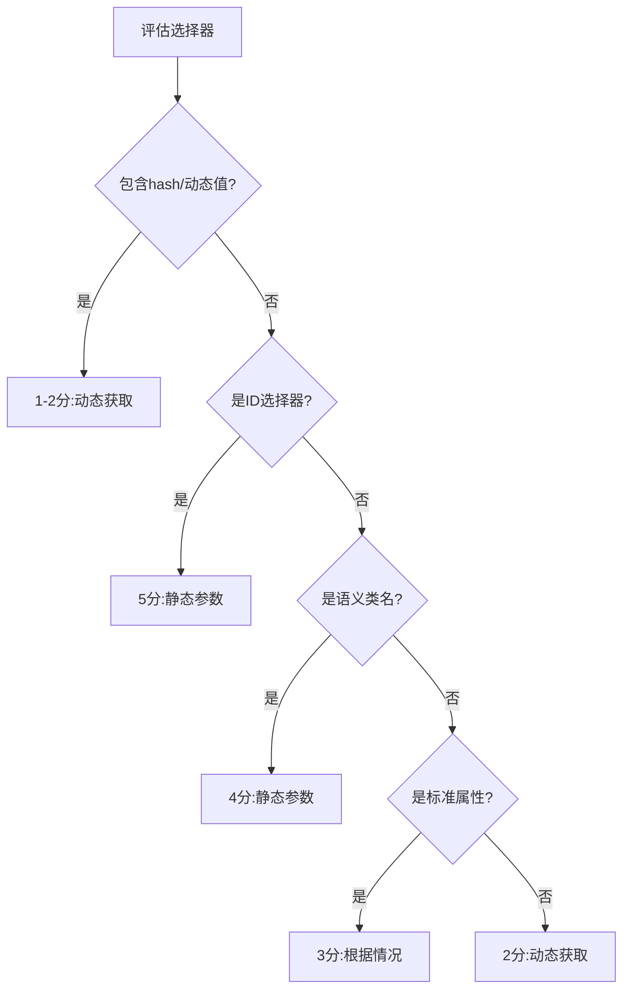

# CSS选择器稳定性判断指南

## 概述

本指南提供CSS选择器稳定性的系统化评估方法。通过5分制评分系统，判断选择器是否可作为静态参数，或需要通过动态方式获取。

## 稳定性评分系统

### 评分标准（1-5分）

| 分数 | 类型 | 特征 | 示例 |
|------|------|------|------|
| **5分** | ID选择器 | 语义化、标准的ID | `#search-button`、`#submit-btn` |
| **4分** | 语义类名 | 描述功能的类名 | `.publish-button`、`.search-input` |
| **3分** | 标准属性 | HTML标准属性 | `input[type="text"]`、`button[type="submit"]` |
| **2分** | 位置依赖 | 依赖DOM结构 | `div:nth-child(3)`、`.container > span` |
| **1分** | 动态Hash | 框架生成的动态值 | `[data-v-7ba5bd90]`、`#item-1234567890` |

### 决策规则

```
评分 ≥ 4分：作为静态参数（直接硬编码）
评分 = 3分：根据上下文判断（优先动态）
评分 ≤ 2分：必须动态获取（使用Task Tool）
```

## 详细评估指南

### 5分 - 高度稳定的ID选择器

**特征**：
- 语义化命名：`#loginButton`、`#searchInput`
- 功能明确：`#submit`、`#cancel`、`#save`
- 平台标准：`#root`、`#app`、`#main`

**示例**：
```css
#searchButton        /* 搜索按钮 */
#publishBtn          /* 发布按钮 */
#userNameInput       /* 用户名输入框 */
```

**判断依据**：ID通常由开发者精心设计，不会轻易改变

### 4分 - 语义化类名选择器

**特征**：
- BEM命名：`.button--primary`、`.form__input`
- 功能类名：`.submit-button`、`.search-form`
- 组件类名：`.modal-header`、`.dropdown-menu`

**示例**：
```css
.publish-button      /* 发布按钮 */
.search-input        /* 搜索输入框 */
.nav-menu           /* 导航菜单 */
.upload-area        /* 上传区域 */
```

**判断依据**：语义化类名反映功能，重构时保持稳定

### 3分 - 标准HTML属性选择器

**特征**：
- 表单类型：`input[type="email"]`、`input[type="password"]`
- 标准属性：`[required]`、`[disabled]`、`[readonly]`
- ARIA属性：`[role="button"]`、`[aria-label="Search"]`

**示例**：
```css
input[type="text"][name="username"]    /* 用户名输入框 */
button[type="submit"]                   /* 提交按钮 */
input[type="file"][accept="image/*"]    /* 图片上传 */
```

**判断依据**：HTML标准属性相对稳定，但可能存在多个匹配

### 2分 - 位置依赖选择器

**特征**：
- 子元素索引：`:nth-child()`、`:first-child`、`:last-child`
- 复杂路径：`.parent > .child > span`
- 相邻兄弟：`+ div`、`~ span`

**示例**：
```css
.container > div:nth-child(3)           /* 第三个子元素 */
.list-item:first-child                  /* 第一个列表项 */
.header + .content                      /* 紧跟header的content */
```

**警告**：DOM结构变化会导致失效

### 1分 - 动态生成选择器

**特征**：
- Vue哈希：`[data-v-7ba5bd90]`
- React类名：`.css-1x2y3z`
- 时间戳ID：`#item-1608547200`
- 随机UUID：`#element-a3f4d5e6`

**示例**：
```css
[data-v-abc123]                        /* Vue组件hash */
.css-module-xyz789                     /* CSS Modules */
#timestamp-1234567890                  /* 时间戳ID */
[class*="styled-component"]            /* Styled Components */
```

**处理方式**：必须使用Task Tool动态获取

## 组合选择器评分

当选择器包含多个部分时，取**最低分**作为整体评分：

```css
/* 示例1：5分(ID) + 1分(hash) = 1分 */
#searchBox[data-v-123abc]  → 1分（需要动态获取）

/* 示例2：4分(类名) + 3分(属性) = 3分 */
.submit-button[type="submit"]  → 3分（边界情况）

/* 示例3：5分(ID) + 4分(类名) = 4分 */
#publishBtn.primary-button  → 4分（可作为静态）
```

## 实际应用示例

### 示例1：小红书发布按钮

```json
{
  "selector": ".publishBtn",
  "score": 4,
  "type": "static",
  "reason": "语义化类名，功能明确"
}
```

### 示例2：抖音动态列表项

```json
{
  "selector": "[data-e2e='user-tab-item'][data-v-7ba5bd90]",
  "score": 1,
  "type": "dynamic",
  "reason": "包含Vue hash，会随构建变化",
  "solution": "使用Task Tool查找包含特定文本的元素"
}
```

### 示例3：标准搜索输入框

```json
{
  "selector": "input[type='search'][placeholder='搜索']",
  "score": 3,
  "type": "conditional",
  "reason": "标准属性组合，中等稳定性",
  "decision": "如果页面只有一个搜索框则静态，否则动态"
}
```

## 动态选择器处理策略

### 1. 使用Task Tool获取

```json
{
  "step": 3,
  "tool_name": "task_tool",
  "tool_params": {
    "description": "查找发布按钮",
    "prompt": "找到页面上的发布按钮，返回稳定的CSS选择器"
  },
  "output": {
    "publish_button": "需要动态获取的发布按钮选择器"
  }
}
```

### 2. 后续步骤引用

```json
{
  "step": 4,
  "tool_name": "mcp__chrome-server__chrome_click_element",
  "tool_params": {
    "selector": "{step_3.publish_button}"
  }
}
```

### 3. 备选方案

如果动态获取失败，提供备选策略：
- 使用文本内容查找：`包含"发布"文字的按钮`
- 使用相对位置：`表单内的最后一个按钮`
- 使用部分属性匹配：`class包含'publish'的元素`

## 平台特定注意事项

### 小红书
- 使用较多语义化类名（4分）
- ID相对稳定（5分）
- 少量Vue hash需要过滤（1分）

### 抖音
- 大量data-v-*属性（1分）
- 建议使用data-e2e属性（3分）
- 避免使用纯class选择器

### TikTok
- React生成的动态类名（1分）
- 优先使用role和aria属性（3分）
- ID可能包含时间戳（2分）

## 最佳实践

### ✅ 推荐做法

1. **优先使用高分选择器**
   - 先尝试ID（5分）
   - 其次语义类名（4分）
   - 最后标准属性（3分）

2. **组合提高准确性**
   ```css
   /* 好：组合多个稳定属性 */
   input[type="text"][name="title"]

   /* 避免：单一不稳定选择器 */
   div:nth-child(3)
   ```

3. **为动态选择器设置output**
   ```json
   {
     "output": {
       "search_button": "搜索按钮选择器",
       "publish_button": "发布按钮选择器"
     }
   }
   ```

### ❌ 避免做法

1. **不要硬编码低分选择器**
   ```json
   /* 错误：直接使用hash */
   "selector": "[data-v-abc123]"
   ```

2. **不要过度依赖位置**
   ```css
   /* 脆弱：深层嵌套路径 */
   body > div > div > div:nth-child(2) > span
   ```

3. **不要忽视动态性**
   ```json
   /* 错误：假设hash稳定 */
   {
     "selector": ".button[data-v-123]",
     "type": "static"
   }
   ```

## 快速决策流程



## 总结

选择器稳定性直接影响工作流的可靠性。通过系统化的评分方法：

1. **快速识别**：通过特征快速判断分数
2. **合理决策**：≥4分静态，≤2分动态
3. **灵活处理**：3分根据具体情况
4. **确保可靠**：动态选择器用Task Tool获取
5. **提供备选**：为不稳定选择器准备Plan B

记住：**宁可动态获取，也不要硬编码不稳定选择器**。