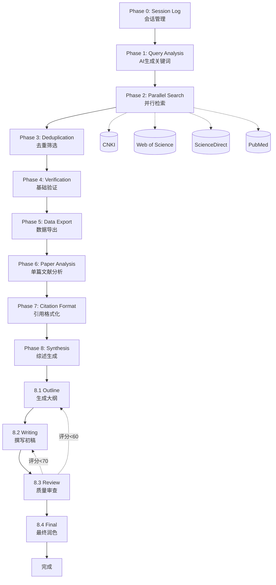

# Literature Reviewer Skill

<p align="center">
  
  
  
  
</p>

<p align="center">
  <b>系统性学术文献回顾（Literature Survey）Skill for Kimi CLI</b>
</p>

<p align="center">
  采用 8阶段工作流，浏览器自动化检索，支持 CNKI/WOS/ScienceDirect，零配置输出 GB/T 7714-2015 格式文献综述
</p>

---

## 📖 简介

**Literature Survey Skill** 是一个为 Kimi CLI 设计的 Skill 插件，用于帮助用户进行系统性的学术文献回顾。

### 核心优势

- 🚀 **8阶段工作流**：从查询分析到综述生成的完整流程
- 🌐 **浏览器自动化**：无需API配置，直接访问学术数据库
- ✅ **多数据库支持**：CNKI、Web of Science、ScienceDirect、PubMed
- 📚 **结构化输出**：GB/T 7714-2015引文 + 标题 + 摘要的Markdown文档
- 🔄 **中断续传**：支持会话保存和恢复

---

## ✨ 功能特性

| 功能模块 | 描述 | 状态 |
|---------|------|------|
| 🔍 查询分析 | AI生成中英文关键词和检索策略 | ✅ 可用 |
| 🌏 中文文献检索 | CNKI 浏览器自动化 | ✅ 可用 |
| 🌍 英文文献检索 | WOS/ScienceDirect/PubMed | ✅ 可用 |
| 🔄 智能去重 | 标题相似度匹配 | ✅ 可用 |
| ✅ 元数据验证 | 基础完整性校验 | ✅ 可用 |
| 📄 数据导出 | Markdown格式（含摘要） | ✅ 可用 |
| 📖 单篇分析 | 深度分析每篇文献 | ✅ 可用 |
| 📝 引用格式化 | GB/T 7714-2015 | ✅ 可用 |
| 📝 综述生成 | 四步高质量综述（大纲→撰写→审查→润色） | ✅ 可用 |

---

## 🔄 8阶段工作流



### 各阶段详细说明

| 阶段 | 名称 | 主要任务 | 输出 |
|------|------|---------|------|
| 0 | Session Log | 创建会话目录，记录工作进度 | `session_log.md` |
| 1 | Query Analysis | AI生成关键词和检索策略 | `keywords.json`, `queries.json` |
| 2 | Parallel Search | 浏览器访问各数据库检索 | `papers_raw.json` |
| 3 | Deduplication | 去重、筛选 | `papers_deduplicated.json` |
| 4 | Verification | 元数据完整性校验 | 验证后的文献列表 |
| 5 | Data Export | 导出文献信息到Markdown | `references.md` |
| 6 | Paper Analysis | 单篇文献深度分析 | `papers_analysis.md` |
| 7 | Citation Format | GB/T 7714-2015格式化 | 格式化的引文列表 |
| **8** | **Synthesis** | **综述生成（核心环节）** | **见下方 Sub Phases** |

#### Phase 8 Sub Phases（综述生成详细分解）

| Sub Phase | 名称 | 主要任务 | 输出 |
|-----------|------|---------|------|
| 8.1 | **Outline** | 主题聚类，构建综述结构 | `outline.md` |
| 8.2 | **Writing** | 撰写完整综述初稿（3000-5000字） | `draft.md` |
| 8.3 | **Review** | 6维度质量审查（加权评分） | `review_report.md` |
| 8.4 | **Final** | 修订润色，生成摘要和关键词 | `literature_review.md` |

**Phase 8 迭代机制**：
- 评分 ≥85：小修后直接定稿
- 评分 70-85：回到 8.2 重写部分章节
- 评分 60-70：回到 8.1 重新规划结构
- 评分 <60：检查文献质量，必要时重新检索

---

## 🚀 快速开始

### 安装

#### 方式一：自然语言安装（推荐）

本 Skill 兼容以下 AI 编程工具的 Skills/MCP 系统：

<p align="left">
  
  
  
  
  
  
  
</p>

如果你使用以上任意 AI 编程工具，可以直接用自然语言安装：

> 💬 **复制以下提示语发送给你的 AI 助手：**
>
> ```
> 请帮我安装 Literature Reviewer Skill。从 GitHub 仓库 https://github.com/stephenlzc/AI-Powered-Literature-Review-Skills 克隆代码，安装到 skills 目录，文件夹命名为 literature-reviewer-skill。
> ```

AI 助手会自动完成克隆、配置和安装。

#### 方式二：手动安装

1. 找到你的 AI 工具的 skills 目录（不同工具路径可能不同）：
   - Kimi CLI / KimiClaw: `~/.kimi/skills/`
   - MaxClaw: `~/.maxclaw/skills/`
   - Claude Code: `~/.claude-code/skills/`
   - OpenCode: `~/.opencode/skills/`
   - TRAE: `~/.trae/skills/`
   - VS Code: `.vscode/skills/`

2. 克隆本仓库到 skills 目录：

```bash
# 进入 skills 目录（根据你的工具选择对应路径）
cd ~/.kimi/skills  # 或其他工具的 skills 目录

# 克隆仓库
git clone https://github.com/stephenlzc/AI-Powered-Literature-Review-Skills.git literature-reviewer-skill
```

3. 完成！无需额外配置，重启 AI 工具即可使用。

### 使用方法

安装完成后，在 AI 工具中输入以下自然语言指令即可触发：

**方式一：直接描述需求**
```
帮我做一份关于「基于深度学习的医学图像诊断」的文献综述
```

**方式二：使用快捷指令**（部分工具支持）
```
/ 文献回顾 基于深度学习的医学图像诊断研究
```

**方式三：指定语言和数量**
```
帮我找文献：Transformer模型在自然语言处理中的应用，需要中英文各20篇
```

**方式四：完整的综述撰写**
```
请为我撰写一份关于「人工智能在癌症早期筛查中的应用」的文献综述，
要求：
- 中文文献20篇，英文文献20篇
- 时间范围：近5年
- 输出格式：包含摘要、关键词、正文、参考文献
- 引用格式：GB/T 7714-2015
```

AI 助手会自动执行 8 阶段工作流，最终输出完整的文献综述文档。

---

## 📁 项目结构

```
literature-reviewer-skill/
├── SKILL.md                          # Skill 主入口
├── README.md                         # 本文件
├── AGENTS.md                         # 项目架构说明
│
├── agents/                           # Agent 模板
│   ├── explore-agent.md              # 搜索 Agent
│   ├── verify-agent.md               # 验证 Agent
│   ├── synthesize-agent.md           # 综述 Agent
│   └── orchestrator.md               # 协调器 Agent
│
├── references/                       # 参考资料
│   ├── cnki-guide.md                 # CNKI检索指南
│   ├── database-access.md            # 数据库访问指南
│   └── gb-t-7714-2015.md             # GB/T 7714-2015引用格式规范
│
├── scripts/                          # 辅助脚本
│   ├── __init__.py
│   ├── models.py                     # 数据模型
│   ├── deduplicate_papers.py         # 去重工具
│   └── citation_formatter.py         # 引用格式化
│
├── examples/                         # 使用示例（不包含在Skill安装中）
│   ├── example-3-ai-education/       # 示例3：AI教育评估
│   ├── example-4-carbon-policy/      # 示例4：碳中和政策
│   └── example-5-uniqlo-social-media/# 示例5：优衣库社媒营销
│
└── sessions/                         # 会话目录（运行时生成）
    └── {YYYYMMDD}_{topic}/
        ├── session_log.md            # 工作日志
        ├── metadata.json             # 会话元数据
        ├── papers_raw.json           # 原始检索结果
        ├── papers_deduplicated.json  # 去重后文献
        └── output/
            ├── references.md         # 文献清单（含摘要）
            ├── papers_analysis.md    # 单篇文献深度分析
            └── literature_review.md  # 最终综述（含摘要、关键词）
```

> **Note**: `examples/` 文件夹包含使用示例和参考输出，**不包含在 Skill 安装包中**。如需查看示例，请访问项目仓库。

---

## 🌐 支持的数据库

| 数据库 | 类型 | 访问方式 |
|--------|------|----------|
| CNKI 中国知网 | 全文 | 浏览器自动化 |
| Web of Science | 引文索引 | 浏览器自动化 |
| ScienceDirect | 全文 | 浏览器自动化 |
| PubMed | 生物医学 | 浏览器自动化 |
| Google Scholar | 学术搜索 | 网页搜索 |

**无需API配置**，直接通过浏览器访问数据库检索页面。

---

## 📝 输出格式

### 文献清单 (references.md)

包含完整文献信息：

```markdown
# 文献清单

## 中文文献

### C1
- **标题**: 基于深度学习的医学图像诊断研究
- **作者**: 张三, 李四, 王五
- **期刊**: 计算机学报
- **年份**: 2023
- **卷期**: 46(5): 1023-1035
- **DOI**: 10.xxxx
- **摘要**: 本文研究了...
- **来源**: CNKI

## 英文文献

### E1
- **Title**: Deep Learning for Medical Image Analysis
- **Authors**: Smith J, Johnson K
- **Journal**: Nature Medicine
- **Year**: 2022
- **DOI**: 10.1038/xxxxx
- **Abstract**: This study presents...
- **Source**: ScienceDirect
```

### GB/T 7714-2015 引用格式

**中文期刊**：
```
[C1] 张三, 李四, 王五. 基于深度学习的医学图像诊断研究[J]. 计算机学报, 2023, 46(5): 1023-1035. DOI:10.xxxx.
```

**英文期刊**：
```
[E1] Smith J, Johnson K, Lee M. Deep learning for medical image analysis[J]. Nature Medicine, 2022, 28(8): 1500-1510. DOI:10.1038/s41591-022-01900-0.
```

### 单篇文献分析 (papers_analysis.md)

每篇文献的深度分析，包含：
- 主要观点和结论
- 局限性
- 争议点
- 研究内容缺陷
- 参考文献格式

### 综述文档 (literature_review.md)

高质量结构化综述，包含：
1. **标题**
2. **摘要**（200-300字）
3. **关键词**（5-8个）
4. **引言**（研究背景、检索策略）
5. **理论基础与方法**
6. **国内研究现状**
7. **国外研究现状**
8. **讨论**（对比分析、研究趋势、Gap识别）
9. **结论**
10. **参考文献**

---

## 📚 参考资料

- `references/cnki-guide.md` - CNKI 高级检索详细指南
- `references/database-access.md` - 各数据库访问指南
- `references/gb-t-7714-2015.md` - GB/T 7714-2015 引用格式规范

---

## 🗺️ 版本历史

### v3.0.0 (2024-03)

- ✅ 移除API配置要求
- ✅ 改用浏览器自动化访问数据库
- ✅ 简化去重/验证流程
- ✅ 输出改为Markdown格式（含摘要）
- ✅ 保留8阶段工作流框架

### v2.0.0 (2024-01)

- 重构为8阶段工作流
- 引入Agent Swarm架构
- 新增引用验证机制
- 新增多数据库API支持

### v1.0.0 (2023)

- 初始版本

---

## 🤝 致谢

本项目在开发过程中参考和整合了以下优秀开源项目的思路和设计：

| 项目 | 核心贡献 |
|------|---------|
| [flonat/claude-research](https://github.com/flonat/claude-research) | 8阶段工作流、引用验证、Session Log |
| [openclaw/skills](https://github.com/openclaw/skills) | 多数据库搜索策略、Agent设计模式 |
| [cookjohn/cnki-skills](https://github.com/cookjohn/cnki-skills) | CNKI自动化检索、Zotero导出 |
| [diegosouzapw/awesome-omni-skill](https://github.com/diegosouzapw/awesome-omni-skill) | 统一学术数据接口设计 |

---

## 📄 许可证

MIT License

Copyright (c) 2024 Literature Reviewer Skill Contributors

Permission is hereby granted, free of charge, to any person obtaining a copy
of this software and associated documentation files (the "Software"), to deal
in the Software without restriction, including without limitation the rights
to use, copy, modify, merge, publish, distribute, sublicense, and/or sell
copies of the Software, and to permit persons to whom the Software is
furnished to do so, subject to the following conditions:

The above copyright notice and this permission notice shall be included in all
copies or substantial portions of the Software.

THE SOFTWARE IS PROVIDED "AS IS", WITHOUT WARRANTY OF ANY KIND, EXPRESS OR
IMPLIED, INCLUDING BUT NOT LIMITED TO THE WARRANTIES OF MERCHANTABILITY,
FITNESS FOR A PARTICULAR PURPOSE AND NONINFRINGEMENT. IN NO EVENT SHALL THE
AUTHORS OR COPYRIGHT HOLDERS BE LIABLE FOR ANY CLAIM, DAMAGES OR OTHER
LIABILITY, WHETHER IN AN ACTION OF CONTRACT, TORT OR OTHERWISE, ARISING FROM,
OUT OF OR IN CONNECTION WITH THE SOFTWARE OR THE USE OR OTHER DEALINGS IN THE
SOFTWARE.

---

<p align="center">
  Made with ❤️ for researchers
</p>
