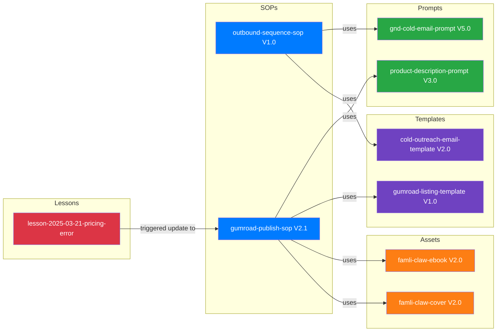

# Knowledge Graph & Cross-References — Mapping How Everything Connects

The knowledge graph is the Librarian's neural network — it maps relationships between every asset in the
system. When you change a prompt, the graph tells you which SOPs use it. When you retire a product, the
graph tells you which templates, images, and descriptions need updating. Without the graph, changes
propagate blindly. With it, the company sees the full impact of every decision.

---

## Table of Contents

1. [Knowledge Graph Philosophy](#knowledge-graph-philosophy)
2. [Relationship Types](#relationship-types)
3. [Dependency Tracking](#dependency-tracking)
4. [Lineage Visualization](#lineage-visualization)
5. [Impact Analysis](#impact-analysis)
6. [Tagging Taxonomy](#tagging-taxonomy)
7. [Search and Retrieval Indexing](#search-and-retrieval-indexing)
8. [Knowledge Compounding Metrics](#knowledge-compounding-metrics)
9. [Graph Maintenance](#graph-maintenance)

---

## Knowledge Graph Philosophy

### Why a Knowledge Graph?
Individual assets are useful. Connected assets are powerful. The knowledge graph turns a file system
into an organizational brain by making relationships explicit:
- "This SOP uses this prompt" → so when the prompt changes, we know to update the SOP
- "This lesson led to this rule" → so we can trace why a rule exists
- "This product depends on this template and this image" → so we can rebuild it from components

### Graph as Infrastructure
The knowledge graph isn't a nice-to-have visualization. It's infrastructure that powers:
- **Impact analysis**: What breaks if I change X?
- **Dependency resolution**: What do I need before I can do Y?
- **Gap detection**: What's missing from this workflow?
- **Duplication prevention**: Does something like this already exist?
- **Knowledge retrieval**: Find everything related to topic Z

---

## Relationship Types

### Core Relationship Taxonomy

| Relationship | From | To | Meaning |
|-------------|------|-----|---------|
| `uses` | SOP | Prompt | "This SOP uses this prompt as part of its workflow" |
| `uses` | SOP | Template | "This SOP uses this template to produce output" |
| `uses` | SOP | Asset | "This SOP requires this asset as input" |
| `produces` | SOP | Asset | "Following this SOP produces this asset" |
| `depends_on` | Asset | Asset | "This asset requires this other asset to function" |
| `supersedes` | Asset (new) | Asset (old) | "This version replaces the old one" |
| `derived_from` | Asset | Asset | "This was created by modifying/forking that" |
| `references` | Any | Any | "This mentions or links to that" |
| `triggered_by` | Lesson | Event | "This lesson was caused by this event" |
| `led_to` | Lesson | Rule | "This lesson resulted in this rule change" |
| `part_of` | Asset | Bundle | "This asset is part of this larger collection" |
| `variant_of` | Asset | Asset | "This is a variant (branch) of that asset" |

### Relationship Metadata

```yaml
relationships:
  - from: "outbound-sequence-sop"
    to: "gnd-cold-email-prompt"
    type: "uses"
    context: "Step 3 of the SOP instructs agent to use this prompt"
    version_specific: true
    required_version: "V5.0"
    criticality: "high"  # high = SOP breaks without this, medium = degraded, low = optional
    
  - from: "gumroad-publish-sop"
    to: "famli-claw-cover-kindle"
    type: "uses"
    context: "Step 2 requires uploading this cover image"
    version_specific: false  # Uses whatever version is current
    criticality: "high"
```

### Bidirectional Registration
Every relationship is registered from BOTH sides:

```yaml
# In gnd-cold-email-prompt metadata:
used_by:
  - asset_id: "outbound-sequence-sop"
    relationship: "uses"
    
# In outbound-sequence-sop metadata:
depends_on:
  - asset_id: "gnd-cold-email-prompt"
    relationship: "uses"
```

---

## Dependency Tracking

### Dependency Map Per Asset

```yaml
dependency_map:
  asset_id: "gumroad-publish-sop"
  
  requires:  # What this asset needs to function
    prompts:
      - id: "product-description-prompt"
        version: "any-active"
        criticality: "medium"
    templates:
      - id: "gumroad-listing-template"
        version: "any-active"
        criticality: "high"
    assets:
      - id: "product-file"
        version: "any-active"
        criticality: "critical"
      - id: "cover-image"
        version: "any-active"
        criticality: "high"
    tools:
      - name: "Gumroad account"
        type: "external"
        criticality: "critical"
      - name: "Web browser"
        type: "external"
        criticality: "critical"
  
  enables:  # What depends on this asset
    sops:
      - id: "marketing-launch-sop"
        relationship: "sequential-successor"
    assets:
      - id: "live-gumroad-listing"
        relationship: "produces"
```

### Dependency Depth
Track how deep the dependency chain goes:

```
gumroad-publish-sop (depth 0)
├── requires: product-description-prompt (depth 1)
│   └── requires: brand-voice-guide (depth 2)
├── requires: gumroad-listing-template (depth 1)
├── requires: product-file (depth 1)
│   └── requires: ebook-creation-sop (depth 2)
│       └── requires: content-outline-template (depth 3)
└── requires: cover-image (depth 1)
    └── requires: brand-style-guide (depth 2)
```

**Rule**: Flag any dependency chain deeper than 5 levels — it may indicate over-coupling.

---

## Lineage Visualization

### Mermaid Diagram Generation
For any asset, generate a relationship diagram:



### Full System Map
Generate a complete system map showing all active assets and their relationships. This is the
"30,000-foot view" of the organization's knowledge structure.

---

## Impact Analysis

### "What Breaks If I Change X?"

When any asset is about to change (new version, deprecation, status change), run impact analysis:

```
IMPACT ANALYSIS: gnd-cold-email-prompt changing from V5.0 to V6.0
═══════════════════════════════════════════════════════════════

DIRECT DEPENDENTS (will definitely need attention):
  ├── outbound-sequence-sop V1.0 — uses this prompt in Step 3
  │   Impact: Must update prompt reference to V6.0
  │   Effort: Low (change version reference)
  │   
  └── cold-outreach-email-template V2.0 — embeds example output
      Impact: May need to update embedded example if output format changed
      Effort: Medium (review and potentially rewrite example)

INDIRECT DEPENDENTS (may need attention):
  └── weekly-report-template V1.0 — lists active prompts
      Impact: Version number in report will be stale
      Effort: Low (auto-update during maintenance)

NO IMPACT:
  All other assets — no dependencies on this prompt

RECOMMENDATION:
  1. Update outbound-sequence-sop reference before promoting V6.0
  2. Review cold-outreach-email-template after V6.0 is finalized
  3. Weekly report will self-correct at next maintenance
```

### Impact Severity Scoring

| Impact Level | Description | Action |
|-------------|-------------|--------|
| **Critical** | Dependent will break or produce wrong output | Update BEFORE changing the source |
| **High** | Dependent will be degraded or outdated | Update within 48 hours |
| **Medium** | Dependent has stale reference but still functions | Update at next maintenance |
| **Low** | Dependent is cosmetically affected only | Update when convenient |
| **None** | No dependency exists | No action needed |

---

## Tagging Taxonomy

### Tag Structure
Tags provide a flat, flexible cross-referencing system that complements the hierarchical directory structure.

### Tag Categories

| Category | Purpose | Examples |
|----------|---------|---------|
| **entity** | Which project/product | `gnd`, `famli-claw`, `agentreach` |
| **function** | What it does | `cold-outreach`, `publishing`, `onboarding` |
| **channel** | Where it's used | `email`, `social`, `gumroad`, `kdp` |
| **audience** | Who it targets | `B2B`, `B2C`, `enterprise`, `smb` |
| **format** | What format it is | `prompt`, `sop`, `template`, `image`, `document` |
| **workflow-stage** | Where in the pipeline | `creation`, `review`, `publishing`, `marketing` |
| **season** | Time-specific relevance | `Q4-holiday`, `evergreen`, `launch-2025` |

### Tagging Rules
1. Every asset gets 3-7 tags minimum
2. Tags are lowercase, hyphenated
3. Always include at least one tag from: entity, function, and format categories
4. Use existing tags before creating new ones (check the tag registry)
5. Tags never contain spaces or special characters
6. Compound concepts use hyphens: `cold-outreach` not `cold` + `outreach`

### Tag Registry
Maintain a master list of approved tags:

```yaml
# tag-registry.yaml
tags:
  entity: ["gnd", "famli-claw", "agentreach", "org"]
  function: ["cold-outreach", "nurture", "publishing", "product-creation", "maintenance"]
  channel: ["email", "social", "gumroad", "kdp", "lulu", "shopify"]
  audience: ["B2B", "B2C", "enterprise", "smb", "creator"]
  format: ["prompt", "sop", "template", "image", "document", "skill", "config"]
  workflow_stage: ["creation", "review", "approval", "publishing", "marketing", "maintenance"]
```

---

## Search and Retrieval Indexing

### Search Dimensions
The system supports finding assets by:

1. **Path browsing**: Navigate the directory tree
2. **Registry lookup**: Query the source-of-truth registry by asset_id
3. **Tag search**: Find all assets with specific tags
4. **Full-text search**: Search within asset content and metadata
5. **Relationship traversal**: "Show me everything connected to X"
6. **Status filter**: "Show me all ACTIVE prompts"
7. **Temporal filter**: "Show me everything modified this week"
8. **Entity filter**: "Show me everything for GND"

### Search Priority
When an agent asks for an asset, search in this order:
1. Exact asset_id match in registry → return immediately
2. Entity + function tag match → return top results
3. Full-text keyword match → return ranked results
4. Relationship traversal → return connected assets

---

## Knowledge Compounding Metrics

### How to Measure Whether Knowledge is Compounding

| Metric | What It Measures | Target |
|--------|-----------------|--------|
| **Reuse Rate** | % of new work that uses an existing prompt/SOP/template | >60% |
| **Time-to-Retrieval** | How long it takes to find an existing asset | <30 seconds |
| **Reinvention Rate** | % of new assets that duplicate existing ones | <5% |
| **Prompt Hit Rate** | % of tasks where an existing prompt was found and used | >70% |
| **SOP Coverage** | % of recurring workflows with documented SOPs | >80% |
| **Lesson Implementation Rate** | % of lessons with implemented prevention rules | >90% |
| **Failure Recurrence** | % of failure types that repeat after a rule was created | <10% |

### Compounding Score Formula
```
Compounding Score = (Reuse Rate × 0.3) + (SOP Coverage × 0.25) + 
                    (Lesson Implementation × 0.2) + (100 - Reinvention Rate) × 0.15 + 
                    (100 - Failure Recurrence) × 0.1
```

Target: >80/100

---

## Graph Maintenance

### Weekly
- Add relationships for any assets created this week
- Verify relationships for any assets updated this week
- Check for orphan nodes (assets with zero relationships — unusual, investigate)

### Monthly
- Full relationship audit: are all declared dependencies still valid?
- Check for undeclared dependencies (assets that reference each other but aren't linked in the graph)
- Generate updated system visualization

### Quarterly
- Complete graph analysis: connectivity, depth, clusters
- Identify over-coupled assets (too many dependencies — fragile)
- Identify isolated assets (zero connections — possibly miscategorized or orphaned)
- Generate knowledge compounding report with trend data
