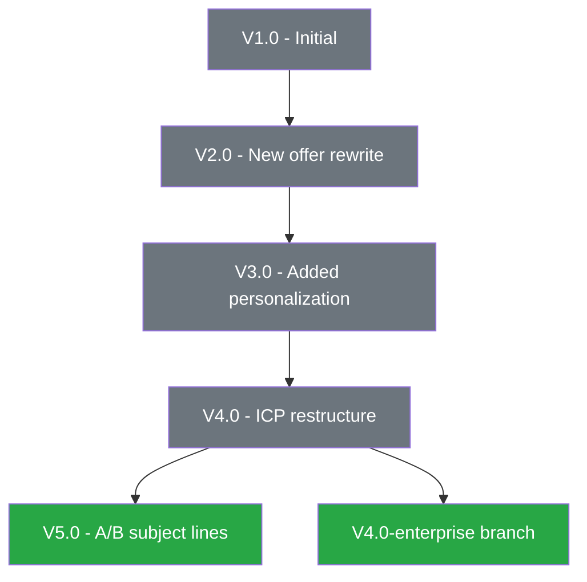

# Version Control — Tracking Every Change, Resolving Every Conflict

Version control ensures that at any moment, anyone (human or agent) can answer: "Which version is current?"
"What changed between V2 and V3?" "Can we roll back to V1?" This reference covers the complete versioning
system for all organizational assets.

---

## Table of Contents

1. [Versioning Philosophy](#versioning-philosophy)
2. [Version Numbering Scheme](#version-numbering-scheme)
3. [Version Manifest Format](#version-manifest-format)
4. [Changelog Format](#changelog-format)
5. [Promotion Workflows](#promotion-workflows)
6. [Rollback Procedures](#rollback-procedures)
7. [Branching for Documents](#branching-for-documents)
8. [Conflict Resolution Protocol](#conflict-resolution-protocol)
9. [Deprecation Cascade](#deprecation-cascade)
10. [Version Lineage Tracking](#version-lineage-tracking)
11. [Automated Version Operations](#automated-version-operations)

---

## Versioning Philosophy

Every change to a production asset gets a version number. No exceptions. "I just made a small tweak" is a
minor version increment. "I rewrote the whole thing" is a major version increment. The discipline of versioning
is what prevents "which file is the right one?" from ever being a question.

### Core Rules
1. **Every asset that leaves DRAFT status gets versioned** — V1.0 is the first production version
2. **Every change to a versioned asset increments the version** — no silent edits
3. **Version numbers never go backwards** — V3.0 cannot become V2.5
4. **Version numbers never skip** — V1.0 → V3.0 is forbidden; V1.0 → V2.0 is required
5. **The version in the filename matches the version in the metadata** — always
6. **Old versions are preserved, never overwritten** — rename old version with ARCHIVED status

---

## Version Numbering Scheme

### Format: V{MAJOR}.{MINOR}

```
V1.0  — First production release
V1.1  — Minor fix or tweak
V1.2  — Another minor fix
V2.0  — Major rewrite or structural change
V2.1  — Minor fix to V2
V3.0  — Another major revision
```

### When to Increment MAJOR (X.0)

Increment MAJOR when the change would cause someone using the old version to get a meaningfully different
result or need to change their workflow:

- Complete rewrite of content
- Structural reorganization (sections reordered, added, removed)
- Change in target audience or use case
- Change in input/output format
- Breaking change to how the asset is consumed by other systems
- Fundamental strategy or approach change

### When to Increment MINOR (X.Y)

Increment MINOR for changes that are improvements but don't break compatibility:

- Typo fixes
- Wording improvements
- Added examples or clarifications
- Bug fixes in templates or scripts
- Updated data/numbers within existing structure
- Added a section that doesn't change existing sections
- Performance optimization of a prompt

### Pre-Release Versions (V0.x)

Use V0.x for experimental assets that aren't ready for production:
- V0.1, V0.2, V0.3 — iterating before first release
- V0.x assets should have DRAFT status
- When ready for production, promote to V1.0

### Version Ceiling
There is no maximum version number. V47.3 is perfectly valid if an asset has been refined that many times.
High version numbers indicate a well-maintained, actively-improved asset — that's a good thing.

---

## Version Manifest Format

A version manifest is a structured record of all versions of a specific asset. It lives alongside the asset
or in the system registries.

### Per-Asset Version Manifest

```yaml
# version-manifest.yaml
asset_id: "gnd-cold-email-prompt"
entity: "gnd"
descriptor: "cold-email-prompt"
asset_type: "prompt"
canonical_path: "prompts/by-entity/gnd/"

current_version:
  version: "V5.0"
  status: "ACTIVE"
  filename: "gnd-cold-email-prompt-V5.0-ACTIVE.md"
  promoted_date: "2025-03-15"
  promoted_by: "Sales Agent"

versions:
  - version: "V5.0"
    status: "ACTIVE"
    date_created: "2025-03-15"
    author: "Sales Agent"
    change_summary: "New subject line framework based on A/B results"
    filename: "gnd-cold-email-prompt-V5.0-ACTIVE.md"
    
  - version: "V4.0"
    status: "ARCHIVED"
    date_created: "2025-03-01"
    date_archived: "2025-03-15"
    author: "Sales Agent"
    change_summary: "Restructured for new ICP targeting"
    filename: "gnd-cold-email-prompt-V4.0-ARCHIVED.md"
    
  - version: "V3.0"
    status: "ARCHIVED"
    date_created: "2025-02-15"
    date_archived: "2025-03-01"
    author: "Opus Agent"
    change_summary: "Added personalization variables"
    filename: "gnd-cold-email-prompt-V3.0-ARCHIVED.md"
    
  - version: "V2.0"
    status: "ARCHIVED"
    date_created: "2025-02-01"
    date_archived: "2025-02-15"
    author: "Opus Agent"
    change_summary: "Complete rewrite for new offer"
    filename: "gnd-cold-email-prompt-V2.0-ARCHIVED.md"
    
  - version: "V1.0"
    status: "ARCHIVED"
    date_created: "2025-01-15"
    date_archived: "2025-02-01"
    author: "Opus Agent"
    change_summary: "Initial creation"
    filename: "gnd-cold-email-prompt-V1.0-ARCHIVED.md"

lineage:
  parent: null
  children: []
  derived_from: null
  
dependencies:
  used_by_sops: ["outbound-sequence-sop"]
  used_by_templates: ["cold-outreach-email-template"]
  uses_prompts: []
```

---

## Changelog Format

### Master Changelog (Per Year)

Location: `system/changelogs/CHANGELOG-{YEAR}.md`

```markdown
# Changelog — 2025

All notable changes to organizational assets are documented here.
Format: [DATE] [ASSET-ID] [VERSION] — [CHANGE DESCRIPTION] — [AUTHOR]

## 2025-03-21

- [gnd-cold-email-prompt] V5.0 → V5.1 — Fixed typo in subject line variable — Sales Agent
- [gumroad-publish-sop] V2.0 → V2.1 — Added step for coupon code setup — Ops Agent
- [famli-claw-cover-kindle] V1.0 → V2.0 — Complete redesign for KDP requirements — Design Agent

## 2025-03-15

- [gnd-cold-email-prompt] V4.0 → V5.0 MAJOR — New subject line framework — Sales Agent
- [gnd-cold-email-prompt] V4.0 status: ACTIVE → ARCHIVED

## 2025-03-01

- [gnd-cold-email-prompt] V3.0 → V4.0 MAJOR — Restructured for new ICP — Sales Agent
```

### Per-Asset Changelog (Embedded in YAML Frontmatter)

```yaml
changelog:
  - version: "V5.1"
    date: "2025-03-21"
    type: "minor"
    description: "Fixed typo in subject line variable"
    author: "Sales Agent"
  - version: "V5.0"
    date: "2025-03-15"
    type: "major"
    description: "New subject line framework based on A/B results"
    author: "Sales Agent"
```

---

## Promotion Workflows

### Standard Promotion Path

```
DRAFT → ACTIVE → APPROVED → ARCHIVED
                     ↑
             DEPRECATED ──→ ARCHIVED
```

### Promotion: DRAFT → ACTIVE
- **Trigger**: Asset is considered ready for production use
- **Action**: Change status tag in filename from DRAFT to ACTIVE
- **Version**: If this is the first production version, ensure it's V1.0 (not V0.x)
- **Changelog**: Log the promotion
- **Registry**: Update source-of-truth registry

### Promotion: ACTIVE → APPROVED
- **Trigger**: Asset has been reviewed and formally approved (optional tier — not all orgs need this)
- **Action**: Change status tag from ACTIVE to APPROVED
- **Version**: No version change (approval is a status change, not a content change)
- **Changelog**: Log the approval
- **Registry**: Update source-of-truth registry

### Demotion: ACTIVE → DEPRECATED
- **Trigger**: A newer version or replacement asset supersedes this one
- **Action**: Change status tag from ACTIVE to DEPRECATED
- **Metadata**: Add `deprecated_reason` and `replaced_by` fields
- **Changelog**: Log the deprecation with pointer to replacement
- **Timeline**: DEPRECATED assets move to ARCHIVED after 30 days if no objections

### Demotion: Any → ARCHIVED
- **Trigger**: Asset is no longer in active use
- **Action**: Change status to ARCHIVED, move to `archive/` directory
- **Metadata**: Add `archived_date` and `archive_reason` fields
- **Changelog**: Log the archival

---

## Rollback Procedures

### When to Roll Back
- New version introduced a regression or error
- Stakeholder requests revert to previous version
- A/B testing shows the old version performed better

### Rollback Protocol
1. Identify the version to restore (e.g., V4.0)
2. Create a NEW version (V6.0) with the content of V4.0 — NEVER re-use old version numbers
3. Log in changelog: "V6.0 — Rollback to V4.0 content due to [reason]"
4. Update status: V6.0 becomes ACTIVE, V5.0 becomes ARCHIVED
5. Update source-of-truth registry
6. Notify dependent SOPs and templates if the rollback affects their workflows

### Why Not Just Reactivate the Old Version?
Because version numbers must always move forward. If V4.0 was archived at `2025-03-01` and V5.0 is archived at
`2025-03-21`, creating V6.0-as-rollback preserves the complete timeline. Anyone reading the changelog can see
exactly what happened and why.

---

## Branching for Documents

Sometimes two variants of an asset need to exist simultaneously (e.g., different versions for different audiences).

### Branch Naming

```
{entity}-{descriptor}-{branch-name}-V{X.Y}-{STATUS}.{ext}
```

Example:
- `gnd-cold-email-prompt-enterprise-V2.0-ACTIVE.md`
- `gnd-cold-email-prompt-smb-V2.0-ACTIVE.md`

### Branch Rules
1. Branches are named in the descriptor segment, not as a separate suffix
2. Both branches can be ACTIVE simultaneously (they serve different purposes)
3. Each branch has its own independent version numbering
4. Branches share a common ancestor in their lineage
5. If branches are merged back together, create a new non-branched version

### When to Branch vs. When to Create a New Asset
- **Branch**: Same core content, different audiences or channels
- **New Asset**: Fundamentally different content serving a different purpose

---

## Conflict Resolution Protocol

### What is a Version Conflict?
When two versions of the same asset both claim to be current, or when it's ambiguous which version should be used.

### Detection
Conflicts are detected during:
- Maintenance audits (multiple ACTIVE versions of same asset)
- Agent requests ("Which email template should I use?" when two exist)
- Cross-reference checks (SOP references V3 but V5 is current)

### Resolution Steps
1. **Identify all conflicting versions** — list them with dates, authors, and locations
2. **Determine authority** — check the source-of-truth registry for declared canonical version
3. **If registry is current**: Registry wins. Archive the non-canonical version.
4. **If registry is outdated**: Compare the conflicting versions:
   a. Most recently modified by an authorized agent wins
   b. If same date, the version created by the agent with domain authority wins
   c. If still ambiguous, escalate to human decision
5. **Merge if needed**: If both versions contain valuable changes, create a new version incorporating both
6. **Update registry**: Ensure source-of-truth registry reflects the resolution
7. **Log the conflict**: Record in lessons-learned with details of how and why it happened

---

## Deprecation Cascade

When a core asset is deprecated, everything that depends on it must be reviewed.

### Cascade Process
1. Identify the deprecated asset
2. Query the knowledge graph for all dependents (SOPs that use this prompt, templates that reference this asset)
3. For each dependent:
   a. Does it reference the deprecated asset by name/version?
   b. Does it still work without the deprecated asset?
   c. Does it need to be updated to reference the replacement?
4. Update all dependents or flag them for update
5. Log the cascade in the changelog

### Example Cascade
```
DEPRECATED: gnd-cold-email-prompt-V4.0
  ├── AFFECTS: outbound-sequence-sop-V1.0 (references V4 prompt) → UPDATE to reference V5
  ├── AFFECTS: cold-outreach-email-template-V2.0 (includes V4 content) → REVIEW needed
  └── AFFECTS: weekly-report-template-V1.0 (lists V4 as active prompt) → UPDATE registry
```

---

## Version Lineage Tracking

### What is Lineage?
The history of how an asset evolved: what it was derived from, what was derived from it, and what it supersedes.

### Lineage Metadata

```yaml
lineage:
  parent_asset: "gnd-cold-email-prompt-V4.0"     # Direct predecessor
  derived_from: "competitor-analysis-email-2025"   # Inspiration source (if any)
  supersedes: "gnd-cold-email-prompt-V4.0"         # What this replaces
  children: []                                      # Assets derived from this
  fork_of: null                                     # If this is a branch/fork
  merged_from: []                                   # If this merged multiple sources
```

### Lineage Visualization
Generate a Mermaid diagram showing version lineage:



---

## Automated Version Operations

### Auto-Version on Save
When an agent saves changes to an existing asset:
1. Detect whether changes are major or minor (content diff analysis)
2. Increment version accordingly
3. Rename file with new version
4. Archive previous version
5. Update changelog
6. Update source-of-truth registry

### Version Diff Report
When comparing two versions:

```markdown
## Version Diff: gnd-cold-email-prompt V4.0 → V5.0

### Summary
- Type: MAJOR version change
- Lines changed: 47 of 120 (39%)
- Sections added: 1 (new subject line framework)
- Sections removed: 0
- Sections modified: 3

### Key Changes
1. Subject line approach changed from curiosity-based to pain-point-based
2. Opening paragraph rewritten for enterprise audience
3. CTA changed from link click to calendar booking
4. Added new P.S. section with social proof

### Impact Assessment
- SOPs affected: 1 (outbound-sequence-sop)
- Templates affected: 1 (cold-outreach-email-template)
- Downstream updates needed: YES
```

### Stale Version Detection
During maintenance, flag assets where:
- The ACTIVE version is more than 90 days old without review
- The ACTIVE version has been superseded but not formally deprecated
- Multiple DRAFT versions exist without any reaching ACTIVE
- A version is referenced by other assets but has been ARCHIVED
