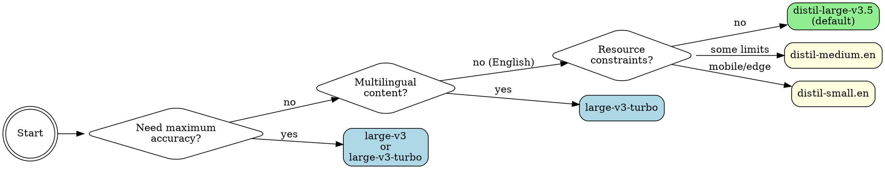

# 🎙️ Super-Transcribe — Unified Speech-to-Text

A self-contained transcription skill with two bundled backends that intelligently routes based on task requirements:

- **🦜 Parakeet** (NVIDIA NeMo) — best accuracy (6.34% WER), ~3380× realtime, auto-punctuation, 25 European languages, NeMo diarization
- **🗣️ faster-whisper** (CTranslate2) — translation, 99+ languages, initial prompting, advanced inference tuning

**Lazy loading:** each backend sets up its own venv on first use. No pre-configuration needed — just transcribe and the right backend installs itself.

## ⚡ First-Time Setup

Follow these 3 steps on first use. Goal: install **only** what this user's hardware needs — nothing extra.

### Step 1 — Check readiness (instant, no downloads)

```bash
./scripts/transcribe --check --json
```

| `action` result    | What to do                                            |
| ------------------ | ----------------------------------------------------- |
| `"ready"`          | Skip setup — already installed. Go straight to usage. |
| `"install_python"` | Tell user to install Python 3.10+ first, then re-run  |
| `"run_quickstart"` | Continue to Step 2                                    |

Key fields: `gpu` (name + VRAM), `ffmpeg`, `backends` status, `estimated_install` (download size for recommended backend), `missing_optional` (non-blocking items — **do NOT eagerly install these**).

### Step 2 — Preview the install (no downloads)

```bash
./scripts/transcribe --quickstart --dry-run --json
```

**Tell the user what will be downloaded before proceeding.** Relay from the `estimated` field:

- Which backend and why it was chosen
- Total download size (setup + model on first use)

Example message: _"Your system has an NVIDIA GPU, so I'd install the Parakeet backend for best accuracy. That's ~5GB for setup plus ~1.2GB for the model on first use (~6.2GB total). OK to proceed?"_

For GPU systems where the user wants a smaller install, see **Lean Install Option** below.

### Step 3 — Install (after user confirms)

```bash
./scripts/transcribe --quickstart --json
```

`ok: true` → backend installed. First transcription downloads model weights (~1-2 GB, cached permanently).
`ok: false` → check `errors` array for what failed.

### What Gets Installed

**Quickstart installs exactly ONE backend** — the best for detected hardware:

| Hardware    | Backend installed | Setup download                    | Model (first use) | Total   |
| ----------- | ----------------- | --------------------------------- | ----------------- | ------- |
| NVIDIA GPU  | Parakeet (NeMo)   | ~5 GB (PyTorch + CUDA + NeMo)     | ~1.2 GB           | ~6.2 GB |
| CPU / macOS | faster-whisper    | ~300 MB (CTranslate2, no PyTorch) | ~756 MB           | ~1 GB   |

**NOT installed by quickstart** (deferred until actually needed):

- **Second backend** — auto-installs only when the user triggers a feature that needs it (`--translate` or non-EU language → faster-whisper; `--fast`/`--multitalker` → Parakeet)
- **System deps** — install separately **only if the user needs them**:
  - `ffmpeg` — only for non-WAV input (mp3/m4a/mp4/ogg). Install: `sudo apt install ffmpeg`
  - `yt-dlp` — only for YouTube/URL downloads. Install: `pipx install yt-dlp`
  - HuggingFace token — only for `--diarize` with faster-whisper. Setup: `huggingface-cli login`
- **PyTorch for faster-whisper** — deferred until `--diarize` is first used (saves ~2.8 GB on initial install)

**Do NOT pre-install optional deps.** Wait until the user actually needs a feature — the script auto-installs or clearly reports what's missing at that point.

### Lean Install Option

If a GPU user wants a smaller download (~1 GB instead of ~6.2 GB):

```bash
./scripts/transcribe --setup faster-whisper
```

Trade-off: ~20× realtime speed (vs ~3380× with Parakeet), no built-in punctuation. Only offer this if the user explicitly asks for a minimal install or has limited bandwidth/disk.

> Supplementary info: see **Setup Details** further down.

---

> **✅ Setup done.** Everything below is usage reference — read on demand.

---

## When to Use

Use this skill for **any speech-to-text task**. It replaces both the `faster-whisper` and `parakeet` skills as your single entry point.

**Trigger phrases:**
"transcribe this", "speech to text", "what did they say", "make a transcript",
"subtitle this video", "who's speaking", "translate this audio", "transcribe this podcast",
"transcribe with parakeet", "transcribe with whisper", "best accuracy transcription",
"transcribe in French", "diarize this meeting", "find where X is mentioned",
"audio to text", "translate to English", "search transcript for", "when did they say",
"at what timestamp", "add chapters", "detect chapters", "find breaks in the audio",
"table of contents for this recording", "TTML subtitles", "DFXP subtitles",
"broadcast format subtitles", "Netflix format", "ASS subtitles", "aegisub format",
"LRC subtitles", "timed lyrics", "karaoke subtitles", "HTML transcript",
"confidence-colored transcript", "separate audio per speaker", "export speaker audio",
"transcript as CSV", "spreadsheet output", "podcast RSS feed", "per-file language",
"remove filler words", "clean up ums and uhs", "transcribe left channel",
"wrap subtitle lines", "character limit per line", "detect paragraphs"

## Auto-Routing Logic

The router picks the backend automatically:

```
┌─────────────────────────────────────────────┐
│             --backend specified?             │
│         YES → use that backend              │
│         NO  ↓                               │
├─────────────────────────────────────────────┤
│     --fast or --multitalker?                │
│         YES → parakeet                      │
│         NO  ↓                               │
├─────────────────────────────────────────────┤
│     Needs faster-whisper-only feature?      │
│  (translate, initial-prompt, hotwords,      │
│   multilingual, non-EU language, advanced   │
│   inference tuning params)                  │
│         YES → faster-whisper                │
│         NO  ↓                               │
├─────────────────────────────────────────────┤
│      Needs parakeet-only feature?           │
│  (--long-form, --streaming, --no-align)     │
│         YES → parakeet                      │
│         NO  ↓                               │
├─────────────────────────────────────────────┤
│  Default: prefer Parakeet (best accuracy    │
│  + speed + auto-punctuation)                │
│  Fall back to faster-whisper if Parakeet    │
│  not installed                              │
└─────────────────────────────────────────────┘
```

## Quick Reference

### Basic (Auto-Routes to Best Available)

| Task                     | Command                                                                |
| ------------------------ | ---------------------------------------------------------------------- |
| **Basic transcription**  | `./scripts/transcribe audio.mp3`                                       |
| **SRT subtitles**        | `./scripts/transcribe audio.mp3 --format srt -o subs.srt`              |
| **VTT subtitles**        | `./scripts/transcribe audio.mp3 --format vtt -o subs.vtt`              |
| **ASS subtitles**        | `./scripts/transcribe audio.mp3 --format ass -o subs.ass`              |
| **LRC lyrics**           | `./scripts/transcribe audio.mp3 --format lrc -o lyrics.lrc`            |
| **TTML broadcast**       | `./scripts/transcribe audio.mp3 --format ttml -o subs.ttml`            |
| **CSV spreadsheet**      | `./scripts/transcribe audio.mp3 --format csv -o out.csv`               |
| **JSON output**          | `./scripts/transcribe audio.mp3 --format json -o out.json`             |
| **YouTube/URL**          | `./scripts/transcribe https://youtube.com/watch?v=...`                 |
| **Batch process**        | `./scripts/transcribe *.mp3 -o ./transcripts/`                         |
| **Force backend**        | `./scripts/transcribe --backend parakeet audio.mp3`                    |
| **List backends**        | `./scripts/transcribe --backends`                                      |
| **Show version**         | `./scripts/transcribe --version`                                       |
| **Probe metadata**       | `./scripts/transcribe --probe audio.mp3`                               |
| **Fast mode (110M)**     | `./scripts/transcribe --fast audio.mp3`                                |
| **Multitalker**          | `./scripts/transcribe --multitalker meeting.wav`                       |
| **Resume batch**         | `./scripts/transcribe *.mp3 --resume progress.json -o ./out/`          |
| **Exact model**          | `./scripts/transcribe -m nvidia/parakeet-tdt-1.1b audio.wav`           |
| **Model alias**          | `./scripts/transcribe --backend pk -m 1.1b audio.wav`                  |
| **Speaker diarization**  | `./scripts/transcribe meeting.wav --diarize`                           |
| **Search transcript**    | `./scripts/transcribe audio.mp3 --search "keyword"`                    |
| **Detect chapters**      | `./scripts/transcribe audio.mp3 --detect-chapters`                     |
| **Clean filler words**   | `./scripts/transcribe audio.mp3 --clean-filler`                        |
| **Denoise audio**        | `./scripts/transcribe audio.mp3 --denoise`                             |
| **Podcast RSS feed**     | `./scripts/transcribe --rss https://feed.url`                          |
| **Burn subtitles**       | `./scripts/transcribe video.mp4 --burn-in out.mp4`                     |
| **Name speakers**        | `./scripts/transcribe audio.mp3 --diarize --speaker-names "Alice,Bob"` |
| **Export speaker audio** | `./scripts/transcribe audio.mp3 --diarize --export-speakers ./spk/`    |

### Routes to Faster-Whisper Automatically

| Task                      | Command                                                                                           | Why                                                                      |
| ------------------------- | ------------------------------------------------------------------------------------------------- | ------------------------------------------------------------------------ |
| **Translate → English**   | `./scripts/transcribe audio.mp3 --translate`                                                      | Whisper-specific feature                                                 |
| **Canary translation**    | `./scripts/transcribe audio.mp3 --backend parakeet --translate --source-lang fr --target-lang de` | NeMo Canary (EN/FR/DE/ES bidirectional)                                  |
| **Domain jargon**         | `./scripts/transcribe audio.mp3 --initial-prompt "Kubernetes"`                                    | Whisper-specific prompting                                               |
| **Non-European language** | `./scripts/transcribe audio.mp3 -l ja`                                                            | Parakeet: 25 EU langs only                                               |
| **Multilingual mode**     | `./scripts/transcribe audio.mp3 --multilingual`                                                   | Whisper-specific feature                                                 |
| **Hotwords boost**        | `./scripts/transcribe audio.mp3 --hotwords 'JIRA Kubernetes'`                                     | Whisper-specific feature                                                 |
| **Prefix conditioning**   | `./scripts/transcribe audio.mp3 --prefix 'Good morning,'`                                         | Whisper-specific feature                                                 |
| **Clip time range**       | `./scripts/transcribe audio.mp3 --clip-timestamps "30,60"`                                        | Whisper-specific feature                                                 |
| **Detect language only**  | `./scripts/transcribe audio.mp3 --detect-language-only`                                           | Routes to fw by default; use `--backend parakeet` for Parakeet detection |
| **Parallel batch**        | `./scripts/transcribe *.mp3 --parallel 4 -o ./out/`                                               | Whisper-specific feature                                                 |

### Routes to Parakeet Automatically

| Task                           | Command                                                                                           | Why                                                         |
| ------------------------------ | ------------------------------------------------------------------------------------------------- | ----------------------------------------------------------- |
| **Long audio (>24 min)**       | `./scripts/transcribe lecture.wav --long-form`                                                    | Parakeet-only: local attention mode                         |
| **Streaming output**           | `./scripts/transcribe audio.wav --streaming`                                                      | Parakeet-only: chunked inference                            |
| **Fast / low VRAM (110M)**     | `./scripts/transcribe --fast audio.mp3`                                                           | Parakeet 110M model (~2GB VRAM)                             |
| **Multitalker / overlap**      | `./scripts/transcribe --multitalker meeting.wav`                                                  | Sortformer + multitalker pipeline                           |
| **Skip alignment**             | `./scripts/transcribe audio.wav --no-align`                                                       | Parakeet-only: faster, less precise                         |
| **Canary translation**         | `./scripts/transcribe --backend parakeet --translate --source-lang fr --target-lang de audio.wav` | Parakeet-only: Canary bidirectional EU translation          |
| **Detect language (Parakeet)** | `./scripts/transcribe --backend parakeet --detect-language-only audio.wav`                        | Parakeet language detection (requires `--backend parakeet`) |
| **Danish transcription**       | `./scripts/transcribe -l da audio.wav`                                                            | Auto-selects dedicated Danish model                         |

## ⚠️ Agent Guidance — Keep Invocations Minimal

**CORE RULE:** The default command (`./scripts/transcribe audio.mp3`) is the fastest path. Add flags only when the user explicitly asks for that capability. The router handles backend selection automatically.

**⚠️ Model preference:** When the router selects faster-whisper, it uses `distil-large-v3.5` by default — this is the preferred model (fastest, better accuracy than large-v3-turbo). Don't override unless the user asks.

### Probe Mode (`--probe`)

Use `--probe` to check audio metadata before deciding whether to transcribe:

```bash
./scripts/transcribe --probe audio.mp3
# → {"file": "audio.mp3", "path": "/tmp/audio.mp3", "duration": 2714.5, "duration_human": "45m 14s", "format": "mp3", "channels": 2, "sample_rate": 44100, "bitrate": 128000, "size_mb": 43.2}
```

- Returns **compact JSON** with duration, format, channels, sample rate, bitrate, and file size
- No transcription — runs in milliseconds using ffprobe
- Use to implement the "ask before transcribing long files" flow:
  - Probe → duration > 10 min → ask user "This is 45 minutes, want me to transcribe?"
  - Probe → duration < 2 min → transcribe immediately
- Works with multiple files: `./scripts/transcribe --probe *.mp3`

### Agent Output Mode (`--agent`)

Use `--agent` for structured output the agent can parse directly:

```bash
./scripts/transcribe --agent audio.ogg
# → {"text": "Hello world", "duration": 4.2, "language": "en", "language_probability": 0.98, "processing_time": 0.8, "backend": "faster-whisper", "segments": 1, "speakers": null, "word_count": 2, "avg_confidence": 0.94, "file_path": "/tmp/audio.ogg"}
```

- Emits a **single compact JSON line** to stdout — no stderr noise (implies `--quiet`)
- Core fields: `text`, `duration`, `language`, `language_probability`, `processing_time`, `backend`, `segments` (count), `speakers` (list or null), `word_count`
- Agent-specific fields:
  - `avg_confidence` (0.0–1.0) — average word/segment confidence; use to gauge transcript reliability. Present for faster-whisper (from `avg_logprob`); absent for Parakeet (NeMo doesn't expose confidence scores)
  - `file_path` — absolute path of input file (for multi-file tracking)
  - `output_path` — absolute path of written output file (when `-o` is used)
  - `summary_hint` — `{"first": "...", "last": "..."}` for long transcripts (>400 chars); gives the agent a quick preview without reading the full text
- Combine with `-o` to also save full transcript to file: `./scripts/transcribe --agent -o /tmp/transcript.txt audio.mp3`
- Use for quick voice message transcription where the agent just needs the text and metadata

### Exit Codes

Standardized exit codes for agent error handling:

| Code | Meaning                                  | Agent response                                       |
| ---- | ---------------------------------------- | ---------------------------------------------------- |
| 0    | Success                                  | Normal reply                                         |
| 1    | General error                            | "Transcription failed"                               |
| 2    | Missing dependency                       | "Backend not set up yet — need to run setup"         |
| 3    | Bad input (file not found, invalid args) | "Couldn't process that audio file"                   |
| 4    | GPU/VRAM error (OOM)                     | "GPU ran out of memory — try a smaller model or CPU" |

### Chat Media Handling (OpenClaw Agents)

OpenClaw downloads media and provides local file paths in the message context (e.g. `<media:voice path="/path/to/audio.ogg">` or `<media:audio path="/path/to/file.mp3">`).

**⚠️ Do NOT auto-transcribe every voice message.** Determine intent first:

#### When to Transcribe Immediately (No Confirmation Needed)

- User **explicitly asks** for transcription: "transcribe this", "what does this say", "make subtitles for this"
- User sends an **audio/video file** (not a voice note) with a transcription request
- User sends media **in an ongoing transcription conversation** (context makes intent clear)

#### When to Ask First

- User sends a **voice message with no context** — they're probably talking _to_ you, not asking for a transcript. Respond to the content of their message instead, or ask: "Want me to transcribe this, or were you telling me something?"
- User sends a **long audio/video file** (>10 min) without explicit instructions — confirm before committing to a long transcription
- User forwards audio from someone else without comment — unclear if they want transcription or something else

#### Technical Notes

- Voice messages (.ogg opus) are auto-converted by ffmpeg — no special handling needed
- Video files work too — ffmpeg extracts the audio track automatically
- Use `-q` (quiet) for short voice messages to suppress stderr progress noise

#### Example Flows

**User wants transcription:**

```
User: Can you transcribe this? [sends audio file]
Agent: Transcribing now...
Agent: [runs ./scripts/transcribe -q /path/to/audio.mp3]
Agent: Here's the transcript: "..."
```

**User is talking to the agent via voice:**

```
User: [sends voice message saying "Hey, what's on my calendar today?"]
Agent: [transcribes silently to understand the request]
Agent: [responds to the calendar question, does NOT parrot back the transcript]
```

**Ambiguous intent (use --probe to check duration first):**

```
User: [sends 45-minute meeting recording, no comment]
Agent: [runs ./scripts/transcribe --probe /path/to/recording.mp3]
Agent: Got a 45-minute recording. Want me to transcribe it? I can also do speaker identification or subtitles if you need those.
```

### Output Length Management for Chat

Transcripts can be very long. Follow these rules to avoid flooding the chat:

- **Short audio (<2 min, <~2000 chars):** Reply directly with the full transcript text
- **Medium audio (2-10 min):** Reply with full text; if it exceeds ~3000 chars, consider saving to file and offering a summary
- **Long audio (>10 min):** Always save to a file (`-o /tmp/transcript.txt`), share the file path, and provide a brief summary of the content
- **Subtitle/data formats** (SRT, VTT, ASS, CSV, JSON, etc.): Always save to file with `-o`, tell the user the path
- **Search results** (`--search`): Show directly — they're already concise
- **Language detection** (`--detect-language-only`): Show directly — single line output

When in doubt, save to file and summarize. Users can always ask for the full text.

**Do NOT add flags unless explicitly requested:**

- `--backend` — unless the user specifically requests a backend
- `--diarize` — unless the user asks "who said what" / "identify speakers"
- `--translate` — unless the user wants audio translated to English
- `--format srt/vtt/ass/etc.` — unless the user asks for subtitles in that format
- `--long-form` — unless the audio is confirmed >24 minutes
- `--denoise`/`--normalize` — unless the user mentions bad audio quality
- `--initial-prompt` — unless there's domain-specific jargon to prime
- `--search` — unless the user asks to find/locate a word in audio
- `--detect-chapters` — unless the user asks for chapters/sections
- `--clean-filler` — unless the user asks to remove filler words
- `--word-timestamps` — unless the user needs word-level timing
- `--stream` / `--streaming` — unless the user wants live/progressive output
- `--clip-timestamps` — unless the user wants a specific time range
- `--temperature 0.0` — unless the model is hallucinating on music/silence
- `--vad-threshold` — unless VAD is aggressively cutting speech or including noise
- `--min-speakers`/`--max-speakers` — unless you know the speaker count
- `--hf-token` — unless the token is not cached at `~/.cache/huggingface/token`
- `--max-words-per-line` / `--max-chars-per-line` — unless the user asks for subtitle wrapping
- `--filter-hallucinations` — unless the transcript contains obvious artifacts
- `--merge-sentences` — unless the user asks for sentence-level subtitle cues
- `--channel left|right` — unless the user mentions stereo tracks
- `--detect-paragraphs` — unless the user asks for paragraph breaks
- `--speaker-names` — unless the user provides real names (always requires `--diarize`)
- `--hotwords` — unless the user names specific rare terms
- `--prefix` — unless the user knows the exact words the audio starts with
- `--detect-language-only` — unless the user only wants language ID
- `--stats-file` — unless the user asks for performance stats
- `--parallel N` — only for large CPU batch jobs
- `--retries N` — only for unreliable inputs (URLs, network files)
- `--burn-in` — only when user explicitly asks to embed subtitles into video
- `--keep-temp` — only when the user may re-process the same URL
- `--output-template` — only when user specifies a custom naming pattern
- `--timestamps` (parakeet) — unless the user asks for word-level timestamps
- `--fast` — unless the user explicitly wants speed over accuracy or mentions low VRAM
- `--multitalker` — unless the user mentions overlapping speech or asks for better multi-speaker handling
- `--resume <path>` — unless the user is resuming a batch job that crashed/was interrupted
- `--no-align` — unless the user wants faster processing and doesn't need precise word timestamps
- `--multitalker-diar-model` / `--multitalker-asr-model` — only when user provides specific model names
- Multi-format (`--format srt,text`) — only when user explicitly wants multiple formats; always pair with `-o <dir>`
- `--agent` — use when you need structured JSON for parsing (e.g. silent transcription of voice messages to understand user intent); don't use when the user explicitly asked for a transcript (just show them the text directly)
- `--probe` — use to check duration before transcribing ambiguous long files; don't probe short voice messages (just transcribe them directly)

**Overhead notes:**

- Any word-level feature (faster-whisper) auto-runs wav2vec2 alignment (~5-10s overhead)
- `--diarize` adds ~20-30s on top

**Search guidance:**

- `--search` **replaces** the normal transcript output — it prints only matching segments with timestamps
- Add `--search-fuzzy` only when the user mentions approximate/partial matching
- To save search results to a file, use `-o results.txt`

**Chapter detection guidance:**

- Default `--chapter-gap 8` (8-second silence = new chapter) works for most content; tune down for dense content
- `--chapter-format youtube` (default) outputs YouTube-ready timestamps; use `json` for programmatic use
- **Always use `--chapters-file PATH`** when combining chapters with a transcript output
- **Batch mode limitation:** `--chapters-file` takes a single path — in batch mode, each file's chapters overwrite the previous

**Speaker audio export guidance:**

- Always pair `--export-speakers` with `--diarize`
- Requires ffmpeg; outputs `SPEAKER_1.wav`, `SPEAKER_2.wav`, etc. (or real names if `--speaker-names` is set)

**Language map guidance:**

- Only use `--language-map` in batch mode when the user has confirmed different languages across files
- Inline format: `"interview*.mp3=en,lecture*.mp3=fr"` — fnmatch globs on filename
- JSON file format: `@/path/to/map.json`

**RSS / Podcast guidance:**

- Default fetches 5 newest episodes; `--rss-latest 0` for all; `--skip-existing` to resume safely
- **Always use `-o <dir>`** with `--rss` — without it, all episode transcripts print to stdout concatenated

**Output format for agent relay:**

- **Text transcript** → show directly to user (summarise long ones)
- **Subtitle formats** (SRT, VTT, ASS, LRC, TTML) → write to `-o` file, tell user the path
- **Data formats** (CSV, TSV, JSON, HTML) → write to `-o` file, tell user the path
- **Search results** → show directly (human-readable)
- **Chapter output** → show directly or write to `--chapters-file`
- **Stats output** (`--stats-file`) → summarise key fields for the user
- **Language detection** (`--detect-language-only`) → print directly; it's a single line
- **Multi-format** (`--format srt,text`) → requires `-o <dir>`; tell user all paths written

**Don't use this skill when:**

- User wants **text-to-speech** (use the `tts` tool instead)
- User wants **audio editing** or music generation
- User wants to **summarize** a YouTube video without needing a raw transcript (use `summarize` skill)

## Backend Comparison

| Feature                 | 🦜 Parakeet                 | 🗣️ faster-whisper            |
| ----------------------- | --------------------------- | ---------------------------- |
| **Accuracy**            | ✅ Best (6.34% avg WER)     | Good (distil: 7.08% WER)     |
| **Speed**               | ✅ ~3380× realtime          | ~20× realtime                |
| **Auto punctuation**    | ✅ Built-in                 | ❌ Requires post-processing  |
| **Languages**           | 25 European                 | ✅ 99+ worldwide             |
| **Diarization**         | ✅ NeMo ClusteringDiarizer  | ✅ pyannote speaker ID       |
| **Translation**         | ✅ Canary: EN/FR/DE/ES      | ✅ Any → English             |
| **Language detection**  | ✅ Auto-detect + output     | ✅ --detect-language-only    |
| **Chapters/search**     | ✅ Shared                   | ✅ Shared                    |
| **Output formats**      | ✅ All 10 formats           | ✅ All 10 formats            |
| **Audio preprocessing** | ✅ --denoise, --normalize   | ✅ --denoise, --normalize    |
| **Filler removal**      | ✅ --clean-filler           | ✅ --clean-filler            |
| **Long audio**          | ✅ Up to 3 hours            | Limited by VRAM              |
| **Streaming**           | ✅ Chunked inference        | ✅ Segment streaming         |
| **RSS/podcast**         | ✅ --rss                    | ✅ --rss                     |
| **VRAM usage**          | ~2GB                        | ~1.5GB (distil)              |
| **Burn-in subtitles**   | ✅ --burn-in                | ✅ --burn-in                 |
| **Initial prompt**      | ❌                          | ✅ Domain jargon priming     |
| **Word timestamps**     | ✅ NeMo + wav2vec2 aligned  | ✅ wav2vec2 aligned (~10ms)  |
| **Custom models**       | ✅ Any NeMo / HuggingFace   | ✅ CTranslate2 / HuggingFace |
| **Multitalker**         | ✅ Sortformer + per-speaker | ❌                           |
| **Fast/small model**    | ✅ 110M (--fast)            | ✅ distil-small.en (166M)    |
| **Batch resume**        | ✅ --resume                 | ✅ --resume                  |
| **Noise handling**      | Good (built-in robustness)  | ✅ --denoise, --normalize    |

## Setup Details

> For first-time setup, see **⚡ First-Time Setup** at the top. This section is supplementary reference.

### What Gets Installed (and What Doesn't)

Quickstart installs **one backend** — the best for the user's hardware. The second backend auto-installs later only if a feature needs it. Heavy optional deps are deferred until first use.

| Hardware    | Backend        | Setup download            | Model (first use) | What triggers more downloads                                         |
| ----------- | -------------- | ------------------------- | ----------------- | -------------------------------------------------------------------- |
| NVIDIA GPU  | Parakeet       | ~5 GB (PyTorch+CUDA+NeMo) | ~1.2 GB           | `--translate` or non-EU language → faster-whisper                    |
| CPU / macOS | faster-whisper | ~300 MB (CTranslate2)     | ~756 MB           | `--diarize` → PyTorch (~2.8 GB); `--fast`/`--multitalker` → Parakeet |

**Why the size difference?** Parakeet needs PyTorch+CUDA upfront (~5 GB, NeMo depends on it). faster-whisper uses CTranslate2 directly — PyTorch is only pulled in for diarization/alignment features.

**Parakeet uses `nemo_toolkit[asr-only]`** — this skips ~19 training-only packages (wandb, transformers, datasets, lightning, pandas, peft, etc.) saving ~400 MB vs `[asr]`.

### Optional Extras (Not Needed for Basic Transcription)

| Feature                              | Install                                                                                  | Auto-installs?                                                             |
| ------------------------------------ | ---------------------------------------------------------------------------------------- | -------------------------------------------------------------------------- |
| Non-WAV audio (mp3/m4a/mp4)          | `sudo apt install ffmpeg` (Linux) · `brew install ffmpeg` (macOS)                        | No — quickstart reports if missing                                         |
| YouTube/URL downloads                | `pipx install yt-dlp`                                                                    | No                                                                         |
| Speaker diarization (faster-whisper) | `huggingface-cli login` + [accept model](https://hf.co/pyannote/speaker-diarization-3.1) | Partial (PyTorch auto-installs; token + model agreement manual)            |
| Both backends                        | `--quickstart --all --json`                                                              | Yes (second backend auto-installs on first use of a feature that needs it) |

### Manual Backend Setup

```bash
./scripts/transcribe --check              # Status check (human-readable)
./scripts/transcribe --check --json       # Status check (agent-parseable)
./scripts/transcribe --setup parakeet     # Best accuracy/speed (needs GPU)
./scripts/transcribe --setup faster-whisper  # Translation, 99+ languages, CPU-compatible
./scripts/transcribe --setup all --diarize   # Full install with diarization
```

### Hard Requirements & Install Strategy

**Hard requirements:** Python 3.10+ only. Everything else is installed by `--quickstart` or auto-installs on first use.

**Lean install strategy:**

- **faster-whisper**: ~300 MB base (CTranslate2, no PyTorch). PyTorch (~2.8 GB) deferred until `--diarize`.
- **Parakeet**: ~5 GB base (NeMo + PyTorch CUDA). Uses `nemo_toolkit[asr-only]` — skips training-only packages.
- **System deps**: `--quickstart` does NOT auto-install system packages (ffmpeg, yt-dlp). It reports them as missing; install them separately if needed.

**Auto-install behavior:** Backends lazy-load on first use. Optional deps (like pyannote for diarization) auto-install when you use the feature that needs them. In `--agent` mode, setup emits structured JSON status to stderr.

### Platform Support

| Platform               | Acceleration | Speed                               |
| ---------------------- | ------------ | ----------------------------------- |
| **Linux + NVIDIA GPU** | CUDA         | Parakeet ~3380× RT, Whisper ~20× RT |
| **WSL2 + NVIDIA GPU**  | CUDA         | Parakeet ~3380× RT, Whisper ~20× RT |
| macOS Apple Silicon    | CPU          | Whisper ~3-5× RT (Parakeet limited) |
| macOS Intel            | CPU          | Whisper ~1-2× RT                    |
| Linux (no GPU)         | CPU          | ~1× RT                              |

### GPU Troubleshooting

If setup didn't detect your GPU, manually install PyTorch with CUDA:

```bash
# For CUDA 12.x (in the backend's venv)
uv pip install --python .venv/bin/python torch --index-url https://download.pytorch.org/whl/cu121
```

**WSL2 users**: Ensure you have the [NVIDIA CUDA drivers for WSL](https://docs.nvidia.com/cuda/wsl-user-guide/) installed on the Windows side.

## Options

### Super-Transcribe Routing Options

```
--quickstart         One-command setup: install best backend for hardware (lean)
--quickstart --all   Install both backends (Parakeet + faster-whisper)
--quickstart --json  Same, structured JSON output for agent parsing
--quickstart --dry-run --json  Preview what would be installed with estimated sizes
--check              Check prerequisites + backend status (exit 0=ready, 2=not ready)
--check --json       Same check, compact JSON with estimated install sizes
--backend <name>     Force a backend: faster-whisper | parakeet | fw | pk
--backends           List available/installed backends and exit
--probe              Quick audio metadata (duration, format, channels) — no transcription
--setup <backend>    Pre-install a backend: faster-whisper | parakeet | all
--help-routing       Show detailed auto-routing logic
--fast               Use small 110M Parakeet model (quick, lower accuracy)
--multitalker        Multi-speaker pipeline with overlapped speech handling
--resume <path>      Resume batch processing from checkpoint file
--version            Show super-transcribe + backend versions
```

### Shared Options (Work with Both Backends)

```
AUDIO                 Audio file(s), directory, glob, or URL
-f, --format FMT      text | json | srt | vtt | ass | lrc | ttml | csv | tsv | html
-o, --output PATH     Output file or directory
-m, --model NAME      Model name (backend-specific)
-l, --language CODE   Language code
--max-words-per-line  Subtitle word wrapping
--max-chars-per-line  Subtitle character wrapping
--batch-size N        Inference batch size
--skip-existing       Skip already-transcribed files
--resume PATH         Resume batch from checkpoint file (skips completed files)
--device DEV          auto | cpu | cuda
-q, --quiet           Suppress progress messages
--version             Print version info
--diarize             Speaker diarization
--min-speakers N      Min speakers hint for diarization
--max-speakers N      Max speakers hint for diarization
--speaker-names LIST  Replace SPEAKER_1, SPEAKER_2 with names
--export-speakers DIR Export each speaker's audio to WAV files
--search TERM         Search transcript for TERM
--search-fuzzy        Fuzzy/approximate search matching
--detect-chapters     Detect chapter breaks from silence gaps
--chapter-gap SEC     Min silence gap for chapter break (default: 8.0)
--chapters-file PATH  Write chapter markers to file
--chapter-format FMT  youtube | text | json (default: youtube)
--clean-filler        Remove hesitation fillers (um, uh, etc.)
--filter-hallucinations  Filter common hallucination patterns
--merge-sentences     Merge segments into sentence chunks
--detect-paragraphs   Insert paragraph breaks based on gaps
--paragraph-gap SEC   Min gap for paragraph break (default: 3.0)
--normalize           EBU R128 volume normalization
--denoise             High-pass + FFT noise reduction
--channel CH          left | right | mix (default: mix)
--burn-in OUTPUT      Burn subtitles into video file
--rss URL             Podcast RSS feed to transcribe
--rss-latest N        Latest N episodes from RSS (default: 5)
--stats-file PATH     Write performance stats JSON sidecar
```

### Faster-Whisper Only Options

```
Model & Language:
  --revision REV        Model revision (git branch/tag/commit) to pin a specific version
  --initial-prompt TEXT  Prompt to condition the model (terminology, formatting style)
  --prefix TEXT         Prefix to condition the first segment (e.g. known starting words)
  --hotwords WORDS      Space-separated hotwords to boost recognition
  --translate           Translate any language to English (instead of transcribing)
  --multilingual        Enable multilingual/code-switching mode
  --hf-token TOKEN      HuggingFace token for private/gated models and diarization
  --model-dir PATH      Custom model cache directory (default: ~/.cache/huggingface/)

Output:
  --word-timestamps     Include word-level timestamps (wav2vec2 aligned automatically)
  --stream              Output segments as they are transcribed (disables diarize/alignment)
  --output-template TPL Batch output filename template ({stem}, {lang}, {ext}, {model})

Inference Tuning:
  --beam-size N         Beam search size; higher = more accurate but slower (default: 5)
  --temperature T       Sampling temperature or comma-separated fallback list
  --no-speech-threshold PROB  Mark segments as silence (default: 0.6)
  --no-vad              Disable voice activity detection
  --vad-threshold T     VAD speech probability threshold (default: 0.5)
  --vad-neg-threshold T VAD negative threshold for ending speech
  --min-speech-duration MS  Minimum speech segment duration in ms
  --max-speech-duration SEC Maximum speech segment duration
  --min-silence-duration MS Minimum silence before splitting (default: 2000)
  --speech-pad MS       Padding around speech segments (default: 400)
  --no-batch            Disable batched inference
  --hallucination-silence-threshold SEC  Skip silent sections where model hallucinates
  --no-condition-on-previous-text  Don't condition on previous text (auto-enabled for distil models)
  --condition-on-previous-text  Override auto-disable for distil models
  --compression-ratio-threshold RATIO  Filter segments above this ratio (default: 2.4)
  --log-prob-threshold PROB  Filter segments below avg log probability (default: -1.0)
  --max-new-tokens N    Maximum tokens per segment
  --clip-timestamps RANGE  Transcribe specific time ranges: '30,60' or '0,30;60,90'
  --progress            Show transcription progress bar
  --best-of N           Candidates when sampling with non-zero temperature (default: 5)
  --patience F          Beam search patience factor (default: 1.0)
  --repetition-penalty F  Penalty for repeated tokens (default: 1.0)
  --no-repeat-ngram-size N  Prevent n-gram repetitions (default: 0 = off)

Advanced Inference:
  --no-timestamps       Output text without timing info
  --chunk-length N      Audio chunk length for batched inference
  --language-detection-threshold T  Confidence threshold for language detection (default: 0.5)
  --language-detection-segments N  Segments to sample for detection (default: 1)
  --length-penalty F    Beam search length penalty (default: 1.0)
  --prompt-reset-on-temperature T  Reset prompt on temperature fallback (default: 0.5)
  --no-suppress-blank   Disable blank token suppression
  --suppress-tokens IDS Token IDs to suppress
  --max-initial-timestamp T  Maximum timestamp for first segment (default: 1.0)
  --prepend-punctuations CHARS  Punctuation merged into preceding word
  --append-punctuations CHARS  Punctuation merged into following word

Advanced:
  --min-confidence PROB Filter segments below avg word confidence (0.0–1.0)
  --detect-language-only  Detect language and exit (no transcription)
  --keep-temp           Keep temp files from URL downloads
  --parallel N          Parallel workers for batch processing
  --retries N           Retry failed files with exponential backoff
  --language-map MAP    Per-file language overrides for batch mode

Device:
  --compute-type TYPE   auto | int8 | int8_float16 | float16 | float32
  --threads N           CPU thread count for CTranslate2
  --log-level LEVEL     debug | info | warning | error
```

### Parakeet Only Options

```
--long-form           Local attention for audio >24 min (up to ~3 hours)
--streaming           Print segments as they're transcribed (chunked inference)
--timestamps          Enable word/segment/char timestamps (auto-enabled for timed formats)
--fast                Use small 110M model for quick transcription (~2GB VRAM)
--no-align            Skip wav2vec2 alignment (faster, less precise timestamps)
--multitalker         Multi-speaker pipeline (Sortformer diar + per-speaker ASR)
--multitalker-diar-model MODEL   Override diarizer model for multitalker
--multitalker-asr-model MODEL    Override ASR model for multitalker
```

### Parakeet Model Aliases

Short names for `-m` (Parakeet backend only):

| Alias                   | Resolves to                                     | Notes                      |
| ----------------------- | ----------------------------------------------- | -------------------------- |
| `v3`, `tdt-v3`          | `nvidia/parakeet-tdt-0.6b-v3`                   | Default multilingual       |
| `v2`, `tdt-v2`          | `nvidia/parakeet-tdt-0.6b-v2`                   | English only               |
| `1.1b`, `tdt-1.1b`      | `nvidia/parakeet-tdt-1.1b`                      | 1.1B English               |
| `110m`, `fast`, `small` | `nvidia/parakeet-tdt_ctc-110m`                  | Tiny/fast model            |
| `ja`, `japanese`        | `nvidia/parakeet-tdt_ctc-0.6b-ja`               | Japanese                   |
| `vi`, `vietnamese`      | `nvidia/parakeet-ctc-0.6b-Vietnamese`           | Vietnamese                 |
| `da`, `danish`          | `nvidia/parakeet-rnnt-110m-da-dk`               | Danish                     |
| `canary`, `canary-v2`   | `nvidia/canary-1b-v2`                           | Translation (25 EU)        |
| `canary-flash`          | `nvidia/canary-1b-flash`                        | Fast translation (4 langs) |
| `multitalker`           | `nvidia/multitalker-parakeet-streaming-0.6b-v1` | Multi-speaker              |

Full HuggingFace model paths always work too (e.g. `-m nvidia/parakeet-tdt-1.1b`).
Both backends accept any valid model name via `-m`.

---

# 🗣️ faster-whisper Backend

Local speech-to-text using faster-whisper — a CTranslate2 reimplementation of OpenAI's Whisper that runs **4-6x faster** with identical accuracy. With GPU acceleration, expect **~20x realtime** transcription (a 10-minute audio file in ~30 seconds).

## Faster-Whisper Model Selection

Choose the right model for your needs:



### Standard Models (Full Whisper)

| Model                  | Size  | Speed     | Accuracy  | Use Case                           |
| ---------------------- | ----- | --------- | --------- | ---------------------------------- |
| `tiny` / `tiny.en`     | 39M   | Fastest   | Basic     | Quick drafts                       |
| `base` / `base.en`     | 74M   | Very fast | Good      | General use                        |
| `small` / `small.en`   | 244M  | Fast      | Better    | Most tasks                         |
| `medium` / `medium.en` | 769M  | Moderate  | High      | Quality transcription              |
| `large-v1/v2/v3`       | 1.5GB | Slower    | Best      | Maximum accuracy                   |
| `large-v3-turbo`       | 809M  | Fast      | Excellent | High accuracy (slower than distil) |

### Distilled Models (~6x Faster, ~1% WER Difference)

| Model                   | Size | Speed vs Standard | Accuracy  | Use Case                           |
| ----------------------- | ---- | ----------------- | --------- | ---------------------------------- |
| **`distil-large-v3.5`** | 756M | ~6.3x faster      | 7.08% WER | **Default, best balance**          |
| `distil-large-v3`       | 756M | ~6.3x faster      | 7.53% WER | Previous default                   |
| `distil-large-v2`       | 756M | ~5.8x faster      | 10.1% WER | Fallback                           |
| `distil-medium.en`      | 394M | ~6.8x faster      | 11.1% WER | English-only, resource-constrained |
| `distil-small.en`       | 166M | ~5.6x faster      | 12.1% WER | Mobile/edge devices                |

`.en` models are English-only and slightly faster/better for English content.

> **Note for distil models:** HuggingFace recommends disabling `condition_on_previous_text` for all distil models to prevent repetition loops. The script **auto-applies** `--no-condition-on-previous-text` whenever a `distil-*` model is detected. Pass `--condition-on-previous-text` to override if needed.

### Custom & Fine-Tuned Models

WhisperModel accepts local CTranslate2 model directories and HuggingFace repo names — no code changes needed.

```bash
# Local CTranslate2 model
./scripts/transcribe audio.mp3 --model /path/to/my-model-ct2

# HuggingFace repo name (auto-downloads)
./scripts/transcribe audio.mp3 --model username/whisper-large-v3-ct2

# Custom model cache directory
./scripts/transcribe audio.mp3 --model-dir ~/my-models

# Convert a HuggingFace model to CTranslate2
pip install ctranslate2
ct2-transformers-converter \
  --model openai/whisper-large-v3 \
  --output_dir whisper-large-v3-ct2 \
  --copy_files tokenizer.json preprocessor_config.json \
  --quantization float16
```

## Faster-Whisper Quick Reference

Essential commands (faster-whisper-specific features only — shared features like diarization, search, chapters, formats are in the shared options above):

| Task                         | Command                                                                         | Notes                                |
| ---------------------------- | ------------------------------------------------------------------------------- | ------------------------------------ |
| **Translate → English**      | `./scripts/transcribe audio.mp3 --translate`                                    | Any language → English               |
| **Domain terms**             | `./scripts/transcribe audio.mp3 --initial-prompt 'Kubernetes gRPC'`             | Boost rare terminology               |
| **Hotwords boost**           | `./scripts/transcribe audio.mp3 --hotwords 'JIRA Kubernetes'`                   | Bias decoder toward specific words   |
| **Clip time range**          | `./scripts/transcribe audio.mp3 --clip-timestamps "30,60"`                      | Only 30s–60s                         |
| **Stream output**            | `./scripts/transcribe audio.mp3 --stream`                                       | Live segments as transcribed         |
| **Fix hallucinations**       | `./scripts/transcribe audio.mp3 --temperature 0.0 --no-speech-threshold 0.8`    | Lock temperature + skip silence      |
| **Tune VAD sensitivity**     | `./scripts/transcribe audio.mp3 --vad-threshold 0.6 --min-silence-duration 500` | Tighter speech detection             |
| **Hybrid quantization**      | `./scripts/transcribe audio.mp3 --compute-type int8_float16`                    | Save ~1GB VRAM, minimal quality loss |
| **Parallel batch**           | `./scripts/transcribe *.mp3 --parallel 4 -o ./out/`                             | CPU multi-file processing            |
| **Language map (batch)**     | `./scripts/transcribe *.mp3 --language-map "int*.mp3=en,lec*.mp3=fr"`           | Per-file language in batch           |
| **Detect language only**     | `./scripts/transcribe audio.mp3 --detect-language-only`                         | Fast language ID, no transcription   |
| **Custom model**             | `./scripts/transcribe audio.mp3 -m ./my-model-ct2`                              | Local CTranslate2 model dir          |
| **Output filename template** | `./scripts/transcribe *.mp3 -o ./out/ --output-template "{stem}_{lang}.{ext}"`  | Custom batch output naming           |

## Output Formats (Both Backends)

Both backends support all 10 output formats via `--format`:

| Format | Extension | Use Case                                             |
| ------ | --------- | ---------------------------------------------------- |
| `text` | `.txt`    | **Default.** Plain transcript                        |
| `json` | `.json`   | Full metadata: segments, timestamps, language, stats |
| `srt`  | `.srt`    | Standard subtitle format (video players)             |
| `vtt`  | `.vtt`    | WebVTT (web video players)                           |
| `ass`  | `.ass`    | Advanced SubStation Alpha (Aegisub, mpv, VLC)        |
| `lrc`  | `.lrc`    | Timed lyrics (music players)                         |
| `ttml` | `.ttml`   | Broadcast standard (Netflix, Amazon, BBC)            |
| `csv`  | `.csv`    | Spreadsheet-ready (with speaker column if diarized)  |
| `tsv`  | `.tsv`    | OpenAI Whisper–compatible TSV                        |
| `html` | `.html`   | Confidence-colored transcript                        |

All formats support diarization labels. Multi-format output: `--format srt,text -o ./out/`

## Faster-Whisper Speaker Diarization

Identifies who spoke when using [pyannote.audio](https://github.com/pyannote/pyannote-audio).

**Setup:**

```bash
./setup.sh --diarize
```

**Requirements:**

- HuggingFace token at `~/.cache/huggingface/token` (`huggingface-cli login`)
- Accepted model agreements:
  - https://hf.co/pyannote/speaker-diarization-3.1
  - https://hf.co/pyannote/segmentation-3.0

**Usage:**

```bash
./scripts/transcribe meeting.wav --diarize
./scripts/transcribe meeting.wav --diarize --format srt -o meeting.srt
./scripts/transcribe meeting.wav --diarize --format json
```

Speakers are labeled `SPEAKER_1`, `SPEAKER_2`, etc. in order of first appearance. Runs on GPU automatically if CUDA is available.

## Faster-Whisper Precise Word Timestamps

Whenever word-level timestamps are computed (`--word-timestamps`, `--diarize`, or `--min-confidence`), a wav2vec2 forced alignment pass automatically refines them from Whisper's ~100-200ms accuracy to ~10ms. Uses the MMS (Massively Multilingual Speech) model — supports 1000+ languages, cached after first load.

## Faster-Whisper Performance Notes

- **First run**: Downloads model to `~/.cache/huggingface/` (one-time)
- **Batched inference**: Enabled by default — ~3x faster than standard mode; VAD on by default
- **GPU**: Automatically uses CUDA if available
- **Quantization**: INT8 used on CPU for ~4x speedup
- **Benchmark** (RTX 3070, 21-min file): **~24s** with batched inference vs ~69s without
- **--precise overhead**: ~5-10s for wav2vec2 model load + alignment (cached for batch)
- **Diarization overhead**: ~10-30s depending on audio length
- **Memory**: `distil-large-v3`: ~2GB RAM / ~1GB VRAM; `large-v3-turbo`: ~4GB RAM / ~2GB VRAM; Diarization: +~1-2GB VRAM
- **OOM**: Lower `--batch-size` (try 4) if you hit out-of-memory errors
- **Silero VAD V6**: faster-whisper 1.2.1+ has improved speech detection

## Faster-Whisper Common Mistakes

| Mistake                             | Problem                    | Solution                                                      |
| ----------------------------------- | -------------------------- | ------------------------------------------------------------- |
| **Using CPU when GPU available**    | 10-20x slower              | Check `nvidia-smi`; verify CUDA                               |
| **Not specifying language**         | Wastes time auto-detecting | Use `--language en` when known                                |
| **Using wrong model**               | Unnecessary slowness       | Default `distil-large-v3.5` is excellent                      |
| **Ignoring distilled models**       | Missing 6x speedup         | Try `distil-large-v3.5` first                                 |
| **Out of memory**                   | Model too large            | Use smaller model, `--compute-type int8`, or `--batch-size 4` |
| **--diarize without pyannote**      | Import error               | Run `setup.sh --diarize` first                                |
| **--diarize without HF token**      | Download fails             | Run `huggingface-cli login`                                   |
| **URL without yt-dlp**              | Download fails             | Install: `pipx install yt-dlp`                                |
| **--min-confidence too high**       | Drops good segments        | Start at 0.5, adjust up                                       |
| **Batch without -o directory**      | All output mixed in stdout | Use `-o ./transcripts/`                                       |
| **Hallucinations on silence/music** | Bad output                 | Try `--temperature 0.0 --no-speech-threshold 0.8`             |

## Faster-Whisper Troubleshooting

- **"CUDA not available — using CPU"**: Install PyTorch with CUDA (see GPU Support above)
- **Setup fails**: Make sure Python 3.10+ is installed
- **Out of memory**: Use smaller model, `--compute-type int8`, or `--batch-size 4`
- **Model download fails**: Check `~/.cache/huggingface/` permissions
- **Diarization model fails**: Ensure HuggingFace token exists and model agreements accepted
- **URL download fails**: Check yt-dlp is installed (`pipx install yt-dlp`)
- **Check installed version**: `./scripts/transcribe --version`
- **Upgrade**: `./scripts/backends/faster-whisper/setup.sh --update`
- **VAD splits speech incorrectly**: Tune with `--vad-threshold 0.3` or `--min-silence-duration 300`

## Faster-Whisper References

- [faster-whisper GitHub](https://github.com/SYSTRAN/faster-whisper)
- [Distil-Whisper Paper](https://arxiv.org/abs/2311.00430)
- [HuggingFace Models](https://huggingface.co/collections/Systran/faster-whisper)
- [pyannote.audio](https://github.com/pyannote/pyannote-audio) (diarization)
- [yt-dlp](https://github.com/yt-dlp/yt-dlp) (URL/YouTube download)

---

# 🦜 Parakeet Backend

Local speech-to-text using NVIDIA's Parakeet TDT models via the NeMo toolkit. The default `parakeet-tdt-0.6b-v3` is a 600-million-parameter multilingual ASR model that delivers **state-of-the-art accuracy** with **automatic punctuation and capitalization**, word-level timestamps, and an insane **~3380× realtime** inference speed on GPU.

Only needs **~2GB VRAM** to run — plenty of room on an RTX 3070 (8GB).

## Parakeet Model Selection

### Available Models

| Model                                           | Alias          | Params | Languages       | VRAM   | Speed     | Use Case                                  |
| ----------------------------------------------- | -------------- | ------ | --------------- | ------ | --------- | ----------------------------------------- |
| **`nvidia/parakeet-tdt-0.6b-v3`**               | `v3`           | 600M   | 25 EU languages | ~2GB   | ~3380× RT | **Default, best multilingual**            |
| `nvidia/parakeet-tdt-0.6b-v2`                   | `v2`           | 600M   | English only    | ~2GB   | ~3380× RT | English-only, slightly better English WER |
| `nvidia/parakeet-tdt-1.1b`                      | `1.1b`         | 1.1B   | English only    | ~3GB   | Slower    | Maximum English accuracy                  |
| `nvidia/parakeet-tdt_ctc-1.1b`                  | `tdt-ctc-1.1b` | 1.1B   | English only    | ~3GB   | Fast      | Hybrid TDT+CTC; 11hrs in one pass         |
| `nvidia/parakeet-tdt_ctc-110m`                  | `110m`/`fast`  | 110M   | English only    | ~1GB   | Fastest   | Low-VRAM / quick drafts                   |
| `nvidia/parakeet-tdt_ctc-0.6b-ja`               | `ja`           | 600M   | Japanese        | ~2GB   | ~3380× RT | Japanese (auto-selected with `-l ja`)     |
| `nvidia/parakeet-ctc-0.6b-Vietnamese`           | `vi`           | 600M   | Vietnamese      | ~2GB   | ~3380× RT | Vietnamese (auto-selected with `-l vi`)   |
| `nvidia/parakeet-rnnt-110m-da-dk`               | `da`           | 110M   | Danish          | ~1GB   | Fast      | Danish (auto-selected with `-l da`)       |
| `nvidia/canary-1b-v2`                           | `canary`       | 1B     | 25 EU languages | ~3GB   | ~200× RT  | ASR + translation (bidirectional)         |
| `nvidia/canary-1b-flash`                        | `canary-flash` | 883M   | EN/DE/FR/ES     | ~2.5GB | >1000× RT | Fast Canary variant (4 languages only)    |
| `nvidia/multitalker-parakeet-streaming-0.6b-v1` | —              | 600M   | English         | ~4GB\* | ~3380× RT | Multi-speaker with overlapped speech      |

\*Multitalker loads diarizer (~2GB) + ASR model (~2GB). Both are lazy-loaded and cached.

### Language-Specific Model Auto-Selection

When using the default model (`parakeet-tdt-0.6b-v3`) and specifying a language with `-l`, dedicated models are auto-selected:

- `-l da` → `nvidia/parakeet-rnnt-110m-da-dk`
- `-l ja` → `nvidia/parakeet-tdt_ctc-0.6b-ja`
- `-l vi` → `nvidia/parakeet-ctc-0.6b-Vietnamese`

All models are **lazy-loaded** — downloaded from HuggingFace on first use and cached locally.

### Supported Languages (v3)

Bulgarian (bg), Croatian (hr), Czech (cs), Danish (da), Dutch (nl), English (en), Estonian (et), Finnish (fi), French (fr), German (de), Greek (el), Hungarian (hu), Italian (it), Latvian (lv), Lithuanian (lt), Maltese (mt), Polish (pl), Portuguese (pt), Romanian (ro), Slovak (sk), Slovenian (sl), Spanish (es), Swedish (sv), Russian (ru), Ukrainian (uk)

Language is **auto-detected** — no prompting or configuration needed.

### Accuracy Benchmarks (v3)

| Benchmark                      | WER       |
| ------------------------------ | --------- |
| **Open ASR Leaderboard (avg)** | **6.34%** |
| LibriSpeech test-clean         | 1.93%     |
| LibriSpeech test-other         | 3.59%     |
| AMI                            | 11.31%    |
| GigaSpeech                     | 9.59%     |
| SPGI Speech                    | 3.97%     |
| TED-LIUM v3                    | 2.75%     |
| VoxPopuli                      | 6.14%     |

## Parakeet Quick Reference

Essential commands (Parakeet-specific features only — shared features are in the shared options above):

| Task                     | Command                                                                                           | Notes                              |
| ------------------------ | ------------------------------------------------------------------------------------------------- | ---------------------------------- |
| **Long audio (>24 min)** | `./scripts/transcribe lecture.wav --long-form`                                                    | Local attention, up to ~3 hours    |
| **Streaming output**     | `./scripts/transcribe audio.wav --streaming`                                                      | Print segments as transcribed      |
| **Fast / 110M model**    | `./scripts/transcribe --fast audio.wav`                                                           | Quick, lower accuracy (~1GB VRAM)  |
| **Skip alignment**       | `./scripts/transcribe audio.wav --no-align`                                                       | Faster, less precise timestamps    |
| **Multitalker mode**     | `./scripts/transcribe --multitalker meeting.wav`                                                  | Overlapped speech, per-speaker ASR |
| **Japanese**             | `./scripts/transcribe audio.wav -l ja`                                                            | Auto-selects Japanese model        |
| **Vietnamese**           | `./scripts/transcribe audio.wav -l vi`                                                            | Auto-selects Vietnamese model      |
| **Danish**               | `./scripts/transcribe audio.wav -l da`                                                            | Auto-selects Danish model          |
| **Canary translation**   | `./scripts/transcribe audio.wav --backend parakeet --translate --source-lang fr --target-lang de` | Bidirectional EU translation       |
| **Fast Canary**          | `./scripts/transcribe audio.wav -m canary-flash --translate`                                      | >1000× RT, EN/DE/FR/ES only        |
| **Upgrade NeMo**         | `./scripts/backends/parakeet/setup.sh --update`                                                   | Upgrade + verify torch >= 2.6.0    |

## Parakeet Output

Same 10 formats as listed in "Output Formats" above. Parakeet text output is automatically punctuated and capitalized. JSON output includes word/segment/char timestamps and performance stats.

## Parakeet Long-Form Audio

Parakeet v3 supports two attention modes:

| Mode                         | Max Duration | Flag          | Notes                                      |
| ---------------------------- | ------------ | ------------- | ------------------------------------------ |
| **Full attention** (default) | ~24 min      | _(none)_      | Best accuracy, requires more VRAM          |
| **Local attention**          | ~3 hours     | `--long-form` | Slightly reduced accuracy, much lower VRAM |

For audio over 24 minutes:

```bash
./scripts/transcribe long-lecture.wav --long-form
```

This changes the attention model to `rel_pos_local_attn` with a context window of [256, 256].

## Parakeet Audio Format Support

| Format  | Support     | Notes                    |
| ------- | ----------- | ------------------------ |
| `.wav`  | ✅ Native   | Preferred; 16kHz mono    |
| `.flac` | ✅ Native   | Lossless; works directly |
| `.mp3`  | 🔄 Converts | Requires ffmpeg          |
| `.m4a`  | 🔄 Converts | Requires ffmpeg          |
| `.mp4`  | 🔄 Converts | Requires ffmpeg          |
| `.ogg`  | 🔄 Converts | Requires ffmpeg          |
| `.webm` | 🔄 Converts | Requires ffmpeg          |
| `.aac`  | 🔄 Converts | Requires ffmpeg          |
| `.wma`  | 🔄 Converts | Requires ffmpeg          |
| `.opus` | 🔄 Converts | Requires ffmpeg          |
| `.mkv`  | 🔄 Converts | Requires ffmpeg          |

Non-native formats are automatically converted to 16kHz mono WAV using ffmpeg before transcription.

## Parakeet Multitalker Mode

For audio with overlapping speakers (meetings, debates, panel discussions), the `--multitalker` mode uses a dedicated pipeline:

1. **Sortformer diarizer** (`nvidia/diar_streaming_sortformer_4spk-v2.1`) identifies speakers and their active regions
2. Per-speaker audio is extracted using ffmpeg
3. **Multitalker ASR model** (`nvidia/multitalker-parakeet-streaming-0.6b-v1`) transcribes each speaker separately
4. Results are merged and sorted by timestamp

```bash
# Basic multitalker
./scripts/transcribe --multitalker meeting.wav

# With speaker names
./scripts/transcribe --multitalker meeting.wav --speaker-names "Alice,Bob,Charlie"

# With custom models
./scripts/transcribe --multitalker \
  --multitalker-diar-model nvidia/diar_streaming_sortformer_4spk-v2.1 \
  --multitalker-asr-model nvidia/multitalker-parakeet-streaming-0.6b-v1 \
  meeting.wav
```

**Requirements:** CUDA GPU with ~6GB VRAM (both models loaded simultaneously). English only. Both models are lazy-loaded on first use.

**vs standard `--diarize`:** Standard diarization transcribes the full audio first, then assigns speakers post-hoc — it can't handle overlapping speech. Multitalker transcribes each speaker independently, so overlapping regions are transcribed correctly per speaker.

## Parakeet Timestamp Alignment

Parakeet includes automatic wav2vec2 forced alignment that refines word-level timestamps from NeMo's native output (~100ms) to ~10ms accuracy using the MMS model. This runs automatically after transcription.

- **To skip alignment** (faster processing): use `--no-align`
- Alignment is automatically skipped in `--streaming` mode
- The MMS model is cached after first load for batch efficiency

## Parakeet Troubleshooting

| Problem                              | Solution                                                                                          |
| ------------------------------------ | ------------------------------------------------------------------------------------------------- |
| **CUDA not available**               | Install PyTorch with CUDA: `pip install torch --index-url https://download.pytorch.org/whl/cu121` |
| **NeMo 2.6+ crashes**                | Requires torch >= 2.6.0. Run `./scripts/backends/parakeet/setup.sh --update` to upgrade both torch and NeMo |
| **NeMo import error**                | Run `./setup.sh` or `./scripts/backends/parakeet/setup.sh`                                        |
| **Out of memory**                    | Use `--fast` (110M model, ~1GB VRAM) or `--device cpu`                                            |
| **Model download fails**             | Check HuggingFace connectivity and `~/.cache/huggingface/` permissions                            |
| **ffmpeg not found**                 | Install ffmpeg: `apt install ffmpeg` (needed for non-WAV input)                                   |
| **Multitalker fails**                | Requires NeMo 2.4+ and ~6GB VRAM. Check `nvidia-smi` for available memory                         |
| **Diarization fails (NeMo)**         | Falls back to pyannote automatically. Install: `pip install pyannote.audio`                       |
| **pyannote auth error**              | Run `huggingface-cli login` and accept model agreements                                           |
| **Streaming mode not real-time**     | `--streaming` uses chunked attention inference, not live audio streaming                          |
| **Japanese/Vietnamese not detected** | Explicitly pass `-l ja` or `-l vi` for auto-selection of dedicated models                         |
| **Batch crashed mid-way**            | Use `--resume progress.json` to continue from where it stopped                                    |
| **Wrong model loaded**               | Check `--model` value. Use exact HuggingFace paths or aliases (see table above)                   |

---

## Architecture

Both backends share a common library to avoid code duplication:

```
scripts/
├── transcribe           # Unified entry point (router)
└── backends/
    ├── lib/             # Shared code (imported by both backends)
    │   ├── formatters.py    # All 10 output formats
    │   ├── postprocess.py   # Search, chapters, filler, paragraphs, merge, hallucination filter
    │   ├── audio.py         # Preprocessing, conversion, download, burn-in, resolve_inputs
    │   ├── alignment.py     # wav2vec2 forced alignment (MMS model, shared by both backends)
    │   ├── speakers.py      # Speaker name mapping, audio export
    │   └── rss.py           # RSS feed parsing
    ├── faster-whisper/  # CTranslate2 backend (imports from lib/)
    └── parakeet/        # NeMo backend (imports from lib/)
```
