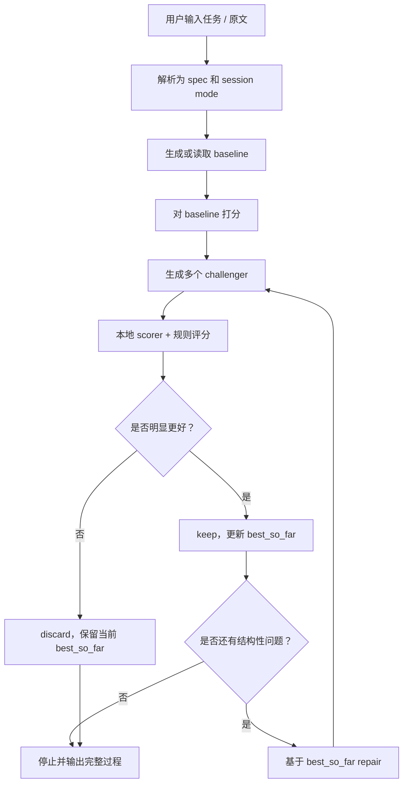

# Humanize Skill

一个中文文案「去 AI 味」skill，可以在 CoPaw、OpenClaw、Claude Code，或者任何能读取 `SKILL.md` 并执行本地 shell 命令的 agent 里使用。

它的本体不是某个平台的私有插件，而是：

```text
SKILL.md + Python CLI + 本地评分 runtime
```

CoPaw / OpenClaw 这类 agent 的使用方式本质上是一样的：让 agent 读取 `SKILL.md`，然后调用同一个 CLI。

仓库里提供的 `scripts/install_to_copaw.py` 只是一个便利脚本，用来同步到我当前能验证的 CoPaw workspace 路径；它不是另一套 skill 协议。

它不是简单让模型重写一遍，而是把文案优化做成一个可检查的迭代闭环：

```text
baseline -> 多个 challenger -> 本地评分 -> keep / discard -> 必要时继续 repair
```

适合用来优化：

- 客户催进度回复
- 售后 / 退款 / 物流沟通
- 面试跟进邮件
- 微信式短消息
- 社群通知
- 产品推荐文案
- 自媒体长文案
- 其他中文沟通类文本

核心目标很简单：

> 让中文内容更像真人会说的话，减少模板腔、客服腔、公告腔和过度 AI 润色感，同时保留原意和必要事实。

---

## 快速开始

### CoPaw 用户：直接从 Skills Hub 导入

在 CoPaw 控制台进入「技能」页面，点击「从 Skills Hub 导入技能」，输入：

```text
https://clawhub.ai/self-evolving-humanize-zh
```

也可以直接搜索精确 slug：

```text
self-evolving-humanize-zh
```

导入后回到聊天窗口，直接说：

```text
用 humanize 帮我把这段自媒体文案改得更像真人会说的话。
原文：在当下这个充满不确定性却又蕴含巨大机会的时代……
```

### 终端用户：直接 clone 后运行

如果你不用 CoPaw，也可以直接在终端跑：

```bash
git clone https://github.com/TianyiDataScience/humanize.git
cd humanize
python3 scripts/bootstrap_runtime.py
python3 humanize.py --text "用 humanize 帮我把这段话改自然一点。原文：感谢您的耐心等待与理解支持，如有任何疑问欢迎随时联系我们。"
```

第一次运行会创建独立 runtime，并下载默认本地 scorer 模型。生成侧会优先跟随宿主 active model；没有可用生成模型时，会降级到 `heuristic-only`。

### 调整最大迭代轮数

默认 `max_rounds=3`。这是上限，不是强制跑满 3 轮；如果第 1 轮已经通过质量门，会提前停止。

临时调高到 5 轮：

```bash
python3 humanize.py --max-rounds 5 --text "用 humanize 帮我把这段话改自然一点。原文：..."
```

或者用环境变量：

```bash
HUMANIZE_MAX_ROUNDS=5 python3 humanize.py --text "用 humanize 帮我把这段话改自然一点。原文：..."
```

当前实现会把轮数限制在 `1..5`，避免因为质量门问题无限循环。一般建议：

- 快速聊天回复：`1` 到 `2` 轮。
- 普通邮件和短文案：默认 `3` 轮。
- 明显 AI 味的长文案：可以临时设成 `5` 轮。

### 你会看到什么

输出不是只给一句最终结果，而是会展示：

- baseline
- 每一轮 candidate
- 每个 candidate 的分数
- failure tags
- selected candidate
- keep / discard / continue 原因
- 最终结果

也就是说，用户能看到它为什么停、为什么继续、为什么选中这一版。

---

## 这个 skill 解决什么问题

现在很多模型都能写文案，但输出经常有几个问题：

- 一次好，下一次又回到模板腔。
- 句子看起来正确，但不像真人会说。
- 抽象词太多，比如「底层逻辑」「认知升级」「成长闭环」。
- 客服回复经常出现「感谢您的理解与支持」「我们将竭诚为您服务」。
- 用户看不到中间过程，不知道最后结果为什么被选中。

`humanize` 的思路不是赌模型第一次就写对，而是让它自己试：

1. 先拿到 baseline。
2. 生成多个不同风格的 challenger。
3. 用本地评分器和通用规则打分。
4. 比 baseline 更好就 keep。
5. 如果分数提升了但还有结构性问题，就继续下一轮。
6. 第二轮以后不是重写原文，而是在上一轮最优结果上继续 repair。

这件事的重点是：

> 不是为了强行多跑几轮，而是只有在确实需要修的时候，才进入下一轮。

干净结果一轮就停。
残留明显问题时，才进入 `best_so_far -> repair`。

---

## 原理

这个 skill 借鉴的是 AutoResearch 式闭环：

```text
提出候选 -> 跑评测 -> 看指标 -> 保留有效改动 -> 继续下一轮
```

在这里，优化对象不是模型训练代码，而是智能体生成文案的策略和候选文本。

流程大致如下：



### 评分信号

最终分数不是一个单纯的「AI 检测器」分数，而是一个综合分：

- `model_score`：候选文本和任务目标、自然度要求的匹配程度。
- `rule_score`：长度、必须保留信息、禁用词、模板短语、格式、覆盖度等规则信号。
- `failure_tags`：给下一轮 repair 使用的失败标签。

默认本地评分模型：

```text
BAAI/bge-reranker-v2-m3
```

模型和运行环境会安装在：

```text
${COPAW_WORKING_DIR:-~/.copaw}/models/humanize/
```

### 模型是否开源

这个项目默认自动下载的评分模型是：

- [`BAAI/bge-reranker-v2-m3`](https://huggingface.co/BAAI/bge-reranker-v2-m3)
- Hugging Face 标注许可证：Apache-2.0

文案生成侧不在仓库里打包闭源模型，也不强制绑定任何云 API。默认优先调用可检测到的宿主 active model；如果当前宿主没有可检测的 active model，也可以通过本地 OpenAI-compatible endpoint 调用自己的模型。

如果你希望整条链路都尽量本地 / 开源，请在宿主的模型管理页面选择本地开源模型。以 CoPaw 为例，可以在「模型」页面选择本地模型，或者用 CoPaw CLI 下载本地模型：

```bash
copaw models download Qwen/Qwen2-0.5B-Instruct-GGUF --source modelscope
copaw models set-llm
```

上面这个示例模型 `Qwen/Qwen2-0.5B-Instruct-GGUF` 在 Hugging Face 上同样标注为 Apache-2.0。

如果没有检测到可用的宿主 active model 或本地 OpenAI-compatible endpoint，`humanize` 会降级到 `heuristic-only`，对已覆盖的常见文案场景仍然可以跑完整流程；复杂开放任务建议先配置一个本地模型。

非 CoPaw 环境也可以设置本地 OpenAI-compatible endpoint：

```bash
export HUMANIZE_GENERATION_BACKEND=local
export HUMANIZE_LLM_BASE_URL=http://127.0.0.1:54841/v1
export HUMANIZE_LLM_MODEL=<your-local-model-id>
```

更完整的开源模型和依赖说明见 [OPEN_SOURCE.md](./OPEN_SOURCE.md)。

### Best-so-far 迭代

这个版本重点修了一个关键问题：

> Round 2 以后不能再从原文重新写，而必须从上一轮最优结果继续修。

所以现在 rewrite case 的两个输入源是分开的：

- `source_text`：原文，用作原意和评分参考。
- `current_best_text`：当前最佳版本，用作下一轮 repair 的基础。

最终展示里也会明确标出：

```text
修订模式：rewrite / repair
本轮修订来源：source / best_so_far
```

你能直接看到：

- 第 1 轮：`source -> rewrite`
- 第 2 轮：`best_so_far -> repair`

---

## 安装

### 0. 选择使用方式

你可以用下面几种方式使用这个 skill。核心机制都一样，区别只在于你的 agent 把 skill 放在哪个 workspace 目录里：

- **CoPaw / OpenClaw**：把仓库放到对应 workspace 的 `skills/humanize` 目录，或者直接在仓库目录里按 `SKILL.md` 调用 `python3 humanize.py --text ...`。
- **Claude Code**：打开仓库后按 `CLAUDE.md` / `SKILL.md` 调用命令，也可以直接在终端运行 CLI。

### 1. 准备 CoPaw（可选，但推荐）

如果你还没装 CoPaw，可以先安装并打开控制台：

```bash
pip install copaw
copaw init --defaults
copaw app
```

然后打开：

```text
http://127.0.0.1:8088/
```

CoPaw 本身是开源项目，官网标注 Apache-2.0，并支持本地 LLM。参考：[CoPaw 官网](https://copaw.bot/)。

### 2. 克隆仓库

当前开源仓库：

```bash
git clone https://github.com/TianyiDataScience/humanize.git
cd humanize
```

### 3. 初始化本地 runtime

第一次运行前执行：

```bash
python3 scripts/bootstrap_runtime.py
```

这一步会创建独立 venv，并下载默认本地 scorer 模型。

如果你只想先准备 Python runtime，不想立刻下载评分模型：

```bash
python3 scripts/bootstrap_runtime.py --skip-model
```

### 4. 安装到 agent workspace（可选）

如果你用的是 CoPaw，并且 workspace 是 `default`，可以直接用仓库自带脚本同步：

```bash
python3 scripts/install_to_copaw.py --workspace default --enable
```

安装后 skill 会同步到 CoPaw 当前约定的 workspace 路径：

```text
~/.copaw/workspaces/default/skills/humanize/
```

如果你用的是 OpenClaw 或其他兼容 OpenClaw / CoPaw skill 结构的 agent，就把这个仓库放到它对应 workspace 的 `skills/humanize` 目录即可。

如果你不确定宿主的 workspace 路径，不需要强行安装，直接在仓库目录运行 CLI 也可以：

```bash
python3 humanize.py --text "{完整用户请求}" --output-root ./runs
```

---

## 让其他用户安装：应该选哪种方式

CoPaw 技能页面里几个入口的可靠性不一样：

| 入口 | 适合做什么 | 是否适合公开分发 |
| --- | --- | --- |
| 从技能池载入 | 从本机已有 skill pool 加载到当前 workspace | 不适合，只对本机有效 |
| 同步到技能池 | 把当前 workspace 的 skill 同步回本机 skill pool | 不适合，只对本机有效 |
| 通过 zip 上传 | 临时发给别人测试，或者离线安装 | 可以当备用方案，但不利于版本更新 |
| 从 Skills Hub 导入技能 | 从公开仓库 / Hub 安装 | 最适合作为普通用户安装入口 |
| 创建技能 | 在界面里新建本地 skill | 只适合开发调试 |

所以发布时最稳的策略是：

1. 把这个项目发布成公开 GitHub 仓库，作为源码和备份安装源。
2. 确保仓库根目录有 `SKILL.md`、`README.md`、`LICENSE`，不要把本地模型、runs、logs 提交进去。
3. 把 skill 发布到 Skills Hub / ClawHub，这样 CoPaw 用户才能在界面里搜索和导入。
4. 让用户在 CoPaw 里点「从 Skills Hub 导入技能」，优先搜索或输入：`https://clawhub.ai/self-evolving-humanize-zh`。
5. 如果 Hub 暂时不可用，再使用 GitHub 稳定版本 URL：`https://github.com/TianyiDataScience/humanize/tree/v0.1.6`。
6. 同时提供 zip release，作为离线安装和临时测试的备用方案。

一句话：

> GitHub URL 导入能保证“可安装”；进入 Skills Hub / ClawHub 索引，才能保证“可搜索”。

推荐给普通用户的安装入口：

```text
https://clawhub.ai/self-evolving-humanize-zh
```

也可以在 CoPaw 的 Skills Hub 搜索框里直接搜：

```text
self-evolving-humanize-zh
```

注意：CoPaw 的 Skills Hub GitHub 导入不要使用 `.git` 后缀。推荐使用版本 tag URL：

```text
https://github.com/TianyiDataScience/humanize/tree/v0.1.6
```

仓库根 URL `https://github.com/TianyiDataScience/humanize` 也可以导入，但 `main` 分支可能受到 GitHub raw 缓存影响；公开分发时优先给 Hub URL 或 tag URL。

`.git` 后缀只适合 `git clone`：

```bash
git clone https://github.com/TianyiDataScience/humanize.git
```

如果只是把 skill 同步到你自己的本地技能池，其他用户不会看到。

---

## 在不同 agent 里怎么用

### CoPaw / OpenClaw

安装到 workspace 后，进入聊天窗口，直接说自然语言即可。

agent 读取 `SKILL.md` 后，应该调用：

```bash
cd {this_skill_dir} && python3 humanize.py --text "{entire_user_request}" --output-root ./runs
```

如果当前宿主没有提供可检测的 active model，可以配置一个本地 OpenAI-compatible endpoint：

```bash
export HUMANIZE_GENERATION_BACKEND=local
export HUMANIZE_LLM_BASE_URL=http://127.0.0.1:54841/v1
export HUMANIZE_LLM_MODEL=<your-local-model-id>
```

没有可用生成模型时，会降级到 `heuristic-only`。

### Claude Code

在 Claude Code 里打开这个仓库，然后直接让它按 `CLAUDE.md` 或 `SKILL.md` 调用：

```bash
python3 humanize.py --text "{完整用户请求}" --output-root ./runs
```

不要让 Claude Code 手写 challenger，也不要自己主观挑 winner。它应该只调用官方入口，最终返回 `=== HUMANIZE_FINAL_RESPONSE_BEGIN ===` 和 `=== HUMANIZE_FINAL_RESPONSE_END ===` 中间的内容。

---

## 示例

下面这些例子在 CoPaw / OpenClaw / Claude Code 里都可以用。区别只是 agent 怎么帮你执行 CLI。

### 例子 1：客户催进度邮件

```text
用 humanize 帮我生成并优化一条中文沟通消息。
任务：给催进度客户发邮件回复。
原文：尊敬的客户，您好。针对您当前咨询的进度事项，我方已经同步协调财务相关同事进行进一步核实与推进。现阶段整体流程正在有序处理中，预计会在明天下午为您提供更加清晰和完整的反馈说明。感谢您的耐心等待与理解支持，如后续您有任何疑问，欢迎随时与我们联系，我们将竭诚为您服务。
```

预期行为：

- 通常一轮就能停。
- 输出会包含 baseline、candidate、分数、failure tags、最终选择。
- 最终结果会更自然，减少客服模板腔。

### 例子 2：需要两轮的自媒体长文案

这个例子通常会触发第 2 轮 repair：

```text
用 humanize 帮我把这段自媒体文案改得更像真人会说的话。
补充偏好：整体意思别偏，但更自然一点，尤其想把底层逻辑、成长闭环、低质量勤奋这种词换掉。

原文：在当下这个充满不确定性却又蕴含巨大机会的时代，每一个普通人都比以往任何时候更需要重新思考成长这件事的底层逻辑。很多人表面上看起来很努力，也投入了大量时间与精力，但最终却没有获得预期中的结果。为什么会这样？我认为，核心原因并不在于努力本身，而在于有没有建立起一套真正适合自己的认知升级系统和行动迭代机制。一个人真正拉开差距的，从来都不是短期的爆发，而是长期稳定的自我优化能力。那些能够持续复盘、持续修正、持续精进的人，往往更容易在复杂环境中找到自己的节奏，并不断放大自己的优势。相反，如果一个人只是重复旧有路径、依赖惯性前进，那么即便看起来很忙，也很可能只是停留在低质量勤奋的循环之中。所以我想告诉大家的是，未来真正重要的能力，不只是执行力，不只是学习力，也不只是单点突破的能力，而是把认知、方法、反馈和行动连接起来，形成一个真正可以持续运转的成长闭环。只有这样，一个人才有可能在变化中不断完成自我更新，并在长期竞争中获得更大的确定性。如果你最近也正在经历迷茫、焦虑或者迟迟找不到突破口的阶段，我真心希望你可以认真想一想：你现在所坚持的东西，到底是在帮助你走向更高质量的成长，还是只是在消耗你的时间和注意力。希望今天这段分享，能够给你带来一点新的思考和启发。如果你也有类似感受，欢迎在评论区分享你的看法。
```

重点看输出里的过程：

```text
第 1 轮：rewrite / source / continue
第 2 轮：repair / best_so_far / keep
```

最终结果里应该不再保留：

- `底层逻辑`
- `成长闭环`
- `低质量勤奋`

### 例子 3：产品文案

```text
用 humanize 帮我把这段产品文案改得更像真人推荐，不要标准宣传稿的感觉。
原文：这款产品采用高品质原材料与先进工艺打造，兼顾功能性、舒适性与审美表现。无论是在日常通勤、家庭使用还是多场景切换中，都能够为用户提供稳定、轻松且高效率的使用体验。我们希望通过更加细致的设计与持续优化的细节打磨，为用户带来真正意义上的品质升级。
```

---

## 命令行用法

你也可以不经过 CoPaw，直接运行：

```bash
python3 humanize.py --text "用 humanize 帮我把这段话改自然一点。原文：感谢您的耐心等待与理解支持，如有任何疑问欢迎随时联系我们。"
```

推荐入口：

```bash
python3 humanize.py --text "{完整用户请求}" --output-root ./runs
```

不要传：

```bash
--mode rewrite
```

rewrite / generate 会自动推断：

- 有 `原文`、`原稿`、`正文`、`draft` 或长文本：进入 rewrite。
- 只有任务和约束：进入 generate。

---

## 输出包含什么

每次运行会输出一个完整的中文过程报告，包括：

- 最终结果
- baseline
- final challenger
- 每一轮 candidate
- 每个 candidate 的分数
- failure tags
- selected candidate
- keep / discard / continue 决策
- delta
- 结果质量门
- report.html 路径
- session-trace.json 路径

典型字段：

```text
修订模式：rewrite（从原文重写）
本轮修订来源：source（原文）
```

或：

```text
修订模式：repair（基于上一轮最佳版本继续修复）
本轮修订来源：best_so_far（上一轮最佳版本）
```

---

## 目录结构

```text
.
├── SKILL.md
├── README.md
├── OPEN_SOURCE.md
├── AGENTS.md
├── CLAUDE.md
├── humanize.py
├── __main__.py
├── scripts/
│   ├── bootstrap_runtime.py
│   ├── run_from_brief.py
│   ├── local_generation.py
│   ├── scoring_core.py
│   ├── run_regression_suite.py
│   └── install_to_copaw.py
├── examples/
│   ├── regression_cases.json
│   └── demo_spec.yaml
├── references/
│   ├── scoring.md
│   └── presets.md
└── requirements.lock.txt
```

---

## 回归测试

运行本地回归：

```bash
python3 scripts/run_regression_suite.py \
  --cases examples/regression_cases.json \
  --output-root ./runs/regression-local \
  --timeout 240
```

编译检查：

```bash
python3 -m py_compile \
  humanize.py \
  scripts/run_from_brief.py \
  scripts/local_generation.py \
  scripts/run_regression_suite.py
```

安装到 CoPaw 后，也可以检查已安装版：

```bash
python3 -m py_compile \
  ~/.copaw/workspaces/default/skills/humanize/humanize.py \
  ~/.copaw/workspaces/default/skills/humanize/scripts/run_from_brief.py \
  ~/.copaw/workspaces/default/skills/humanize/scripts/local_generation.py \
  ~/.copaw/workspaces/default/skills/humanize/scripts/run_regression_suite.py
```

---

## 重名检查

截至 2026-04-12，我做了两类检查：

1. 本地 CoPaw skill pool 里，除了当前项目同步出来的 `humanize`，没有发现另一个同名 skill。
2. GitHub repository search 查询以下关键词，当时没有发现明确的 CoPaw 同名 skill 冲突：
   - [`copaw humanize skill`](https://github.com/search?q=copaw+humanize+skill&type=repositories)
   - [`copaw-skill-humanize`](https://github.com/search?q=copaw-skill-humanize&type=repositories)
   - [`CoPaw humanize`](https://github.com/search?q=CoPaw+humanize&type=repositories)

但是 `humanize` 本身是一个非常通用的英文词，公开生态里存在大量类似的人类化文本工具、NLP 包、AI humanizer 项目。

所以当前命名策略是：

- skill 内部名继续叫 `humanize`，便于 CoPaw 里自然调用。
- 开源仓库使用你已经创建的 [`TianyiDataScience/humanize`](https://github.com/TianyiDataScience/humanize)，README 中明确它是 CoPaw / OpenClaw / Claude Code 可用的中文文案 humanize skill。

这不是商标检索，只是公开仓库和本地 skill 名称层面的冲突检查。

---

## 设计原则

### 1. 不过度工程化用户输入

用户没有给约束，就不要替用户发明约束。

例如：

```text
给催进度客户发邮件回复
```

这里的「邮件」属于任务语义，不是用户必须手写的硬约束。skill 应该自动理解它更接近邮件回复，而不是微信短句。

### 2. 不为了多轮而多轮

多轮不是目的。

目标是：

- 干净结果：一轮停。
- 分数提升但仍有结构性问题：继续 repair。
- 第二轮失败：保留上一轮 best-so-far，不回退。

### 3. Round 2 以后基于 best-so-far

第二轮不是重新拿原文写一篇。

它应该：

- 保留第一轮已经变自然的表达。
- 只修残留问题。
- 不重新引入原文模板短语。
- 不把完整文案压缩成一句话。
- 不把局部问题扩大成整篇重写失败。

### 4. 用户必须能看到过程

这个 skill 的输出不是只给一句最终答案。

它应该让用户看到：

- 为什么这版赢了。
- 哪些候选失败了。
- 失败原因是什么。
- 为什么继续下一轮。
- 为什么停止。

---

## 限制

- 评分器不是绝对审美裁判，它只是一个稳定的辅助信号。
- 对非常专业、强风格、强品牌语气的文案，建议用户明确说明风格偏好。
- 本地 scorer 首次运行需要下载模型，第一次会慢一些。
- 生成侧优先跟随可检测到的宿主 active model；当前仓库已内置 CoPaw active model 桥接。其他 agent 可以通过本地 OpenAI-compatible endpoint 接入自己的模型。
- 没有生成模型时会进入 `heuristic-only` 降级，常见模板化文案仍可用，但开放式复杂任务建议配置本地模型。
- agent 有时会先读 `SKILL.md` 再执行命令，这是正常行为；最终结果以 `=== HUMANIZE_FINAL_RESPONSE_BEGIN ===` 和 `=== HUMANIZE_FINAL_RESPONSE_END ===` 之间的 canonical block 为准。

---

## License

MIT
