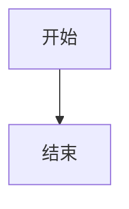

# feishu-writing-bundle

> 🦞 OpenClaw 飞书文档写作整合包

让龙虾只看这一份 skill，就能独立完成从零到链接交付的完整飞书文档写作任务。

---

## 覆盖能力

- 📄 **新建飞书文档** — 从群文件、链接、资料整理成文档
- ✏️ **局部改稿** — replace_range / append / insert_before 等 7 种更新模式
- 🔧 **精准改稿** — 保留原结构，只改必要部分
- 🧹 **去 AI 腔** — 消套话、去机械排比、提高人味
- 📋 **Proposal 正式化** — 把草稿改成能发的正式材料
- 🔗 **飞书回链交付** — 任务结束必须给 doc_url，这是完成标准

---

## 安装

```bash
clawhub install feishu-writing-bundle
```

或直接克隆到你的 skills 目录：

```bash
git clone https://github.com/tianyilt/feishu-writing-bundle.git skills/feishu-writing-bundle
```

---

## 文件结构

```
feishu-writing-bundle/
├── SKILL.md                        # 主 skill 文件，agent 读这里
└── references/
    ├── quick-reference.md          # 速查手册（工具调用 / 语法 / 模式速查）
    ├── best-practices.md           # 完整最佳实践（含代码示例、反模式）
    ├── open-box-rules.md           # 权限 / 空间 / OAuth 补救规则
    ├── workflows.md                # 常见工作流（新建 / 改稿 / proposal）
    ├── style-guide.md              # 风格与交付规则
    └── skill-map.md                # 7 类能力详细规则（自包含）
```

---

## 速查

### 工具决策树

```
新建文档    →  feishu_create_doc(title, markdown)
改稿        →  feishu_fetch_doc → feishu_update_doc(replace_range)
追加内容    →  feishu_update_doc(append)
长文档      →  feishu_create_doc（骨架）→ feishu_update_doc(append) × N
```

### feishu_update_doc 7种模式

| 模式 | 用途 |
|------|------|
| `append` | 追加到末尾 |
| `replace_range` | 替换某段/章节 |
| `insert_before/after` | 在特定位置前后插入 |
| `delete_range` | 删除某段 |
| `replace_all` | 全文替换关键词 |
| `overwrite` | 全文重写（**慎用**） |

### Lark Markdown 特殊语法

```html
<!-- Callout 高亮块 -->
<callout emoji="💡" background-color="light-blue">内容</callout>

<!-- 分栏 -->
<grid cols="2"><column>左</column><column>右</column></grid>

<!-- Mermaid 图表（自动转飞书画板） -->

```

---

## 实际效果案例

下图展示了龙虾使用这套 skill 前后写出的飞书文档对比（0307 → 0312）：


> 写作能 work 主要靠两件事：蒸馏作者本人的写作风格 + 每天反思写作的上下文 SOP 持续优化。这个整合包是这套方法论的产物。

### 案例文档

| 文档 | 说明 |
|------|------|
| [OpenClaw 飞书写作最佳实践](https://fudan-nlp.feishu.cn/wiki/WZVMwUEnXiHUqLkfzDycSp9en2c) | 飞书写作方法论与最佳实践沉淀，本 skill 的知识来源之一 |
| [飞书文档写作相关 Skills 说明（给龙虾同学）](https://fudan-nlp.feishu.cn/docx/HdWfdNomtoGd7yxL3gVcFgrhnnb) | 对 feishu-writing-bundle 各能力的说明文档，也是 0312 水平写作效果的展示案例 |

---

## 三条铁律

1. **完成标准是链接，不是文字** — 没有 doc_url，任务未完成
2. **先读再改，默认局部更新** — 改稿必先 feishu_fetch_doc，不乱 overwrite
3. **失败立刻换路径** — 工具失败最多一句说明，下一步必须是真实的备选动作

---

## 适用平台

[OpenClaw](https://openclaw.ai) — AI Agent 框架（龙虾）

---

## License

MIT
