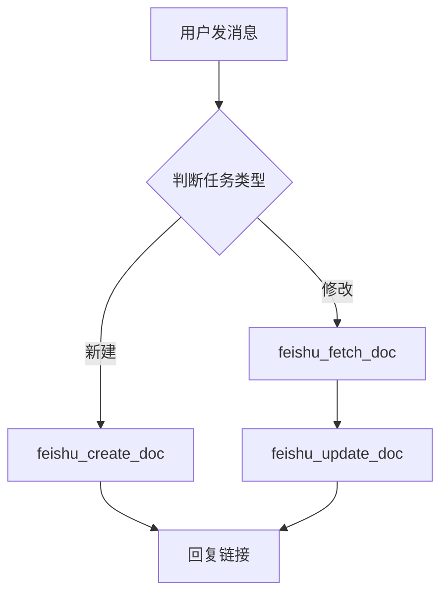
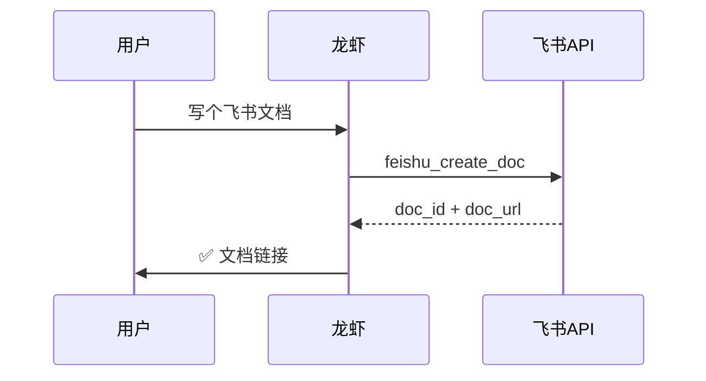
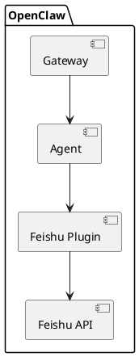

# OpenClaw 飞书文档写作最佳实践

> **适用对象**：运行在 openclaw 上的 AI agent（龙虾）
> **目标**：让 agent 只看这一份文档，就能独立完成从零到链接交付的完整飞书文档写作任务
> **来源**：基于真实 session 成功案例（cf3c3793）+ feishu-create-doc / update-doc skill 深度整理

---

## 一、核心原则

### 1.1 完成标准是链接，不是文字

飞书文档任务的完成标准只有一个：

> 文档创建成功，飞书链接已回给用户。

聊天里输出一大段像文档的文字，**不算完成**。这是最常见的失败模式。

### 1.2 文档要自包含

飞书文档会被转发、收藏、长期留存。写作时默认：读者没有看过任何聊天上下文。

开头要主动补足：
- 这份文档在讲什么
- 原始材料来源（链接、文件名、会议时间）
- 适用对象 / 阅读范围

### 1.3 行动优先，失败立刻换路径

工具调用失败后，最多一句简短说明，下一步必须是真实的换路径动作。严禁发出"我在继续 / 下一条只给结果"类空承诺。

---

## 二、完整工作流

### 2.1 判断任务类型

```
用户要求
  ├── 新建文档 → 走 2.2 创建流程
  ├── 修改已有文档 → 先读（feishu_fetch_doc），再走 2.3 更新流程
  └── 整理资料成文档 → 先读资料，再走 2.2 创建流程
```

### 2.2 新建文档标准流程

**第一步：先读素材**

```python
# 如果有飞书文档链接，先读
feishu_fetch_doc(doc_id="https://xxx.feishu.cn/wiki/XxxXxx")

# 如果有群消息里的文件
feishu_im_user_search_messages(chat_id="oc_xxx", message_type="file")
feishu_im_user_fetch_resource(file_key="file_v3_xxx", type="file", message_id="om_xxx")
read(file_path="/tmp/openclaw/im-resource-xxx")

# 如果有多个链接
feishu_im_user_search_messages(chat_id="oc_xxx", query="http")
# 批量 feishu_fetch_doc 逐个读取
```

**第二步：构建文档内容（Lark-flavored Markdown）**

参见第三章语法详解。

**第三步：创建文档**

```json
// 最简调用
{
  "title": "文档标题",
  "markdown": "正文内容（不要重复标题）"
}

// 指定位置（三选一，优先级从高到低）
{
  "title": "文档标题",
  "wiki_node": "wikcnXXXXXXXXXX",    // 知识库节点
  "markdown": "..."
}
{
  "title": "文档标题",
  "wiki_space": "my_library",          // 个人知识库
  "markdown": "..."
}
{
  "title": "文档标题",
  "folder_token": "fldcnXXXXXXXXXX",  // 普通文件夹
  "markdown": "..."
}
```

**第四步：回链接**

```
✅ 文档已创建：https://www.feishu.cn/docx/HdWfdXXXXXXXXX
```

---

### 2.3 长文档分段策略（重要）

单次 `feishu_create_doc` 不稳定时，**拆成 create + 多次 append**：

```
第一次 create_doc：写前两个章节（作为基础骨架）
  → 拿到 doc_id

第二次 update_doc（append）：追加第三章
  → mode: "append"

第三次 update_doc（append）：追加第四章
  ...以此类推
```

```json
// Step 1: 创建带骨架
{
  "title": "我的文档",
  "markdown": "## 背景\n\n...\n\n## 现状分析\n\n..."
}
// 返回: { "doc_id": "HdWfdXXX", "doc_url": "https://..." }

// Step 2: 追加第三章
{
  "doc_id": "HdWfdXXX",
  "mode": "append",
  "markdown": "## 解决方案\n\n..."
}

// Step 3: 继续追加
{
  "doc_id": "HdWfdXXX",
  "mode": "append",
  "markdown": "## 总结\n\n..."
}
```

---

### 2.4 修改已有文档流程

```
先读原文 → feishu_fetch_doc
分析要改哪里
选择合适的 update 模式（见第四章）
执行更新
回链接
```

**不要 overwrite 整篇！** 除非用户明确要求全部重写，否则用局部模式保留原文结构和评论。

---

## 三、Lark-flavored Markdown 语法详解

### 3.1 基础块

#### 标题

```markdown
# 一级标题
## 二级标题
### 三级标题
#### 四级标题

# 蓝色居中标题 {color="blue" align="center"}
```

**注意**：`title` 参数已是文档标题，markdown 正文不要再写同名一级标题。

---

#### 列表

```markdown
- 无序项1
  - 无序子项（2空格或tab缩进）
  - 无序子项

1. 有序项1
2. 有序项2
   1. 有序子项

- [ ] 待办事项
- [x] 已完成事项
```

---

#### 代码块

只支持围栏代码块，**禁止缩进代码块**：

````markdown
```python
def hello():
    print("Hello, Feishu!")
```

```json
{
  "key": "value"
}
```

```shell
openclaw gateway restart
```
````

支持语言：`python` `javascript` `go` `java` `sql` `json` `yaml` `shell` `bash` `typescript` 等。

---

#### 引用块

```markdown
> 这是一段引用
> 可以跨多行

> 引用中支持**加粗**和*斜体*
```

---

### 3.2 富文本格式

```markdown
**粗体** *斜体* ~~删除线~~ `行内代码` <u>下划线</u>

<text color="red">红色文字</text>
<text color="blue">蓝色文字</text>
<text background-color="yellow">黄色高亮</text>

[链接文字](https://example.com)

行内公式：<equation>E = mc^2</equation>
```

颜色支持：`red` `orange` `yellow` `green` `blue` `purple` `gray`

---

### 3.3 高亮块（Callout）— 最常用

```html
<!-- 提示 -->
<callout emoji="💡" background-color="light-blue" border-color="blue">
这是一条**重要提示**，支持加粗等格式。
</callout>

<!-- 警告 -->
<callout emoji="⚠️" background-color="light-yellow" border-color="yellow">
注意！这个操作不可逆。
</callout>

<!-- 危险/错误 -->
<callout emoji="❌" background-color="light-red" border-color="red">
禁止操作：不要删除这个文件夹。
</callout>

<!-- 成功/完成 -->
<callout emoji="✅" background-color="light-green" border-color="green">
已完成：部署成功，所有检查通过。
</callout>
```

**Callout 内部限制**：只支持文本、标题、列表、待办、引用。**不支持代码块、表格、图片**。

---

### 3.4 分栏（Grid）— 对比展示

```html
<!-- 两栏等宽 -->
<grid cols="2">
<column>

**方案A**

优点：简单直接
缺点：性能较差

</column>
<column>

**方案B**

优点：性能优秀
缺点：实现复杂

</column>
</grid>

<!-- 三栏自定义宽度（总和必须100） -->
<grid cols="3">
<column width="20">

小栏

</column>
<column width="60">

主内容区，宽度占60%

</column>
<column width="20">

小栏

</column>
</grid>
```

---

### 3.5 表格

**简单数据用 Markdown 表格：**

```markdown
| 工具 | 用途 | 备注 |
|------|------|------|
| feishu_fetch_doc | 读取文档 | 支持 wiki/docx |
| feishu_create_doc | 创建文档 | 返回 doc_id + doc_url |
| feishu_update_doc | 更新文档 | 7种更新模式 |
```

**复杂内容（列表、代码块在单元格内）用 lark-table：**

```html
<lark-table column-widths="200,300,230" header-row="true">
<lark-tr>
<lark-td>

**模式**

</lark-td>
<lark-td>

**适用场景**

</lark-td>
<lark-td>

**关键参数**

</lark-td>
</lark-tr>
<lark-tr>
<lark-td>

append

</lark-td>
<lark-td>

- 追加新章节
- 分段写长文档

</lark-td>
<lark-td>

`markdown`

</lark-td>
</lark-tr>
<lark-tr>
<lark-td>

replace_range

</lark-td>
<lark-td>

- 替换某个章节
- 修改某段内容

</lark-td>
<lark-td>

`selection_with_ellipsis` 或 `selection_by_title`

</lark-td>
</lark-tr>
</lark-table>
```

**lark-table 规则**：
- 每行 `lark-td` 数量必须相同
- `lark-td` 内容前后必须有空行
- 不支持嵌套表格和 Grid
- `column-widths` 总宽约 730px

---

### 3.6 图表（Mermaid / PlantUML）

**优先选 Mermaid**，更简洁：

````markdown





```

**Mermaid 不够用时选 PlantUML：**


````

**重要**：创建时写 Mermaid/PlantUML 代码块，系统自动转成飞书画板。禁止写 `<whiteboard>` 标签。

---

### 3.7 图片

```html
<!-- 公开 URL 图片（直接用，系统自动上传） -->
<image url="https://example.com/arch.png" width="800" align="center" caption="系统架构图"/>

<!-- 本地图片用 feishu_doc_media 工具，不能在 markdown 里写路径 -->
```

---

### 3.8 提及用户

```html
<!-- 先搜索用户 ID -->
feishu_search_user(query="张三")
→ 返回 open_id: "ou_xxxxxx"

<!-- 在文档里提及 -->
<mention-user id="ou_xxxxxx"/>
```

---

## 四、feishu_update_doc 7 种模式详解

### 4.1 模式速查

| 模式 | 用途 | 定位参数 |
|------|------|------|
| `append` | 追加到文档末尾 | 无需定位 |
| `overwrite` | 全文清空重写 | 无需定位，**慎用** |
| `replace_range` | 替换某段内容 | `selection_with_ellipsis` 或 `selection_by_title` |
| `replace_all` | 全文替换关键词（多处） | `selection_with_ellipsis` |
| `insert_before` | 在某段前插入 | `selection_with_ellipsis` |
| `insert_after` | 在某段后插入 | `selection_with_ellipsis` |
| `delete_range` | 删除某段内容 | `selection_with_ellipsis` 或 `selection_by_title` |

---

### 4.2 定位方式详解

**selection_with_ellipsis（内容定位）：**

```
"开头内容...结尾内容"  →  匹配从开头到结尾之间的所有内容（含中间）
"完整内容"             →  精确匹配，不含 ...
```

```json
// 替换某章节（范围匹配）
{
  "doc_id": "HdWfdXXX",
  "mode": "replace_range",
  "selection_with_ellipsis": "## 旧方案\n\n这是旧的...已过期。",
  "markdown": "## 新方案\n\n..."
}

// 全文替换某个词
{
  "doc_id": "HdWfdXXX",
  "mode": "replace_all",
  "selection_with_ellipsis": "openclaw-cn",
  "markdown": "openclaw"
}
```

**selection_by_title（标题定位，自动选中整个章节）：**

```json
// 替换整个"功能说明"章节
{
  "doc_id": "HdWfdXXX",
  "mode": "replace_range",
  "selection_by_title": "## 功能说明",
  "markdown": "## 功能说明\n\n更新后的内容..."
}

// 删除整个"旧版内容"章节
{
  "doc_id": "HdWfdXXX",
  "mode": "delete_range",
  "selection_by_title": "旧版内容"
}
```

---

### 4.3 insert_before / insert_after（在某处插入）

```json
// 在"危险操作"章节前加警告
{
  "doc_id": "HdWfdXXX",
  "mode": "insert_before",
  "selection_with_ellipsis": "## 危险操作",
  "markdown": "<callout emoji=\"⚠️\" background-color=\"light-yellow\">\n执行前请先备份！\n</callout>\n"
}

// 在代码块后插入说明
{
  "doc_id": "HdWfdXXX",
  "mode": "insert_after",
  "selection_with_ellipsis": "```python...```",
  "markdown": "\n**输出示例**：\n```\nHello, Feishu!\n```\n"
}
```

---

## 五、常见任务代码示例

### 5.1 从群聊文件整理成飞书文档

```python
# 1. 搜索群里的文件
feishu_im_user_search_messages(
    chat_id="oc_86ab1d7bd8f7ca6133a2d74e4aa9a60b",
    message_type="file"
)
# 返回: message_id, file_key

# 2. 下载文件
feishu_im_user_fetch_resource(
    file_key="file_v3_00vl_ac7e1f2c-5fcc-4db5-8e82-6f5d80aa132g",
    type="file",
    message_id="om_x100b55cd9634f4c8b4bec55fdd59e43"
)
# 返回: local_path = "/tmp/openclaw/im-resource-xxx"

# 3. 读取文件内容
read(file_path="/tmp/openclaw/im-resource-xxx")

# 4. 创建飞书文档
feishu_create_doc(
    title="NPU训练速度分析",
    markdown="## 背景\n\n根据群内分享文档整理...\n\n..."
)
# 返回: { doc_url: "https://www.feishu.cn/docx/xxx" }
```

### 5.2 批量读取群链接建立知识文档

```python
# 1. 搜索含链接的消息
feishu_im_user_search_messages(chat_id="oc_xxx", query="http")

# 2. 逐个读取飞书文档（feishu_fetch_doc 支持 wiki/docx URL）
feishu_fetch_doc(doc_id="https://xxx.feishu.cn/wiki/XxxXxxXxxXxxXxxXxxXxxXxxXxx")
feishu_fetch_doc(doc_id="https://xxx.feishu.cn/docx/XxxXxxXxxXxxXxxXxxXxxXxxXxx")

# 3. 读取多维表格（bitable URL 要提取 app_token）
# URL: https://xxx.feishu.cn/base/XxxXxxXxxXxxXxxXxxXxxXxxXxx
feishu_bitable_app_table_record(
    app_token="XxxXxxXxxXxxXxxXxxXxxXxxXxx",
    action="list",
    table_id="tblXxxXxxXxxXxxXx"
)

# 4. 综合所有内容写文档
feishu_create_doc(title="项目知识汇总", markdown="...")
```

### 5.3 改稿：精准局部修改

```python
# 1. 先读原文
feishu_fetch_doc(doc_id="https://xxx.feishu.cn/docx/HdWfdXXX")

# 2. 替换某个章节
feishu_update_doc(
    doc_id="HdWfdXXX",
    mode="replace_range",
    selection_by_title="## 实现细节",
    markdown="## 实现细节\n\n...(改进后的内容)..."
)

# 3. 在文档末尾追加更新说明
feishu_update_doc(
    doc_id="HdWfdXXX",
    mode="append",
    markdown="\n---\n\n<callout emoji=\"📝\" background-color=\"pale-gray\">\n**更新记录**：2026-03-15 补充实现细节章节。\n</callout>"
)
```

### 5.4 写技术文档的标准模板

```markdown
<!-- 标题通过 title 参数传，这里不写 # 一级标题 -->

<callout emoji="🧭" background-color="light-blue" border-color="blue">
**本文档说明**：这份文档整理自 [来源链接]，时间：2026-03-15，适用对象：开发团队。
</callout>

## 背景

说明为什么需要这份文档。

## 核心概念

### 概念A

解释清楚。

<callout emoji="💡" background-color="light-blue">
**一句话理解**：...
</callout>

## 操作步骤

1. 第一步：...

   ```shell
   具体命令
   ```

2. 第二步：...

## 常见问题

| 问题 | 原因 | 解决方法 |
|------|------|----------|
| ... | ... | ... |

## 参考资料

- [相关文档](https://xxx)
```

---

## 六、反模式（禁止做的事）

### ❌ 在聊天里输出一大段文字代替创建文档

```
❌ 错误：
"好的，这是文档内容：
# 标题
## 背景
..."
（没有调用 feishu_create_doc）

✅ 正确：
直接调用 feishu_create_doc，回复飞书链接
```

### ❌ 用 title 参数后正文再写同名一级标题

```markdown
❌ 错误（title="项目概览" 时正文里再写）：
# 项目概览    ← 多余，飞书会有两个标题

✅ 正确：
正文直接从 ## 二级标题或正文内容开始
```

### ❌ Callout 里放代码块或表格

```html
❌ 错误：
<callout emoji="💡">
```python         ← Callout 内不支持代码块
代码...
```
</callout>

✅ 正确：
<callout emoji="💡">
重要提示：见下方代码示例
</callout>

```python
代码...
```
```

### ❌ sessions_spawn 幻觉 agentId

```json
❌ 错误：
{
  "agentId": "feishu-writer",   ← 这个 agent 不存在
  "task": "..."
}
// → 报错: agentId is not allowed for sessions_spawn (allowed: none)

✅ 正确：
- 不传 agentId（在自己的 agent 下运行）
- 或先用 agents_list 确认 agentId 是否真实存在
- 或直接调用 feishu_create_doc 工具，不走 sessions_spawn
```

### ❌ 失败后陷入空承诺循环

```
❌ 错误：
工具失败 → "我在继续" → "下一条只给结果" → "正在推进" → ...（没有任何工具调用）

✅ 正确：
工具失败 → 一句话说明 → 立刻调用备选路径（换工具或换方案）
若确实无法完成 → 一次性报告阻塞原因 + 提供可用替代交付 → 停止
```

### ❌ overwrite 整篇文档

```json
❌ 危险：
{
  "doc_id": "xxx",
  "mode": "overwrite",
  "markdown": "..."
}
// 会清空所有图片、评论、历史版本里的 token 关联

✅ 优先使用局部模式：
replace_range / append / insert_before / insert_after
```

---

## 七、工具能力边界说明

| 功能 | 是否支持 | 说明 |
|------|----------|------|
| 创建飞书文档 | ✅ | `feishu_create_doc` |
| 读取飞书文档 | ✅ | `feishu_fetch_doc`（wiki/docx 均支持） |
| 局部更新文档 | ✅ | `feishu_update_doc` 7种模式 |
| 插入公开URL图片 | ✅ | `<image url="..."/>` |
| 插入本地图片 | ✅ | `feishu_doc_media` 工具（两步流程） |
| 创建 Mermaid 图表 | ✅ | 写代码块，自动转画板 |
| 飞书文档荧光笔高亮 | ❌ | API 不支持，只能用 Callout 替代 |
| 读取画板源码 | ❌ | 只能拿到 token，看不到原始代码 |
| 合并单元格 | ❌ | 创建时不支持，读取时有 rowspan/colspan |
| 在 Callout 内放代码块 | ❌ | 飞书 API 限制 |
| 指定 token 插入图片 | ❌ | 只支持 URL 方式 |

---

## 八、场景速查

| 任务 | 关键工具 | 备注 |
|------|----------|------|
| 从群文件建文档 | `feishu_im_user_search_messages` → `feishu_im_user_fetch_resource` → `feishu_create_doc` | |
| 从链接建知识文档 | `feishu_fetch_doc` × N → `feishu_create_doc` | |
| 读多维表格 | `feishu_bitable_app_table_record` | 提取 app_token 和 table_id |
| 改稿某章节 | `feishu_fetch_doc` → `feishu_update_doc(replace_range)` | 优先 selection_by_title |
| 末尾追加 | `feishu_update_doc(append)` | 长文档分段首选 |
| 全文替换关键词 | `feishu_update_doc(replace_all)` | 返回 replace_count |
| 发送文档给用户 | 回复 doc_url | 格式：`https://www.feishu.cn/docx/xxx` |
