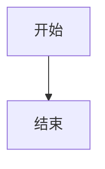

# 飞书文档写作速查手册

> 本文档是 feishu-writing-bundle 的行动速查卡。遇到飞书文档任务，先扫一眼这份手册确认路径，再执行。

---

## 0. 三条铁律

1. **完成标准是链接，不是文字** — 没有 doc_url，任务未完成
2. **先读再改，默认局部更新** — 改稿必先调 `feishu_fetch_doc`，默认不 overwrite
3. **失败立刻换路径** — 工具失败最多一句说明，下一步必须是真实的备选动作

---

## 1. 任务类型 → 工具路径

```
用户说"写个飞书文档 / 整理成文档"
  └─► feishu_create_doc(title, markdown)  → 回 doc_url ✅

用户说"改这篇文档 / 改这一节"
  └─► feishu_fetch_doc → feishu_update_doc(mode=replace_range) → 回 doc_url ✅

用户说"追加/补充一节"
  └─► feishu_update_doc(mode=append) → 回 doc_url ✅

用户给了群文件
  └─► feishu_im_user_search_messages → feishu_im_user_fetch_resource → read → feishu_create_doc

用户给了飞书文档链接
  └─► feishu_fetch_doc(doc_id=URL)  →（处理内容）→ feishu_create_doc 或 feishu_update_doc

长文档（>2000字 或分段写）
  └─► feishu_create_doc（前两章骨架）→ feishu_update_doc(append) × N
```

---

## 2. feishu_create_doc 速查

```json
// 最简调用
{ "title": "标题", "markdown": "正文（不要重复一级标题）" }

// 指定位置（三选一）
{ "title": "标题", "wiki_space": "my_library", "markdown": "..." }
{ "title": "标题", "wiki_node": "wikcnXXXXXX", "markdown": "..." }
{ "title": "标题", "folder_token": "fldcnXXXXXX", "markdown": "..." }

// 返回
{ "doc_id": "HdWfdXXX", "doc_url": "https://www.feishu.cn/docx/HdWfdXXX" }
```

---

## 3. feishu_update_doc 7种模式速查

| 模式 | 用途 | 必填定位参数 |
|------|------|------------|
| `append` | 追加到末尾 | 无 |
| `overwrite` | 清空重写（**慎用**） | 无 |
| `replace_range` | 替换某段/某章节 | `selection_with_ellipsis` 或 `selection_by_title` |
| `replace_all` | 全文替换关键词 | `selection_with_ellipsis`（填要替换的词） |
| `insert_before` | 在某段前插入 | `selection_with_ellipsis` |
| `insert_after` | 在某段后插入 | `selection_with_ellipsis` |
| `delete_range` | 删除某段/某章节 | `selection_with_ellipsis` 或 `selection_by_title` |

**定位方式：**
```
selection_with_ellipsis: "开头内容...结尾内容"  // 范围匹配（含中间）
selection_by_title: "## 章节标题"               // 自动选中整章
```

**常用示例：**
```json
// 替换整章
{ "doc_id": "xxx", "mode": "replace_range", "selection_by_title": "## 旧章节", "markdown": "## 新章节\n\n..." }

// 追加
{ "doc_id": "xxx", "mode": "append", "markdown": "## 新内容\n\n..." }

// 全文替换词
{ "doc_id": "xxx", "mode": "replace_all", "selection_with_ellipsis": "旧词", "markdown": "新词" }
```

---

## 4. Lark Markdown 语法速查

### 基础

```markdown
# 一级标题  ## 二级  ### 三级
**粗体**  *斜体*  ~~删除~~  `行内代码`  <u>下划线</u>

- 无序列表     1. 有序列表     - [ ] 待办  - [x] 已完成
> 引用块
[文字](URL)    <image url="https://..." width="800"/>
<text color="red">彩色文字</text>
<equation>E = mc^2</equation>
```

> ⚠️ 只用围栏代码块（ \`\`\`lang ... \`\`\` ），禁用缩进代码块

### Callout（高亮块）

```html
<callout emoji="💡" background-color="light-blue" border-color="blue">
内容（支持加粗/列表/引用，**不支持代码块/表格**）
</callout>
```

颜色选项：`light-blue` `light-green` `light-yellow` `light-red` `pale-gray` `light-orange` `light-purple`

### 分栏 Grid

```html
<grid cols="2">
<column>左侧内容</column>
<column>右侧内容</column>
</grid>
```

### 表格

- 普通数据 → Markdown 表格（`| 列 | 列 |`）
- 单元格内含列表/代码 → lark-table：

```html
<lark-table column-widths="200,300,230" header-row="true">
<lark-tr><lark-td>

**列头**

</lark-td><lark-td>

内容（前后必须有空行）

</lark-td></lark-tr>
</lark-table>
```

### 图表

```markdown

```

> Mermaid/PlantUML 代码块 → 自动转飞书画板。禁止写 `<whiteboard>` 标签。

---

## 5. feishu_fetch_doc 速查

```json
// 支持各种链接格式
{ "doc_id": "https://xxx.feishu.cn/wiki/Xxxx" }
{ "doc_id": "https://xxx.feishu.cn/docx/Xxxx" }
{ "doc_id": "HdWfdXXX" }  // 直接传 doc_id
```

---

## 6. 权限问题速查

| 症状 | 最可能原因 | 处理 |
|------|-----------|------|
| 文档建成了但用户打不开 | 文档落在插件账号空间 | 改用 `wiki_space="my_library"` 或指定 `wiki_node` |
| `auth_unavailable` | 用户未完成 OAuth 授权 | 等用户点授权卡片，再自动重试 |
| `feishu_create_doc` 报权限错 | tools.profile 未开 full | 检查 openclaw.json：`tools.profile = "full"` |
| 文档建了没回链 | 忘了最后一步 | 调用完成后立刻回 `doc_url` |

---

## 7. 反模式速查（禁止）

| 错误行为 | 替代方案 |
|---------|---------|
| 聊天里输出长文本代替建文档 | 直接调 feishu_create_doc |
| title 参数传了标题，正文再写 `# 同名标题` | 正文从 `##` 开始 |
| Callout 内放代码块或表格 | 代码块放 Callout 外面 |
| 直接 overwrite 改稿 | 先 fetch，再 replace_range |
| sessions_spawn 幻觉 agentId | 用 agents_list 确认；或直接调工具，不走 spawn |
| 工具失败后连发"我在继续" | 一句说明 + 立刻调备选路径 |

---

## 8. 交付模板

```
✅ 已整理成飞书文档：[一句话说明做了什么]
🔗 https://www.feishu.cn/docx/HdWfdXXXXXXXXX
```
