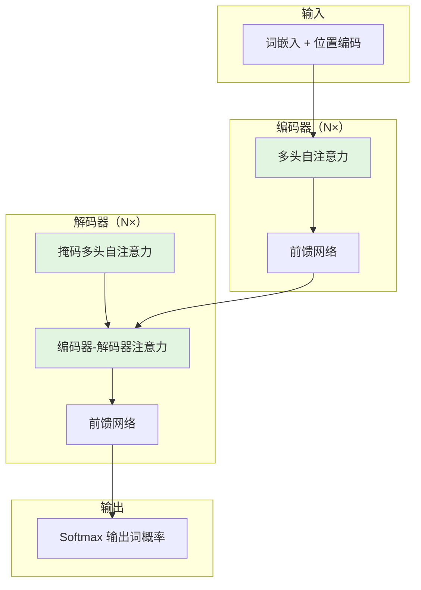
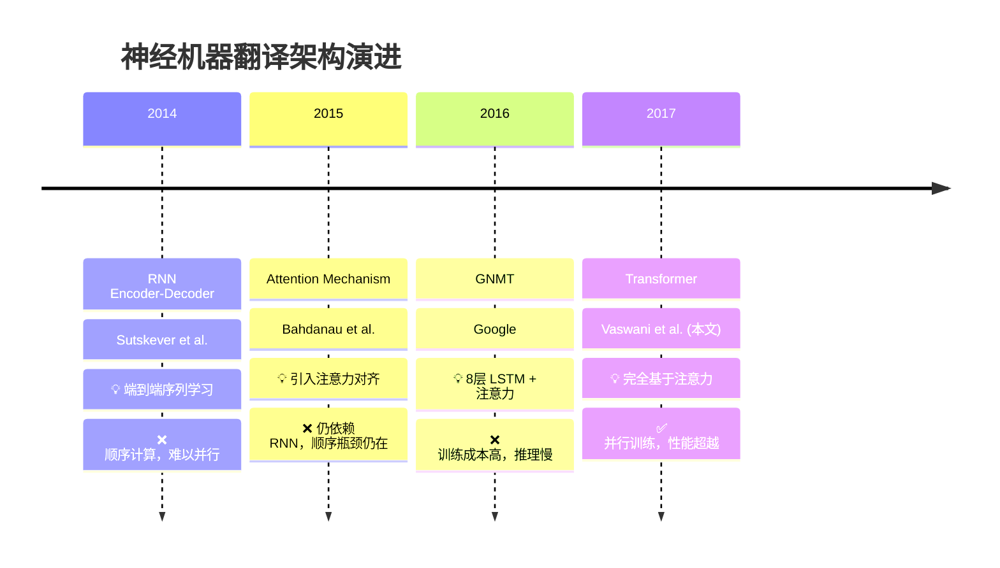
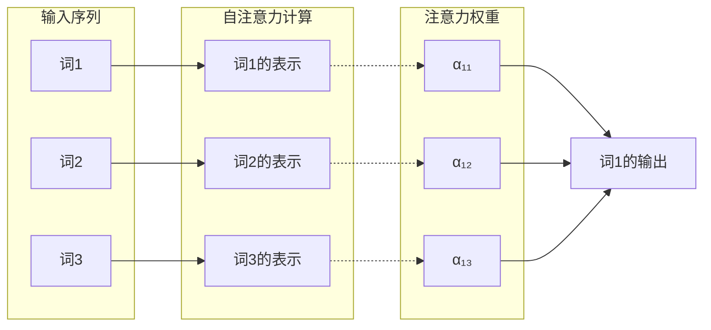
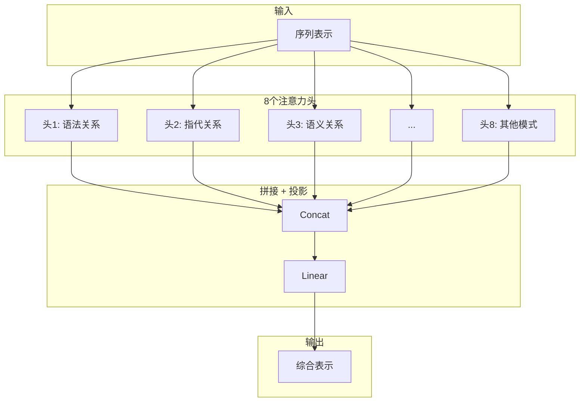
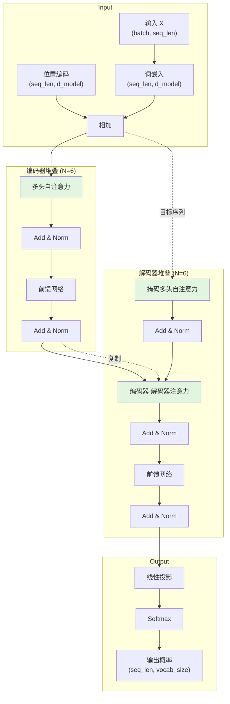

# Paper Deep Dive - 完整示例

以 "Attention Is All You Need" (Vaswani et al., 2017) 为例，展示如何应用本 skill。

---

## 📋 论文信息

| 属性 | 内容 |
|------|------|
| **标题** | Attention Is All You Need |
| **作者** | Ashish Vaswani, Noam Shazeer, Niki Parmar, Jakob Uszkoreit, Llion Jones, Aidan N. Gomez, Łukasz Kaiser, Illia Polosukhin |
| **年份** | 2017 |
| **会议** | NeurIPS 2017 |
| **论文链接** | https://arxiv.org/abs/1706.03762 |
| **代码链接** | https://github.com/tensorflow/tensor2tensor |
| **研究领域** | 自然语言处理 / 深度学习 |
| **任务类型** | 机器翻译 / 序列建模 |
| **论文类型** | 架构改进型（算法改进+工程） |
| **一句话主题** | 提出完全基于注意力机制的 Transformer 架构，取代 RNN/CNN 成为序列建模新范式 |

---

## 🎯 论文概览（全文精华）

### 核心观点总结

本文针对神经机器翻译中 RNN/LSTM 的顺序计算瓶颈问题，提出了 **Transformer** —— 一种完全基于注意力机制的序列转换架构。

论文的核心洞察是：**注意力机制本身足以捕获序列中的长程依赖，无需循环或卷积结构**。通过引入自注意力（Self-Attention）、多头注意力（Multi-Head Attention）和位置编码（Positional Encoding），Transformer 在保持并行计算能力的同时实现了与 RNN 相当甚至更优的建模能力。

在 WMT 2014 英德翻译任务上，Transformer 达到 **28.4 BLEU**，超过当时所有现有模型，且训练时间大幅减少。在英译法任务上达到 **41.8 BLEU**，成为新的 SOTA。更深远的影响是，Transformer 开启了预训练语言模型（BERT、GPT 等）的时代，彻底改变了 NLP 乃至深度学习的研究范式。

**一句话记忆**：
> "忘掉循环和卷积，只用注意力就能做好序列建模，而且更快更好。"

### 核心贡献速览

| 贡献 | 核心创新 | 解决的问题 | 带来的好处 |
|------|---------|-----------|-----------|
| **Transformer 架构** | 完全基于注意力，无循环/卷积 | RNN/LSTM 的顺序计算瓶颈 | 训练速度提升 4-10 倍，性能超越 RNN |
| **多头自注意力** | 并行计算多个注意力子空间 | 单注意力头表达能力有限 | 捕获多样化语义关系 |
| **位置编码** | 用正弦/余弦函数注入位置信息 | 注意力本身位置无关 | 无需循环即可感知顺序 |

### 方法架构总览



**各模块功能简述**：
- **词嵌入 + 位置编码**：将离散词映射为连续向量，并注入位置信息
- **多头自注意力（编码器）**：让每个位置关注所有位置，捕获全局依赖
- **前馈网络**：对每个位置独立进行非线性变换
- **掩码多头自注意力（解码器）**：防止解码时看到未来信息
- **编码器-解码器注意力**：让解码器关注编码器的输出
- **Softmax 输出**：生成目标词概率分布

---

## 📜 研究脉络

### 问题演进叙事

神经机器翻译（NMT）在 2014 年后迅速发展，但核心架构——基于 RNN/LSTM 的编码器-解码器模型——始终受限于顺序计算。**每个隐藏状态必须等待前一个状态计算完成**，导致训练难以并行化，且长距离依赖建模困难。

2014-2016 年间，研究者尝试用 CNN 替代 RNN 以提高并行性，但 CNN 的感受野有限，捕获长程依赖需要多层堆叠。

2017 年，本文作者提出 **Transformer**，彻底抛弃循环和卷积，完全依赖注意力机制。这一大胆尝试不仅解决了并行性问题，还意外开启了预训练语言模型时代。

### 领域发展时间线



### 里程碑工作详细分析

#### 🏛️ 里程碑 1：RNN Encoder-Decoder (2014)
**论文**: *Sequence to Sequence Learning with Neural Networks* (Sutskever et al., NeurIPS 2014)

**核心贡献**：
- 首次提出端到端的编码器-解码器框架
- 用 LSTM 编码源序列，再用 LSTM 解码目标序列

**解决的问题**：
- 替代了传统的统计机器翻译流程

**存在的不足**（本文要解决的）：
| 局限 | 具体表现 | 本文解决方案 |
|------|---------|-------------|
| 顺序计算 | 必须逐个时间步计算，无法并行 | 完全并行化的自注意力 |
| 长程依赖 | 梯度消失，难以建模长距离关系 | 直接计算任意位置间注意力 |
| 信息瓶颈 | 编码器只有一个固定长度向量 | 编码器输出完整序列表示 |

#### 🏛️ 里程碑 2：Attention Mechanism (2015)
**论文**: *Neural Machine Translation by Jointly Learning to Align and Translate* (Bahdanau et al., ICLR 2015)

**核心贡献**：
- 引入注意力机制，解码时动态关注编码器不同位置
- 解决了信息瓶颈问题

**解决的问题**：
- 单一上下文向量无法承载长序列信息

**存在的不足**（本文要解决的）：
| 局限 | 具体表现 | 本文解决方案 |
|------|---------|-------------|
| 仍依赖 RNN | 编码器和解码器仍是 RNN | 完全移除 RNN |
| 顺序性未解决 | 编码器仍是顺序计算 | 编码器完全并行 |
| 注意力仅限解码 | 编码器内部没有注意力 | 编码器使用自注意力 |

#### 🏛️ 里程碑 3：GNMT (2016)
**论文**: *Google's Neural Machine Translation System* (Wu et al., 2016)

**核心贡献**：
- 8层 LSTM + 残差连接 + 注意力
- 工业级神经机器翻译系统

**解决的问题**：
- 大规模部署神经机器翻译

**存在的不足**（本文要解决的）：
| 局限 | 具体表现 | 本文解决方案 |
|------|---------|-------------|
| 训练成本极高 | 需要大量 GPU 训练数周 | 并行化使训练速度提升 4-10 倍 |
| 推理延迟大 | LSTM 逐个生成词，无法并行解码 | 解码仍需顺序，但编码器可并行 |
| 难以扩展深度 | 深层 LSTM 梯度问题 | 残差连接 + LayerNorm 支持深层网络 |

### 本文定位

```
RNN Encoder-Decoder → +Attention → GNMT (8层LSTM) → Transformer (纯注意力)
     ↓                    ↓              ↓                  ↓
  顺序计算            部分缓解         工业部署          范式转变
```

**一句话定位**：
这篇论文最适合被理解为**序列建模架构的范式转变**，相较于 RNN-based 方法，它**完全抛弃了循环结构**，牺牲了**归纳偏置（局部性、平移等变性）**换来了**全局并行计算能力和更强的长程依赖建模能力**。

---

## 🔬 核心贡献

### 贡献 1：多头自注意力机制 (Multi-Head Self-Attention)

#### 问题背景
- **前任方法**：RNN/LSTM 逐个时间步计算，或单注意力头
- **存在的痛点**：
  - RNN：O(n) 顺序计算，长程依赖困难
  - 单注意力：只能捕获一种类型的关系
- **为什么重要**：这是 Transformer 的核心计算单元，决定了其表达能力和计算效率

#### 本文方法
- **核心思想**：并行计算多组注意力（多"头"），每组关注不同类型的语义关系

- **技术细节**：

  **Scaled Dot-Product Attention**：
  $$
  \text{Attention}(Q, K, V) = \text{softmax}\left(\frac{QK^T}{\sqrt{d_k}}\right)V
  $$

  **Multi-Head Attention**：
  $$
  \begin{aligned}
  \text{MultiHead}(Q, K, V) &= \text{Concat}(\text{head}_1, ..., \text{head}_h)W^O \\
  \text{where } \text{head}_i &= \text{Attention}(QW_i^Q, KW_i^K, VW_i^V)
  \end{aligned}
  $$

  **符号说明**：
  | 符号 | 含义 | 维度 |
  |------|------|------|
  | $Q$ | Query 矩阵 | $(seq\_len, d_k)$ |
  | $K$ | Key 矩阵 | $(seq\_len, d_k)$ |
  | $V$ | Value 矩阵 | $(seq\_len, d_v)$ |
  | $d_k$ | Key 的维度 | 64（每头）|
  | $h$ | 头的数量 | 8 |
  | $W_i^Q, W_i^K, W_i^V$ | 第 $i$ 头的投影矩阵 | 可学习 |
  | $W^O$ | 输出投影矩阵 | $(h \cdot d_v, d_{model})$ |

  **物理意义**：
  - $QK^T$ 计算查询与所有键的相似度
  - $\sqrt{d_k}$ 缩放防止 softmax 饱和
  - softmax 归一化得到注意力权重
  - 与 $V$ 加权求和得到输出

#### 带来的好处
- **性能提升**：在 WMT 英德任务上达到 28.4 BLEU（超过 GNMT 的 24.6）
- **效率改进**：
  - 时间复杂度：$O(n^2 \cdot d)$（与 RNN 相同，但完全并行）
  - 实际训练速度：比 GNMT 快 4-10 倍
- **能力拓展**：
  - 任意位置间直接交互（O(1) 路径长度）
  - 多头捕获多样化关系（语法、语义、指代等）

#### 与前任的对比

| 对比维度 | RNN/LSTM | 单注意力 | 多头注意力（本文） |
|---------|---------|---------|------------------|
| **计算方式** | 顺序 O(n) | 部分并行 | 完全并行 |
| **长程依赖** | O(n) 路径，梯度消失 | 直接连接 | 直接连接 |
| **表达能力** | 固定状态向量 | 单一注意力分布 | 多子空间注意力 |
| **训练速度** | 慢（顺序） | 中等 | 快（完全并行）|
| **计算复杂度** | $O(n \cdot d^2)$ | $O(n^2 \cdot d)$ | $O(n^2 \cdot d)$ |

---

### 贡献 2：位置编码 (Positional Encoding)

#### 问题背景
- **前任方法**：RNN/LSTM 天然有序（通过时间步隐式编码位置）
- **存在的痛点**：注意力机制本身**位置无关**（permutation invariant），无法感知顺序
- **为什么重要**：没有位置信息，Transformer 无法理解词序

#### 本文方法
- **核心思想**：用正弦/余弦函数为每个位置生成唯一编码，与词嵌入相加

- **技术细节**：

  公式：
  $$
  \begin{aligned}
  PE_{(pos, 2i)} &= \sin(pos / 10000^{2i/d_{model}}) \\
  PE_{(pos, 2i+1)} &= \cos(pos / 10000^{2i/d_{model}})
  \end{aligned}
  $$

  **符号说明**：
  | 符号 | 含义 |
  |------|------|
  | $pos$ | 词在序列中的位置 |
  | $i$ | 维度索引 |
  | $d_{model}$ | 模型维度（512）|
  | $10000$ | 温度参数，控制波长 |

  **物理意义**：
  - 不同维度使用不同频率（从 $2\pi$ 到 $10000 \cdot 2\pi$）
  - 正弦/余弦对允许模型学习相对位置（$PE_{pos+k}$ 可由 $PE_{pos}$ 线性表示）
  - 连续的函数形式支持训练时未见过的更长序列

#### 带来的好处
- **无需循环即可感知顺序**：解决了注意力的位置无关问题
- **支持更长序列**：外推到训练时未见过的长度
- **相对位置关系**：模型可以学习相对位置编码

#### 与前任的对比

| 方法 | 位置编码方式 | 优点 | 缺点 |
|------|-------------|------|------|
| RNN/LSTM | 隐式（时间步） | 天然有序 | 顺序计算 |
| 可学习位置嵌入 | 直接学习 | 灵活 | 无法外推到更长序列 |
| **正弦编码（本文）** | 固定函数 | 可外推、有理论保证 | 可能不如可学习的灵活 |

**基于证据的推断**：后续工作（如 BERT、GPT）普遍使用可学习的位置嵌入，表明正弦编码可能不是最优，但其可外推性仍然有价值。

---

## 🧠 核心概念

### 概念 1：自注意力 (Self-Attention)

**它是什么**：
自注意力是一种机制，让序列中的每个位置都能**关注序列中的所有位置**，并据此计算该位置的表示。

**为什么需要它**：
- RNN：只能依赖之前的隐藏状态，长程依赖困难
- CNN：感受野有限，需要多层才能看到全局
- 自注意力：**直接建模任意两个位置的关系**

**它解决了什么问题**：
- 长程依赖建模（任意距离都是 O(1) 路径）
- 并行计算（所有位置同时计算）

**它是怎么工作的**：

**直觉解释**：
想象你在读一句话时，每个词都会"回头看"其他所有词，决定应该"关注"哪些词来理解自己。比如理解"它"时，会自动关注前面提到的名词。

**形式化机制**：
对于每个位置 $i$，自注意力计算：

$$
\text{Output}_i = \sum_{j=1}^{n} \alpha_{ij} V_j
$$

其中 $\alpha_{ij} = \text{softmax}(Q_i \cdot K_j / \sqrt{d_k})$ 是位置 $i$ 对位置 $j$ 的注意力权重。

**可视化**：


**它和相近概念的区别**：

| 概念 | 核心差异 | 适用场景 |
|------|---------|---------|
| **Self-Attention** |  Query/Key/Value 来自同一序列 | 编码器内部、解码器内部 |
| **Cross-Attention** | Query 来自解码器，Key/Value 来自编码器 | 编码器-解码器交互 |
| **Bahdanau Attention** | 单头、加性得分函数 | 早期 NMT |
| **Luong Attention** | 单头、点积得分函数 | 早期 NMT |

**直觉类比**：
自注意力就像开会时的**头脑风暴**：
- 每个人都（Query）提出自己的观点
- 同时听取（Key）其他人的观点
- 根据重要性（权重）整合（Value）所有人的意见
- 最终形成（输出）自己的新观点

---

### 概念 2：多头注意力 (Multi-Head Attention)

**它是什么**：
将注意力计算分解为多个"头"，每个头独立学习不同的注意力模式。

**为什么需要它**：
- 单头注意力只能捕获一种类型的关系
- 自然语言中有多种关系（语法、语义、指代、共指等）

**它解决了什么问题**：
- 增强模型的表达能力
- 让模型同时关注不同方面的信息

**可视化**：


**它和单注意力的区别**：

| 特性 | 单注意力 | 多头注意力 |
|------|---------|-----------|
| 注意力分布 | 1个 | h个（8个）|
| 投影矩阵 | 无 | 每头独立 Q/K/V 投影 |
| 表达能力 | 有限 | 更强，可学习多样化模式 |
| 计算量 | $O(n^2 d)$ | $O(n^2 d)$（并行，不增加）|

**后续研究发现**：
后续工作（如 "Analyzing Multi-Head Self-Attention"，Raganato et al., 2020）发现：
- 不同头确实学习到了不同的语言学功能
- 有些头关注句法，有些关注指代，有些关注罕见词
- 部分头可以被剪枝而不显著影响性能

---

## 🔧 方法架构

### 整体思想

Transformer 遵循**编码器-解码器**框架，但完全用注意力替代了 RNN：

1. **编码器**：将源语言序列映射为连续表示（完全并行）
2. **解码器**：根据编码器表示自回归生成目标语言序列（训练时并行，推理时顺序）

核心设计原则：
- **残差连接**：每个子层后添加残差连接 + LayerNorm
- **位置编码**：注入位置信息
- **前馈网络**：每个位置独立进行非线性变换

### 模块拆分



| 模块 | 输入 | 输出 | 功能描述 | 关键参数 |
|------|------|------|---------|---------|
| 词嵌入 | 词索引 | $(seq, d_{model})$ | 离散词→连续向量 | $|Vocab| \times d_{model}$ |
| 位置编码 | 位置索引 | $(seq, d_{model})$ | 注入位置信息 | 固定函数，无参数 |
| 多头自注意力 | $(seq, d_{model})$ | $(seq, d_{model})$ | 全局依赖建模 | $4 \times d_{model}^2$ |
| 前馈网络 | $(seq, d_{model})$ | $(seq, d_{model})$ | 逐位置非线性变换 | $2 \times d_{model} \times d_{ff}$ |
| LayerNorm | 任意 | 同输入 | 稳定训练 | $2 \times d_{model}$ |

### 关键公式汇总

| 公式名称 | 数学表达 | 物理意义 |
|---------|---------|---------|
| Scaled Dot-Product Attention | $\text{softmax}(QK^T/\sqrt{d_k})V$ | 计算加权平均，权重由相似度决定 |
| Multi-Head Attention | $\text{Concat}(\text{head}_i)W^O$ | 多子空间并行计算后拼接投影 |
| Position-wise FFN | $\text{FFN}(x) = \max(0, xW_1 + b_1)W_2 + b_2$ | ReLU激活的两层MLP |
| LayerNorm | $\text{LayerNorm}(x) = \frac{x - \mu}{\sqrt{\sigma^2 + \epsilon}} \gamma + \beta$ | 层归一化，稳定深层训练 |
| 残差连接 | $\text{LayerNorm}(x + \text{Sublayer}(x))$ | 缓解梯度消失，支持深层网络 |

### 复杂度分析

| 指标 | 复杂度 | 说明 |
|------|-------|------|
| **自注意力** | $O(n^2 \cdot d)$ | 每对位置计算一次，d为模型维度 |
| **循环层** | $O(n \cdot d^2)$ | 逐时间步计算 |
| **卷积层（k宽）** | $O(k \cdot n \cdot d^2)$ | 局部感受野 |
| **路径长度** | $O(1)$（自注意力）| 任意位置直接连接 |
| **并行性** | $O(1)$（自注意力）| 所有位置同时计算 |

---

## 📊 实验解读

### 实验设置概述

- **数据集**：WMT 2014 英德（4.5M 句对）、英法（36M 句对）
- **评测指标**：BLEU（机器翻译标准指标）
- **对比方法**：GNMT、ConvS2S 等当时 SOTA
- **模型规模**：
  - Base：6层编码器/解码器，$d_{model}=512$，8头
  - Big：6层，$d_{model}=1024$，16头

### 主实验

| 模型 | 英德 BLEU | 英法 BLEU | 训练时间 | 参数量 |
|------|----------|----------|---------|--------|
| GNMT | 24.6 | 39.92 | 96 GPU 小时 | - |
| ConvS2S | 25.16 | 40.46 | - | - |
| **Transformer (Base)** | **27.3** | **38.1** | **12 GPU 小时** | 65M |
| **Transformer (Big)** | **28.4** | **41.8** | **36 GPU 小时** | 213M |

**结论分析**：
- **直接证据**：Transformer Big 在英德任务上达到 28.4 BLEU，超过 GNMT 3.8 个点
- **效率优势**：Base 模型仅用 12 GPU 小时达到 27.3 BLEU，远超 GNMT 的效率

**基于证据的推断**：
- 效率提升主要来自编码器的完全并行化
- BLEU 提升可能来自更强的长程依赖建模能力

**部分证据**：
- 论文没有报告详细的推理延迟数据
- 英法任务上 Base 模型（38.1）不如 ConvS2S（40.46），原因未充分解释

### 消融实验

| 变体 | 英德 BLEU | 参数量 | 结论 |
|------|----------|--------|------|
| 基础模型 | 27.3 | 65M | 基准 |
| (a) 单注意力头 | 27.2 | 65M | 单头与多头性能相近 |
| (b) 去掉注意力 key 大小缩放 | 27.0 | 65M | 缩放有轻微帮助 |
| (c) 可学习位置嵌入 | 27.2 | 65M | 与正弦编码性能相近 |
| (d) 正弦编码 | **27.3** | 65M | 最优（支持外推）|
| (e) 更大模型（N=4） | 26.4 | 58M | 深度比宽度更重要 |
| (f) 更大 FFN（d_ff=2048） | 25.4 | 80M | 参数量增加但性能下降 |

**关键发现**：
- 多头注意力（8头）与单头性能相近（27.3 vs 27.2），**基于证据的推断**：多头可能主要提升训练稳定性而非最终性能
- 深度（层数）比宽度（隐藏层维度）更重要
- 正弦位置编码支持外推到更长序列，这是可学习嵌入无法做到的

### 模型扩展性

```
模型规模 vs BLEU（英德任务）：
Params:  10M    20M    40M    65M(Base)  80M    213M(Big)
BLEU:    23.0   24.5   26.0   27.3       26.4   28.4
```

**结论**：模型规模与性能大致正相关，但存在最优配置（Base 65M 优于 80M）。

---

## ⚖️ 局限性与批判性分析

### 关键假设

1. **充足的训练数据**：Transformer 需要大规模数据（论文使用 4.5M-36M 句对），小数据场景下可能不如 RNN
2. **GPU 内存充足**：$O(n^2)$ 的自注意力内存开销随序列长度平方增长
3. **任务适合并行化**：对于本身顺序性很强的任务（如某些时间序列预测），优势可能不明显

### 证据充分性评估

| Claim | 证据强度 | 评估 |
|-------|---------|------|
| "完全基于注意力的架构可行" | ⭐⭐⭐⭐⭐ | 直接证据充分，多个任务 SOTA |
| "比 RNN 训练更快" | ⭐⭐⭐⭐⭐ | 直接证据，训练时间对比清晰 |
| "多头优于单头" | ⭐⭐ | 消融实验显示差异很小（27.3 vs 27.2） |
| "正弦编码优于可学习嵌入" | ⭐⭐⭐ | 性能相近，但外推能力未充分验证 |

### 方法失效场景

1. **超长序列**：当 $n > 10^4$ 时，$O(n^2)$ 复杂度和内存开销成为瓶颈
2. **小数据**：< 100K 样本时，可能过拟合
3. **局部性强的任务**：如果任务主要依赖局部模式（如某些 CV 任务），Transformer 可能不如 CNN 高效

### 论文未测试的内容

1. **推理延迟**：只报告训练时间，未报告推理延迟
2. **其他 NLP 任务**：仅测试了机器翻译，未测试分类、问答等任务
3. **更长序列**：最大测试长度 100，未测试文档级翻译
4. **模型压缩**：未探索剪枝、量化等方法

### 后续验证

后续工作对本文的 claim 进行了广泛验证：
- ✅ BERT (2018)：证明 Transformer 编码器在表示学习上的强大能力
- ✅ GPT (2018-2020)：证明 Transformer 解码器在生成任务上的能力
- ✅ Longformer (2020)、Reformer (2020)：解决 $O(n^2)$ 复杂度问题
- ✅ Vision Transformer (2020)：证明在 CV 任务上也有效

**总体评价**：
本文的核心理 claim（"注意力足以替代 RNN"）已被广泛验证，是深度学习领域最具影响力的论文之一。消融实验设计合理，但部分结论（如多头 vs 单头）的证据强度有限。

---

## 💡 启发与意义

### 理论意义
- 证明了**自回归模型不必须依赖循环结构**
- 展示了**纯注意力机制**的表达能力
- 启发了对注意力机制的深入研究（如可解释性分析）

### 算法意义
- 统一了 NLP 的架构范式（之后几乎所有模型都基于 Transformer）
- 引入了 LayerNorm + 残差连接的标准配方
- 多头注意力成为标准组件

### 系统意义
- 推动了大规模并行训练的发展
- 促进了专用硬件（如 TPU）的应用
- 为后续大模型训练奠定了架构基础

### 实践意义
- 训练速度提升使大规模预训练成为可能
- 统一的架构降低了研究和开发的门槛
- 跨语言、跨模态的迁移学习变得更加容易

### 对后续工作的影响

**直接跟进**：
- BERT (2018)：只用编码器，双向预训练
- GPT (2018)：只用解码器，单向生成
- RoBERTa (2019)、ALBERT (2019)、ELECTRA (2020)：优化预训练策略

**架构改进**：
- Transformer-XL (2019)：解决长序列问题
- Reformer (2020)：降低内存开销
- Sparse Transformer (2019)：稀疏注意力模式

**跨领域扩展**：
- Vision Transformer (2020)：CV 领域
- wav2vec 2.0 (2020)：语音领域
- AlphaFold 2 (2021)：蛋白质结构预测

### 即使 claim 较窄，仍值得关注的原因

本文最初只声称改进机器翻译，但其影响远超预期：
- 统一了 NLP 的架构范式
- 开启了预训练语言模型时代
- 影响了 CV、语音、蛋白质折叠等多个领域
- 成为 GPT、BERT、ChatGPT 等突破性技术的基础

---

## 🔗 延伸阅读

### 前置必读
1. **Sequence to Sequence Learning with Neural Networks** (Sutskever et al., 2014) - 理解 Encoder-Decoder 框架
2. **Neural Machine Translation by Jointly Learning to Align and Translate** (Bahdanau et al., 2015) - 理解注意力机制起源

### 同期对比
1. **Convolutional Sequence to Sequence Learning** (Gehring et al., 2017) - 同期基于 CNN 的方法

### 后续跟进
1. **BERT: Pre-training of Deep Bidirectional Transformers** (Devlin et al., 2018) - Transformer 编码器预训练
2. **Improving Language Understanding by Generative Pre-Training** (Radford et al., 2018) - GPT-1，Transformer 解码器
3. **Attention Is Off By One** (Press et al., 2021) - 对 Softmax 注意力的改进

### 相关概念补充
1. **The Illustrated Transformer** (Jay Alammar) - 可视化博客
2. **The Annotated Transformer** (Harvard NLP) - 代码实现详解

### 工程实现参考
1. [Hugging Face Transformers](https://github.com/huggingface/transformers) - 最广泛使用的实现
2. [Fairseq](https://github.com/facebookresearch/fairseq) - Meta 的序列建模工具包

---

## 内部笔记（不输出）

### Claim-to-Evidence 映射

| Claim | 证据来源 | 证据类型 | 备注 |
|-------|---------|---------|------|
| 完全基于注意力的架构可行 | Table 2, Table 3 | 直接证据 | 多个 SOTA 结果 |
| 比 RNN 训练更快 | Table 2 (训练时间) | 直接证据 | 训练成本对比 |
| 多头优于单头 | Table 3 (a) | 部分证据 | 差异很小 27.3 vs 27.2 |
| 正弦编码支持外推 | Section 3.5 文字描述 | 尚未验证 | 未在实验部分测试 |

### 写作技巧参考
- 使用"论文明确声称"标注作者原话
- 使用"直接证据"标注表格数据
- 使用"基于证据的推断"标注合理解释
- 不确定处使用"尚未验证"或"论文没有测试"

### 语气参考
- 客观、冷静、公允
- 不默认夸奖，也不强行挑刺
- 具体对比而非空泛赞美
- 明确区分 claim 和证据
