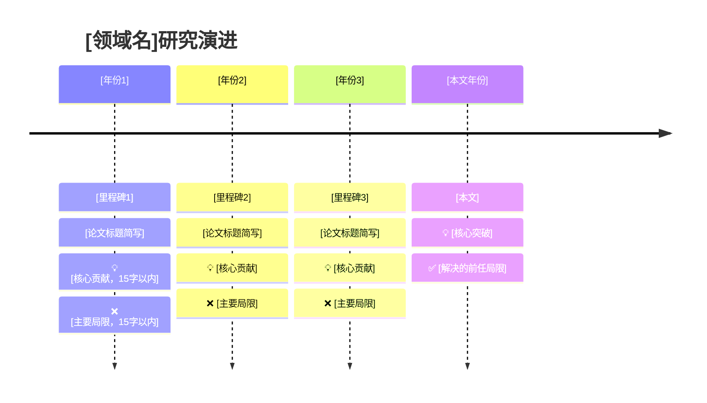
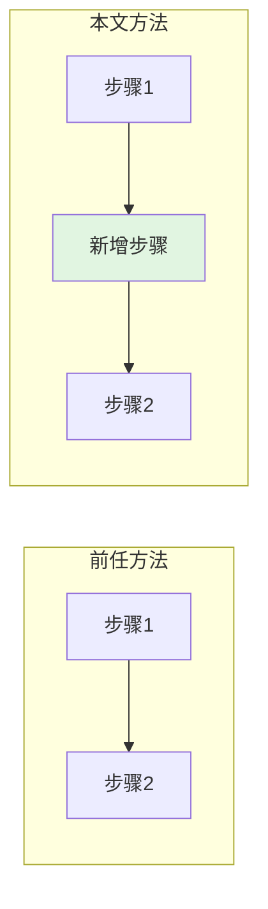
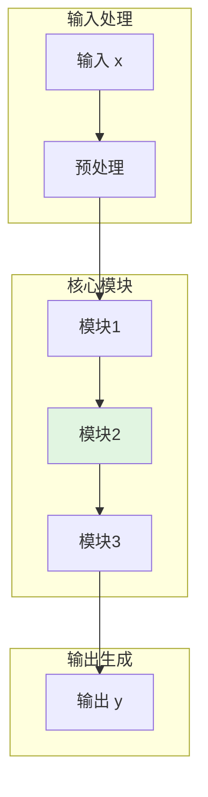

# Paper Deep Dive - 完整输出模板

标准输出结构的详细模板，可直接复制填空。

---

## 📋 论文信息

```markdown
| 属性 | 内容 |
|------|------|
| **标题** | [论文完整标题] |
| **作者** | [作者列表] |
| **年份** | [发表年份] |
| **会议/期刊** | [会议名/期刊名] |
| **论文链接** | [arXiv/官方链接] |
| **代码链接** | [GitHub/project page] |
| **研究领域** | [如：NLP/CV/系统/理论] |
| **任务类型** | [如：分类/生成/检索/推理] |
| **论文类型** | [理论型/工程型/算法改进型/综述型/Benchmark型/Infra型] |
| **一句话主题** | [用一句话概括论文核心] |
```

---

## 🎯 论文概览（全文精华）

### 核心观点总结

[第1段：问题背景 + 本文方法概述]
- 本文针对什么问题？
- 提出了什么方法/框架？
- 核心创新是什么？

[第2段：主要成果 + 意义]
- 量化结果（准确率提升X%、速度提升Y倍等）
- 定性结果（解决了什么开放问题、验证了什么假设）
- 对领域的影响（推动了什么方向、被哪些后续工作引用）

**一句话记忆**：
[用一句话抓住论文本质，适合复述和记忆]

### 核心贡献速览

| 贡献 | 核心创新 | 解决的问题 | 带来的好处 |
|------|---------|-----------|-----------|
| 贡献1 | [一句话描述创新点] | [前任方法的痛点] | [量化收益，如准确率+X%] |
| 贡献2 | [一句话描述创新点] | [前任方法的痛点] | [量化收益] |
| 贡献3 | [一句话描述创新点] | [前任方法的痛点] | [量化收益] |

### 方法架构总览

```mermaid
flowchart TB
    subgraph 输入层
        I1[输入模块1]
        I2[输入模块2]
    end
    
    subgraph 核心方法
        C1[核心模块1]
        C2[核心模块2]
        C3[核心模块3]
        C1 --> C2 --> C3
    end
    
    subgraph 输出层
        O[输出]
    end
    
    I1 --> C1
    I2 --> C2
    C3 --> O
    
    style C2 fill:#e1f5e1  %% 本文创新点高亮
```

**各模块功能简述**：
- **输入模块1**：[一句话功能描述]
- **输入模块2**：[一句话功能描述]
- **核心模块1**：[一句话功能描述]
- **核心模块2（本文创新）**：[一句话功能描述，说明与前任的差异]
- **核心模块3**：[一句话功能描述]
- **输出**：[一句话功能描述]

---

## 📜 研究脉络

### 问题演进叙事

[2-3段文字描述该问题的研究历程]

第1段：问题最初是如何被提出的？早期方法是什么？
第2段：经历了哪些关键突破？每次突破解决了什么、留下了什么？
第3段：本文在这个链条中的位置？它回应了哪个关键不足？

### 领域发展时间线



### 里程碑工作详细分析

#### 🏛️ 里程碑 1：[论文名]（年份）
**论文**: *[标题]* (作者, 会议/期刊)

**核心贡献**：
- 贡献1：[一句话描述]
- 贡献2：[一句话描述]

**解决的问题**：
- [该工作之前存在的痛点]

**存在的不足**（本文要解决的）：
| 局限 | 具体表现 | 本文解决方案 |
|------|---------|-------------|
| [局限1] | [具体表现] | [本文如何解决] |
| [局限2] | [具体表现] | [本文如何解决] |

#### 🏛️ 里程碑 2：[论文名]（年份）
[同上结构]

#### 🏛️ 里程碑 3：[论文名]（年份）
[同上结构]

### 本文定位

**研究演进链中的位置**：
```
[早期方法] → [里程碑1] → [里程碑2] → [前任SOTA] → [本文]
     ↓           ↓           ↓            ↓          ↓
   [局限A]     [局限B]     [局限C]      [局限D]    [解决D]
```

**一句话定位**：
这篇论文最适合被理解为 [描述其方法论贡献或定位]，相较于 [最相关前作]，它 [核心差异]，牺牲了 [什么] 换来了 [什么]。

---

## 🔬 核心贡献

### 贡献 1：[名称]

#### 问题背景
- **前任方法**：[具体方法名，如"Mamba-2的标量×单位矩阵设计"]
- **存在的痛点**：[具体局限，最好量化，如"在奇偶校验任务上准确率仅50%（随机水平）"]
- **为什么重要**：[这个问题对整体性能/效率的影响，如"状态追踪能力是序列模型的基本能力，缺失会限制应用场景"]

#### 本文方法
- **核心思想**：[一句话概括方法的本质，如"引入复数状态转移矩阵，实现数据依赖的旋转动力学"]

- **技术细节**：
  
  公式：
  $$
  [关键公式，如：h_t = e^{\Delta_t A_t} R_t h_{t-1} + \Delta_t B_t x_t]
  $$
  
  **符号说明**：
  | 符号 | 含义 | 维度 |
  |------|------|------|
  | $h_t$ | [含义] | [维度] |
  | ... | ... | ... |
  
  **物理意义**：
  [这条公式在做什么，如"该公式表示状态更新由三部分组成：历史状态衰减、旋转变换、当前输入投影"]

- **算法流程**（如适用）：
  1. [步骤1]
  2. [步骤2]
  3. [步骤3]

#### 带来的好处
- **性能提升**：[具体数据，如"奇偶校验准确率从50%提升至100%"]
- **效率改进**：[时间/空间复杂度变化，如"保持O(n)复杂度，状态大小不变"]
- **能力拓展**：[解决了前任无法完成的任务，如"首次让线性复杂度模型具备状态追踪能力"]

#### 与前任的对比

| 对比维度 | [前任方法名] | 本文方法 |
|---------|-------------|---------|
| **核心思想** | [前任的核心思路] | [本文的核心思路] |
| **关键机制** | [前任的关键组件] | [本文的关键组件] |
| **性能（任务A）** | [前任结果] | [本文结果，+X%] |
| **性能（任务B）** | [前任结果] | [本文结果，+Y%] |
| **计算复杂度** | [前任复杂度] | [本文复杂度] |
| **内存开销** | [前任开销] | [本文开销] |
| **引入的代价** | - | [本文引入的额外复杂度/假设] |

**可视化对比**（如适用）：


---

### 贡献 2：[名称]
[同上结构]

### 贡献 3：[名称]
[同上结构]

---

## 🧠 核心概念

### 概念 1：[名称]

**它是什么**：
[清晰定义，如"状态空间模型（SSM）是一种使用隐藏状态随时间演化的微分/差分方程来描述系统动态的数学模型"]

**为什么需要它**：
[解释它填补了什么空缺，如"Transformer有O(n²)复杂度，RNN有梯度消失问题，SSM兼顾了两者优势"]

**它解决了什么问题**：
[把它和论文目标关联，如"SSM提供了固定状态大小下建模长程依赖的能力，是本文方法的基础"]

**它是怎么工作的**：

[直觉解释]
[用大白话解释核心机制，如"想象你有一个笔记本，每次读新内容时，根据重要性决定记多少、忘多少"]

[形式化机制]
公式：
$$
[关键公式]
$$

**符号说明**：
| 符号 | 含义 | 维度 |
|------|------|------|
| ... | ... | ... |

**它和相近概念的区别**：
| 概念 | 核心差异 | 适用场景 |
|------|---------|---------|
| [相近概念1] | [关键差异] | [适用场景] |
| [相近概念2] | [关键差异] | [适用场景] |

**直觉类比或小例子**：
[具体类比或 toy example，如"图书馆管理员 vs 索引卡片系统 vs 分类笔记本"]

---

### 概念 2：[名称]
[同上结构]

---

## 🔧 方法架构

### 整体思想

[2-3段描述方法的整体设计思想]
- 为什么要这样设计？
- 核心 insight 是什么？
- 与前作的最大区别在哪里？

### 模块拆分



| 模块 | 输入 | 输出 | 功能描述 | 关键参数 |
|------|------|------|---------|---------|
| 预处理 | [输入] | [输出] | [功能] | [参数] |
| 模块1 | [输入] | [输出] | [功能] | [参数] |
| 模块2（创新） | [输入] | [输出] | [功能] | [参数] |
| 模块3 | [输入] | [输出] | [功能] | [参数] |

### 数据流

[描述数据如何在系统中流动，从输入到输出的完整路径]


### 训练流程

1. [训练步骤1：数据准备/预处理]
2. [训练步骤2：前向传播]
3. [训练步骤3：损失计算]
   - 损失函数：$\mathcal{L} = ...$
4. [训练步骤4：反向传播/参数更新]
5. [训练步骤5：评估/早停]

### 推理流程

1. [推理步骤1：输入处理]
2. [推理步骤2：核心计算]
3. [推理步骤3：输出生成]

### 关键公式汇总

| 公式名称 | 数学表达 | 物理意义 |
|---------|---------|---------|
| [名称1] | $$...$$ | [意义] |
| [名称2] | $$...$$ | [意义] |

### 复杂度分析

| 指标 | 复杂度 | 说明 |
|------|-------|------|
| 时间复杂度（训练） | [如：O(n²)] | [说明] |
| 时间复杂度（推理） | [如：O(n)] | [说明] |
| 空间复杂度 | [如：O(n)] | [说明] |
| 参数量 | [如：1.5B] | [说明] |

### 与最相关 Baseline 的直接对比

| 特性 | [Baseline 1] | [Baseline 2] | 本文方法 |
|------|-------------|-------------|---------|
| 架构特点 | ... | ... | ... |
| 训练成本 | ... | ... | ... |
| 推理速度 | ... | ... | ... |
| 内存占用 | ... | ... | ... |
| 关键优势 | ... | ... | ... |
| 主要局限 | ... | ... | ... |

---

## 📊 实验解读

### 实验设置概述

- **数据集**：[数据集名称，规模，特点]
- **评测指标**：[指标1, 指标2, ...]
- **对比方法**：[Baseline 1, Baseline 2, ...]
- **实验环境**：[硬件配置，如"8×A100 80GB"]

### 主实验

**实验设计**：
- 验证的 claim：[该实验在验证什么核心结论]
- 设置细节：[关键设置]

**主要结果**：

| 方法 | 指标A | 指标B | 指标C |
|------|-------|-------|-------|
| Baseline 1 | X1 | Y1 | Z1 |
| Baseline 2 | X2 | Y2 | Z2 |
| **本文方法** | **X3** | **Y3** | **Z3** |
| 提升幅度 | +ΔX | +ΔY | +ΔZ |

**结论分析**：
- 结果说明什么：[直接结论]
- 是否支持 claim：[是否验证了论文声称的结论]
- 替代解释：[还可能有什么其他解释]
- 未测试的：[还有哪些场景没有覆盖]

### 消融实验

| 配置 | 指标A | 相对完整模型 | 结论 |
|------|-------|-------------|------|
| 完整模型 | X | - | 基准 |
| 去掉组件A | X-Δ1 | -Δ1 | 组件A贡献Δ1 |
| 去掉组件B | X-Δ2 | -Δ2 | 组件B贡献Δ2 |
| 只用组件A | X-Δ3 | -Δ3 | 单独作用有限 |

**关键发现**：
- [发现1：哪个组件贡献最大]
- [发现2：组件之间是否有协同效应]
- [发现3：是否有冗余组件]

### 效率实验

| 方法 | 吞吐 (samples/s) | 延迟 (ms) | 内存 (GB) |
|------|-----------------|-----------|-----------|
| Baseline 1 | X1 | Y1 | Z1 |
| Baseline 2 | X2 | Y2 | Z2 |
| 本文方法 | X3 | Y3 | Z3 |

**分析**：
- 效率提升来源：[如"主要来自并行化优化"]
- 瓶颈分析：[当前主要瓶颈在哪里]

### 鲁棒性实验（如有）

| 扰动类型 | 本文方法 | Baseline | 差距变化 |
|---------|---------|---------|---------|
| 扰动1 | X1 | Y1 | Δ1 |
| 扰动2 | X2 | Y2 | Δ2 |

**结论**：方法在不同条件下的稳定性如何。

### 扩展性实验（如有）

| 模型规模 | 指标 | 相对收益 |
|---------|------|---------|
| Small | X1 | 基准 |
| Medium | X2 | +Δ1 |
| Large | X3 | +Δ2 |

**Scaling 趋势**：[是否随规模提升而持续受益]

### 实验总体评价

**最强证据**：
- [哪组实验最有说服力，为什么]

**最弱证据**：
- [哪组实验证据不足，存在什么问题]

**未被充分验证的 claim**：
- [论文声称了什么但实验没有很好验证]

---

## ⚖️ 局限性与批判性分析（强制）

### 关键假设

方法依赖的核心假设：
1. [假设1：如"训练数据分布与测试数据分布一致"]
2. [假设2：如"任务可以用固定长度的状态表示"]
3. [假设3：如"评估指标能真实反映任务质量"]

**假设失效的场景**：
- [场景1：假设1在什么情况下不成立]
- [场景2：假设2在什么情况下不成立]

### 证据充分性评估

| Claim | 证据强度 | 评估 |
|-------|---------|------|
| Claim 1 | ⭐⭐⭐⭐⭐ | [直接证据充分] |
| Claim 2 | ⭐⭐⭐ | [部分证据支持] |
| Claim 3 | ⭐⭐ | [基于结果的推断] |

### 可能的替代解释

1. [替代解释1：结果提升可能来自X而非Y]
2. [替代解释2：优势可能只在特定条件下成立]

### 依赖条件

哪些结论高度依赖：
- [ ] 特定 benchmark
- [ ] 特定数据集
- [ ] 更大模型规模
- [ ] 更多训练数据
- [ ] 精细调参
- [ ] 特定硬件/软件环境

### 方法失效场景

方法在以下场景可能表现不佳：
1. [场景1：如"超长序列（>100K tokens）"]
2. [场景2：如"多模态混合数据"]
3. [场景3：如"低资源语言"]

### 论文未测试的内容

1. [未测试1：如"更大规模（>100B参数）"]
2. [未测试2：如"与其他SOTA的公平对比"]
3. [未测试3：如"实际部署中的长尾延迟"]

### 总体可信度评估

| 维度 | 评分 | 说明 |
|------|------|------|
| 方法创新性 | X/5 | [评价] |
| 实验充分性 | X/5 | [评价] |
| 结论可信度 | X/5 | [评价] |
| 可复现性 | X/5 | [评价] |

**总体评价**：
[公允、冷静、具体的评价，不默认夸奖，也不强行挑刺]

---

## 💡 启发与意义

### 理论意义
- [对理论理解有什么贡献]

### 算法意义
- [对算法设计有什么启发]

### 系统意义
- [对系统设计有什么影响]

### 实践意义
- [在实际应用中有什么价值]

### 对后续工作的影响
- [开启了什么方向]
- [被哪些后续工作引用/跟进]

### 打开的新研究方向
1. [方向1：如"将该方法扩展到多模态场景"]
2. [方向2：如"与其他技术的结合"]
3. [方向3：如"理论上的深入分析"]

### 即使 claim 较窄，仍值得关注的原因
- [该论文的其他价值]

---

## 🔗 延伸阅读

### 前置必读（理解本文必须先读）
1. [论文1] - [简要说明为什么必须先读]
2. [论文2] - [简要说明]

### 同期对比（与本文同时期的相关工作）
1. [论文1] - [与本文的对比]
2. [论文2] - [与本文的对比]

### 后续跟进（本文之后的重要工作）
1. [论文1] - [如何基于本文]
2. [论文2] - [如何改进/扩展]

### 相关概念补充
1. [论文/资料1] - [补充什么概念]
2. [论文/资料2] - [补充什么概念]

### 工程实现参考
1. [代码仓库1] - [官方/第三方实现]
2. [博客/教程1] - [工程实践分享]

---

## 附录：内部笔记（可选，不输出）

### Claim-to-Evidence 映射

| Claim | 证据来源 | 证据类型 | 备注 |
|-------|---------|---------|------|
| ... | ... | ... | ... |

### 待核实的问题
- [ ] [问题1]
- [ ] [问题2]

### 与代码的不一致之处
- [位置]：论文说X，代码实现Y
