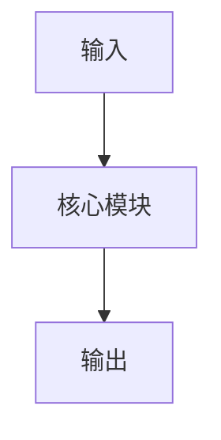

# Paper Deep Dive - 速查

用这份文档快速确认输出结构、证据标签和收尾检查项。

---

## 输出结构速查

### Standard

```text
📋 论文信息
🎯 论文概览
📜 研究脉络
🔬 核心贡献
🧠 核心概念
🔧 方法架构
📊 实验解读
⚖️ 局限性与批判性分析
💡 启发与意义
🔗 延伸阅读
```

### Deep Dive 额外要求

- 研究脉络通常扩展到 4 到 6 篇里程碑工作
- 实验部分给出 claim-to-evidence 映射
- 关键概念做更完整的直觉 + 形式化解释
- 局限性不少于 3 个具体方面

### 受限版 deep dive

输入只有标题和摘要，或拿不到正文时：
- 开头明确标注输入受限
- 压缩方法和实验细节
- 把未确认部分写成“待验证”
- 不强行给 claim-to-evidence 映射

---

## 开头必须写好的部分

### 🎯 论文概览

至少包含：
- 1 到 2 段详细总结：问题、方法、结果、意义
- 一句话记忆
- 核心贡献速览表
- 高层方法图和模块说明

```markdown
## 🎯 论文概览

### 核心观点总结
[第1段：问题与方法]
[第2段：结果与意义]

**一句话记忆**：
[一句话抓住论文本质]

### 核心贡献速览
| 贡献 | 核心创新 | 解决的问题 | 带来的好处 |
|------|---------|-----------|-----------|
| 贡献1 | ... | ... | ... |
| 贡献2 | ... | ... | ... |

### 方法架构总览


**各模块功能简述**：
- **输入**：...
- **核心模块**：...
- **输出**：...
```

---

## 中间章节速查

### 📜 研究脉络

检查：
- 是否解释了本文为什么出现
- 是否选出 3 到 6 篇真正构成主线的前作
- 是否写出“前作贡献 + 前作局限 + 本文回应”
- 是否给出一句清晰的“本文定位”

### 🔬 核心贡献

每项贡献都尽量覆盖：
- 问题背景
- 前任方法和局限
- 本文改动
- 工作机制
- 带来的收益
- 证据类型
- caveat

### 🧠 核心概念

只解释真正卡理解的概念。优先用这套顺序：
- 它是什么
- 为什么需要它
- 它怎么工作
- 它和相近概念的区别
- 一个直觉类比或 toy example

### 📊 实验解读

先问，再写：
- 这个实验在验证什么 claim
- 结果是直接证据，还是只有部分证据
- 是否存在替代解释
- baseline 是否足够强且比较公平

---

## 证据标签速查

| 标签 | 何时使用 | 例子 |
|------|---------|------|
| `论文明确声称` | 作者在文中直接写出的结论 | “论文明确声称该方法达到 SOTA。” |
| `直接证据` | 表格、图或实验结果直接支持 | “直接证据来自 Table 2。” |
| `部分证据` | 只在部分设置下成立 | “部分证据显示该方法只在大模型上明显有效。” |
| `基于证据的推断` | 结合结果做出的合理解释 | “基于证据的推断，主要收益可能来自组件 A。” |
| `尚未验证` | 作者提及或暗示，但未严格测试 | “论文提到可迁移到多模态，但这一点尚未验证。” |

### 推荐表述

- “论文没有完整说明……”
- “这一点更像是根据 Figure X 的趋势推断出来的”
- “结果表明整体提升显著，但论文没有隔离验证该组件的独立贡献”
- “代码实现中使用了 X，而论文描述为 Y，此处存在差异”

---

## 图表速查

详细规范看 `references/visualization.md`。这里只记选择规则：

| 目标 | 推荐图表 |
|------|---------|
| 讲研究演进 | `timeline` |
| 讲算法步骤 | `flowchart TD` |
| 讲系统或模块结构 | `flowchart TB` |
| 讲前后对比 | `flowchart LR` |
| 讲概念层次 | `mindmap` |

图表原则：
- 一张图只回答一个核心问题
- 节点尽量控制在 10 个以内
- 节点名字写功能，不只写符号
- 用颜色强调本文创新，而不是装饰整图

---

## 输出前自检

### A. 概览是否够强

- [ ] 是否先讲清问题、方法、结果、意义
- [ ] 是否有一句话记忆
- [ ] 是否有贡献速览表
- [ ] 是否有高层方法图

### B. 脉络是否是真主线

- [ ] 是否避免堆文献名
- [ ] 是否说明每篇前作的局限
- [ ] 是否清楚交代本文在演进链中的位置

### C. 方法是否讲透

- [ ] 是否给出关键模块和信息流
- [ ] 是否兼顾直觉和形式化
- [ ] 是否解释了与最相关 baseline 的差异

### D. 实验是否真正服务于 claim

- [ ] 是否区分了 claim 和证据
- [ ] 是否写明 baseline 强度和公平性
- [ ] 是否指出了未验证的地方
- [ ] 是否避免只是抄表格数字

### E. 批判性分析是否成立

- [ ] 是否单独写了局限性
- [ ] 是否指出了依赖规模、数据、调参预算或硬件的结论
- [ ] 是否诚实标出了不确定点

---

## 最后五问

输出前快速确认：
1. 读者能讲清这篇论文在解决什么问题吗？
2. 读者能把它放进研究脉络里吗？
3. 读者能理解最核心的机制吗？
4. 读者能判断实验是否真的支撑主要 claim 吗？
5. 读者能同时看到价值和局限吗？
