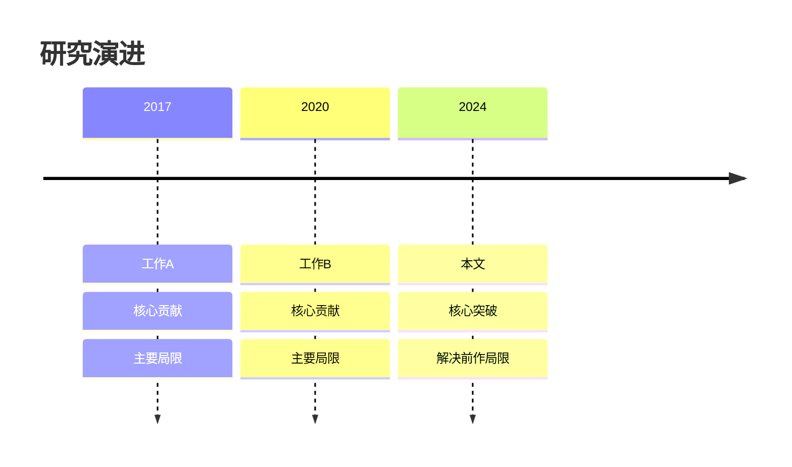
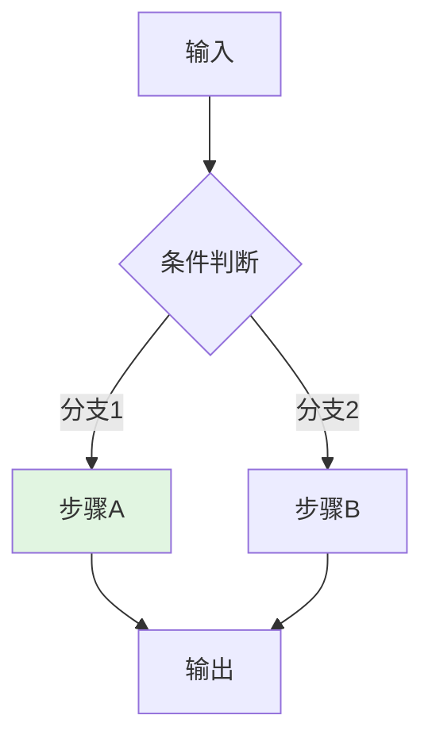
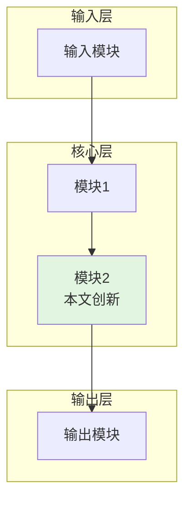
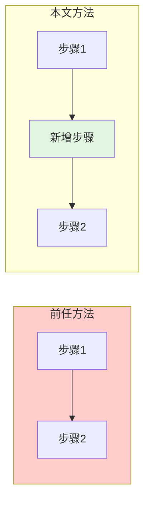
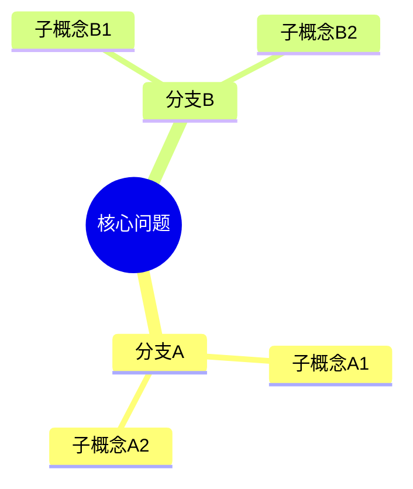

# Paper Deep Dive - 可视化规范

在图确实能降低理解成本时再使用 Mermaid。目标是解释，不是装饰。

---

## 什么时候画图

优先在以下场景使用：
- 需要展示研究演进或里程碑关系
- 需要展示方法的高层模块和信息流
- 需要展示训练 / 推理流程
- 需要展示本文与前作的关键差异
- 需要展示概念之间的层次关系

不必画图的场景：
- 图只是在重复正文
- 关系过于简单，一句话就能说清
- 为了“看起来完整”而硬凑图

---

## 图表类型选择

| 目的 | 推荐类型 | 典型场景 |
|------|---------|---------|
| 展示时间演进 | `timeline` | 研究脉络、版本演进 |
| 展示流程步骤 | `flowchart TD` | 算法流程、训练流程 |
| 展示模块结构 | `flowchart TB` | 系统架构、模块关系 |
| 展示前后对比 | `flowchart LR` | 本文 vs 前作 |
| 展示层次关系 | `mindmap` | 概念框架、知识结构 |

---

## 通用设计原则

1. 一张图只回答一个核心问题。
2. 节点名称写功能，不只写数学符号。
3. 节点尽量控制在 10 个以内，复杂系统拆成多张图。
4. 颜色只用于表达语义，不用于装饰。
5. 如果颜色有明确含义，就在正文里顺手说明。

推荐颜色约定：
- `#e1f5e1`：本文创新或改进
- `#ffcccc`：前作方案或被替代部分
- `#fff4e1`：关键注意点或中间环节

---

## 模板

### 1. 时间线：研究脉络

适用建议：
- 每个节点控制在 3 到 4 行
- 优先写“贡献 + 局限”，不要堆细节
- 时间线是讲主线，不是列相关工作全集

### 2. 流程图：算法或训练步骤

适用建议：
- `TD` 适合自上而下解释过程
- 判断节点用 `{...}`
- 分支条件写在连线上

### 3. 架构图：系统或模块关系

适用建议：
- 用 `subgraph` 表示层次
- 优先画高层结构，不要把论文所有细节都塞进去
- 高亮本文真正新增或最关键的模块

### 4. 对比图：前作 vs 本文

适用建议：
- 用来回答“本文究竟改了什么”
- 高亮关键差异，不要平均对待所有节点

### 5. 思维导图：概念层次

适用建议：
- 适合整理概念簇和分类框架
- 不适合画过程或因果链

---

## 常见错误

### 1. 图只是把段落换成方框

避免：
- 每个句子一个节点
- 节点密到需要读者逐字阅读

改法：
- 先问这张图要回答什么问题
- 只保留支撑这个问题的节点

### 2. 把“相关工作列表”画成时间线

避免：
- 列很多论文名但不写它们的作用

改法：
- 时间线只留主线里程碑
- 每个节点至少写贡献和局限

### 3. 对比图没有真正对比

避免：
- 左右两张几乎一样的图
- 不高亮差异点

改法：
- 把新增模块、替换模块或删除模块显式标出来

### 4. 架构图太底层

避免：
- 把每个公式项都变成节点
- 把图画成实现细节展开图

改法：
- 架构图先保留 2 到 4 层高层模块
- 公式留在正文单独解释

---

## 推荐使用顺序

1. 先写正文，确定你真正要解释什么。
2. 再决定是否需要图。
3. 先画高层图，再决定要不要补一张更细的图。
4. 出图后回看：删掉不能降低理解成本的节点。

---

## 收尾检查

- [ ] 这张图是否回答了一个明确问题
- [ ] 没看正文时，读者能否靠图抓住主线
- [ ] 节点数量是否仍然可读
- [ ] 颜色是否有明确语义
- [ ] 图是否真的比纯文字更清楚
