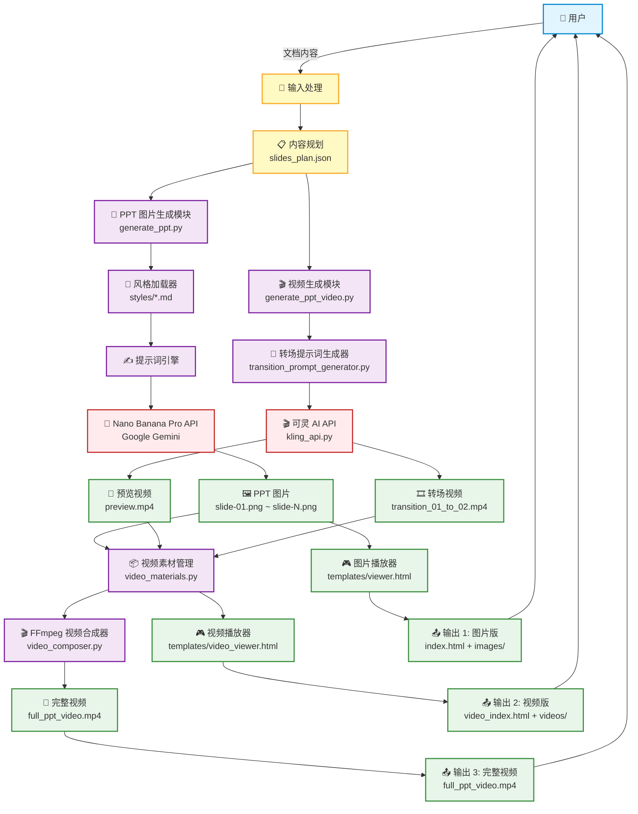

# PPT Generator Pro 架构文档

## 📐 系统架构图



## 🏗️ 模块架构

### 1️⃣ 核心生成模块

```
┌─────────────────────────────────────────────────────────────┐
│                    PPT Generator Pro                         │
├─────────────────────────────────────────────────────────────┤
│                                                              │
│  ┌────────────────────┐        ┌──────────────────────┐    │
│  │  图片生成模块      │        │   视频生成模块       │    │
│  │  generate_ppt.py   │        │ generate_ppt_video.py│    │
│  └────────────────────┘        └──────────────────────┘    │
│           │                              │                  │
│           ▼                              ▼                  │
│  ┌────────────────────┐        ┌──────────────────────┐    │
│  │  风格系统          │        │  转场提示词生成      │    │
│  │  styles/*.md       │        │ transition_prompt_   │    │
│  │                    │        │   generator.py       │    │
│  └────────────────────┘        └──────────────────────┘    │
│           │                              │                  │
│           ▼                              ▼                  │
│  ┌────────────────────┐        ┌──────────────────────┐    │
│  │ Nano Banana Pro    │        │   可灵 AI API        │    │
│  │ (Gemini 3 Pro)     │        │   kling_api.py       │    │
│  └────────────────────┘        └──────────────────────┘    │
│           │                              │                  │
│           ▼                              ▼                  │
│    🖼️ PPT 图片                    🎬 转场视频               │
│                                                              │
└─────────────────────────────────────────────────────────────┘
```

### 2️⃣ 视频合成模块

```
┌─────────────────────────────────────────────────────────────┐
│               FFmpeg 视频合成流程                            │
├─────────────────────────────────────────────────────────────┤
│                                                              │
│  输入素材:                                                   │
│  ├── 📷 PPT 图片 (slide-01.png ~ slide-N.png)              │
│  ├── 🔄 预览视频 (preview.mp4)                              │
│  └── 🎞️ 转场视频 (transition_XX_to_YY.mp4)                 │
│                                                              │
│  ┌────────────────────────────────────────────────┐         │
│  │     video_materials.py - 素材管理             │         │
│  │  • 收集所有素材                                │         │
│  │  • 验证文件完整性                              │         │
│  │  • 组织素材顺序                                │         │
│  └────────────────────────────────────────────────┘         │
│                       │                                      │
│                       ▼                                      │
│  ┌────────────────────────────────────────────────┐         │
│  │     video_composer.py - FFmpeg 合成器         │         │
│  │                                                │         │
│  │  步骤 1: 图片转静态视频                        │         │
│  │    • 转换为 2 秒静态视频                       │         │
│  │    • 统一分辨率 1920x1080                      │         │
│  │    • 统一帧率 24fps                            │         │
│  │                                                │         │
│  │  步骤 2: 标准化所有视频                        │         │
│  │    • 缩放到统一分辨率                          │         │
│  │    • 添加黑边保持宽高比                        │         │
│  │    • 统一帧率                                  │         │
│  │                                                │         │
│  │  步骤 3: 拼接视频序列                          │         │
│  │    预览 → 转场01-02 → 静态02 → 转场02-03...   │         │
│  │                                                │         │
│  │  步骤 4: H.264 编码输出                        │         │
│  └────────────────────────────────────────────────┘         │
│                       │                                      │
│                       ▼                                      │
│              🎥 full_ppt_video.mp4                          │
│                                                              │
└─────────────────────────────────────────────────────────────┘
```

### 3️⃣ 播放器系统

```
┌─────────────────────────────────────────────────────────────┐
│                   播放器架构                                 │
├─────────────────────────────────────────────────────────────┤
│                                                              │
│  ┌───────────────────────┐    ┌────────────────────────┐   │
│  │  图片播放器           │    │   视频播放器           │   │
│  │  viewer.html          │    │   video_viewer.html    │   │
│  ├───────────────────────┤    ├────────────────────────┤   │
│  │                       │    │                        │   │
│  │  • 图片轮播           │    │  • 视频+图片混合       │   │
│  │  • 键盘导航           │    │  • 智能转场            │   │
│  │  • 全屏支持           │    │  • 预览模式            │   │
│  │  • 触摸滑动           │    │  • 状态管理            │   │
│  │  • 自动播放           │    │  • 键盘控制            │   │
│  │                       │    │                        │   │
│  └───────────────────────┘    └────────────────────────┘   │
│           │                              │                  │
│           ▼                              ▼                  │
│   📁 outputs/TIMESTAMP/        📁 outputs/TIMESTAMP_video/  │
│                                                              │
└─────────────────────────────────────────────────────────────┘
```

## 🔄 数据流图

```
┌──────────────────────────────────────────────────────────────────┐
│                         完整工作流                                │
└──────────────────────────────────────────────────────────────────┘

1️⃣ 内容输入阶段
   用户文档 → Claude 分析 → slides_plan.json
   
2️⃣ 图片生成阶段
   slides_plan.json → 风格提示词 → Nano Banana Pro → PPT 图片
   
3️⃣ 视频生成阶段 (可选)
   PPT 图片 → 转场提示词 → 可灵 AI → 转场视频
   
4️⃣ 播放器生成阶段
   素材集合 → HTML 模板 → 交互式播放器
   
5️⃣ 完整视频合成阶段 (可选)
   所有素材 → FFmpeg → 完整视频文件
```

## 📦 文件组织结构

```
ppt-generator-pro/
│
├── 🎯 核心脚本
│   ├── generate_ppt.py              # PPT 图片生成主程序
│   ├── generate_ppt_video.py        # 视频生成主程序
│   ├── kling_api.py                 # 可灵 AI API 封装
│   ├── video_composer.py            # FFmpeg 视频合成
│   ├── video_materials.py           # 素材管理
│   └── transition_prompt_generator.py # 转场提示词生成
│
├── 🎨 风格系统
│   └── styles/
│       ├── gradient-glass.md        # 渐变毛玻璃风格
│       └── vector-illustration.md   # 矢量插画风格
│
├── 🎮 播放器模板
│   └── templates/
│       ├── viewer.html              # 图片播放器
│       └── video_viewer.html        # 视频播放器
│
├── 📝 提示词模板
│   └── prompts/
│       └── transition_base.md       # 转场提示词基础
│
├── ⚙️ 配置文件
│   ├── .env                         # API 密钥配置
│   └── .env.example                 # 配置模板
│
└── 📤 输出目录
    └── outputs/
        ├── TIMESTAMP/               # 图片版本
        │   ├── images/             # PPT 图片
        │   ├── index.html          # 图片播放器
        │   └── prompts.json        # 提示词记录
        └── TIMESTAMP_video/         # 视频版本
            ├── videos/             # 转场视频
            ├── video_index.html    # 视频播放器
            └── full_ppt_video.mp4  # 完整视频
```

## 🔌 API 集成架构

```
┌─────────────────────────────────────────────────────────────┐
│                      API 集成层                              │
├─────────────────────────────────────────────────────────────┤
│                                                              │
│  ┌──────────────────────┐      ┌───────────────────────┐   │
│  │  Google Gemini API   │      │    可灵 AI API        │   │
│  ├──────────────────────┤      ├───────────────────────┤   │
│  │                      │      │                       │   │
│  │  • Nano Banana Pro   │      │  • 图生视频 (i2v)    │   │
│  │  • 图像生成          │      │  • 视频生成           │   │
│  │  • 提示词工程        │      │  • 数字人生成         │   │
│  │  • 风格控制          │      │  • 主体库             │   │
│  │  • 分辨率控制        │      │  • 专业/创意模式      │   │
│  │                      │      │                       │   │
│  └──────────────────────┘      └───────────────────────┘   │
│           ▲                              ▲                  │
│           │                              │                  │
│  ┌────────┴───────────┐      ┌──────────┴────────────┐    │
│  │  GEMINI_API_KEY    │      │  KLING_ACCESS_KEY     │    │
│  │  (必需)            │      │  KLING_SECRET_KEY     │    │
│  │                    │      │  (可选)               │    │
│  └────────────────────┘      └───────────────────────┘    │
│           ▲                              ▲                  │
│           └──────────────┬───────────────┘                 │
│                          │                                  │
│                    ┌─────┴──────┐                          │
│                    │  .env 文件  │                          │
│                    └────────────┘                          │
│                                                              │
└─────────────────────────────────────────────────────────────┘
```

## 🎬 视频播放器交互流程

```
┌─────────────────────────────────────────────────────────────┐
│            视频播放器 (VideoPPTPlayer) 状态机               │
├─────────────────────────────────────────────────────────────┤
│                                                              │
│      ┌──────────────────────────────────┐                  │
│      │      初始状态: 预览模式          │                  │
│      │   🔄 播放 preview.mp4 (循环)    │                  │
│      └──────────────────────────────────┘                  │
│                     │                                        │
│                     │ 用户按右键 →                          │
│                     ▼                                        │
│      ┌──────────────────────────────────┐                  │
│      │      转场状态 (01→02)            │                  │
│      │   🎞️ 播放 transition_01_to_02   │                  │
│      │      isTransitioning = true      │                  │
│      └──────────────────────────────────┘                  │
│                     │                                        │
│                     │ 视频结束 →                            │
│                     ▼                                        │
│      ┌──────────────────────────────────┐                  │
│      │      静态页面状态 (页面2)        │                  │
│      │   🖼️ 显示 slide-02.png          │                  │
│      │      currentSlide = 1            │                  │
│      │      isPreviewMode = false       │                  │
│      └──────────────────────────────────┘                  │
│                     │                                        │
│                     │ 用户按右键 →                          │
│                     ▼                                        │
│      ┌──────────────────────────────────┐                  │
│      │      转场状态 (02→03)            │                  │
│      │   🎞️ 播放 transition_02_to_03   │                  │
│      └──────────────────────────────────┘                  │
│                     │                                        │
│                     │ 视频结束 →                            │
│                     ▼                                        │
│      ┌──────────────────────────────────┐                  │
│      │      静态页面状态 (页面3)        │                  │
│      │   🖼️ 显示 slide-03.png          │                  │
│      └──────────────────────────────────┘                  │
│                     │                                        │
│                     │ 循环继续...                           │
│                     ▼                                        │
│                                                              │
└─────────────────────────────────────────────────────────────┘

关键状态变量:
• isPreviewMode: 是否在预览模式
• isTransitioning: 是否在播放转场视频
• currentSlide: 当前幻灯片索引
```

## 🛠️ 技术栈

```
┌─────────────────────────────────────────────────────────────┐
│                        技术栈                                │
├─────────────────────────────────────────────────────────────┤
│                                                              │
│  后端 (Python 3.8+)                                         │
│  ├── google-genai       # Google Gemini API 客户端         │
│  ├── pillow            # 图像处理                           │
│  └── requests          # HTTP 请求                          │
│                                                              │
│  视频处理                                                    │
│  └── FFmpeg            # 视频编码、转换、合成               │
│                                                              │
│  前端 (HTML5 + JavaScript)                                  │
│  ├── 原生 JavaScript    # 播放器逻辑                        │
│  ├── HTML5 Video       # 视频播放                           │
│  └── CSS3              # 样式和动画                         │
│                                                              │
│  AI 服务                                                     │
│  ├── Google Nano Banana Pro (Gemini 3 Pro Image Preview)   │
│  └── 可灵 AI (Kling AI)                                    │
│                                                              │
└─────────────────────────────────────────────────────────────┘
```

## 📊 性能指标

```
生成速度:
├── PPT 图片: ~30秒/页 (2K) | ~60秒/页 (4K)
├── 转场视频: ~30-60秒/段 (可灵 AI)
└── 视频合成: ~5-10秒 (FFmpeg, 取决于页数)

文件大小:
├── PPT 图片: ~2.5MB/页 (2K) | ~8MB/页 (4K)
├── 转场视频: ~3-5MB/段 (1080p, 5秒)
└── 完整视频: ~12-20MB (5页 PPT + 转场)

质量参数:
├── 图片: 2752x1536 (2K) | 5504x3072 (4K)
├── 视频: 1920x1080, 24fps, H.264
└── 编码: CRF 23 (高质量)
```

---

## 🎯 使用流程总结

### 基础流程（仅图片）
```
用户文档 → 内容规划 → 生成图片 → 图片播放器 → ✅
```

### 完整流程（图片 + 视频）
```
用户文档 → 内容规划 → 生成图片 → 生成转场视频 
         → 视频播放器 + 完整视频 → ✅
```

### 快速流程（使用完整视频）
```
用户文档 → 内容规划 → 生成图片 → 生成视频 
         → 导出 MP4 → 直接分享 → ✅
```

---

<div align="center">

**🏗️ 架构设计原则**

模块化 • 可扩展 • 高内聚低耦合 • API 驱动

Made with ❤️ by 歸藏

</div>
