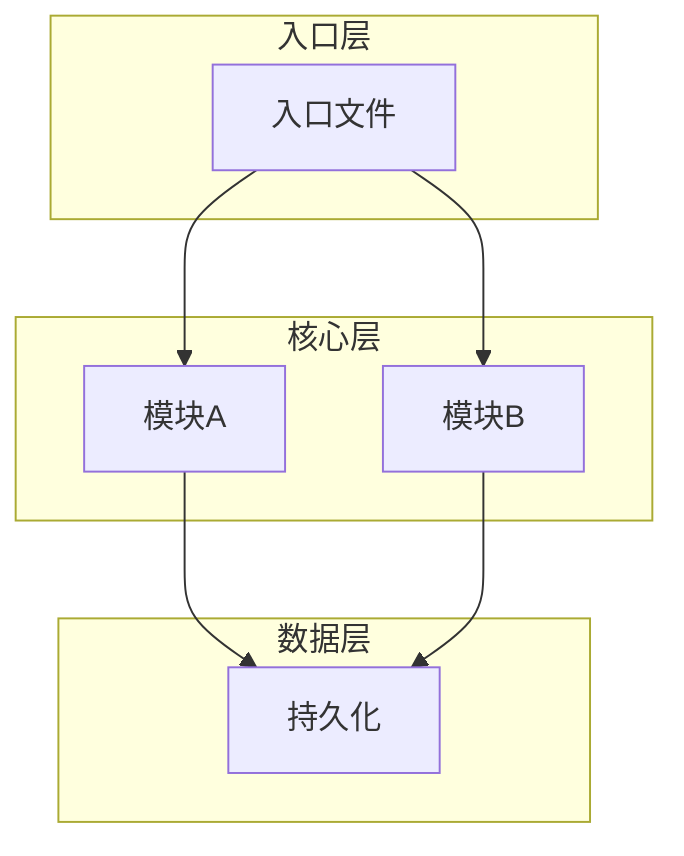

# {项目名称} — 代码逻辑分析报告

## 1. 执行摘要

| 维度 | 内容 |
|------|------|
| **项目名称** | {名称} |
| **项目定位** | {一句话描述项目做什么} |
| **技术栈** | {语言 + 核心框架 + 主要依赖} |
| **架构模式** | {MVC / Clean Architecture / 微服务 / 等} |
| **代码规模** | {大致文件数和代码行数量级} |
| **核心入口** | `{入口文件路径}` |

> **一段话总结**: {用 3-5 句话概括项目的核心价值、架构亮点和需要注意的地方}

---

## 2. 目录结构解析

```
{项目根目录}/
├── {目录1}/          # {职责分类}: {简要说明}
├── {目录2}/          # {职责分类}: {简要说明}
├── ...
└── {配置文件}        # {说明}
```

**关键观察**: {对目录组织方式的简要评价，如"采用按功能分包"或"按层分包"}

---

## 3. 架构与模块依赖

### 3.1 架构概览

{用文字简述整体架构设计思路，2-3 段}

### 3.2 模块依赖图



### 3.3 核心模块详解

#### {模块名称}

- **路径**: `{模块路径}/`
- **职责**: {该模块做什么}
- **关键文件**:
  - `{文件1}` — {作用}
  - `{文件2}` — {作用}
- **对外暴露**: {导出的接口/类/函数}
- **依赖关系**: 依赖 {列出上游模块}，被 {列出下游模块} 依赖

---

## 4. 核心业务流程与数据流

### 4.1 主流程描述

{用文字描述最核心的业务流程，说明数据从何处进入、经过哪些处理、最终输出什么}

### 4.2 流程图


> 替换为实际的流程逻辑，可使用 `flowchart` 或 `sequenceDiagram`。对于涉及多个参与者的异步流程，优先使用 sequence diagram。

### 4.3 数据模型

{列出核心数据结构/实体及其关系，必要时使用 Mermaid erDiagram}

---

## 5. 关键 API 接口与调用链路

### 5.1 API 总览

| 方法 | 路径/接口 | 说明 | 所在文件 |
|------|-----------|------|----------|
| {GET/POST/函数} | {路径} | {简述} | `{文件}` |

### 5.2 核心 API 调用链路分析

#### `{API 名称}`

**调用链**:

```
{Handler} → {Service} → {Repository} → {Database/外部服务}
```

**关键代码片段**:

```startLine:endLine:filepath
// 引用项目中实际代码
```

**逻辑说明**: {解释这段代码的核心逻辑}

---

## 6. 算法与关键函数实现

### 6.1 {算法/函数名称}

- **位置**: `{文件路径}` 第 {行号} 行
- **用途**: {解决什么问题}
- **复杂度**: 时间 O({X}) / 空间 O({X})

**核心代码**:

```startLine:endLine:filepath
// 引用项目中实际代码
```

**逐步解析**:

1. {第一步}: {说明}
2. {第二步}: {说明}
3. ...

---

## 7. 架构评价与建议

### 优势

- {优势1}
- {优势2}

### 潜在问题

- {问题1}: {简要说明及可能影响}
- {问题2}: {简要说明及可能影响}

### 进一步阅读建议

如果您想深入了解某个模块，建议从以下文件开始：

1. `{文件路径1}` — {原因}
2. `{文件路径2}` — {原因}
3. `{文件路径3}` — {原因}
