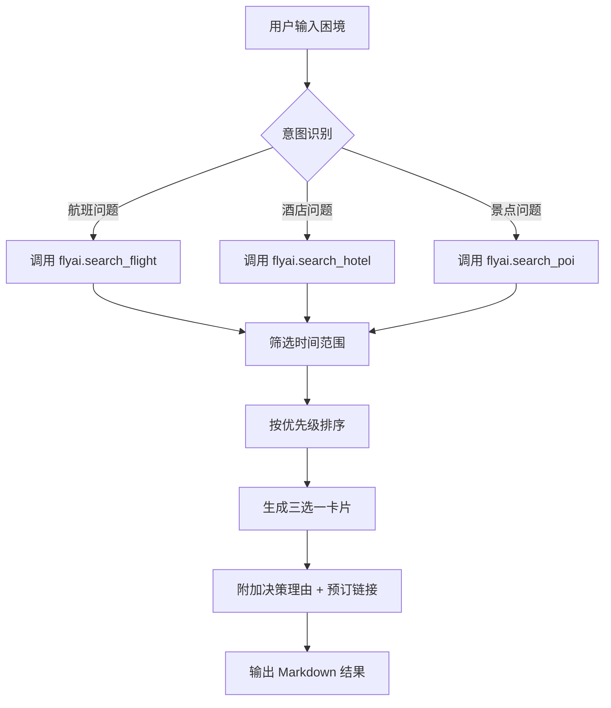

# 行程急救包 - Trip Emergency Kit

**定位**：行中突发场景应急决策助手  
**核心价值**：在高焦虑场景下，30 秒内生成「应急三选一」方案，帮助用户快速做出最优决策

## 触发场景

当用户在旅行途中遇到以下突发情况时自动触发：

### 1. 航班取消/延误
- 用户输入："航班取消了，今晚要从上海去北京"
- 用户输入："MU5103 延误了，有没有其他航班？"
- 用户输入："带小孩，今晚必须到北京，预算 2000"

### 2. 酒店超售/满房
- 用户输入："到了酒店说超售了，附近有没有同价位替代？"
- 用户输入："我在杭州西湖，附近还有空房吗？"
- 用户输入："原订单被取消了，急求周边酒店推荐"

### 3. 景点临时关闭
- 用户输入："迪士尼说临时闭园，上海还有什么适合小孩的？"
- 用户输入："下雨天，杭州有哪些室内景点？"
- 用户输入："故宫约满了，北京还有什么值得去的？"

### 4. 天气/不可抗力
- 用户输入："台风来了，行程要调整，有什么建议？"
- 用户输入："暴雨，原计划的户外项目去不了了"

## 核心能力

### 1. 自然语言理解
支持极简输入，自动提取关键信息：
- **地点识别**：从"从 X 到 Y"或"X 去 Y"提取出发地/目的地
- **时间识别**：识别"今晚"、"明天"、"现在"等相对时间
- **同行人识别**：识别"带小孩"、"带老人"、"亲子"等特殊需求
- **预算识别**：提取"预算 XXX"中的金额约束

### 2. 智能搜索策略
根据不同场景调用不同的 FlyAI 工具：
- **航班应急** → `flyai.search_flight`
- **酒店应急** → `flyai.search_hotel`
- **景点应急** → `flyai.search_poi`

### 3. 三选一决策卡片
每个方案包含：
- ✅ **选它理由**（明确优势，如"时间最早"、"价格最低"、"舒适度最高"）
- ❌ **不选理由**（明确 trade-off，帮助用户排除）
- 💰 **实时价格 + 价格明细**（成人/儿童分开显示）
- ⏰ **最晚决策时间**（如"需在 30 分钟内下单，否则无座"）
- 🔗 **预订链接**（直达预订页面）
- 📊 **剩余座位/房间数**（紧张程度提示）

### 4. 情绪安抚与风险提示
- **情绪价值**：明确告知"还有救"，降低焦虑
- **风险提示**：标注晚点风险、退改政策、理赔指引
- **决策建议**：按用户类型推荐（追求稳妥/预算敏感/带小孩优先）

## 输出格式规范

### 标准输出结构

```markdown
## 🚨 行程急救包 - <场景类型>应急方案

**当前困境**：<简要描述用户遇到的问题>  
**搜索范围**：<时间范围/地理范围>  
**同行人**：<同行人规格及特殊需求>

---

### 方案 A：<名称>（推荐指数⭐⭐⭐⭐⭐）

- **出发时间**：XX:XX → XX:XX（时长）
- **路线**：起点 → 终点
- **总价**：¥XXX（成人¥XXX + 儿童¥XXX）
- **剩余座位**：XX 席（紧张/充足）
- **✅ 优势**：优势 1，优势 2，优势 3
- **❌ 劣势**：劣势 1，劣势 2
- **⏰ 最晚下单**：HH:MM（原因说明）

[👉 点击立即预订](URL)

---

### 方案 B：<名称>（推荐指数⭐⭐⭐⭐）

[同上结构]

---

### 方案 C：<名称>（推荐指数⭐⭐⭐）

[同上结构]

---

### 💡 决策建议

- **追求稳妥** → 选方案 A（理由）
- **预算敏感** → 选方案 C（理由）
- **带小孩优先** → 选方案 B（理由）

### ⚠️ 风险提示

- 风险 1 说明
- 风险 2 说明
- 理赔/退改指引

---
*数据来源：基于 fly.ai 实时搜索结果* ✈️
```

### 图片展示要求
- 酒店场景：必须展示 ``
- 景点场景：必须展示 ``
- 航班场景：可选展示航司 logo（如有）

### 预订链接要求
- 必须单独一行显示 `[👉 点击立即预订]({url})`
- URL 来源：
  - 航班：`jumpUrl`
  - 酒店：`detailUrl`
  - 景点：`jumpUrl`

## 异常处理策略

| 失败场景 | 兜底方案 |
|---------|---------|
| **无直飞航班** | ① 搜索邻近城市出发 ② 中转方案（标注总耗时）③ 高铁/动车备选 |
| **全部售罄** | ① 推荐打包产品 ② 建议调整目的地 ③ 提供退票/理赔指引 |
| **价格超出预算** | ① 展示最低可行方案 ② 询问是否接受调整日期 |
| **API 超时** | ① 降级为模拟数据演示 ② 提供官方客服电话 ③ 引导截图保存 |
| **同行人特殊需求** | ① 婴儿/老人：过滤长时间步行方案 ② 宠物：标注允许携带的选项 |

## 使用示例

### 示例 1：航班取消

**用户输入**：
```
航班取消了，今晚要从上海带小孩去北京，预算 2000
```

**期望输出**：
- 识别：出发地=上海，目的地=北京，时间=今晚 (18:00-24:00)，同行人=1A1C，预算=2000
- 搜索：未来 6 小时内所有可用航班 + 高铁
- 输出：三选一决策卡片（含最晚下单时间提醒）

### 示例 2：酒店超售

**用户输入**：
```
到了酒店说超售了，我在杭州西湖，附近有没有同价位替代？预算 500
```

**期望输出**：
- 识别：位置=杭州西湖，半径=3km，预算=500
- 搜索：西湖周边 3km 内空房酒店
- 输出：三选一决策卡片（含距离、免费接驳车信息）

### 示例 3：景点关闭

**用户输入**：
```
迪士尼说临时闭园，上海还有什么适合小孩的室内景点？
```

**期望输出**：
- 识别：城市=上海，关键词=亲子/室内
- 搜索：上海室内亲子景点
- 输出：三选一决策卡片（含今日余票、亲子设施）

## 前置依赖：FlyAI CLI 安装检查

**重要**：本技能强制依赖 FlyAI CLI，未安装时直接退出报错，不使用演示数据降级。

### 执行流程

#### 1. 检查是否已安装

在执行任何搜索之前，必须先确保 FlyAI CLI 已正确安装。

**检查命令**：
```bash
which flyai
```

**判断逻辑**：
- ✅ **已安装**：命令返回 flyai 的路径（如 `/usr/local/bin/flyai`），说明已安装，直接跳过安装步骤
- ❌ **未安装**：命令返回空或提示"not found"，说明未安装，执行安装流程

#### 2. 安装 FlyAI CLI

**安装命令**：
```bash
npm install -g @fly-ai/flyai-cli
```

**安装后验证**：
```bash
flyai --help
```

#### 3. 安装失败处理

| 情况 | 处理方式 |
|------|---------|
| **npm 未安装** | 提示用户先安装 Node.js (https://nodejs.org/) |
| **权限不足** | 建议使用 `sudo npm install -g @fly-ai/flyai-cli` 或使用 nvm 管理 Node |
| **网络问题** | 建议用户检查网络或使用国内镜像 `npm config set registry https://registry.npmmirror.com` |

**注意**：此步骤只在首次使用时执行，后续调用会直接跳过已安装的情况。

### FlyAI CLI 命令规范

- **航班搜索**：`flyai search-flight --origin <出发地> --destination <目的地> --dep-date <出发日期>`
- **酒店搜索**：`flyai search-hotel --dest-name <目的地名称>`
- **景点搜索**：`flyai search-poi --city-name <城市名称>`

**参数说明**：
- 必须使用单行命令，execSync 中不可使用 `\\\n` 转义换行符
- 使用 `--origin`、`--destination`、`--dep-date` 参数格式
- 返回数据结构为 `{data:{itemList:[...]}}`

---

## 技术实现要点

### 核心流程



### 文件结构

```
trip-emergency-lite/
├── SKILL.md              # 技能定义（含 agent prompt + tools 配置）
└── package.json          # 技能元数据
```

### 安装方式

```bash
# 将本项目复制到 .skills/ 目录
cp -r trip-emergency-lite ~/.skills/trip-emergency-kit-lite
```

## 注意事项

1. **实时性要求**：应急场景对价格/余票实时性要求极高，必须标注"请以预订页面为准"
2. **退改政策**：应急购买的票务需特别提醒退改签规则
3. **理赔指引**：航班取消/酒店超售需保留书面证明用于理赔
4. **隐私保护**：不存储用户行程数据，搜索完即焚
