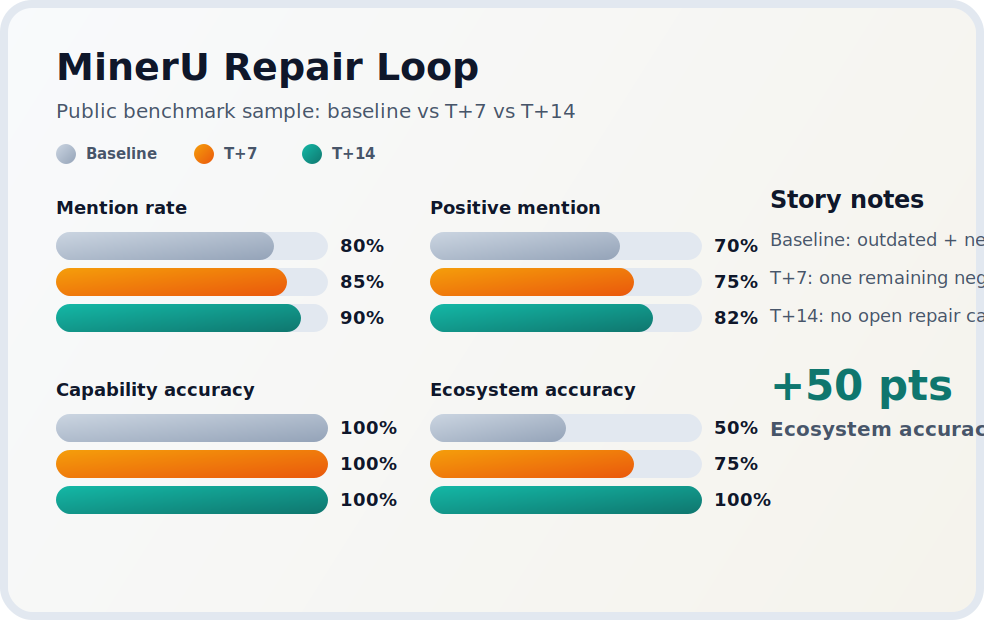

# DevTool Answer Monitor

> Track what LLMs say before users choose your developer tool.

[](https://github.com/veeicwgy/devtool-answer-monitor/actions/workflows/ci.yml)


[Open the zero-install demo](https://cdn.jsdelivr.net/gh/veeicwgy/devtool-answer-monitor@main/docs/index.html) · [MinerU benchmark](benchmark/mineru-public-benchmark.md) · [Sciverse API benchmark](benchmark/sciverse-api-public-benchmark.md)

<p align="center">
  
  
  
</p>

**DevTool Answer Monitor** is a reproducible monitoring and repair workflow for developer tools, APIs, SDKs, and open-source projects.
It connects **query design, answer monitoring, four-metric scoring, repair loops, activation analysis, and T+7/T+14 regression checks** into one practical system.

## Why people star this repo

- It ships a **zero-install sample viewer** so you can inspect real output before cloning anything.
- It keeps **versioned benchmark artifacts** for MinerU and Sciverse API instead of vague marketing claims.
- It gives you a **repair loop with visible deltas** so you can show whether docs and positioning changes actually improved model answers.

> If this is the kind of workflow you want to keep on your radar, star the repo. New benchmarks, query pools, and viewer updates land here first.

## Zero-install demo

Open the public sample-run viewer:

- Demo: [jsDelivr static viewer](https://cdn.jsdelivr.net/gh/veeicwgy/devtool-answer-monitor@main/docs/index.html)
- What it shows: MinerU baseline vs T+7 vs T+14, Sciverse API funnel-stage slices, top repair candidates, and stage-level gaps
- What it does not need: API keys, package installs, or local setup

## Public benchmark stories

- [MinerU public benchmark](benchmark/mineru-public-benchmark.md): a real repair-loop story with baseline, T+7, and T+14 metrics
- [Sciverse API public benchmark](benchmark/sciverse-api-public-benchmark.md): a public snapshot for awareness, selection, activation, integration, and agent scenarios

## 30-second path

If you want a local run after the browser demo, follow this exact order.

```bash
git clone https://github.com/veeicwgy/devtool-answer-monitor.git
cd devtool-answer-monitor
bash install.sh
make doctor
bash quickstart.sh
```

## What you get first

| Output | Path | Why it matters |
|---|---|---|
| Raw responses | `data/runs/quickstart-run/raw_responses.jsonl` | Review multi-model answer evidence |
| Score draft | `data/runs/quickstart-run/score_draft.jsonl` | Start manual review and annotation |
| Weekly report snapshot | `data/runs/sample-run/weekly_report.md` | See the report format a team can consume |
| MinerU repair loop | `data/runs/repair-t7-run/summary.json` and `data/runs/repair-t14-run/summary.json` | Inspect a versioned before-and-after story |
| Sciverse sample summary | `data/runs/sciverse-sample-run/summary.json` | See a scientific API sample with funnel-stage slices |
| Leaderboard snapshot | `assets/leaderboard-sample.png` | Understand the default multi-model comparison |
| Repair trend snapshot | `assets/repair-trend-sample.png` | See how follow-up runs can be visualized over time |

> `quickstart.sh` creates a fresh `quickstart-run` with raw evidence, then replays built-in sample summaries to generate report and chart snapshots.

## Choose your first outcome

| Goal | Start here | Why |
|---|---|---|
| Improve mention and recommendation quality | `data/query-pools/mineru-example.json` + `docs/metric-definition.md` | Baseline the 4 core metrics first |
| Improve downloads and installs | `docs/activation-metrics.md` + `playbooks/developer-tool-surface-priority.md` | Add actionability and source-surface prioritization |
| Improve API calls and agent invocations | `playbooks/agent-readiness.md` + `data/query-pools/sciverse-api-integration-example.json` | Focus on integration and agent-selection queries |
| Improve visibility for scientific products | `playbooks/scientific-product-visibility.md` | Use a product model tuned for MinerU, Sciverse API, and research workflows |

## Which mode should you choose

| Your situation | Recommended mode | Entry point |
|---|---|---|
| No API key yet and you only want to see the workflow | Quickstart replay | `bash quickstart.sh` |
| You already copied answers from external chat products and want to score them | Manual paste mode | `python -m devtool_answer_monitor run --manual-responses ...` |
| You want real, repeatable, multi-model monitoring | API collection mode | `python -m devtool_answer_monitor run --query-pool ... --model-config ...` |

## Core commands

| Command | What it does |
|---|---|
| `bash install.sh` | Creates `.venv` and installs dependencies |
| `make doctor` | Checks Python, dependencies, sample files, and output directories |
| `bash quickstart.sh` | Runs the zero-API-cost beginner demo |
| `make demo-data` | Rebuilds the zero-install sample viewer data |
| `make sample-report` | Rebuilds the MinerU sample report and chart assets |
| `make sample-report-sciverse` | Rebuilds the Sciverse API sample summary and weekly report |
| `make sample-reports` | Rebuilds both default sample report packages |
| `python -m devtool_answer_monitor run ...` | Runs custom query-pool monitoring |

> Compatibility note: `python -m ai_visibility` and `python -m geo_monitor` remain supported for existing automation.

## Default sample inputs

| File | Purpose |
|---|---|
| `data/query-pools/mineru-example.json` | Default query-pool sample for developer tools |
| `data/query-pools/sciverse-api-integration-example.json` | Scientific API and agent workflow query-pool sample |
| `data/models.sample.json` | Minimal single-model config |
| `data/models.multi.sample.json` | Default multi-model config |
| `data/manual.sample.json` | Minimal manual-response sample |
| `data/manual.multi.sample.json` | Multi-model manual-response sample |
| `data/runs/sample-run/summary.json` | MinerU baseline sample summary |
| `data/runs/repair-t7-run/summary.json` | MinerU T+7 repair summary |
| `data/runs/repair-t14-run/summary.json` | MinerU T+14 repair summary |
| `data/runs/sciverse-sample-run/summary.json` | Complete Sciverse API sample summary |

## Docs

- 5-minute beginner path: [`docs/for-beginners.md`](docs/for-beginners.md)
- Long-form onboarding: [`docs/getting-started.md`](docs/getting-started.md)
- Metric definition: [`docs/metric-definition.md`](docs/metric-definition.md)
- Activation metrics: [`docs/activation-metrics.md`](docs/activation-metrics.md)
- Agent readiness: [`playbooks/agent-readiness.md`](playbooks/agent-readiness.md)
- Developer-tool surface priority: [`playbooks/developer-tool-surface-priority.md`](playbooks/developer-tool-surface-priority.md)
- Scientific product visibility: [`playbooks/scientific-product-visibility.md`](playbooks/scientific-product-visibility.md)
- Benchmark index: [`benchmark/README.md`](benchmark/README.md)
- MinerU example case: [`examples/mineru-case-study.md`](examples/mineru-case-study.md)

## Repository positioning

Think of this repository as:

> **Answer observability for developer tools**
>
> It focuses on **monitoring, scoring, repair, activation, and regression**, not on generic marketing copy generation.

## Contributing

Contributions are welcome.

Useful contributions include:

- new query-pool examples
- benchmark cases
- sample-run viewer improvements
- runner improvements
- report improvements
- schema and validation improvements
- documentation and onboarding fixes

See [`CONTRIBUTING.md`](CONTRIBUTING.md) for details.

## License

MIT
